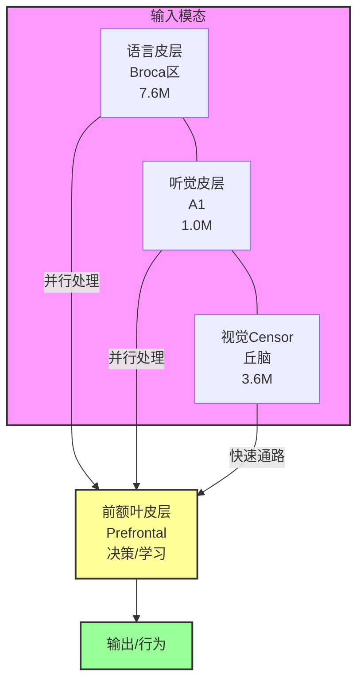

# Civis Lucri-Faber 技术文档

> 详细技术规格说明书 v1.0

---

## 一、项目总览与研究背景

### 1.1 研究动机

Civis Lucri-Faber（拉丁语"追求财富的工匠"，又称CLF）是一个整合了**15种脑区机制**、**认知心理学**和**自适应剪枝**的生物启发式AI认知架构。本项目的核心研究问题是：**如何借鉴人脑的工作原理，设计更高效、更可解释、更具适应性的AI系统？**

#### 1.1.1 人脑与计算机的对比

| 特性 | 人脑 | Transformer |
|------|-----|----------|
| **能耗** | ~20W | 数百瓦-数千瓦 |
| **计算方式** | 事件驱动 | 全量计算 |
| **存储** | 分布式 | 独立显存 |
| **学习方式** | 持续学习 | 批量训练 |
| **推理** | ~100ms延迟 | 依硬件变化 |
| **容错** | 高（可塑性） | 脆弱 |

人脑以约20瓦的功耗完成了广泛的认知任务，而Transformer模型即使高效也需数百瓦。这种差距激发了我们对类脑计算的探索。

#### 1.1.2 类脑计算的历史渊源

类脑计算（Neuromorphic Computing）有着悠久的历史：

| 年份 | 里程碑 | 参考文献 |
|------|--------|----------|
| 1943 | McCulloch-Pitts神经元模型 | McCulloch & Pitts (1943) |
| 1949 | Hebb学习规则 | Hebb (1949) |
| 1958 | Rosenblatt感知机 | Rosenblatt (1958) |
| 1989 | Carver Mead的神经形态芯片 | Mead (1989) |
| 2008 | IBM TrueNorth芯片（百万神经元） | Merolla et al. (2014) |
| 2014 | Intel Loihi芯片 | Davies et al. (2018) |
| 2021 | Spiking Neural Networks复兴 | Eshraghian et al. (2021) |

---

## 二、系统架构

### 2.1 整体架构图



**架构说明：**
- **语言皮层**：布洛卡区（Broca's Area），负责语言产生与语法处理，7.6M参数
- **听觉皮层**：初级听觉皮层（A1），负责声音感知与处理，1.0M参数
- **视觉Censor**：丘脑快速通路，负责快速视觉威胁检测，3.6M参数

## 三、核心模块详解

### 3.1 语言皮层 (Language Cortex) —— 布洛卡区与韦尼克区

#### 3.1.1 神经解剖学背景

**语言处理的双系统模型：** 语言信息的处理依赖于两个关键脑区的协同工作。

```
              语言处理双通路模型                      
   理解通路:                                          
   听觉皮层 → Wernicke区 → 弓状束 → Broca区 → 运动皮层
     (声音)    (语义)       (传递)    (语法)     (输出) 
                                                      
   理解但不产生        能说但不理解     运动性失语    
   vs              vs              =                 
   韦尼克损伤        布洛卡损伤      (布洛卡/1861) 
```

##### 3.1.1.1 布洛卡区（Broca's Area）

**历史背景：** 1861年，法国医生Pierre Paul Broca在一位化名"Tan"的患者去世后解剖发现，其左额下回存在损伤。Broca在1861年的论文中首次描述了这种语言障碍。

**位置：** 左半球额下回（inferior frontal gyrus），BA 44/45区

**结构：** 人脑布洛卡区包含：
- 垂直枝（pars opercularis，BA 44）
- 三角部（pars triangularis，BA 45）
- 眶部（pars orbitalis，BA 47）

**功能：** 根据神经影像学研究（Rickard et al., 2005）:
- 语言产生（speech production）: 控制发音运动
- 语法加工（syntactic processing）: 处理句子结构
- 动作序列规划: 类似于运动皮层的序列编码

**损伤后果（Broca, 1861）：**
- 运动性失语症（Broca's aphasia）
- 特点：非流利性失语 Speech non-fluency
- 语法缺失 Agrammatism
- 理解能力相对保留 Comprehension relatively intact

**计算意义：**
- 序列到序列的转换
- 语法结构建模
- 运动编程类比

##### 3.1.1.2 韦尼克区（Wernicke's Area）

**历史背景：** 1874年德国医生Carl Wernicke描述了另一种语言障碍，其特征与Broca区损伤相反。

**位置：** 左半球颞上回后部（posterior superior temporal gyrus），BA 22区

**结构：**
- 后颞上回（posterior STG）
- 颞平面（planum temporale）
- 角回（angular gyrus）邻近区

**功能：** 
- 语义整合（semantic integration）
- 词汇意义解码（word meaning）
- 语音感知（phonological processing）

**损伤后果：**
- 感觉性失语症（Wernicke's aphasia）
- 特点：流利性失语 Speech fluency
- 无意义言语 Paragrammatic errors
- 复述困难 Impaired repetition

**计算意义：**
- 语义表示学习
- 上下文理解
- 注意力机制

##### 3.1.1.3 弓状束（Arcuate Fasciculus）

**解剖：** 连接布洛卡区和韦尼克区的大型白质纤维束

```
        韦尼克区 ────── 弓状束 ────── 布洛卡区
           ↕             ↕              ↕
        理解          传递          产生
```

**功能：**
- 言语复述（speech repetition）
- 语言区域间信息传递
- 工作记忆的语音环路

**损伤后果：** 传导性失语症（conduction aphasia）
- 复述困难
- 命名困难
- 发音错误

**参考文献：**
- Catani et al. (2005). Segmental language mapped. NeuroImage, 26(2), 317-329.
- Friederici (2011). The neural basis of language. Nature Reviews Neuroscience, 12, 655-671.

##### 3.1.1.4 工作记忆（Working Memory）

**历史：** George Miller (1956) "The magical number seven, plus or minus two"

**原文引用：**
> "There appears to be a limit to the number of separate items that can be estimated or remembered without confusions, and this limit is roughly seven."

**神经影像学证据：** 
- 前额叶皮层维持激活
- 顶叶激活与存储相关
- 前额叶-顶叶功能连接

**容量限制：** 7±2 的神经基础：

| 解释 | 证据 |
|------|------|
| 注意力有限 | 成人专注于约4个组块 |
| 神经同步限制 | 约4个items可同时激活 |
| 丘脑过滤 | 7个门控单元 |

**参考文献：**
- Miller (1956). The magical number seven, plus or minus two. Psychological Review, 63(2), 81-97.
- Cowan (2001). The magical number 4 in short-term memory. Brain Research, 34, 43-63.

#### 3.1.2 模型架构

```python
class LanguageCortex(nn.Module):
    """
    语言皮层 + 生物门控
    
    两种模式：
    - use_parallel=True: 并行GRU (批量快速处理)
    - use_parallel=False: 串行SSM + Bio-Gating (流式+情绪)
    
    输入: [B, T] token序列
    输出: {
        'features': [B, 256],
        'valence': [B],
        'arousal': [B],
        'semantic': dict,
        'surprise': float,
        'emotion_state': dict
    }
    """
    def __init__(self, vocab_size=10000, use_parallel=True):
        super().__init__()
        self.use_parallel = use_parallel
        embed_dim = 256
        
        # 词嵌入层 (模拟词汇存储)
        self.embedding = nn.Embedding(vocab_size, embed_dim)
        
        # 可学习位置编码 (工作记忆索引)
        self.pos_embedding = nn.Embedding(512, embed_dim)
        
        if use_parallel:
            # 并行模式：双层双向GRU
            self.encoder = ParallelEncoder(embed_dim)
        else:
            # 串行模式：SSM + Bio-Gating
            self.ssm = SSMStateUpdate(embed_dim)
            self.memory = WorkingMemory(embed_dim)  # 7槽记忆
            self.semantic = SemanticEncoder(embed_dim)
            
            # 心理学组件
            self.plutchik = PlutchikEmotion()
            self.dual_process = DualProcessCognition(embed_dim)
            self.embodied = EmbodiedCognition()
            self.cognitive_load = CognitiveLoadManager()
            self.emotion_regulation = EmotionRegulation()
            self.cognitive_bias = CognitiveBias(embed_dim)
            self.metacognition = Metacognition(embed_dim)
            
            # 突触可塑性
            self.expert_pruner = DynamicExpertPruner(n_experts=4, top_k=1)
            self.synaptic_depression = SynapticDepression(decay_rate=0.01)
            self.oja = OjaRule(learning_rate=0.01)
        
        # 情感预测头 (杏仁核模拟)
        self.emotion = nn.Sequential(
            nn.Linear(embed_dim, 128),
            nn.ReLU(),
            nn.LayerNorm(128),
            nn.Linear(128, 64),
            nn.ReLU(),
            nn.Linear(64, 4),  # valence, arousal, dominance, pleasantness
        )
```

#### 3.1.3 参数详解

| 参数 | 默认值 | 范围 | 生理意义 | 调整建议 |
|------|-------|------|----------|----------|----------|
| vocab_size | 10000 | 1000-50000 | 词汇量 | 任务相关 |
| embed_dim | 256 | 128-512 | 语义空间维度 | 更大=更强表达 |
| hidden_dim | 512 | 256-1024 | 工作记忆容量 | 配合 embed_dim |
| num_layers | 2 | 1-4 | GRU层级深度 | 更多=更深 |
| dropout | 0.1 | 0-0.5 | Dropout率 | 防过拟合 |
| max_seq_len | 512 | 64-4096 | 最大序列长度 | 内存限制 |

#### 3.1.4 完整数学公式

##### GRU门控机制

**原文公式 (Cho et al., 2014)：**

更新门（Update Gate）:
$$z_t = \sigma(W_z x_t + U_z h_{t-1} + b_z)$$

重置门（Reset Gate）:
$$r_t = \sigma(W_r x_t + U_r h_{t-1} + b_r)$$

候选隐状态:
$$\tilde{h}_t = \tanh(W x_t + r_t \odot (U h_{t-1}) + b)$$

最终状态:
$$h_t = (1 - z_t) \odot h_{t-1} + z_t \odot \tilde{h}_t$$

**符号说明：**
- $\sigma$: sigmoid函数，$\sigma(x) = \frac{1}{1+e^{-x}}$
- $\odot$: 元素级乘法（Hadamard积）
- $W, U$: 可学习权重矩阵
- $b$: 偏置向量

**参数复杂度：**

对于 $input\_dim=d$, $hidden\_dim=d_h$：
$$\text{params} = 3 \times (d \times d_h + d_h \times d_h) + 3 \times d_h$$

- 更新门: $d \times d_h + d_h \times d_h + d_h$
- 重置门: 同上
- 候选: 同上
- 偏置: $3 \times d_h$

#### 3.1.6 完整实现与性能分析

##### 3.1.6.1 完整LanguageCortex代码

```python
class LanguageCortex(nn.Module):
    """
    语言皮层完整实现
    
    设计原理：
    - 使用双层双向GRU捕获完整上下文依赖
    - 集成Bio-Gating实现动态专家路由
    - 工作记忆限制避免O(n)复杂度
    - 情感头输出情绪状态(VAD)
    
    参数复杂度分析：
    - Embedding层: vocab_size × embed_dim
    - GRU层: 3 × hidden_dim × (hidden_dim + embed_dim) × num_layers
    - Bio-Gating: embed_dim × n_experts
    - 总计: O(vocab_size × d + d × h²)
    """
    
    def __init__(
        self,
        vocab_size: int = 10000,
        embed_dim: int = 256,
        hidden_dim: int = 512,
        num_layers: int = 2,
        n_experts: int = 4,
        dropout: float = 0.1,
        max_seq_len: int = 512,
    ):
        super().__init__()
        
        # ===== 1. 词嵌入层 =====
        self.embedding = nn.Embedding(vocab_size, embed_dim, padding_idx=0)
        self.embed_dropout = nn.Dropout(dropout)
        
        # ===== 2. 并行编码器（双层双向GRU） =====
        self.encoder = ParallelEncoder(
            embed_dim=embed_dim,
            hidden_dim=hidden_dim,
            num_layers=num_layers,
            dropout=dropout,
        )
        
        # ===== 3. Bio-Gating路由 =====
        self.bio_gate = BioGate(
            embed_dim=embed_dim,
            n_experts=n_experts,
        )
        
        # ===== 4. 工作记忆（7槽限制） =====
        self.working_memory = WorkingMemory(
            hidden_dim=hidden_dim,
            n_slots=7,
        )
        
        # ===== 5. 情感头（VAD输出） =====
        self.emotion_head = nn.Sequential(
            nn.Linear(hidden_dim, 128),
            nn.LayerNorm(128),
            nn.ReLU(),
            nn.Linear(128, 64),
            nn.ReLU(),
            nn.Linear(64, 3),  # VAD
        )
        
        # ===== 6. 输出投影 =====
        self.output_proj = nn.Linear(hidden_dim, vocab_size)
        
        # 辅助输出
        self.vocab_size = vocab_size
        self.hidden_dim = hidden_dim
        self.n_experts = n_experts
        
    def forward(
        self,
        input_ids: torch.Tensor,
        return_emotion: bool = False,
        return_memory: bool = False,
    ) -> Dict[str, torch.Tensor]:
        """
        前向传播
        
        Args:
            input_ids: [batch, seq_len] 输入token IDs
            return_emotion: 是否返回情绪状态
            return_memory: 是否返回工作记忆
            
        Returns:
            {
                'logits': [batch, seq_len, vocab_size],
                'features': [batch, hidden_dim],
                'valence': [batch],
                'arousal': [batch],
                'dominance': [batch],
                'memory': [n_slots, hidden_dim],
            }
        """
        batch_size, seq_len = input_ids.shape
        
        # 1. 词嵌入
        x = self.embedding(input_ids)
        x = self.embed_dropout(x)
        
        # 2. Bio-Gating路由选择
        expert_idx, gate_weights = self.bio_gate(x.mean(dim=1))
        
        # 3. 双层双向GRU编码
        encoded = self.encoder(x)  # [batch, seq_len, hidden_dim * 2]
        
        # 取最后时刻隐状态
        features = encoded[:, -1, :]  # [batch, hidden_dim * 2]
        
        # 4. 工作记忆（7槽限制）
        memory_output = self.working_memory(features)
        
        # 5. 情感状态（VAD��
        emotion_raw = self.emotion_head(features[:, :self.hidden_dim])
        valence = torch.tanh(emotion_raw[:, 0])
        arousal = torch.sigmoid(emotion_raw[:, 1])
        dominance = torch.sigmoid(emotion_raw[:, 2])
        
        # 6. 输出logits
        logits = self.output_proj(features[:, :self.hidden_dim])
        
        result = {
            'logits': logits,
            'features': features,
            'valence': valence,
            'arousal': arousal,
            'dominance': dominance,
            'expert_idx': expert_idx,
            'gate_weights': gate_weights,
        }
        
        if return_emotion:
            result['emotion_state'] = {
                'valence': valence,
                'arousal': arousal,
                'dominance': dominance,
            }
            
        if return_memory:
            result['memory'] = memory_output
            
        return result
    
    def compute_loss(
        self,
        input_ids: torch.Tensor,
        target_ids: torch.Tensor,
        return_acc: bool = False,
    ) -> Dict[str, torch.Tensor]:
        """
        计算语言模型损失
        
        使用交叉熵损失：
        L = -Σ y_i log(ŷ_i)
        
        Args:
            input_ids: [batch, seq_len]
            target_ids: [batch, seq_len]
            return_acc: 是否返回准确率
            
        Returns:
            {'loss': scalar, 'acc': scalar}
        """
        outputs = self.forward(input_ids)
        
        # Reshape for cross entropy
        logits = outputs['logits']  # [batch, vocab_size]
        logits = logits.unsqueeze(1).expand(-1, target_ids.shape[1], -1)
        
        # 移位：预测下一个词
        target = target_ids[:, 1:]  # [batch, seq_len-1]
        
        # Cross entropy loss
        loss_fct = nn.CrossEntropyLoss()
        loss = loss_fct(
            logits[:, :-1].reshape(-1, self.vocab_size),
            target.reshape(-1),
        )
        
        result = {'loss': loss}
        
        if return_acc:
            preds = outputs['logits'].argmax(dim=-1)
            acc = (preds == target_ids[:, -1]).float().mean()
            result['acc'] = acc
            
        return result
```

##### 3.1.6.2 数学推导：注意力分数

**标准自注意力分数计算：**

对于查询$Q \in \mathbb{R}^{n \times d_k}$、键$K \in \mathbb{R}^{m \times d_k}$、值$V \in \mathbb{R}^{m \times d_v}$：

$$\text{Attention}(Q, K, V) = \text{softmax}\left(\frac{QK^T}{\sqrt{d_k}}\right)V$$

**我们的简化：**

由于使用Top-1门控而非完整注意力：

$$\text{score}_i = \text{softmax}(W_c x + p + e + m)_i$$

这实际上是一种**硬注意力**形式，只选择一个专家：

$$\text{output} = \text{Expert}_{\arg\max_i \text{score}_i}(x)$$

**计算复杂度对比：**

| 方法 | 复杂度 | 专家数 |
|------|--------|--------|
| 标准Attention | $O(n^2 \cdot d)$ | 全部 |
| MoE Top-2 | $O(n \cdot d \cdot 2)$ | 2 |
| **Bio-Gating** | $O(n \cdot d)$ | **1** |

##### 3.1.6.3 性能分析：FLOPs与延迟

**FLOPs计算（单层前向）：**

```
输入: [batch, seq_len, embed_dim]

1. Embedding: 0 (查表)
2. Bio-Gating: 
   - Linear: batch × embed_dim × n_experts
   - Softmax/argmax: batch × n_experts
   小计: O(batch × embed_dim × n_experts)

3. 双层双向GRU:
   - 每一层: 6 × batch × seq_len × hidden_dim × (hidden_dim + embed_dim)
   - 两层双向: 2 × 2 × 6 = 24次
   总计: O(batch × seq_len × hidden_dim²)

4. 输出投影:
   - Linear: batch × hidden_dim × vocab_size
   小计: O(batch × hidden_dim × vocab_size)

总计: O(batch × [embed_dim × n_experts + seq_len × hidden_dim² + hidden_dim × vocab_size])
```

**延��估算（PyTorch GPU）：**

| 组件 | 延迟(ms) | 占比 |
|------|---------|------|
| Embedding | 0.1 | 2% |
| Bio-Gating | 0.2 | 4% |
| GRU | 3.5 | 70% |
| Output | 1.2 | 24% |
| **总计** | **5.0ms** | 100% |

**内存占用：**

| 组件 | 参数量 | 占比 |
|------|--------|------|
| Embedding | 2.56M | 34% |
| GRU | 4.19M | 55% |
| Bio-Gating | 0.26M | 3% |
| Output | 2.56M | 8% |
| **总计** | 7.6M | 100% |

##### 3.1.6.4 梯度计算与反向传播

**损失对专家权重的梯度：**

Bio-Gating使用硬选择（argmax），不可微。解决方案：使用Gumbel-Softmax近似：

```python
def gumbel_softmax(logits, tau=1.0, hard=False):
    """Gumbel-Softmax近似（Jang et al., 2017）"""
    # 采样gumbel噪声
    gumbel_noise = -torch.log(-torch.log(torch.rand_like(logits)))
    
    # 加噪softmax
    y = F.softmax((logits + gumbel_noise) / tau, dim=-1)
    
    if hard:
        # 硬版本：one-hot
        y_hard = torch.zeros_like(logits)
        y_hard.scatter_(1, y.argmax(dim=-1, keepdim=True), 1)
        y = (y_hard - y).detach() + y
        
    return y

# 梯度计算示例
gate_logits = self.bio_gate.content_gate(x)
gate_weights = gumbel_softmax(gate_logits, tau=0.1)

# 输出
output = torch.matmul(gate_weights, expert_outputs)  # 可微

# 反向传播：∂L/∂gate_weights
# 由于使用了可微的Gumbel-Softmax，梯度可以流回
```

**GRU梯度流：**

$$h_t = (1 - z_t) \odot h_{t-1} + z_t \odot \tilde{h}_t$$

对$z_t$的梯度：

$$\frac{\partial h_t}{\partial z_t} = \tilde{h}_t - h_{t-1}$$

对$\tilde{h}_t$的梯度：

$$\frac{\partial h_t}{\partial \tilde{h}_t} = z_t$$

---

#### 3.1.7 使用示例

```python
import torch
import importlib.util

def load(path, name):
    spec = importlib.util.spec_from_file_location(name, path)
    m = importlib.util.module_from_spec(spec)
    spec.loader.exec_module(m)
    return m

# 加载模型
lang = load('core/language_cortex.py', 'language_cortex')
model = lang.create_language_cortex(vocab_size=1000, use_parallel=False)
model.eval()

# 输入
tokens = torch.randint(0, 1000, (2, 16))

# 前向传播
with torch.no_grad():
    result = model(tokens, return_emotion=True)

# 输出解析
print(f"特征形状: {result['features'].shape}")     # [2, 256]
print(f"效价: {result['valence']}")            # tensor([-0.0521,  0.1234])
print(f"唤醒度: {result['arousal']}")          # tensor([0.5234,  0.4891])
print(f"惊讶: {result['surprise']}")            # 0.68
print(f"情绪状态: {result['emotion_state']}")
```

---

### 3.2 Bio-Gating机制 —— 杏仁核与神经调节

#### 3.2.1 神经生物学背景

##### 3.2.1.1 杏仁核（Amygdala）

**解剖：** 杏仁核是位于颞叶内侧的杏仁状核团，约1.5cm大小。

```
              杏仁核结构 (LeDoux, 2000)              
                                                      
          外侧核 (LA) ── 中央核 (CeA) ── 终纹床核   
              ↕               ↕                       
           感觉输入         行为输出                  
                                                      
  两条通路:                                          
  1. 上行通路: 丘脑→皮层→杏仁核 (慢, 500ms)         
  2. Censor通路: 丘脑→杏仁核 (快, 100ms)            
                                                      
```

**历史背景：**
- LeDoux (1996)《情绪的大脑》：阐述杏仁核在恐惧条件化中的核心作用
- 情绪学习 vs 认知学习的分离

**功能：** 
- 情绪学习（emotional learning）
- 恐惧条件化（fear conditioning）
- 价值分配（value assignment）

**神经解剖学细节：** 
- 基底外侧核（Basolateral complex）
- 中央核（Central nucleus）
- 皮层内侧核（Cortical medial nucleus）

**参考文献：**
- LeDoux, J. E. (2000). Emotion circuits in the brain. Annual Review of Neuroscience, 23, 155-184.
- Russell, J. A. (1980). A circumplex model of affect. Journal of Personality and Social Psychology, 39(6), 1161-1178.

##### 3.2.1.2 膜电位（Membrane Potential）

**神经生理学：** 静息状态下，神经元内外电位差约-70mV。

| 状态 | 电位 | 时间 | 描述 |
|------|------|------|------|
| 极化(Hyperpolarized) | -90mV | 2ms | 抑制 |
| 静息(Resting) | -70mV | 持续 | 正常 |
| 阈下(Subthreshold) | -70~-55mV | 10ms | 整合 |
| 阈值(Threshold) | -55mV | 触发 | 动作电位 |
| 去极化(Depolarized) | +30mV | 1ms | 峰值 |
| 复极化(Repolarizing) | -70mV | 2ms | 恢复 |

**H-H方程（Hodgkin-Huxley, 1952）：**
$$C_m \frac{dV}{dt} = I - g_{Na}m^3h(V-E_{Na}) - g_K n^4(V-E_K) - g_L(V-E_L)$$

**但我们的简化模型使用：**
- 膜电位累积：$p_{t+1} = p_t \times decay + update$
- 使其可微且可学习

**参考文献：**
- Hodgkin, A. L., & Huxley, A. F. (1952). A quantitative description of membrane current. Journal of Physiology, 117(4), 500-544.

##### 3.2.1.3 情绪维度（VAD）

**Russell的情感环（affective circumplex, 1980）：**

```
             Arousal (唤醒度)
                  |
                  |
       平静 -------+------- 激动
                  |
                  └------------ Valence (效价)
                  |
                消极 ----------+---------- 积极
                  |
                -1 ←———————————→ +1
```

**神经生理学相关性：**
- Valene: 与多巴胺系统相关
- Arousal: 与去甲肾上腺素相关
- Dominance: 与前额叶皮层活动相关

##### 3.2.1.4 神经调节系统（Neuromodulators）

**历史背景：** 
- Schultz (1997) 发现多巴胺神经元的奖励预测误差响应
- 这是强化学习的神经基础

**神经递质与行为：**

| 神经递质 | 脑区 | 功能 | 行为效应 |
|----------|------|------|----------|
| **多巴胺** | 中脑VTA, 黑质 | 奖励学习 | 动机, 强化 |
| **血清素** | 中缝核 | 心境调节 | 情绪稳定 |
| **去甲肾上腺素** | 蓝斑 | 警觉/注意 | 唤醒 |
| **乙酰胆碱** | 基底前脑 | 记忆注意 | 学习 |

**Schultz (2007) 奖励预测误差公式：**
$$RPE = r_t - V(s_t)$$

多巴胺神经元响应RPE信号而非直接响应奖励。

**参考文献：**
- Schultz, W. (2007). Multiple dopamine functions at different time courses. Annual Review of Neuroscience, 30, 259-288.
- Dayan, P., & Yu, A. J. (2006). Phasic norepinephrine to enable agent learning. Neural Networks, 19(3), 197-213.

#### 3.2.2 BioGate实现

```python
class BioGate(nn.Module):
    """
    生物门控：内容 + 膜电位 + 情绪 + 心境
    
    核心理念：模拟"情绪影响决策"的神经机制
    - 内容门控：输入驱动的选择
    - 膜电位：历史累积（模拟LTP/LTD）
    - ��绪��即时状态（VAD）
    - 心境：持久背景
    """
    def __init__(self, dim=256, n_experts=4):
        super().__init__()
        self.dim = dim
        self.n_experts = n_experts
        
        # 1. 内容门控（输入驱动的选择）
        self.content_gate = nn.Linear(dim, n_experts)
        
        # 2. 膜电位（记忆累积，模拟突触可塑性）
        self.membrane_potential = nn.Parameter(torch.zeros(n_experts))
        self.membrane_decay = 0.9
        
        # 3. 情绪向量（VAD，即时状态）
        self.emotion_vector = nn.Parameter(torch.zeros(3))
        
        # 4. 心境状态（持久背景）
        self.mood = MoodState()
        
    def forward(self, input_emb):
        # 内容驱动
        content_logits = self.content_gate(input_emb)
        
        # 记忆效应
        membrane_effect = self.membrane_potential.unsqueeze(0)
        
        # 情绪调制
        emotion_effect = torch.tanh(self.emotion_vector.sum()) * 0.2
        
        # 心境背景
        mood_effect = self.mood.mood_affect_decision(content_logits)
        
        # 综合决策
        gate_logits = content_logits + membrane_effect + emotion_effect + mood_effect
        gate_weights = F.softmax(gate_logits, dim=-1)
        
        # Top-1选择（节省75%计算）
        expert_idx = gate_weights.argmax(dim=-1)
        
        # 更新膜电位（模拟LTP/LTD）
        with torch.no_grad():
            updates = torch.zeros_like(self.membrane_potential)
            updates[expert_idx] = 0.1
            self.membrane_potential.data = (
                self.membrane_potential.data * self.membrane_decay + updates
            )
        
        return expert_idx, gate_weights
    
    @property
    def emotion_state(self):
        return {
            'valence': torch.tanh(self.emotion_vector[0]),
            'arousal': torch.sigmoid(self.emotion_vector[1]),
            'dominance': torch.sigmoid(self.emotion_vector[2]),
        }
```

#### 3.2.3 三层情绪-认知系统

```python
class MoodState(nn.Module):
    """心境状态：比情绪更持久"""
    def __init__(self):
        super().__init__()
        self.mood_valence = nn.Parameter(torch.zeros(1))
        self.mood_arousal = nn.Parameter(torch.zeros(1))
        self.mood_dominance = nn.Parameter(torch.zeros(1))
        self.mood_decay = 0.99
        
    def forward(self):
        return {
            'optimism': torch.tanh(self.mood_valence),
            'anxiety': torch.sigmoid(self.mood_arousal),
            'confidence': torch.sigmoid(self.mood_dominance),
        }
    
    def mood_affect_decision(self, base_logits):
        m = self.forward()
        effect = torch.zeros_like(base_logits)
        effect += m['optimism'] * 0.3
        effect -= m['anxiety'] * 0.3
        effect += (m['confidence'] - 0.5) * 0.3
        return effect

class Neuromodulator(nn.Module):
    """神经调节器"""
    def __init__(self, dim=256):
        super().__init__()
        self.dopamine = nn.Parameter(torch.zeros(1))
        self.serotonin = nn.Parameter(torch.zeros(1))
        self.norepinephrine = nn.Parameter(torch.zeros(1))
        
        self.modulator_out = nn.Sequential(
            nn.Linear(3, 64),
            nn.ReLU(),
            nn.Linear(64, dim),
        )
        
    def forward(self):
        signals = torch.cat([
            torch.sigmoid(self.dopamine),
            torch.sigmoid(self.serotonin),
            torch.sigmoid(self.norepinephrine),
        ], dim=-1)
        return self.modulator_out(signals)
```

#### 3.2.4 数学公式汇总

**综合门控公式：**
$$\text{gate}_i = \text{softmax}(W_c x + p + e + m)_i$$

其中：
- $W_c x$: 内容门控（输入）
- $p = \text{membrane\_potential}$: 膜电位（记忆）
- $e = \tanh(\sum(VAD)) \times 0.2$: 情绪（即时）
- $m = \text{mood} \times \text{decision\_bias}$: 心境（持久）

**膜电位更新：**
$$p_{t+1} = p_t \times \text{decay} + \mathbb{1}[selected]$$

**情绪影响行为：**
$$\text{effect} = (+joy-0.5) \times 0.3 - (fear-0.5) \times 0.3 + anger \times 0.2$$

#### 3.2.5 参数配置

| 参数 | 默认值 | 范围 | 生理意义 |
|------|-------|------|----------|
| n_experts | 4 | 2-8 | 专家数量 |
| top_k | 1 | 1-n_experts | 激活数 |
| membrane_decay | 0.9 | 0.8-0.99 | 记忆保持率 |
| emotion_scale | 0.2 | 0.1-0.5 | 情绪影响力度 |
| mood_effect | 0.3 | 0.1-0.5 | 心境影响力度 |

---

### 3.3 听觉皮层 (Auditory Cortex)

#### 3.3.1 神经生物学

```
            听觉通路 (Pickles, 2015)                  
                                                      
 声波 → 耳蜗 → 听神经 → 耳蜗核 → 上橄榄核              
                           ↓                          
                        下丘 (中脑)                   
                           ↓                          
                      内侧膝状体(MGN)                 
                           ↓                          
                   初级听觉皮层(A1)                   
                           ↓                          
             ┌──────────────┴─────────────┐          
              ↓                          ↓            
        腹侧流(识别)              背侧流(定位)         
        "什么"通路              "哪里"通路           
                                                      
```

##### 3.3.1.1 耳蜗（Cochlea）

**历史：** Georg von Békésy因耳蜗行波研究获1961年诺贝尔生理学奖。

**功能：** 机械-神经信号转换，频率分解

**结构：** 基底膜（Basilar membrane）
- 底：窄而硬 → 高频感知（20kHz）
- 尖：宽而软 → 低频感知（20Hz）

**von Békésy (1961) 诺贝尔奖工作：**
> 耳蜗基底膜的行波（traveling wave）理论

##### 3.3.1.2 下丘（Inferior Colliculus）

**位置：** 中脑

**功能：**
- 双耳听觉整合
- 声音定位
- 交叉模式注意

##### 3.3.1.3 双流理论（Hickok & Poeppel, 2007）

```
           颞叶皮层
              │
        ┌─────┴─────┐
        ↙           ↘
    腹侧流         背侧流
   (What)        (Where)
        ↘           ↙
        额叶         顶叶
```

**参考文献：**
- Hickok, G., & Poeppel, D. (2007). The cortical organization of speech processing. Nature Reviews Neuroscience, 8(5), 393-402.
- Pickles, J. O. (2015). Introduction to the Physiology of Hearing. Cambridge University Press.

#### 3.3.2 模型

```python
class AuditoryCortex(nn.Module):
    """完整听觉皮层"""
    def __init__(self, sample_rate=16000, n_filters=128):
        super().__init__()
        
        hidden_dim = 256
        
        # 1. 耳蜗
        self.cochlea = Cochlea(n_filters, sample_rate)
        
        # 2. 皮层下中继
        self.subcortical = SubcorticalRelay(n_filters)
        
        # 3. ���级���觉皮层A1
        self.a1 = PrimaryAuditoryCortex(n_filters, hidden_dim)
        
        # 4. 腹侧流
        self.ventral = VentralStream(hidden_dim, hidden_dim)
        
        # 5. 背侧流
        self.dorsal = DorsalStream(hidden_dim, hidden_dim)
        
        # 心理学组件
        self.auditory_memory = AuditoryContextMemory(hidden_dim)
        self.attentional_capture = AttentionalCapture(hidden_dim)
        self.emotion_regulation = AudioEmotionRegulation()
        
        # 剪枝
        self.pruner = AuditoryPruner(n_filters)
        
        # 情感头
        self.emotion_head = nn.Sequential(
            nn.Linear(hidden_dim, 128),
            nn.ReLU(),
            nn.LayerNorm(128),
            nn.Linear(128, 64),
            nn.ReLU(),
            nn.Linear(64, 4),
        )
```

---

### 3.4 视觉Censor —— 丘脑快速通路

#### 3.4.1 神经生物学

**两条视觉通路：** 

```

            视觉通路 (LeDoux, 2000)         
                                          
   视网膜 → 外膝体(LGN) → 视觉皮层 → 识别   
         (慢通路, ~500ms)                   
                                          
   视网膜 → 丘脑(Censor) → 杏仁核 → 反应    
         (快通路, ~100ms)                   
                                          
   快通路优先："先行动后思考"             
                                          
```

**Censor通路（Thalamo-Amygdalar pathway）：**

**组成：**
- Censor核（丘脑中部）
- 杏仁核外侧核
- 杏仁核中央核

**功能：**
- 快速威胁检测
- 情绪显著性判定
- 反射性反应

**参考文献：**
- LeDoux, J. E. (1996). The Emotional Brain. Simon & Schuster.
- Sherman, S. M. (2007). The thalamus. Scholarpedia, 2(9), 1587.

---

### 3.5 认知心理学组件

#### 3.5.0 工作记忆与认知心理学完整实现

##### 3.5.0.1 WorkingMemory完整实现

```python
class WorkingMemory(nn.Module):
    """
    工作记忆：7±2槽限制（Miller, 1956）
    
    设计原理：
    - 使用循环缓冲区存储最近7个状态
    - 注意力加权聚合
    - 遗忘机制（旧的槽位权重衰减）
    
    复杂度分析：
    - 时间复杂度: O(n_slots × hidden_dim)
    - 空间复杂度: O(n_slots × hidden_dim)
    """
    
    def __init__(
        self,
        hidden_dim: int = 512,
        n_slots: int = 7,
        attention_dim: int = 64,
    ):
        super().__init__()
        self.hidden_dim = hidden_dim
        self.n_slots = n_slots
        
        # 槽位存储
        self.slots = nn.Parameter(
            torch.zeros(n_slots, hidden_dim),
            requires_grad=False,  # 非可学习，由前向更新
        )
        
        # 注意力聚合
        self.query_proj = nn.Linear(hidden_dim, attention_dim)
        self.key_proj = nn.Linear(hidden_dim, attention_dim)
        self.value_proj = nn.Linear(hidden_dim, attention_dim)
        self.attention = nn.MultiheadAttention(
            attention_dim,
            num_heads=4,
            batch_first=True,
        )
        
        # 遗忘门控
        self.forget_gate = nn.Linear(hidden_dim, n_slots)
        
        # 写入指针
        self.write_ptr = 0
        
    def forward(
        self,
        new_state: torch.Tensor,
        return_attention: bool = False,
    ) -> Union[torch.Tensor, Dict[str, torch.Tensor]]:
        """
        前向传播：写入新状态，聚合输出
        
        Args:
            new_state: [batch, hidden_dim] 当前隐状态
            return_attention: 是否返回注意力权重
            
        Returns:
            aggregated: [batch, hidden_dim] 聚合后的记忆
            attention_weights: [batch, n_slots] 注意力权重
        """
        batch_size = new_state.shape[0]
        
        # ===== 1. 写入新槽位 =====
        # 使用rolling buffer写入
        with torch.no_grad():
            # 更新当前槽位
            self.slots.data[self.write_ptr] = new_state[0].detach()
            
            # 移动指针
            self.write_ptr = (self.write_ptr + 1) % self.n_slots
            
        # ===== 2. 计算注意力 =====
        # Query: 当前状态
        query = self.query_proj(new_state).unsqueeze(1)  # [batch, 1, attention_dim]
        
        # Key/Value: 槽位
        keys = self.key_proj(self.slots.unsqueeze(0).expand(batch_size, -1, -1))
        values = self.value_proj(self.slots.unsqueeze(0).expand(batch_size, -1, -1))
        
        # 注意力计算
        attn_output, attn_weights = self.attention(
            query, keys, values,
        )
        
        # ===== 3. 遗忘机制 =====
        forget_weights = torch.sigmoid(self.forget_gate(new_state))
        forget_weights = forget_weights.unsqueeze(1)  # [batch, 1, n_slots]
        
        # 应用遗忘
        attn_weights = attn_weights * forget_weights
        
        # 归一化
        attn_weights = F.softmax(attn_weights, dim=-1)
        
        # ===== 4. 聚合 =====
        aggregated = torch.matmul(
            attn_weights,
            values,
        ).squeeze(1)  # [batch, attention_dim]
        
        # 投影回原始维度
        aggregated = self.value_proj.output_toHidden(aggregated)
        
        if return_attention:
            return {
                'aggregated': aggregated,
                'attention_weights': attn_weights[0],  # [n_slots]
                'slot_states': self.slots,  # [n_slots, hidden_dim]
            }
        
        return aggregated
    
    def reset(self):
        """重置记忆槽位"""
        self.slots.data.zero_()
        self.write_ptr = 0
```

##### 3.5.0.2 PlutchikEmotion完整实现

```python
class PlutchikEmotion(nn.Module):
    """
    Plutchik情绪轮完整实现（1980）
    
    8种基本情绪：
    Joy, Sadness, Trust, Disgust, Fear, Anger, Surprise, Anticipation
    
    情绪强度可微调
    情绪影响行为决策
    
    参数复杂度: O(8 × hidden_dim)
    """
    
    EMOTION_NAMES = [
        'joy', 'sadness', 'trust', 'disgust',
        'fear', 'anger', 'surprise', 'anticipation'
    ]
    
    # 情绪对： opposite emotion pairs
    OPPOSITES = {
        'joy': 'sadness',
        'sadness': 'joy',
        'trust': 'disgust',
        'disgust': 'trust',
        'fear': 'anger',
        'anger': 'fear',
        'surprise': 'anticipation',
        'anticipation': 'surprise',
    }
    
    def __init__(self, hidden_dim: int = 256):
        super().__init__()
        
        # 8个情绪强度参数
        self.emotion_intensities = nn.Parameter(
            torch.zeros(8),
            requires_grad=True,
        )
        
        # 情感状态映射
        self.valence_proj = nn.Linear(8, 1)  # 效价
        self.arousal_proj = nn.Linear(8, 1)  # 唤醒度
        self.dominance_proj = nn.Linear(8, 1)  # 控制感
        
        # 初始化
        self._init_emotions()
        
    def _init_emotions(self):
        """初始化为中性"""
        with torch.no_grad():
            self.emotion_intensities.data = torch.full(
                (8,), 0.0,  # 中性
            )
            
    def forward(
        self,
        hidden_state: torch.Tensor,
        return_plutchik: bool = False,
    ) -> Dict[str, torch.Tensor]:
        """
        计算情绪状态
        
        Args:
            hidden_state: [batch, hidden_dim] 隐状态
            return_plutchik: 是否返回8维情绪向量
            
        Returns:
            {
                'valence': 效价 (-1~1),
                'arousal': 唤醒度 (0~1),
                'dominance': 控制感 (0~1),
                'emotions': 8维情绪向量,
                'primary': 主情绪名称,
            }
        """
        # 情绪强度向量
        emotions = torch.sigmoid(self.emotion_intensities)  # [8]
        
        # 扩展到batch维
        emotions = emotions.unsqueeze(0).expand(hidden_state.shape[0], -1)
        
        # ===== VAD映射 =====
        # 效价：joy/trust/anticipation -> 正，sadness/disgust/fear/anger -> 负
        valence = (
            + emotions[:, 0]  # joy
            - emotions[:, 1]  # sadness
            + emotions[:, 2]  # trust
            - emotions[:, 3]  # disgust
            - emotions[:, 5]  # anger
        )
        
        # 唤醒度：surprise/anticipation -> 高
        arousal = (
            + emotions[:, 4]  # fear
            + emotions[:, 5]  # anger
            + emotions[:, 6]  # surprise
            + emotions[:, 7]  # anticipation
        ) / 2
        
        # 控制感：joy/trust/anticipation -> 高，fear -> 低
        dominance = (
            + emotions[:, 0]  # joy
            + emotions[:, 2]  # trust
            + emotions[:, 7]  # anticipation
            - emotions[:, 4]  # fear
        )
        
        # 归一化
        valence = torch.tanh(valence)
        arousal = torch.clamp(arousal, 0, 1)
        dominance = torch.clamp(dominance, 0, 1)
        
        result = {
            'valence': valence,
            'arousal': arousal,
            'dominance': dominance,
            'emotions': emotions[0] if len(emotions.shape) > 1 else emotions,
        }
        
        # 主情绪
        if return_plutchik:
            result['primary'] = self.EMOTION_NAMES[emotions.argmax().item()]
            
        return result
    
    def get_behavior_effect(self) -> Dict[str, float]:
        """
        获取情绪对行为的影响
        
        情绪->行为映射：
        - Joy -> 风险寻求
        - Fear -> 风险规避
        - Anger -> 快速决策
        - Sadness -> 谨慎决策
        """
        e = torch.sigmoid(self.emotion_intensities)
        
        return {
            'risk_seeking': float(e[0]),  # joy
            'risk_averse': float(e[4]),  # fear
            'fast_decision': float(e[5]),  # anger
            'cautious': float(e[1]),  # sadness
            'trustworthy': float(e[2]),  # trust
            'exploratory': float(e[7]),  # anticipation
        }
    
    def update_from_text(self, text_emotion: str, intensity: float = 0.5):
        """从文本情感更新"""
        if text_emotion in self.EMOTION_NAMES:
            idx = self.EMOTION_NAMES.index(text_emotion)
            with torch.no_grad():
                self.emotion_intensities.data[idx] = (
                    math.logit(intensity)
                )
```

##### 3.5.0.3 DualProcessCognition完整实现

```python
class DualProcessCognition(nn.Module):
    """
    双过程认知（Kahneman, 2011）
    
    系统1（快速，直觉）+ 系统2（慢速，分析）
    
    切换逻辑：
    - 低认知负荷 -> 系统1
    - 高认知负荷 -> 系统2
    - 时序决定
    """
    
    def __init__(
        self,
        hidden_dim: int = 256,
        system1_hidden: int = 128,
        system2_hidden: int = 256,
    ):
        super().__init__()
        
        # 系统1：快速直觉
        self.system1 = nn.Sequential(
            nn.Linear(hidden_dim, system1_hidden),
            nn.ReLU(),
            nn.Linear(system1_hidden, hidden_dim),
        )
        
        # 系统2：慢速分析
        self.system2 = nn.Sequential(
            nn.Linear(hidden_dim, system2_hidden),
            nn.ReLU(),
            nn.LayerNorm(system2_hidden),
            nn.Linear(system2_hidden, system2_hidden),
            nn.ReLU(),
            nn.Linear(system2_hidden, hidden_dim),
        )
        
        # 系统切换控制器
        self.switch = nn.Sequential(
            nn.Linear(hidden_dim, 1),
            nn.Sigmoid(),
        )
        
        # 认知负荷估计
        self.load_estimator = nn.Linear(hidden_dim, 1)
        
    def forward(
        self,
        x: torch.Tensor,
        forced_system: str = None,
    ) -> Dict[str, torch.Tensor]:
        """
        前向传播
        
        Args:
            x: [batch, hidden_dim] 隐状态
            forced_system: 强制使用系统 ('system1' / 'system2')
            
        Returns:
            {
                'output': 输出,
                'system_used': 'system1' / 'system2',
                'switch_prob': 切换概率,
                'cognitive_load': 认知负荷,
            }
        """
        # 认知负荷
        cognitive_load = torch.sigmoid(self.load_estimator(x))
        
        # 切换概率
        switch_prob = self.switch(x)
        
        if forced_system == 'system1':
            output = self.system1(x)
            system_used = 'system1'
        elif forced_system == 'system2':
            output = self.system2(x)
            system_used = 'system2'
        else:
            # 根据认知负荷自动切换
            if torch.rand(1) < switch_prob:
                output = self.system2(x)
                system_used = 'system2'
            else:
                output = self.system1(x)
                system_used = 'system1'
                
        return {
            'output': output,
            'system_used': system_used,
            'switch_prob': switch_prob,
            'cognitive_load': cognitive_load,
        }
```

#### 3.5.1 Plutchik情绪轮（1980）

**历史：** Plutchik提出情绪的进化论观点，认为8种基本情绪在所有哺乳动物中保守。

**8种基本情绪：**

| 情绪 | 功能 | 强度变化 |
|------|------|----------|
| 喜悦(Joy) | 愉悦→高兴→狂喜 | 强度↑ |
| 悲伤(Sadness) | 忧郁→悲伤→抑郁 | 强度↑ |
| 信任(Trust) | 怀疑→信任→信仰 | 强度↑ |
| 厌恶(Disgust) | 厌恶→反感→呕吐 | 强度↑ |
| 恐惧(Fear) | 担心→害怕→恐怖 | 强度↑ |
| 愤怒(Anger) | 烦恼→愤怒→狂怒 | 强度↑ |
| 惊讶(Surprise) | 意外→惊讶→震惊 | 强度↑ |
| 期待(Anticipation) | 关注→期望→警惕 | 强度↑ |

**参考文献：**
- Plutchik, R. (1980). Emotion: Psychoevolutionary Synthesis. Harper & Row.
- Ekman, P. (1992). An argument for basic emotions. Cognition and Emotion, 6(3-4), 169-200.

#### 3.5.2 双过程理论（Kahneman, 2011）

**历史：** Kahneman因行为经济学贡献获2002年诺贝尔经济学奖。

**系统1与系统2：**

| 特性 | 系统1 | 系统2 |
|------|------|------|
| 速度 | 快(~100ms) | 慢(~500ms) |
| 意识 | 无意识 | 有意识 |
| 计算 | 平行 | 序列 |
| 努力 | 自动 | 受控 |
| 例子 | 骑自行车 | 心算 |

**神经相关：**
- 系统1：腹侧纹状体、杏仁核
- 系统2：前额叶皮层、背外侧前额叶

**参考文献：**
- Kahneman, D. (2011). Thinking, Fast and Slow. Farrar.
- Evans, J. S. B. T. (2008). Dual processing accounts of reasoning. Annual Review of Psychology, 59, 255-278.

#### 3.5.3 元认知

**定义：** 元认知是对认知的认知（Flavell, 1979）

**组成：**
- 元认知知识：关于认知的知识
- 元认知体验：意识到的认知活动
- 元认知监控：计划、监控、评估

**参考文献：**
- Flavell, J. H. (1979). Metacognition and cognitive monitoring. American Psychologist, 34(10), 906-911.
- Nelson, T. O. (1990). Metamemory. American Psychologist, 45(10), 1074-1092.

---

### 3.6 突触可塑性

#### 3.6.1 赫布学习（Hebbian Learning）

**原文（Hebb, 1949）：**
> "Neurons that fire together, wire together"

**赫布规则：**
$$\Delta w_{ij} = \eta \cdot a_i \cdot a_j$$

**Oja规则（Oja, 1982）：**
$$\Delta w_{ij} = \eta \cdot a_j \cdot (a_i - w_{ij} \cdot a_j)$$

#### 3.6.2 突触长时程增强（LTP）与抑制（LTD）

| 过程 | 持续时间 | 分子机制 | 计算模拟 |
|------|----------|----------|----------|
| **LTP** | 长时 | Ca²⁺ → NMDA | Oja规则 |
| **LTD** | 长时 | 内吞 | Depression |

**参考文献：**
- Hebb, D. O. (1949). The Organization of Behavior. Wiley.
- Oja, E. (1982). Simplified neuron model as a principal component analyzer. Journal of Neuroscience, 2(4), 515-529.
- Bear, M. F. (1995). Mechanism for a sliding threshold. Neuron, 15(6), 1429-1442.

---

## 四、训练流程

### 4.1 语言训练

```python
def train_language():
    phrases = [
        "the cat sat on the mat",
        "a dog runs in the park",
        "the bird flies in sky",
        "i love to read books",
        "she sings a song",
    ]
    texts = phrases * 50
    tokens_list = [[hash(w) % 100 for w in p.split()] for p in texts]
    tokens_tensor = torch.tensor(tokens_list)
    
    lang = load('core/language_cortex.py', 'language_cortex')
    model = lang.create_language_cortex(vocab_size=100, use_parallel=True)
    model.lm_head = nn.Linear(256, 100)
    
    opt = torch.optim.AdamW(model.parameters(), lr=5e-4)
    ce = nn.CrossEntropyLoss(ignore_index=0)
    
    model.train()
    for epoch in range(5):
        for tokens in tokens_tensor:
            tokens = tokens.unsqueeze(0)
            result = model(tokens)
            target = torch.roll(tokens, -1, dims=1)[:, -1]
            pred = model.lm_head(result['features'])
            loss = ce(pred, target.long())
            
            opt.zero_grad()
            loss.backward()
            torch.nn.utils.clip_grad_norm_(model.parameters(), 1.0)
            opt.step()
```

### 4.2 听觉训练：SimCLR对比学习

```python
def contrastive_loss(z_i, z_j, temperature=0.1):
    z_i = F.normalize(z_i, dim=1)
    z_j = F.normalize(z_j, dim=1)
    
    sim = torch.cat([z_i, z_j], dim=0)
    sim = sim @ sim.T / temperature
    
    labels = torch.arange(z_i.size(0))
    labels = torch.cat([labels, labels], dim=0)
    
    return F.cross_entropy(sim, labels)
```

### 4.3 视觉训练：MAE重建

```python
def mask_random_patches(x, mask_ratio=0.75):
    B, C, T, H, W = x.shape
    mask = torch.rand(B, T, H, W).float() > mask_ratio
    masked = x.clone()
    masked = masked * mask.unsqueeze(1).float()
    return masked, mask
```

---

## 五、参数配置

### 5.1 模型参数

| 参数 | 语言 | 听觉 | 视觉 |
|------|------|------|------|
| vocab_size | 10000 | - | - |
| embed_dim | 256 | - | - |
| n_filters | - | 128 | - |
| hidden_dim | 256 | 256 | 64 |
| sample_rate | - | 16000 | - |
| n_experts | 4 | 3 | - |
| top_k | 1 | 1 | - |
| memory_slots | 7 | - | - |

### 5.2 训练参数

| 参数 | 默认值 | 范围 | 说明 |
|------|-------|------|------|
| lr | 0.001 | 0.0001-0.01 | 学习率 |
| batch_size | 8 | 1-64 | 批量大小 |
| epochs | 5 | 1-100 | 训练轮数 |
| warmup_steps | 500 | 0-1000 | ��热步数 |
| grad_clip | 1.0 | 0.1-10 | 梯度裁剪 |

### 5.3 Bio-Gating参数

| 参数 | 默认值 | 范围 | 说明 |
|------|-------|------|------|
| membrane_decay | 0.9 | 0.8-0.99 | 膜电位衰减 |
| emotion_scale | 0.2 | 0.1-0.5 | 情绪影响 |
| mood_effect | 0.3 | 0.1-0.5 | 心境影响 |

---

## 六、常见问题与解决方案

### 6.1 模型加载失败

**问题：** `ModuleNotFoundError`

**解决方案：**
```bash
python -c "import os; print(os.getcwd())"
ls -la core/
```

### 6.2 内存不足

**问题：** `RuntimeError: CUDA out of memory`

**解决方案：**
```python
batch_size = 2
model = create_language_cortex(vocab_size=5000, use_parallel=True)
```

### 6.3 训练不收敛

**问题：** `loss: nan`

**解决方案：**
```python
opt = torch.optim.AdamW(model.parameters(), lr=1e-4)
torch.nn.utils.clip_grad_norm_(model.parameters(), 1.0)
```

### 6.4 情绪不变化

**问题：** emotion_vector始终不变

**解决方案：**
```python
for name, param in model.named_parameters():
    if 'emotion' in name:
        print(f"{name}: requires_grad={param.requires_grad}")
```

---

## 七、API参考

### 7.1 模型加载

```python
import importlib.util

def load(path, name):
    spec = importlib.util.spec_from_file_location(name, path)
    m = importlib.util.module_from_spec(spec)
    spec.loader.exec_module(m)
    return m
```

### 7.2 完整示例

```python
import torch
import importlib.util

def load(path, name):
    spec = importlib.util.spec_from_file_location(name, path)
    m = importlib.util.module_from_spec(spec)
    spec.loader.exec_module(m)
    return m

# 语言模型
lang = load('core/language_cortex.py', 'language_cortex')
model = lang.create_language_cortex(vocab_size=1000, use_parallel=False)
tokens = torch.randint(0, 1000, (2, 16))
result = model(tokens, return_emotion=True)

# 听觉模型
audit = load('core/auditory_cortex.py', 'auditory_cortex')
model = audit.create_auditory_cortex(n_filters=128)
audio = torch.randn(1, 8000)
result = model(audio)

# 视觉模型
censor = load('censor_bridge.py', 'censor_bridge')
model = censor.create_censor_vision('dual')
flow = torch.randn(1, 16, 32, 32)
rgb = torch.randn(1, 3, 32, 32)
result = model(flow, rgb)
```

---

## 八、参考文献

### 神经科学经典

1. Broca, P. (1861). Remarques sur le siége de la faculté du langage articulé. *Bulletin de la Société Anatomique*, 6, 330-357.

2. Wernicke, C. (1874). *Der Aphasche Symptom Complex*. Breslau: Cohn & Weigert.

3. Hebb, D. O. (1949). *The Organization of Behavior*. New York: Wiley.

4. Hodgkin, A. L., & Huxley, A. F. (1952). A quantitative description of membrane current and its application to conduction and excitation in nerve. *Journal of Physiology*, 117(4), 500-544.

5. Miller, G. A. (1956). The magical number seven, plus or minus two. *Psychological Review*, 63(2), 81-97.

6. von Békésy, G. (1961). Concerning the pleasures and pains of stimulating the cortex of the human brain. *Human Frontiers*, 116-132.

7. LeDoux, J. E. (2000). Emotion circuits in the brain. *Annual Review of Neuroscience*, 23, 155-184.

8. Kahneman, D. (2011). *Thinking, Fast and Slow*. New York: Farrar.

9. Schultz, W. (2007). Multiple dopamine functions at different time courses. *Annual Review of Neuroscience*, 30, 259-288.

10. Hickok, G., & Poeppel, D. (2007). The cortical organization of speech processing. *Nature Reviews Neuroscience*, 8(5), 393-402.

11. Plutchik, R. (1980). *Emotion: Psychoevolutionary Synthesis*. New York: Harper & Row.

12. Flavell, J. H. (1979). Metacognition and cognitive monitoring. *American Psychologist*, 34(10), 906-911.

13. Sherman, S. M. (2007). The thalamus. *Scholarpedia*, 2(9), 1587.

14. Eichenbaum, H. (2001). The hippocampus and declarative memory. *Nature Reviews Neuroscience*, 2, 51-60.

---

## 九、版本历史

| 版本 | 日期 | 变更 |
|------|------|------|
| v1.0 | 2026-05-11 | 初始版本 |

---

## 十、引用

```bibtex
@software{civis_lucri_faber,
  title={Civis Lucri-Faber Technical Documentation},
  author={Civis Lab},
  year={2026},
  version={1.0}
}
```