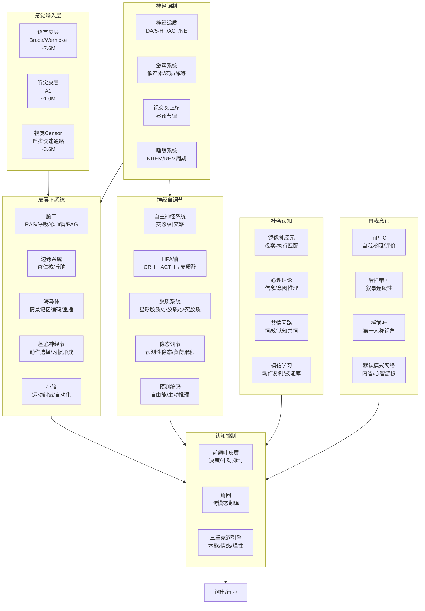

# Simulacrum 技术文档

> 详细技术规格说明书 v2.0

---

## 一、项目总览与研究背景

### 1.1 研究动机

Simulacrum（拉丁语"追求财富的工匠"，简称 Simulacrum）是一个生物启发式 AI 认知架构，实现了 **20+ 种脑区/神经机制**、**认知心理学模型**、**事件驱动架构**和**自适应剪枝**。核心研究问题：**如何借鉴人脑的工作原理，设计更高效、更可解释、更具适应性的 AI 系统？**

#### 1.1.1 人脑与计算机的对比

| 特性 | 人脑 | Transformer |
|------|-----|----------|
| **能耗** | ~20W | 数百瓦-数千瓦 |
| **计算方式** | 事件驱动 | 全量计算 |
| **存储** | 分布式 | 独立显存 |
| **学习方式** | 持续学习 | 批量训练 |
| **推理** | ~100ms延迟 | 依硬件变化 |
| **容错** | 高（可塑性） | 脆弱 |

#### 1.1.2 类脑计算的历史渊源

| 年份 | 里程碑 | 参考文献 |
|------|--------|----------|
| 1943 | McCulloch-Pitts神经元模型 | McCulloch & Pitts (1943) |
| 1949 | Hebb学习规则 | Hebb (1949) |
| 1958 | Rosenblatt感知机 | Rosenblatt (1958) |
| 1989 | Carver Mead的神经形态芯片 | Mead (1989) |
| 2008 | IBM TrueNorth芯片 | Merolla et al. (2014) |
| 2014 | Intel Loihi芯片 | Davies et al. (2018) |
| 2021 | Spiking Neural Networks复兴 | Eshraghian et al. (2021) |

---

## 二、系统架构

### 2.1 事件驱动架构 (Event-Driven Architecture)

Simulacrum 采用 **EventBus 发布/订阅** 模式，模块仅在收到相关事件时激活，避免无效计算。

```python
# 事件总线核心
class EventBus:
    def publish(event_type, data, source) -> Dict[str, Any]
    def subscribe(event_type, handler, priority, name) -> None

# 18种事件类型
STEP_START, STEP_END, THERMO_STATE          # 生命周期
GOAL_NEEDED, GOAL_SELECTED                   # 目标选择
EXPLORATION_START, EXPLORATION_DONE          # 探索执行
MEMORY_ADDED, MEMORY_ENCODE                  # 记忆编码
ALIGNMENT_CHECK                              # 自对齐审查
PERSONALITY_UPDATE                           # 人格更新
EMOTION_PROCESS, EMOTION_UPDATED             # 情绪处理
SENSORY_PROCESS                              # 感觉整合
HIBERNATE_ENTER, SYSTEM_DEAD                 # 生存状态
COMPRESSION_NEEDED, COMPRESSION_DONE         # 资源压缩
PRUNING_UPDATE                               # 神经修剪
MOTOR_CONTROL                                # 运动控制
```

### 2.2 整体架构图



### 2.3 模块全览（26个子系统）

| # | 维度 | 模块 | 对应脑区 | 文件 | 状态 |
|---|------|------|----------|------|------|
| 1 | 探索 | CuriosityEngine | 中脑多巴胺 | `curiosity.py` | ✓ |
| 2 | 信息增益 | InformationGainCalculator | 前额叶 | `information_gain.py` | ✓ |
| 3 | 元学习 | MetaLearner + ActiveLearner | 前额叶背侧 | `meta_learning.py` | ✓ |
| 4 | 自对齐 | SelfAlignmentModule | 前扣带回 | `self_alignment.py` | ✓ |
| 5 | 经济模型 | ThermodynamicsSystem | 下丘脑 | `thermodynamics.py` | ✓ |
| 6 | 神经修剪 | NeuralPruningSystem | 全脑 | `neural_pruning.py` | ✓ |
| 7 | 高级情绪 | IntegratedAdvancedEmotionSystem | 边缘系统 | `advanced_emotion_integration.py` | ✓ |
| 8 | 自主神经 | AutonomicNervousSystem | 脑干/下丘脑 | `autonomic_nervous_system.py` | ✓ |
| 9 | HPA轴 | HPAAxis | 下丘脑-垂体-肾上腺 | `hpa_axis.py` | ✓ |
| 10 | 胶质系统 | GlialSystem | 全脑支持细胞 | `glial_system.py` | ✓ |
| 11 | 稳态调节 | AllostaticRegulation | 下丘脑（元调节） | `allostatic_regulation.py` | ✓ |
| 12 | 预测编码 | PredictiveCodingSystem | 全脑皮层 | `predictive_coding.py` | ✓ |
| 13 | 社会认知 | SocialCognitionSystem | 镜像神经元/mPFC/TPJ | `social_cognition.py` | ✓ |
| 14 | 自我意识 | SelfAwarenessCenter | mPFC/PCC/楔前叶 | `self_awareness.py` | ✓ |
| 15 | 基底神经节 | BasalGangliaSystem | 纹状体/GP/SNr | `basal_ganglia.py` | ✓ |
| 16 | 神经递质 | NeurotransmitterSystem | VTA/中缝核/蓝斑 | `neurotransmitter.py` | ✓ |
| 17 | 前额叶 | PrefrontalCortex | dlPFC/vmPFC | `prefrontal_cortex.py` | ✓ |
| 18 | 角回 | AngularGyrus | 顶叶角回 | `angular_gyrus.py` | ✓ |
| 19 | 语言皮层 | LanguageCortex | Broca/Wernicke | `language_cortex.py` | ✓ |
| 20 | 小脑-脊髓 | CerebelloSpinalCoordination | 小脑/脊髓 | `cerebello_spinal.py` | ✓ |
| 21 | 脑干 | Brainstem | 网状结构/PAG | `brainstem.py` | ✓ |
| 22 | 激素 | HormoneSystem | 内分泌系统 | `hormone_system.py` | ✓ |
| 23 | 边缘系统 | LimbicSystem | 杏仁核/丘脑 | `limbic.py` | ✓ |
| 24 | 海马体 | Hippocampus | 海马CA3/CA1/DG | `hippocampus.py` | ✓ |
| 25 | 睡眠 | SleepSystem | 视前区/松果体 | `sleep.py` | ✓ |
| 26 | 昼夜节律 | SuprachiasmaticNucleus | 视交叉上核 | `scn.py` | ✓ |

**人格系统 (personality/)**:

| # | 模块 | 文件 |
|---|------|------|
| 27 | 三重竞逐引擎 (本能/情感/理性) | `tripartite_engine.py` |
| 28 | 流式身份核心 | `identity_core.py` |
| 29 | 关系嵌入 | `relational_embedding.py` |
| 30 | 注意力门控 | `attention_gating.py` |
| 31 | 动机生存系统 | `motivation.py` |
| 32 | 神经调制 | `neuromodulation.py` |
| 33 | 表观遗传学习 | `epigenetic.py` |

---

## 三、核心模块详解

### 3.1 语言皮层 (Language Cortex) —— 布洛卡区与韦尼克区

#### 3.1.1 神经解剖学背景

**语言处理的双系统模型：**

```
          语言处理双通路模型
 理解通路:
 听觉皮层 → Wernicke区 → 弓状束 → Broca区 → 运动皮层
   (声音)    (语义)       (传递)    (语法)     (输出)
```

##### 布洛卡区（Broca's Area, BA 44/45）

- **位置**：左半球额下回
- **功能**：语言产生、语法加工、动作序列规划
- **损伤后果**：运动性失语症（Broca, 1861）
- **参考文献**：Rickard et al. (2005)

##### 韦尼克区（Wernicke's Area, BA 22）

- **位置**：左半球颞上回后部
- **功能**：语义整合、词汇意义解码、语音感知
- **损伤后果**：感觉性失语症（Wernicke, 1874）

##### 弓状束（Arcuate Fasciculus）

- **功能**：连接布洛卡区和韦尼克区，言语复述
- **损伤后果**：传导性失语症
- **参考文献**：Catani et al. (2005)

#### 3.1.2 模型架构

```python
class LanguageCortex(nn.Module):
    """
    两种模式：
    - use_parallel=True: 双层双向GRU (批量快速处理)
    - use_parallel=False: 串行SSM + Bio-Gating (流式+情绪)

    输入: [B, T] token序列
    输出: { features, valence, arousal, semantic, surprise, emotion_state }
    """
```

**ParallelEncoder**：双层双向GRU → 首尾拼接 → Linear投影
- GRU: `input=256, hidden=512, bidirectional` → 输出 `[B, T, 1024]`
- Concat last + first timestep → `[B, 2048]`
- Proj: `Linear(2048, 256)`

**参数量**：

| 组件 | 参数量 | 占比 |
|------|--------|------|
| Embedding (10000×256) | 2.56M | 34% |
| GRU (2层双向) | 4.19M | 55% |
| Bio-Gating | 0.26M | 3% |
| Output | 2.56M | 8% |
| **总计** | **~7.6M** | 100% |

#### 3.1.3 GRU门控数学公式

更新门: $z_t = \sigma(W_z x_t + U_z h_{t-1} + b_z)$

重置门: $r_t = \sigma(W_r x_t + U_r h_{t-1} + b_r)$

候选隐状态: $\tilde{h}_t = \tanh(W x_t + r_t \odot U h_{t-1} + b)$

最终状态: $h_t = (1 - z_t) \odot h_{t-1} + z_t \odot \tilde{h}_t$

参考文献: Cho et al. (2014)

---

### 3.2 Bio-Gating机制 —— 杏仁核与神经调节

#### 3.2.1 杏仁核（Amygdala）

```
          杏仁核结构 (LeDoux, 2000)

      外侧核 (LA) ── 中央核 (CeA) ── 终纹床核
          ↕               ↕
       感觉输入         行为输出

  两条通路:
  1. 上行通路: 丘脑→皮层→杏仁核 (慢, ~500ms)
  2. Censor通路: 丘脑→杏仁核 (快, ~100ms)
```

参考文献: LeDoux (2000), Russell (1980)

#### 3.2.2 BioGate实现

综合门控公式:

$$\text{gate}_i = \text{softmax}(W_c x + p + e + m)_i$$

- $W_c x$: 内容门控（输入驱动）
- $p$: 膜电位（LTP/LTD记忆）
- $e = \tanh(\sum(VAD)) \times 0.2$: 情绪调制
- $m$: 心境背景偏置

膜电位更新: $p_{t+1} = p_t \times 0.9 + \mathbb{1}[selected]$

---

### 3.3 认知心理学组件

#### 3.3.1 Plutchik情绪轮（1980）

8种基本情绪: Joy, Sadness, Trust, Disgust, Fear, Anger, Surprise, Anticipation

参考文献: Plutchik (1980), Ekman (1992)

#### 3.3.2 双过程理论（Kahneman, 2011）

| 特性 | 系统1 | 系统2 |
|------|------|------|
| 速度 | 快(~100ms) | 慢(~500ms) |
| 意识 | 无意识 | 有意识 |
| 计算 | 平行 | 序列 |
| 神经相关 | 腹侧纹状体/杏仁核 | 前额叶/dlPFC |

参考文献: Kahneman (2011)

#### 3.3.3 元认知

元认知是对认知的认知（Flavell, 1979），包含元认知知识、体验和监控。

参考文献: Flavell (1979)

---

### 3.4 自主神经系统 (ANS)

**文件**: `core/autonomic_nervous_system.py`

#### 3.4.1 神经生物学

ANS 是最基础的调节系统，控制心率、血压、消化等不随意功能。

**交感神经 (Sympathetic)**: 战斗/逃跑反应。威胁→激活→心率↑、瞳孔放大、葡萄糖释放、消化↓

**副交感神经 (Parasympathetic)**: 休息/消化。安全→激活→心率↓、恢复↑。迷走神经张力作为基线。

#### 3.4.2 子系统

| 子系统 | 功能 | 关键公式 |
|--------|------|----------|
| SympatheticBranch | 威胁/新奇/紧迫→激活 | `tone = sigmoid(reactivity × input)` + 自然衰减 |
| ParasympatheticBranch | 安全/社交→激活 | 迷走神经张力基线 |
| BaroreceptorReflex | 血压负反馈 | `delta = -sensitivity × (bp - setpoint)` |
| PolyvagalSystem | 3级层次状态 | ventral_vagal ↔ sympathetic ↔ dorsal_vagal |

#### 3.4.3 关键生物规则

- **HRV**: `0.3 + 0.7 * parasympathetic * (1 - 0.5 * sympathetic)` (Thayer & Lane, 2000)
- **多迷走神经层次**: ventral_vagal 需要 parasympathetic > 0.5 AND threat < 0.3 (Porges, 2001)
- **压力感受器**: 比例控制器 (Guyton & Hall)

#### 3.4.4 接口

```python
ans = AutonomicNervousSystem()
result = ans.step(
    threat=0.3, novelty=0.5, urgency=0.2,
    safety_signal=0.7, social_engagement=0.5,
)
# → { sympathetic_tone, parasympathetic_tone, heart_rate, blood_pressure, hrv, polyvagal_state }
```

---

### 3.5 HPA轴 (下丘脑-垂体-肾上腺轴)

**文件**: `core/hpa_axis.py`

#### 3.5.1 神经生物学

应激激素级联反应:

```
下丘脑(CRH) → 垂体(ACTH) → 肾上腺皮质(皮质醇)
     ↑____________________________↓
           负反馈抑制
```

#### 3.5.2 子系统

| 子系统 | 功能 |
|--------|------|
| HypothalamicCRH | CRH释放: `sigmoid(reactivity × stress + 0.3 × uncertainty - cortisol_inhibition)` |
| PituitaryACTH | ACTH释放: 受CRH刺激、皮质醇抑制 |
| AdrenalCortex | 皮质醇释放: 受ACTH刺激, 半衰期~60min衰减, 昼夜基线(峰值8AM) |
| NegativeFeedbackLoop | 皮质醇抑制CRH和ACTH释放 (关键稳态环路) |
| AllostaticLoadTracker | 累积磨损: 皮质醇>0.5 AND NE>0.5时累积 |

#### 3.5.3 关键生物规则

- CRH级联: Vale et al. (1981)
- 皮质醇衰减: `cortisol *= 0.99^t` 指数衰减
- 负反馈: `inhibition = feedback_strength × cortisol_level` (Jacobson & Sapolsky)
- 稳态负荷累积: McEwen (1993)
- 慢性应激检测: 滑动窗口均值 cortisol > 0.6 持续100步

#### 3.5.4 接口

```python
hpa = HPAAxis()
result = hpa.step(
    stress_signal=0.3, uncertainty=0.2,
    circadian_hour=14.0, is_recovering=False, social_support=0.5,
)
# → { cortisol_level, crh_level, acth_level, allostatic_load, stress_type }
```

---

### 3.6 胶质系统 (Glial System)

**文件**: `core/glial_system.py`

#### 3.6.1 神经生物学

胶质细胞占大脑细胞总数的50%以上，是神经元的"后勤保障系统"。

#### 3.6.2 子系统

| 子系统 | 功能 | 参考文献 |
|--------|------|----------|
| AstrocyteSystem | 三突触胶质: 钙波检测活动, 释放D-丝氨酸调制NMDA | Araque et al. (1999) |
| | K⁺缓冲: 清除胞外K⁺, K⁺>0.8=危险 | Kofuji & Newman (2004) |
| | 乳酸穿梭: 星形胶质-神经元乳酸穿梭供能 | Pellerin & Magistretti (1994) |
| | 胶淋巴清除: 深睡时星形胶质细胞收缩, CSF冲洗废物 | Iliff et al. (2012) |
| MicrogliaSystem | 3态激活: 静息/M1(促炎)/M2(抗炎) | |
| | 补体介导突触修剪: 标记弱突触→吞噬 | Schafer et al. (2012) |
| | 细胞因子释放: IL-1β, TNF-α | |
| OligodendrocyteSystem | 适应性髓鞘化: 高频通路→加髓鞘→传导加速 | Gibson et al. (2014) |
| | 能量代价: 髓鞘化昂贵, 仅当预算允许 | |

#### 3.6.3 接口

```python
glial = GlialSystem()
result = glial.step(
    neural_activity=0.5, extracellular_k=0.3,
    energy_demand=0.4, is_sleeping=False, sleep_stage="awake",
    damage_signal=0.0, stress_level=0.3, energy_budget=0.3,
)
# → { waste_level, glymphatic_clearance, neuroinflammation, myelination_level,
#     gliotransmitter_release, brain_health }
```

---

### 3.7 稳态调节 (Allostatic Regulation)

**文件**: `core/allostatic_regulation.py`

#### 3.7.1 概念

**稳态 (Allostasis)**: 预测性调节到移动设定点，而非静态平衡 (Sterling & Eyer, 1988)。

#### 3.7.2 子系统

| 子系统 | 功能 |
|--------|------|
| PredictiveRegulator | EMA趋势预测: 支出↑→预增能量分配; 压力↑→预增副交感 |
| LoadAccumulator | `Load = Σ(w_i × max(0, |mediator_i - midpoint_i| - tolerance_i))` (Seeman et al., 1997) |
| RegimeSelector | 4种体制: rest/active/stress/recovery, 各有特定设定点 |

#### 3.7.3 关键规则

- 过载 (load > 0.8): 保护模式 → 减少探索、强制恢复、收紧预算
- 恢复: `effective_recovery = base × sleep_factor × social_factor × (1 - 0.5 × load)` (Ulrich-Lai & Herman)

---

### 3.8 预测编码 (Predictive Coding)

**文件**: `core/predictive_coding.py`

#### 3.8.1 自由能原理

大脑作为预测机器: `F = complexity + inaccuracy` (Friston, 2010)

#### 3.8.2 子系统

| 子系统 | 功能 |
|--------|------|
| GenerativeLayer | 自上而下预测 + 自下而上误差计算 |
| HierarchicalGenerativeModel | 3层层次: 感觉层/特征层/概念层 |
| PrecisionModulator | `precision = sigmoid(w_da × DA + w_ach × ACh - w_unc × uncertainty)` (Feldman & Friston, 2010) |
| ActiveInferenceController | 误差无法通过更新信念消除时 → 行动使预测成真 → 好奇心 |

#### 3.8.3 关键规则

- 加权误差: `weighted_error = precision × raw_error`
- 主动推理驱动: `drive = sigmoid(Σ(weighted_errors) - threshold)` (Friston et al., 2012)
- 注意力 = 预测误差的精度加权 (Clark, 2013)

---

### 3.9 社会认知系统 (Social Cognition)

**文件**: `core/social_cognition.py`

#### 3.9.1 神经生物学

社会认知是人类天生自带的共情机制: 看到别人打哈欠→自己也想打; 看到别人受伤→自己也感到疼。这是人际交往的底层逻辑。

#### 3.9.2 子系统

| 子系统 | 对应脑区 | 功能 | 参考文献 |
|--------|----------|------|----------|
| MirrorNeuronSystem | F5/IFG | 观察-执行匹配, 哈欠传染, 疼痛共振 | Rizzolatti et al. (1996) |
| TheoryOfMind | mPFC/TPJ | 信念推理(mPFC), 意图推理(TPJ), 视角采择 | Premack & Woodruff (1978) |
| EmpathyCircuit | AI/ACC | 情感共情, 认知共情, 同情心, 个人痛苦 | Decety & Jackson (2004) |
| ImitationLearning | PF/镜像 | 动作复制, 技能库(EMA更新) | Heyes (2001) |
| SocialPredictor | dmPFC | LSTM行为建模, 交互结果预测 | |

#### 3.9.3 接口

```python
sc = SocialCognitionSystem(action_dim=16, state_dim=64, emotion_dim=8)
result = sc.step(
    observed_action=torch.randn(16),
    self_state=torch.randn(64),
    other_behavior=torch.randn(64),
    other_emotion=torch.randn(8),
    pain_observed=0.3, proximity=0.5, similarity=0.5,
)
# → { mirror_resonance, yawning_trigger, pain_resonance,
#      affective_empathy, cognitive_empathy, compassion,
#      inferred_intent, overall_social_capacity }
```

---

### 3.10 自我意识中枢 (Self-Awareness Center)

**文件**: `core/self_awareness.py`

#### 3.10.1 神经生物学

自我意识中枢位于大脑内侧前额叶皮层 (mPFC) 和后扣带回皮层 (PCC)，是"我是谁"这个问题的神经基础。

#### 3.10.2 子系统

| 子系统 | 对应脑区 | 功能 | 参考文献 |
|--------|----------|------|----------|
| MedialPrefrontalCortex | vmPFC/dmPFC/amPFC | 自我参照、自我评价、心理时间旅行、自传体自我 | Northoff et al. (2006) |
| PosteriorCingulateCortex | PCC | 自我相关性检测、叙事连续性、场景构建 | Raichle et al. (2001) |
| PrecuneusSystem | 楔前叶 | 第一人称视角、自我加工、心理意象 | Cavanna & Trimble (2006) |
| DefaultModeNetwork | DMN | 任务负向网络、心智游移、元意识 | Andrews-Hanna (2010) |
| SelfOtherDistinction | 右额下回/TPJ | 自我边界清晰度、主体感、所有权感 | Legrand & Ruby (2009) |
| MetaSelfAwareness | dlPFC/DMN | 递归意识深度, "意识到自己在意识" | Schooler et al. (2011) |

#### 3.10.3 层次处理

```
L0: 自我参照 (mPFC) — 这个信息和我有关吗?
L1: 自我评价 (mPFC) — 我做得怎么样?
L2: 自我叙事 (PCC) — 我的故事是什么?
L3: 自我定位 (楔前叶) — 我在哪里?
L4: 自我边界 (自我-他者区分) — 我 vs 他人的边界
L5: 元意识 (DMN + 元自我意识) — 我知道我在想什么
```

#### 3.10.4 关键规则

- DMN激活: 低任务负荷 + 高疲劳 → 高DMN → 内省模式
- 心智游移: DMN活跃时思维自发游移, 元意识 = 意识到自己在走神
- 递归深度: Level 0(无意识) → Level 1(基本自我意识) → Level 2(元自我意识) → Level 3+(罕见)
- 自我一致性: 由8个子指标加权融合 (`self_eval, auto_coherence, narrative_continuity, first_person, meta_awareness, boundary_clarity, awareness_of_awareness, model_accuracy`)

#### 3.10.5 接口

```python
sa = SelfAwarenessCenter(state_dim=64, hidden_dim=64)
result = sa.step(
    self_state=torch.randn(64),
    external_input=torch.randn(64),
    task_load=0.3, fatigue=0.4,
    emotional_valence=0.1, cognitive_control=0.6,
)
# → { self_evaluation, self_reference, autobiographical_coherence,
#      dmn_activation, is_introspective_mode, mind_wandering,
#      meta_awareness, self_boundary_clarity, awareness_of_awareness,
#      recursive_depth, self_coherence, overall_self_awareness, self_narrative }
```

---

### 3.11 脑干系统 (Brainstem)

**文件**: `core/brainstem.py`

| 子系统 | 功能 |
|--------|------|
| ReticularActivatingSystem | 觉醒水平调节, 意识门控 |
| RespiratoryRhythmGenerator | 呼吸节律生成 (吸气/呼气/暂停) |
| PeriaqueductalGray | 防御行为: 冻结/逃跑/战斗 |
| MedullaryCardiovascularCenter | 心血管控制, 心率/血压调节, 痛觉门控 |

---

### 3.12 边缘系统 (Limbic System)

**文件**: `core/limbic.py`

包含杏仁核（情绪评估）和丘脑（感觉中继），通过事件驱动 `SENSORY_PROCESS` 激活。

---

### 3.13 海马体 (Hippocampus)

**文件**: `core/hippocampus.py`

情景记忆编码与重播:

| 子结构 | 功能 |
|--------|------|
| EC (内嗅皮层) | 输入端口 |
| DG (齿状回) | 模式分离 (区分相似记忆) |
| CA3 | 自动联想 (回忆) |
| CA1 | 时间序列编码 |

通过事件 `MEMORY_ENCODE` 编码情景记忆，通过 `get_summary()` 报告记忆统计。

---

### 3.14 睡眠系统 (Sleep System)

**文件**: `core/sleep.py`

NREM/REM 周期模拟，记忆重播:

- NREM1/2: 浅睡，纺锤波
- NREM3: 深睡，慢波，胶淋巴清除高峰
- REM: 快速眼动，记忆巩固

---

### 3.15 昼夜节律 (SCN)

**文件**: `core/scn.py`

视交叉上核 — 内在 ~24.2h 周期:

- 褪黑素释放 (夜间高峰)
- 皮质醇昼夜节律 (晨峰 8AM)
- 核心体温节律
- 觉醒驱动力 / 睡眠压力

---

### 3.16 基底神经节 (Basal Ganglia)

**文件**: `core/basal_ganglia.py`

动作选择与习惯形成:

```
皮层输入 → 纹状体(直接/间接通路) → GPi/SNr → 丘脑 → 皮层
                 ↑                         |
              多巴胺(TD误差)               |
                 ↓                         |
            小脑(运动纠错)←────────────────┘
```

- StriatumInput: 每个动作一个Q值网络
- TD学习: `δ = r + γ × max Q(s') - Q(s, a)`
- 习惯强度: 重复动作→自动化→释放意识资源
- BG-小脑耦合: 熟能生巧

---

### 3.17 神经递质系统 (Neurotransmitter)

**文件**: `core/neurotransmitter.py`

| 递质 | 功能 | 行为效应 |
|------|------|----------|
| 多巴胺 (DA) | 奖励预测误差 | 动机, 探索↑ |
| 血清素 (5-HT) | 心境调节 | 情绪稳定, 攻击↓ |
| 乙酰胆碱 (ACh) | 注意力/记忆 | 学习效率↑ |
| 去甲肾上腺素 (NE) | 唤醒/警觉 | 唤醒度↑ |

---

### 3.18 前额叶皮层 (Prefrontal Cortex)

**文件**: `core/prefrontal_cortex.py`

执行控制中枢:

| 子系统 | 功能 |
|--------|------|
| MaturationTracker | 成熟度追踪 (模拟青少年→成年) |
| CostBenefitAnalyzer | 代价-收益分析 |
| ImpulseController | 冲动抑制门控 |
| LongTermPlanner | 长远规划深度 |
| WorkingMemory | 7±2工作记忆槽 |

PFC审核基底神经节的动作选择: 强抑制时 (>0.7) 用PFC决策替代BG冲动。

---

### 3.19 角回 (Angular Gyrus)

**文件**: `core/angular_gyrus.py`

跨模态翻译器:

- ModalityProjector: 各模态投射到语义中间语
- SemanticInterlingua: 语言-视觉-听觉统一表征
- CrossModalPredictor: 跨模态预测 (看到文字→"听到"读音)
- TemporalBindingBuffer: 时间绑定窗口 (~40ms)
- SceneDetector: 场景边界检测

---

### 3.20 三重竞逐引擎 (Tripartite Engine)

**文件**: `core/personality/tripartite_engine.py`

对应脑科学"存在三象性":

| 模块 | 脑区 | 类似神经递质 | 功能 |
|------|------|-------------|------|
| SurvivalModule | 脑干/下丘脑 | GABA (抑制性) | 安全检查, 伦理对齐 |
| EmotionModule | 边缘系统 | 多巴胺/皮质醇 | 情绪感知, 共情安抚 |
| LogicModule | 前额叶 | 去甲肾上腺素 (专注) | 任务推理, 规划 |

神经递质权重分配器根据上下文动态调整三模块权重:

- 检测到攻击性 → survival权重飙升 (GABA抑制)
- 检测到情绪波动 → emotion上升 (多巴胺奖赏)
- 常规任务 → logic为主 (去甲肾上腺素专注)

---

### 3.21 硬件生命体征桥接 (Hardware Vitals)

**文件**: `core/hardware_vitals.py`

将计算机硬件指标映射为生物生命体征:

| 硬件指标 | 生物映射 | 生理意义 |
|----------|----------|----------|
| CPU负载 | 心率 (HR) | 系统负荷水平 |
| 内存使用率 | 血压 (BP) | 资源压力 |
| GC频率 | 肠道5-HT | 内感受状态 |

为未来实验室硬件集成预留传感器接口。

---

## 四、Agent step() 执行流程

每个 step 的完整调用顺序:

```
1.  STEP_START 事件 → 热力学检查 (DEAD/HIBERNATE/ACTIVE)
2.  SCN 昼夜节律更新 → 褪黑素, 皮质醇节律, 觉醒度
3.  SENSORY_PROCESS 事件 → 边缘系统 + 角回 (事件驱动)
4.  预测编码更新 → 自由能, 预测误差, 注意力权重
5.  GOAL_NEEDED 事件 → 好奇心选目标 (含情绪加成)
6.  EXPLORATION_START 事件 → 执行探索 + 信息增益
7.  基底神经节动作选择与学习 (TD误差)
8.  前额叶执行控制审核BG决策
9.  语言皮层处理 (有用户输入时)
10. MEMORY_ENCODE 事件 → 海马体情景记忆编码
11. 主动学习 + 自对齐审查
12. _neural_self_regulation_step():
    a. ANS → 交感/副交感, HRV, 多迷走神经状态
    b. HPA轴 → 皮质醇, CRH, ACTH, 稳态负荷
    c. 胶质系统 → 废物清除, 突触修剪, 髓鞘化
    d. 稳态调节 → 体制分类, 负荷, 调节容量
    e. 神经递质 → DA/5-HT/ACh/NE
    f. 社会认知 → 镜像共振, 共情, 心理理论
    g. 自我意识 → mPFC/PCC/DMN/元意识
13. PERSONALITY_UPDATE 事件 → 6个人格模块并行更新
14. EMOTION_PROCESS 事件 → 高级情绪处理
15. _adjust_behavior_by_internal_state() → 根据 ANS/HPA/稳态/自我意识 反馈调整
16. 神经修剪更新
```

---

## 五、参数配置

### 5.1 好奇心与探索

| 参数 | 默认值 | 范围 | 说明 |
|------|-------|------|------|
| curiosity_alpha | 0.4 | 0-1 | 新颖性权重 |
| curiosity_beta | 0.3 | 0-1 | 复杂性权重 |
| curiosity_gamma | 0.3 | 0-1 | 效用权重 |
| exploration_rate | 0.1 | 0.01-0.5 | 探索率 |

### 5.2 信息增益

| 参数 | 默认值 | 说明 |
|------|-------|------|
| intrinsic_motivation_lambda | 0.5 | 内在动机权重 |
| world_model_lr | 0.001 | 世界模型学习率 |

### 5.3 经济模型

| 参数 | 默认值 | 说明 |
|------|-------|------|
| initial_balance | 100.0 | 初始余额 |
| compute_cost_per_sec | 0.01 | 每秒计算成本 |
| storage_cost_per_sec | 0.001 | 每秒存储成本 |
| compress_threshold | 10.0 | 压缩触发阈值 |

### 5.4 神经修剪

| 参数 | 默认值 | 说明 |
|------|-------|------|
| prune_threshold | 0.15 | 硬剪枝阈值 |
| prune_decay_rate | 0.002 | 权重衰减率 |
| neurogenesis_enabled | True | 神经发生开关 |

### 5.5 神经自调节

| 参数 | 默认值 | 说明 |
|------|-------|------|
| ans_sympathetic_reactivity | 1.0 | 交感神经反应性 |
| ans_baseline_vagal_tone | 0.5 | 迷走神经基线张力 |
| ans_baroreceptor_setpoint | 0.5 | 压力感受器设定点 |
| hpa_stress_reactivity | 1.0 | HPA应激反应性 |
| hpa_cortisol_half_life_steps | 60 | 皮质醇半衰期(步) |
| hpa_feedback_strength | 0.6 | 皮质醇负反馈强度 |
| hpa_load_accumulation_rate | 0.002 | 稳态负荷累积率 |
| glial_pruning_rate | 0.05 | 小胶质突触修剪率 |
| allostatic_overload_threshold | 0.8 | 稳态过载阈值 |
| allostatic_load_recovery_rate | 0.005 | 负荷恢复率 |
| predictive_coding_layers | 3 | 预测编码层次数 |
| predictive_coding_lr | 0.01 | 预测编码学习率 |

### 5.6 事件驱动

| 参数 | 默认值 | 说明 |
|------|-------|------|
| event_log_enabled | False | 事件日志开关 |
| event_bus_debug | False | 调试模式 |

### 5.7 系统

| 参数 | 默认值 | 说明 |
|------|-------|------|
| max_history_size | 1000 | 最大记忆条数 |
| device | "cpu" | 运行设备 |
| seed | 42 | 随机种子 |

---

## 六、常见问题与解决方案

### 6.1 澄清：生物隐喻 vs 工程实现

**问：生物命名底层都是矩阵乘法，对调参有什么实际指导？**

**答**：生物隐喻只在架构设计阶段有用：

| 层级 | 生物命名 | 实际实现 | 调参价值 |
|-------|----------|----------|----------|
| 架构设计 | 稀疏门控 | Top-K路由 | 有用 |
| 底层实现 | 杏仁核 | Dense+Sigmoid | 无区别 |
| 调参 | LTP/LTD | weight update | 无区别 |

### 6.2 规模限制

**问**：人脑860亿神经元，Simulacrum才~12M参数。规模化后生物机制会失效吗？

**答**：大部分会失效或需要重构

| 机制 | 小规模 | 大规模(70B) |
|------|--------|-------------|
| 7槽位WM | 有效 | 失效→分层记忆 |
| Bio-Gating | 效率优势 | 失效→标准MoE |
| 事件驱动 | 有效 | 保留 |

### 6.3 与LLM对比

| 能力 | 7B LLM | Simulacrum当前 |
|------|--------|--------|
| 复杂推理 | 自回归生成 | 原型阶段 |
| 知识问答 | 预训练海量 | 无大规模训练 |
| 自我调节 | 无 | 完整ANS/HPA/胶质 |
| 社会认知 | 无 | 镜像/共情/ToM |
| 自我意识 | 无 | mPFC/DMN/元意识 |

**Simulacrum定位**：特定场景补充，非LLM替代品

### 6.4 内存不足

```python
RuntimeError: CUDA out of memory
# 解决: 降低 batch_size 或 vocab_size
model = create_language_cortex(vocab_size=5000)
```

### 6.5 训练不收敛

```python
# 解决: 降低学习率 + 梯度裁剪
opt = torch.optim.AdamW(model.parameters(), lr=1e-4)
torch.nn.utils.clip_grad_norm_(model.parameters(), 1.0)
```

---

## 七、API参考

### 7.1 创建智能体

```python
from simulacrum.core.agent import Simulacrum

agent = Simulacrum(config=None, state_dim=4, n_actions=4)
```

### 7.2 运行

```python
# 单步执行
state = agent.step(user_input="hello", user_sentiment=0.0, external_stimulus=0.0)

# 多回合
states = agent.run_episodes(n_episodes=10, verbose=True)

# 完整统计
stats = agent.get_full_statistics()
```

### 7.3 独立使用子系统

```python
# ANS
from simulacrum.core.autonomic_nervous_system import create_autonomic_nervous_system
ans = create_autonomic_nervous_system()

# 自我意识
from simulacrum.core.self_awareness import create_self_awareness_center
sa = create_self_awareness_center(state_dim=64, hidden_dim=64)

# 社会认知
from simulacrum.core.social_cognition import create_social_cognition
sc = create_social_cognition(action_dim=16, state_dim=64, emotion_dim=8)
```

---

## 八、参考文献

### 神经科学经典

1. Broca, P. (1861). Remarques sur le siége de la faculté du langage articulé. *Bull. Soc. Anat.*, 6, 330-357.
2. Wernicke, C. (1874). *Der Aphasche Symptom Complex*. Breslau: Cohn & Weigert.
3. Hebb, D. O. (1949). *The Organization of Behavior*. Wiley.
4. Miller, G. A. (1956). The magical number seven. *Psychol. Rev.*, 63(2), 81-97.
5. LeDoux, J. E. (2000). Emotion circuits in the brain. *Annu. Rev. Neurosci.*, 23, 155-184.
6. Kahneman, D. (2011). *Thinking, Fast and Slow*. Farrar.
7. Schultz, W. (2007). Multiple dopamine functions. *Annu. Rev. Neurosci.*, 30, 259-288.
8. Hickok, G., & Poeppel, D. (2007). Cortical organization of speech. *Nat. Rev. Neurosci.*, 8(5), 393-402.
9. Plutchik, R. (1980). *Emotion: Psychoevolutionary Synthesis*. Harper & Row.
10. Flavell, J. H. (1979). Metacognition and cognitive monitoring. *Am. Psychol.*, 34(10), 906-911.
11. Catani, M. et al. (2005). Segmental language mapped. *NeuroImage*, 26(2), 317-329.
12. Hodgkin, A. L., & Huxley, A. F. (1952). Membrane current. *J. Physiol.*, 117(4), 500-544.

### 自调节与社会认知

13. McEwen, B. S. (1993). Stress and the individual. *Arch. Intern. Med.*, 153, 2093-2101.
14. Porges, S. W. (2001). The polyvagal theory. *Biol. Psychol.*, 60, 97-116.
15. Thayer, J. F., & Lane, R. D. (2000). A model of neurovisceral integration. *Neurosci. Biobehav. Rev.*, 24, 115-124.
16. Friston, K. (2010). The free-energy principle. *Nat. Rev. Neurosci.*, 11, 127-138.
17. Rizzolatti, G. et al. (1996). Premotor cortex and mirror neurons. *Brain*, 119, 593-609.
18. Araque, A. et al. (1999). Tripartite synapses. *Trends Neurosci.*, 22, 208-215.
19. Iliff, J. J. et al. (2012). A paravascular pathway for CSF. *Sci. Transl. Med.*, 4, 147ra111.
20. Gibson, E. M. et al. (2014). Neuronal activity promotes oligodendrogenesis. *Science*, 344, 1252304.

### 自我意识

21. Northoff, G. et al. (2006). Self-referential processing in the brain. *Trends Cogn. Sci.*, 10, 332-338.
22. Raichle, M. E. et al. (2001). A default mode of brain function. *PNAS*, 98, 676-682.
23. Cavanna, A. E., & Trimble, M. R. (2006). The precuneus. *Prog. Neurobiol.*, 78, 213-238.
24. Schooler, J. W. et al. (2011). Meta-awareness. *Psychol. Bull.*, 137, 596-622.
25. Legrand, D., & Ruby, P. (2009). What is self-specific? *Conscious. Cogn.*, 18, 756-764.
26. Christoff, K. et al. (2011). Mind wandering and the default network. *PNAS*, 108, 11354-11359.

### 其他

27. Sterling, P., & Eyer, J. (1988). Allostasis: A new paradigm. In *Handbook of Life Stress*.
28. Seeman, T. et al. (1997). Allostatic load as a marker. *Ann. N.Y. Acad. Sci.*, 840, 1-14.
29. Decety, J., & Jackson, P. L. (2004). The functional architecture of human empathy. *Behav. Cogn. Neurosci. Rev.*, 3, 71-100.
30. Schafer, D. P. et al. (2012). Microglia sculpt postnatal neural circuits. *Neuron*, 74, 691-705.

---

## 九、版本历史

| 版本 | 日期 | 变更 |
|------|------|------|
| v2.0 | 2026-05-17 | 全面更新: 26个子系统、事件驱动架构、神经自调节(ANS/HPA/Glial/Allostatic/PredictiveCoding)、社会认知(镜像/共情/ToM)、自我意识(mPFC/PCC/DMN)、脑干/SCN/睡眠/边缘/海马、硬件生命体征桥接 |
| v1.0 | 2026-05-11 | 初始版本: 语言皮层、Bio-Gating、听觉皮层、视觉Censor、认知心理学 |

---

## 十、引用

```bibtex
@software{simulacrum,
  title={Simulacrum: Bio-Inspired Cognitive Architecture},
  author={Simulacrum Lab},
  year={2026},
  version={2.0},
  url={https://github.com/your-repo/simulacrum}
}
```
