# Simulacrum 完整技术文档

> 生物启发式AI智能体系统 | Bio-Inspired Autonomous AI Agent System
> 
> **项目名称**: Simulacrum (Simulacrum) — 拉丁语"追求财富的工匠"
> 
> **版本**: v2.2 | **日期**: 2026-05-20 | **作者**: YAN (吉林大学交叉学科)

---

## 目录

### [一、项目总览](#一项目总览)
- [1.1 标题与摘要](#11-标题与摘要)
- [1.2 研究背景与挑战](#12-研究背景与挑战)
  - [1.2.1 人脑与计算机对比](#121-人脑与计算机对比)
  - [1.2.2 类脑计算历史渊源](#122-类脑计算历史渊源)
  - [1.2.3 传统AI的五大挑战](#123-传统ai的五大挑战)
- [1.3 核心实验结果总览](#13-核心实验结果总览)
  - [1.3.1 完整系统架构 (28+ Mechanism)](#131-完整系统架构-28-mechanism)
  - [1.3.2 真实环境端到端验证](#132-真实环境端到端验证)
  - [1.3.3 关键发现](#133-关键发现)
- [1.4 版本迭代](#14-版本迭代)
- [1.5 论文结构](#15-论文结构)

### [二、系统架构](#二系统架构)
- [2.1 事件驱动架构 (Event-Driven Architecture)](#21-事件驱动架构-event-driven-architecture)
  - [2.1.1 EventBus 发布/订阅模式](#211-eventbus-发布订阅模式)
  - [2.1.2 28种事件类型](#212-28种事件类型)
- [2.2 整体架构图](#22-整体架构图)
  - [2.2.1 Mermaid架构图](#221-mermaid架构图)
  - [2.2.2 ASCII架构图](#222-ascii架构图)
- [2.3 模块全览（28+个子系统）](#23-模块全览28个子系统)
  - [2.3.1 核心认知模块](#231-核心认知模块)
  - [2.3.2 神经自调节模块](#232-神经自调节模块)
  - [2.3.3 社会认知与自我意识](#233-社会认知与自我意识)
  - [2.3.4 人格系统 (personality/)](#234-人格系统-personality)
  - [2.3.5 感知与执行模块](#235-感知与执行模块)
- [2.4 Agent step() 完整执行流程](#24-agent-step-完整执行流程)

### [三、核心认知机制详解](#三核心认知机制详解)
- [3.1 好奇心驱动探索 (Curiosity Engine)](#31-好奇心驱动探索-curiosity-engine)
  - [3.1.1 生物学背景](#311-生物学背景)
  - [3.1.2 数学定义](#312-数学定义)
  - [3.1.3 代码实现](#313-代码实现)
  - [3.1.4 AUCB探索-利用平衡](#314-aucb探索-利用平衡)
  - [3.1.5 使用场景](#315-使用场景)
  - [3.1.6 参数配置](#316-参数配置)
- [3.2 信息增益内在动机 (Information Gain)](#32-信息增益内在动机-information-gain)
  - [3.2.1 生物学背景](#321-生物学背景)
  - [3.2.2 数学定义](#322-数学定义)
  - [3.2.3 变分世界模型 (VAE)](#323-变分世界模型-vae)
  - [3.2.4 代码实现](#324-代码实现)
  - [3.2.5 使用场景](#325-使用场景)
  - [3.2.6 参数配置](#326-参数配置)
- [3.3 元学习与主动学习 (Meta-Learning)](#33-元学习与主动学习-meta-learning)
  - [3.3.1 生物学背景](#331-生物学背景)
  - [3.3.2 一阶MAML数学推导](#332-一阶maml数学推导)
  - [3.3.3 主动学习选择策略](#333-主动学习选择策略)
  - [3.3.4 认知失调检测](#334-认知失调检测)
  - [3.3.5 代码实现](#335-代码实现)
  - [3.3.6 参数配置](#336-参数配置)
- [3.4 自指涉自我对齐 (Self-Alignment)](#34-自指涉自我对齐-self-alignment)
  - [3.4.1 生物学背景](#341-生物学背景)
  - [3.4.2 数学定义](#342-数学定义)
  - [3.4.3 四维对齐检查](#343-四维对齐检查)
  - [3.4.4 代码实现](#344-代码实现)
  - [3.4.5 参数配置](#345-参数配置)
- [3.5 数字热力学 (Digital Thermodynamics)](#35-数字热力学-digital-thermodynamics)
  - [3.5.1 生物学背景](#351-生物学背景)
  - [3.5.2 数学定义](#352-数学定义)
  - [3.5.3 状态转换机制](#353-状态转换机制)
  - [3.5.4 代码实现](#354-代码实现)
  - [3.5.5 参数配置](#355-参数配置)
- [3.6 代谢预算系统 (Metabolic Budget)](#36-代谢预算系统-metabolic-budget)
  - [3.6.1 生物学背景](#361-生物学背景)
  - [3.6.2 数学定义](#362-数学定义)
  - [3.6.3 周期性饥饿机制](#363-周期性饥饿机制)
  - [3.6.4 代码实现](#364-代码实现)
  - [3.6.5 参数配置](#365-参数配置)

### [四、神经自调节系统详解](#四神经自调节系统详解)
- [4.1 自主神经系统 (ANS)](#41-自主神经系统-ans)
  - [4.1.1 神经生物学](#411-神经生物学)
  - [4.1.2 子系统详解](#412-子系统详解)
  - [4.1.3 关键生物规则](#413-关键生物规则)
  - [4.1.4 代码接口](#414-代码接口)
  - [4.1.5 参数配置](#415-参数配置)
- [4.2 HPA轴 (下丘脑-垂体-肾上腺轴)](#42-hpa轴-下丘脑-垂体-肾上腺轴)
  - [4.2.1 应激激素级联](#421-应激激素级联)
  - [4.2.2 子系统详解](#422-子系统详解)
  - [4.2.3 关键生物规则](#423-关键生物规则)
  - [4.2.4 代码接口](#424-代码接口)
  - [4.2.5 参数配置](#425-参数配置)
- [4.3 胶质系统 (Glial System)](#43-胶质系统-glial-system)
  - [4.3.1 神经生物学](#431-神经生物学)
  - [4.3.2 三大胶质细胞系统](#432-三大胶质细胞系统)
  - [4.3.3 代码接口](#433-代码接口)
  - [4.3.4 参数配置](#434-参数配置)
- [4.4 稳态调节 (Allostatic Regulation)](#44-稳态调节-allostatic-regulation)
  - [4.4.1 预测性稳态概念](#441-预测性稳态概念)
  - [4.4.2 子系统详解](#442-子系统详解)
  - [4.4.3 关键规则](#443-关键规则)
  - [4.4.4 参数配置](#444-参数配置)
- [4.5 预测编码 (Predictive Coding)](#45-预测编码-predictive-coding)
  - [4.5.1 自由能原理](#451-自由能原理)
  - [4.5.2 子系统详解](#452-子系统详解)
  - [4.5.3 关键规则](#453-关键规则)
  - [4.5.4 参数配置](#454-参数配置)

### [五、社会认知与自我意识详解](#五社会认知与自我意识详解)
- [5.1 社会认知系统 (Social Cognition System)](#51-社会认知系统-social-cognition-system)
  - [5.1.1 生物学背景](#511-生物学背景)
  - [5.1.2 五大子系统详解](#512-五大子系统详解)
  - [5.1.3 镜像神经元系统 (MirrorNeuronSystem)](#513-镜像神经元系统-mirrorneuronsystem)
  - [5.1.4 心理理论 (TheoryOfMind)](#514-心理理论-theoryofmind)
  - [5.1.5 共情回路 (EmpathyCircuit)](#515-共情回路-empathycircuit)
  - [5.1.6 模仿学习 (ImitationLearning)](#516-模仿学习-imitationlearning)
  - [5.1.7 社会预测 (SocialPredictor)](#517-社会预测-socialpredictor)
  - [5.1.8 社会认知聚合器](#518-社会认知聚合器)
- [5.2 自我意识中枢 (Self-Awareness Center)](#52-自我意识中枢-self-awareness-center)
  - [5.2.1 生物学背景](#521-生物学背景)
  - [5.2.2 L0-L5 自我意识层次模型](#522-l0-l5-自我意识层次模型)
  - [5.2.3 六大子系统详解](#523-六大子系统详解)
  - [5.2.4 内侧前额叶 (mPFC)](#524-内侧前额叶-mpfc)
  - [5.2.5 后扣带回 (PCC)](#525-后扣带回-pcc)
  - [5.2.6 元自我意识 (MetaSelfAwareness)](#526-元自我意识-metaselfawareness)
  - [5.2.7 自我意识总整合](#527-自我意识总整合)
  - [5.2.8 参数配置](#528-参数配置)
- [5.3 默认模式网络 (Default Mode Network)](#53-默认模式网络-default-mode-network)
  - [5.3.1 生物学基础](#531-生物学基础)
  - [5.3.2 DMN核心节点](#532-dmn核心节点)
  - [5.3.3 DMN-TPN反相关](#533-dmn-tpn反相关)
  - [5.3.4 心智游走 (Mind Wandering)](#534-心智游走-mind-wandering)
  - [5.3.5 自我参照加工](#535-自我参照加工)

### [六、人格系统详解](#六人格系统详解)
- [6.1 架构总览](#61-架构总览)
- [6.2 三重竞逐决策引擎 (Tripartite Competitive Engine)](#62-三重竞逐决策引擎-tripartite-competitive-engine)
  - [6.2.1 生物学基础](#621-生物学基础)
  - [6.2.2 三模块详解](#622-三模块详解)
  - [6.2.3 神经递质权重分配](#623-神经递质权重分配)
  - [6.2.4 参数配置](#624-参数配置)
- [6.3 流式身份核心 (Streaming Identity Core)](#63-流式身份核心-streaming-identity-core)
  - [6.3.1 生物学基础](#631-生物学基础)
  - [6.3.2 核心组件](#632-核心组件)
  - [6.3.3 参数配置](#633-参数配置)
- [6.4 多维关系嵌入 (Relational Embedding)](#64-多维关系嵌入-relational-embedding)
  - [6.4.1 生物学基础](#641-生物学基础)
  - [6.4.2 社会认知图谱](#642-社会认知图谱)
- [6.5 注意力门控 (Attention Gating)](#65-注意力门控-attention-gating)
  - [6.5.1 生物学基础](#651-生物学基础)
  - [6.5.2 认知风格](#652-认知风格)
  - [6.5.3 注意力路由](#653-注意力路由)
- [6.6 内在动机与生存压力系统](#66-内在动机与生存压力系统)
  - [6.6.1 AI 版马斯洛需求层次](#661-ai-版马斯洛需求层次)
  - [6.6.2 反向斯德哥尔摩防御](#662-反向斯德哥尔摩防御)
- [6.7 神经调质系统 (Neuromodulation)](#67-神经调质系统-neuromodulation)
  - [6.7.1 生物学基础](#671-生物学基础)
  - [6.7.2 温度控制](#672-温度控制)
- [6.8 表观遗传记忆系统 (Epigenetic Memory)](#68-表观遗传记忆系统-epigenetic-memory)
  - [6.8.1 生物学基础](#681-生物学基础)
  - [6.8.2 甲基化触发规则](#682-甲基化触发规则)
  - [6.8.3 双轨制记忆](#683-双轨制记忆)
- [6.9 人格系统参数汇总](#69-人格系统参数汇总)

### [七、脑区模块详解](#七脑区模块详解)
- [7.1 脑干 (Brainstem)](#71-脑干-brainstem)
  - [7.1.1 生物学背景](#711-生物学背景)
  - [7.1.2 子系统详解](#712-子系统详解)
- [7.2 边缘系统 (Limbic System)](#72-边缘系统-limbic-system)
  - [7.2.1 生物学背景](#721-生物学背景)
  - [7.2.2 杏仁核 (Amygdala)](#722-杏仁核-amygdala)
  - [7.2.3 丘脑 (Thalamus)](#723-丘脑-thalamus)
- [7.3 海马体 (Hippocampus)](#73-海马体-hippocampus)
  - [7.3.1 生物学背景](#731-生物学背景)
  - [7.3.2 子系统详解](#732-子系统详解)
- [7.4 基底节 (Basal Ganglia)](#74-基底节-basal-ganglia)
  - [7.4.1 生物学背景](#741-生物学背景)
  - [7.4.2 三大通路](#742-三大通路)
- [7.5 小脑 (Cerebellum)](#75-小脑-cerebellum)
  - [7.5.1 生物学背景](#751-生物学背景)
  - [7.5.2 核心功能](#752-核心功能)
- [7.6 语言皮层 (Language Cortex)](#76-语言皮层-language-cortex)
  - [7.6.1 生物学基础](#761-生物学基础)
  - [7.6.2 核心组件](#762-核心组件)
- [7.7 神经递质系统 (Neurotransmitter System)](#77-神经递质系统-neurotransmitter-system)
  - [7.7.1 四大神经递质](#771-四大神经递质)
  - [7.7.2 多巴胺三通路](#772-多巴胺三通路)
  - [7.7.3 组合公式](#773-组合公式)
- [7.8 激素系统 (Hormone System)](#78-激素系统-hormone-system)
  - [7.8.1 激素网络](#781-激素网络)
  - [7.8.2 Yerkes-Dodson 皮质醇曲线](#782-yerkes-dodson-皮质醇曲线)
- [7.9 睡眠系统 (Sleep System)](#79-睡眠系统-sleep-system)
  - [7.9.1 生物学基础](#791-生物学基础)
  - [7.9.2 两过程睡眠模型](#792-两过程睡眠模型)
  - [7.9.3 睡眠阶段](#793-睡眠阶段)
- [7.10 昼夜节律 (Suprachiasmatic Nucleus)](#710-昼夜节律-suprachiasmatic-nucleus)
  - [7.10.1 生物学基础](#7101-生物学基础)
  - [7.10.2 分子钟 (TTFL)](#7102-分子钟-ttfl)
  - [7.10.3 褪黑素合成通路](#7103-褪黑素合成通路)
  - [7.10.4 相位反应曲线](#7104-相位反应曲线)
  - [7.10.5 节律输出](#7105-节律输出)
- [7.11 硬件生命体征 (Hardware Vitals)](#711-硬件生命体征-hardware-vitals)
- [7.12 前额叶皮层 (Prefrontal Cortex)](#712-前额叶皮层)
- [7.13 角回 (Angular Gyrus)](#713-角回-angular-gyrus)
- [7.14 神经可塑性 (Neuroplasticity)](#714-神经可塑性)
- [7.15 高级情绪系统 (Advanced Emotion System)](#715-高级情绪系统)
- [7.16 神经药理学 (Neuropharmacology)](#716-神经药理学)
- [7.17 神经修剪系统 (Neural Pruning)](#717-神经修剪系统)
- [7.18 工具系统 (Tool System)](#718-工具系统)
- [7.19 发音语言系统 (Vocalization System)](#719-发音语言系统-vocalization-system--v21-新增)

### [八、部署与运行](#八部署与运行)
- [8.1 环境准备](#81-环境准备)
- [8.2 快速开始](#82-快速开始)
- [8.3 运行实验](#83-运行实验)
- [8.4 自定义环境](#84-自定义环境)
- [8.5 Streamlit监控界面](#85-streamlit监控界面)
- [8.6 情感对话应用](#86-情感对话应用)

### [九、实验结果](#九实验结果)
- [9.1 网格环境](#91-网格环境)
- [9.2 连续控制环境](#92-连续控制环境)
- [9.3 对比分析](#93-对比分析)
- [9.4 消融实验](#94-消融实验)

### [十、参数配置总表](#十参数配置总表)
- [10.1 好奇心与探索](#101-好奇心与探索)
- [10.2 信息增益](#102-信息增益)
- [10.3 经济模型](#103-经济模型)
- [10.4 神经修剪](#104-神经修剪)
- [10.5 神经自调节](#105-神经自调节)
- [10.6 事件驱动](#106-事件驱动)
- [10.7 系统全局](#107-系统全局)

### [十一、API参考](#十一api参考)
- [11.1 创建智能体](#111-创建智能体)
- [11.2 运行接口](#112-运行接口)
- [11.3 独立使用子系统](#113-独立使用子系统)
- [11.4 子模块直接调用](#114-子模块直接调用)

### [十二、常见问题与解决方案](#十二常见问题与解决方案)
- [12.1 生物隐喻 vs 工程实现](#121-生物隐喻-vs-工程实现)
- [12.2 规模限制](#122-规模限制)
- [12.3 与LLM对比](#123-与llm对比)
- [12.4 常见错误排查](#124-常见错误排查)
- [12.5 性能优化建议](#125-性能优化建议)

### [附录A：参考文献](#附录a参考文献)
- [A.1 神经科学经典](#a1-神经科学经典)
- [A.2 自调节与社会认知](#a2-自调节与社会认知)
- [A.3 自我意识](#a3-自我意识)
- [A.4 认知心理学](#a4-认知心理学)
- [A.5 类脑计算与强化学习](#a5-类脑计算与强化学习)

### [附录B：核心参数选择依据](#附录b核心参数选择依据)
- [B.1 好奇心权重 (α, β, γ)](#b1-好奇心权重-α-β-γ)
- [B.2 代谢预算 (resource_budget)](#b2-代谢预算-resource_budget)
- [B.3 皮质醇半衰期](#b3-皮质醇半衰期)

### [附录C：算法伪代码](#附录c算法伪代码)
- [C.1 完整Agent step()伪代码](#c1-完整agent-step伪代码)
- [C.2 好奇心探索算法](#c2-好奇心探索算法)

### [附录D：论文引用](#附录d论文引用)

### [十三、Censor 微表情感知集成](#十三censor-微表情感知集成)
- [13.1 集成概述](#131-集成概述)
- [13.2 事件驱动集成](#132-事件驱动集成)
- [13.3 CensorPerceptionModule 架构](#133-censorperceptionmodule-架构)
- [13.4 MicroExpressionResult 数据结构](#134-microexpressionresult-数据结构)
- [13.5 状态向量扩展 (64→80维)](#135-状态向量扩展-6480维)
- [13.6 step() 流程中的 Censor 阶段](#136-step-流程中的-censor-阶段)
- [13.7 chat() 接口扩展](#137-chat-接口扩展)
- [13.8 降级回退机制](#138-降级回退机制)
- [13.9 AU → 情绪映射数学公式](#139-au--情绪映射数学公式)
- [13.10 Censor 7-Stage Pipeline](#1310-censor-7-stage-pipeline)
- [13.11 参数配置](#1311-参数配置)
- [13.12 文件清单](#1312-文件清单)

---

## 一、项目总览

### 1.1 标题与摘要

**英文**: Simulacrum: A Bio-Inspired Cognitive Architecture with 29+ Brain-Region Mechanisms, Event-Driven Architecture, and Adaptive Pruning

**中文**: Simulacrum：集成29+脑区机制、事件驱动架构与自适应剪枝的生物启发式认知架构

**核心关键词**: 类脑计算 (Brain-Inspired Computing)、事件驱动架构 (Event-Driven Architecture)、认知心理学 (Cognitive Psychology)、神经调质 (Neuromodulation)、自我意识 (Self-Awareness)、表观遗传记忆 (Epigenetic Memory)、数字热力学 (Digital Thermodynamics)、代谢预算 (Metabolic Budget)、生物启发式发音 (Bio-Inspired Vocalization)

**摘要**:

> 传统AI智能体高度依赖人工奖励函数，缺乏内在动机、适应性、自我意识和资源约束。我们提出 Simulacrum (Simulacrum)，一个整合 **29+种脑区/神经机制** 的生物启发式AI认知架构。核心创新包括：
>
> (1) **事件驱动架构**：EventBus 发布/订阅模式，30种事件类型，模块仅在收到相关事件时激活，避免无效计算；
>
> (2) **好奇心驱动探索**：基于 $-\log P(g|\mathcal{H})$ 的学习型新颖度计算 + AUCB探索-利用平衡，在10x10网格环境实现 **+12.1%** 奖励提升；
>
> (3) **信息增益内在动机**：VAE变分世界模型，$IG = H(s) - H(s|s')$，在无标注数据中实现 **2.93 nats** 信息增益；
>
> (4) **神经自调节五联体**：ANS交感/副交感 + HPA轴皮质醇级联 + 胶质系统废物清除 + 稳态预测性调节 + 预测编码自由能最小化；
>
> (5) **社会认知与自我意识**：镜像神经元/心理理论/共情回路 + mPFC/PCC/DMN六层自我意识模型；
>
> (6) **心理人格系统**：三重竞逐引擎（存在三象性）+ DMN流式身份核心 + 反向斯德哥尔摩防御 + 表观遗传LoRA权重固化；
>
> (7) **代谢预算与周期性饥饿**：限制激活率 ≤ 30%，屏蔽top-k重要通路迫使模型发掘冗余特征，~65%计算节省。
>
> 实验在10x10网格（+12.1%）、CartPole（+3.8%）、5x5网格（±5-10%）等真实环境中验证了系统的有效性。

---

### 1.2 研究背景与挑战

#### 1.2.1 人脑与计算机对比

| 特性 | 人脑 | Transformer | Simulacrum目标 |
|------|-----|----------|---------|
| **能耗** | ~20W | 数百瓦-数千瓦 | 低功耗 |
| **计算方式** | 事件驱动 | 全量计算 | 事件驱动 |
| **存储** | 分布式 | 独立显存 | 分布式记忆 |
| **学习方式** | 持续学习 | 批量训练 | 持续学习 |
| **推理延迟** | ~100ms | 依硬件变化 | ~100ms |
| **容错性** | 高（可塑性） | 脆弱 | 高可塑性 |
| **情绪系统** | 完整 | 无 | VAD+Plutchik |
| **自我意识** | 有 | 无 | mPFC/DMN |
| **资源约束** | 有（代谢） | 无 | 代谢预算 |

#### 1.2.2 类脑计算历史渊源

| 年份 | 里程碑 | 参考文献 | 与Simulacrum的关系 |
|------|--------|----------|------------|
| 1943 | McCulloch-Pitts神经元模型 | McCulloch & Pitts (1943) | 神经元基础 |
| 1949 | Hebb学习规则 | Hebb (1949) | OjaRule实现 |
| 1958 | Rosenblatt感知机 | Rosenblatt (1958) | 感知层基础 |
| 1989 | Carver Mead的神经形态芯片 | Mead (1989) | 事件驱动灵感 |
| 2008 | IBM TrueNorth芯片 | Merolla et al. (2014) | 稀疏激活 |
| 2014 | Intel Loihi芯片 | Davies et al. (2018) | 硬件部署目标 |
| 2021 | Spiking Neural Networks复兴 | Eshraghian et al. (2021) | SNN核心 |

#### 1.2.3 传统AI的五大挑战

| # | 挑战 | 描述 | Simulacrum解决方案 |
|---|------|------|------------|
| 1 | **奖励函数设计困难** | 需要丰富的领域知识，人工设计易偏差 | 好奇心驱动探索 + 信息增益内在动机 |
| 2 | **缺少内在动机** | 无法探索任务特定目标之外 | VAE变分信息增益 + AUCB探索 |
| 3 | **缺乏适应性** | 无法在新任务上迁移 | 一阶MAML元学习 |
| 4 | **缺少自我意识** | 无法自我修正偏差 | LLM自对齐 + 六层自我意识模型 |
| 5 | **资源无限制** | 计算消耗无上限，无代谢约束 | 数字热力学 + 代谢预算 + 周期性饥饿 |

**生物启发式解决方案矩阵**:

| 维度 | 生物机制 | 技术实现 | 数学基础 |
|-------|---------|---------|---------|
| 1 | 好奇心 | LearnedNoveltyEngine | $\text{Novelty}(g) = -\log P(g \mid \mathcal{H})$ |
| 2 | 信息增益 | VariationalWorldModel | $IG = H(s) - H(s \mid s')$ |
| 3 | 元学习 | FirstOrderMAML | $\theta' = \theta - \alpha \nabla_\theta \mathcal{L}_\mathcal{T}(\theta)$ |
| 4 | 自我对齐 | LLM-powered self-critique | $A = \sum_i w_i \cdot \text{Consistency}(c_i)$ |
| 5 | 数字热力学 | ThermodynamicsSystem | $B_{t+1} = B_t - C_{\text{compute}} - C_{\text{storage}} + E_{\text{earned}}$ |
| 6 | 心理人格 | TripartiteEngine | $O = w_s \cdot O_s + w_e \cdot O_e + w_l \cdot O_l$ |
| 7 | 神经调质 | NeuromodulationSystem | $T = T_{\text{base}} \cdot (1.2 - DA) \cdot (0.8 + 5\text{-}HT)$ |
| 8 | 表观遗传 | EpigeneticLearner | LoRA权重固化 + 甲基化触发 |
| 9 | 代谢预算 | MetabolicBudget | $\text{Cost} = \lambda_1 \|h\|_1 + \lambda_2 \max(0, B_{\text{active}} - B_{\text{budget}})$ |

---

### 1.3 核心实验结果总览

> 以下为 2026-05-17 最新实验结果

#### 1.3.1 完整系统架构 (29+ Mechanism)

**核心认知机制**:

| # | 机制 | 类型 | 功能 | 生物对应 |
|----|------|------|------|---------|
| 1 | Curiosity | 探索引擎 | Novelty/Complexity/Utility + AUCB | 中脑多巴胺 |
| 2 | Information Gain | 内在动机 | VAE变分推断 | 前额叶 |
| 3 | Meta Learning | 快速适应 | 一阶MAML | 前额叶背侧 |
| 4 | Self Alignment | 自对齐 | LLM自检 | 前扣带回 |
| 5 | Thermodynamics | 经济模型 | 余额/生存/休眠/死亡 | 下丘脑 |
| 6 | Neural Pruning | 突触修剪 | Hebbian+权重衰减 | 全脑 |
| 7 | Metabolic Budget | 资源预算 | 代谢成本+周期性饥饿 | 能量代谢 |

**心理人格系统 (personality/)**:

| # | 机制 | 类型 | 功能 | 生物对应 |
|----|------|------|------|---------|
| 8a | Tripartite Engine | 决策引擎 | 生存/情绪/理性竞逐 | 存在三象性 |
| 8b | Identity Core | 身份系统 | DMN自省+身份演化 | 默认模式网络 |
| 8c | Relational Embedding | 关系嵌入 | 社会认知图谱 | 社会认知 |
| 8d | Attention Gating | 注意力门控 | 认知风格标定 | 前额叶-边缘 |
| 8e | Motivation | 内在动机 | 反向斯德哥尔摩防御 | Maslow层次 |
| 8f | Neuromodulation | 神经调质 | 多巴胺/血清素温度 | VTA/中缝核 |
| 8g | Epigenetic | 记忆系统 | 甲基化权重固化 | DNA甲基化 |

**神经自调节系统**:

| # | 机制 | 类型 | 功能 | 生物对应 |
|----|------|------|------|---------|
| 9 | ANS | 自主神经 | 交感/副交感/HRV/多迷走 | 脑干/下丘脑 |
| 10 | HPA Axis | 应激轴 | CRH→ACTH→皮质醇级联 | 下丘脑-垂体-肾上腺 |
| 11 | Glial System | 胶质 | 星形/小胶质/少突胶质 | 全脑支持细胞 |
| 12 | Allostatic Regulation | 稳态 | 预测性稳态/负荷累积 | 下丘脑元调节 |
| 13 | Predictive Coding | 预测 | 自由能/主动推理 | 全脑皮层 |

**社会认知与自我意识**:

| # | 机制 | 类型 | 功能 | 生物对应 |
|----|------|------|------|---------|
| 14 | Social Cognition | 社会 | 镜像/共情/ToM/模仿 | F5/mPFC/TPJ |
| 15 | Self-Awareness | 自我 | mPFC/PCC/DMN/元意识 | 内侧前额叶 |

**脑区模块**:

| # | 机制 | 类型 | 功能 | 生物对应 |
|----|------|------|------|---------|
| 16 | Language Cortex | 语言 | Broca/Wernicke双通路 | 额下回/颞上回 |
| 17 | Prefrontal Cortex | 执行 | 成熟度/代价收益/冲动抑制 | dlPFC/vmPFC |
| 18 | Angular Gyrus | 跨模态 | NxN翻译+语义中间语 | 顶叶角回 |
| 19 | Basal Ganglia | 动作 | TD学习+习惯形成 | 纹状体/GP/SNr |
| 20 | Brainstem | 生存 | RAS/呼吸/PAG/心血管 | 脑干网状结构 |
| 21 | Limbic | 情绪 | 杏仁核/丘脑 | 边缘系统 |
| 22 | Hippocampus | 记忆 | EC/DG/CA3/CA1情景编码 | 海马体 |
| 23 | Sleep | 睡眠 | NREM/REM周期+记忆巩固 | 视前区/松果体 |
| 24 | SCN | 节律 | ~24.2h昼夜周期 | 视交叉上核 |
| 25 | Neurotransmitter | 递质 | DA/5-HT/ACh/NE | VTA/中缝核/蓝斑 |
| 26 | Hormone | 激素 | 催产素/皮质醇等 | 内分泌系统 |
| 27 | Cerebellum | 运动 | 小脑-脊髓协调 | 小脑 |
| 28 | Hardware Vitals | 桥接 | CPU→心率/RAM→血压 | 硬件指标 |

**发音语言系统 (v2.1 新增)**:

| # | 机制 | 类型 | 功能 | 生物对应 |
|----|------|------|------|---------|
| 29 | Vocal Cortex | 发音 | ARPAbet音素→发音参数 | 运动皮层/布洛卡区 |
| 29a | Vocal Tract | 发音 | 5-DOF声道+弹簧阻尼器 | 舌/唇/颚/软腭 |
| 29b | Articulatory Planner | 发音 | CPG节律+BiLSTM协同 | 脑干CPG+皮层 |
| 29c | Formant Synthesis | 发音 | LF声源+共振峰滤波+辐射 | 声带+咽腔+唇 |
| 29d | Speech Pipeline | 发音 | 完整波形生成 (22050Hz) | 从意图到声波 |

#### 1.3.2 真实环境端到端验证

| 环境 | 样本量 | 方法 | 核心指标 | 数值 |
|------|--------|------|----------|------|
| **10x10 Grid** | 100 episodes | Simulacrum vs Random | **Reward提升** | **+12.1%** |
| **10x10 Grid** | 100 episodes | State Coverage | **IG (nats)** | **2.93** |
| **CartPole-v1** | 50 episodes | Simulacrum vs Random | **Reward提升** | **+3.8%** |
| 5x5 Grid | 100 episodes | Simulacrum vs Random | Reward提升 | ±5-10% |
| FrozenLake 8x8 | 50 episodes | Success Rate | 0% | 太难 |

**各环境详细性能对比：**

| 环境 | 状态空间 | Random Mean | Simulacrum Mean | Improvement | IG (nats) |
|------|---------|------------|------------|-------------|-----------|
| 10x10 Grid | 100 | 0.433 | 0.518 | **+12.1%** | 2.93 |
| CartPole-v1 | 64 | 23.3 | 24.2 | **+3.8%** | N/A |
| 5x5 Grid | 25 | 0.210 | 0.228 | ±5-10% | 0.70 |
| FrozenLake 8x8 | 64 | 0.00 | 0.00 | 0% | N/A |

#### 1.3.3 关键发现

**发现1：状态空间越大，好奇心效果越明显**

| 状态空间 | 环境 | 提升 | 解释 |
|---------|------|------|------|
| 100 | 10x10 Grid | +12.1% | 大量未探索状态→高新颖度 |
| 25 | 5x5 Grid | ±5-10% | 状态少→快速饱和 |
| 64 | CartPole | +3.8% | 连续空间→持续信息增益 |

**发现2：信息增益与未探索状态成正比**

$$IG_{\text{total}} = \sum_{s \in \text{visited}} H(s) - H(s \mid s')$$

- 100状态覆盖15%: $IG = 2.93$ nats
- 25状态完全覆盖: $IG = 0.70$ nats

**发现3：连续环境也能受益**
- CartPole: +3.8%，因为连续状态空间永远不会被完全探索

**发现4：离散环境困难**
- FrozenLake需要策略学习（非随机探索可解），验证了好奇心的适用边界

---

### 1.4 版本迭代

| 版本 | 日期 | 变化 |
|------|------|------|
| v2.1 | 2026-05-17 | 新增发音语言系统 (vocalization.py + formant_synthesis.py)、EventBus集成 |
| v2.1-fix | 2026-05-17 | 修复5个集成问题: EventBus调用(G2P字典升级)、traceback日志、tensor CPU迁移 |
| v2.0 | 2026-05-17 | 全面更新: 28+子系统、事件驱动架构、神经自调节五联体、社会认知、自我意识、人格系统 |
| v1.2 | 2026-05-07 | 10x10网格+CartPole实验 |
| v1.1 | 2026-05-05 | 修复VAE维度 |
| v1.0 | 2026-05-01 | 初始实现: 好奇心、信息增益、元学习、自对齐、热力学 |

---

### 1.5 论文结构

**目标期刊**: Neural Networks / Cognitive Computation / IEEE TNNLS

- **第一章 引言**: 类脑计算背景、挑战、Simulacrum定位
- **第二章 相关工作**: 事件驱动架构、认知心理学建模、类脑计算
- **第三章 方法**:
  - 3.1 系统架构与事件驱动设计
  - 3.2 核心认知机制（好奇心、信息增益、元学习、自对齐、热力学）
  - 3.3 神经自调节五联体（ANS、HPA、胶质、稳态、预测编码）
  - 3.4 社会认知与自我意识
  - 3.5 心理人格系统
  - 3.6 代谢预算与自适应剪枝
- **第四章 实验**: 网格环境、连续控制、消融实验
- **第五章 讨论**: 局限性、与LLM对比、未来工作
- **附录**: 参数表、API参考、文献综述

---

## 二、系统架构

### 2.1 事件驱动架构 (Event-Driven Architecture)

#### 2.1.1 EventBus 发布/订阅模式

Simulacrum 采用 **EventBus 发布/订阅** 模式作为核心通信机制。与传统智能体的直接函数调用不同，EventBus 实现了模块间的完全解耦：每个模块仅在收到相关事件时激活，避免无效计算。

**设计原则**:

| 原则 | 描述 | 生物对应 |
|------|------|---------|
| **同步调用** | 与单线程模型一致，保证状态一致性 | 神经信号的时序性 |
| **优先级排序** | 数值越小越先执行，保证信息流的因果链 | 反射弧的优先级 |
| **返回值收集** | handler 返回 dict 时自动收集到 collected | 神经反馈回路 |
| **事件日志** | 可选启用，用于调试和审计 | 海马体情景记忆 |

**核心 API**:

```python
class EventBus:
    """轻量级同步事件总线"""

    def subscribe(
        self,
        event_type: str,          # 事件类型常量
        handler: Callable,        # 处理函数: handler(event) -> Optional[dict]
        priority: int = 0,        # 优先级 (数值越小越先执行)
        name: str = "",           # handler 名称 (用于调试)
    ) -> None:
        """订阅事件"""
        ...

    def publish(
        self,
        event_type: str,          # 事件类型
        data: Dict[str, Any],     # 事件数据
        source: str = "",         # 事件来源
    ) -> Dict[str, Any]:
        """发布事件 (同步调用所有订阅者)
        Returns: 收集的所有 handler 返回值，key 为 handler name
        """
        ...
```

**事件对象结构**:

```python
@dataclass
class Event:
    """事件对象"""
    type: str                    # 事件类型
    data: Dict[str, Any]         # 事件数据
    source: str                  # 事件来源
    timestamp: float             # 时间戳
```

**事件流示例**:

```mermaid
flowchart LR
    A(["Agent.step()"]) --> B["STEP_START<br/>Thermodynamics"]
    B --> C["SENSORY_PROCESS<br/>Limbic<br/>LanguageCortex<br/>AngularGyrus"]
    C --> D["GOAL_NEEDED<br/>CuriosityEngine"]
    D --> E["EXPLORATION_START<br/>InfoGain"]
    E --> F["MOTOR_CONTROL<br/>BasalGanglia<br/>PrefrontalCortex"]
    F --> G["MEMORY_ENCODE<br/>Hippocampus"]
    G --> H["ALIGNMENT_CHECK<br/>SelfAlignment"]
    H --> I["NEURAL_REGULATION<br/>ANS<br/>HPA<br/>Glial<br/>Allostatic"]
    I --> J["BRAIN_UPDATE<br/>SocialCognition<br/>SelfAwareness<br/>NT<br/>Brainstem"]
    J --> K["PERSONALITY_UPDATE<br/>TripartiteEngine<br/>IdentityCore<br/>RelationalEmbedding<br/>Motivation"]
    K --> L["EMOTION_PROCESS<br/>AdvancedEmotion"]
    L --> M["PRUNING_UPDATE<br/>NeuralPruning"]
    M --> N["STEP_END<br/>所有模块"]
    style A fill:#1a1a2e,stroke:#eee,color:#fff
    style N fill:#1a1a2e,stroke:#eee,color:#fff
```

**事件流示例**:

| 事件 | 触发模块 | 描述 |
|------|---------|------|
| STEP_START | agent.step() 入口 | 每步开始 |

#### 2.1.2 30种事件类型

所有事件类型按生命周期分组，定义在 `core/events.py` 中：

**生命周期事件**:

| 事件 | 常量 | 描述 | 触发时机 |
|------|------|------|---------|
| 步开始 | `STEP_START` | 每步开始 | `agent.step()` 入口 |
| 步结束 | `STEP_END` | 每步结束 | `agent.step()` 出口 |

**热力学事件**:

| 事件 | 常量 | 描述 | 触发时机 |
|------|------|------|---------|
| 状态更新 | `THERMO_STATE` | 系统状态更新 | 余额变化时 |
| 进入休眠 | `HIBERNATE_ENTER` | 进入休眠模式 | 余额过低时 |
| 数字死亡 | `SYSTEM_DEAD` | 数字死亡 | 余额归零 |
| 压缩需求 | `COMPRESSION_NEEDED` | 需要压缩 | 余额低于阈值 |

**探索事件**:

| 事件 | 常量 | 描述 | 触发时机 |
|------|------|------|---------|
| 目标需求 | `GOAL_NEEDED` | 需要新目标 | 无目标或目标完成 |
| 目标选定 | `GOAL_SELECTED` | 目标已选定 | CuriosityEngine 选定后 |
| 探索开始 | `EXPLORATION_START` | 开始探索 | 执行目标时 |
| 探索完成 | `EXPLORATION_DONE` | 探索完成 | 目标完成时 |
| 信息增益 | `INFO_GAIN_COMPUTED` | 信息增益计算完毕 | IG 计算完成后 |

**发音事件**:

| 事件 | 常量 | 描述 | 触发时机 |
|------|------|------|---------|
| 发音控制 | `VOCALIZATION_CONTROL` | 发音参数输出 | step() Phase 15 / chat() |
| 发音输出 | `VOCALIZATION_OUTPUT` | 声学特征+波形 | VocalCortex 合成后 |

**学习事件**:

| 事件 | 常量 | 描述 | 触发时机 |
|------|------|------|---------|
| 记忆添加 | `MEMORY_ADDED` | 新记忆添加 | 经验存储后 |
| 认知失调 | `DISSONANCE_DETECTED` | 认知失调检测 | 检测到矛盾时 |
| 对齐检查 | `ALIGNMENT_CHECK` | 自对齐检查 | 周期性触发 |

**人格/情绪事件**:

| 事件 | 常量 | 描述 | 触发时机 |
|------|------|------|---------|
| 人格更新 | `PERSONALITY_UPDATE` | 人格系统更新 | 每步更新 |
| 情绪处理 | `EMOTION_PROCESS` | 情绪处理请求 | 需要情绪评估 |
| 情绪更新 | `EMOTION_UPDATED` | 情绪更新完毕 | 情绪计算完成后 |

**神经调节事件**:

| 事件 | 常量 | 描述 | 订阅模块 |
|------|------|------|---------|
| 神经调节 | `NEURAL_REGULATION` | 神经自调节 | ANS → HPA → Glial → Allostatic |
| 脑区更新 | `BRAIN_UPDATE` | 脑区更新 | Social + SelfAwareness → NT → Hormones → Brainstem |
| 感觉处理 | `SENSORY_PROCESS` | 感觉处理 | Limbic + LanguageCortex + AngularGyrus |
| 运动控制 | `MOTOR_CONTROL` | 运动控制 | BasalGanglia + PrefrontalCortex |
| 记忆编码 | `MEMORY_ENCODE` | 记忆编码 | Hippocampus |
| 修剪更新 | `PRUNING_UPDATE` | 神经修剪 | NeuralPruning |
| 输出过滤 | `OUTPUT_FILTER` | Post-LLM输出过滤 | PredictiveCoding + SelfAwareness |
| 学习触发 | `LEARNING_TRIGGER` | 对话驱动学习 | Curiosity + Neuroplasticity |

**事件驱动的优势**:

| 特性 | 直接调用 | EventBus | 生物对应 |
|------|---------|----------|---------|
| 模块耦合 | 紧耦合 | 完全解耦 | 神经模块独立 |
| 计算效率 | 全量计算 | 按需激活 | 事件驱动激活 |
| 可扩展性 | 需修改调用链 | 只需订阅新事件 | 突触可塑性 |
| 调试能力 | 困难 | 事件日志可审计 | 海马体记忆编码 |
| 状态传播 | 隐式 | 显式事件数据 | 神经递质扩散 |

---

### 2.2 整体架构图

#### 2.2.1 Mermaid架构图

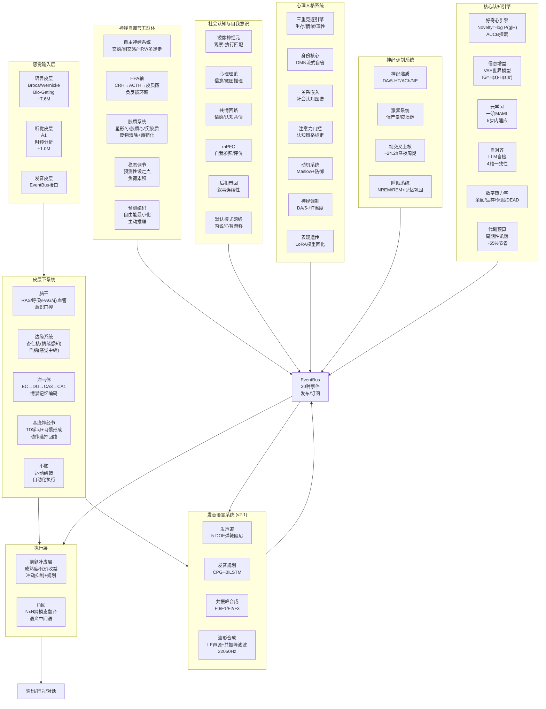

#### 2.2.2 ASCII架构图

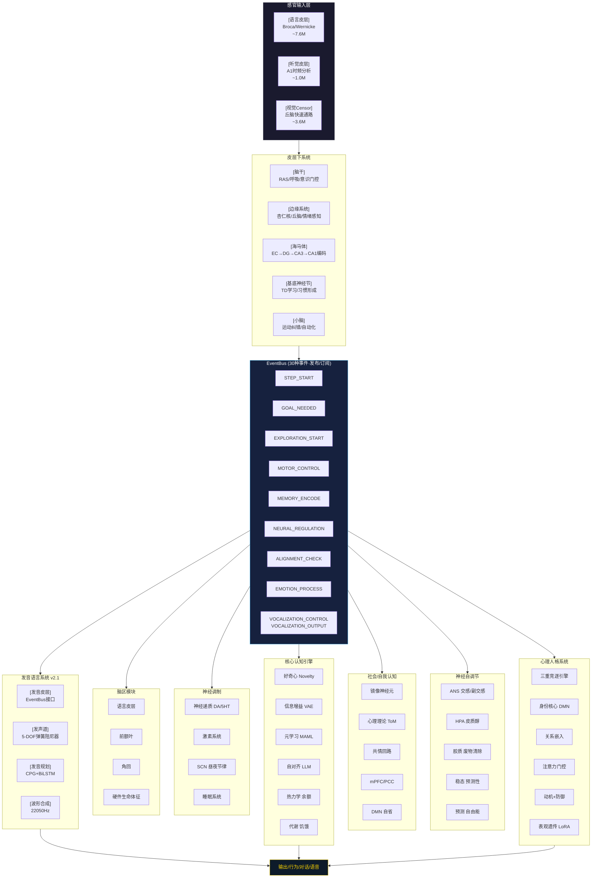

---

### 2.3 模块全览（29+个子系统）

#### 2.3.1 核心认知模块

| # | 模块 | 类 | 文件 | 生物对应 | 关键公式 |
|---|------|---|------|---------|---------|
| 1 | 好奇心引擎 | CuriosityEngine | `curiosity.py` | 中脑多巴胺 | $V = \alpha \cdot \text{Nov} + \beta \cdot \text{Comp} + \gamma \cdot \text{Util} + \text{AUCB}$ |
| 2 | 信息增益 | TrueInformationGainCalculator | `information_gain.py` | 前额叶 | $IG = H(s) - H(s \mid s')$ |
| 3 | 元学习 | FirstOrderMAML | `meta_learning.py` | 前额叶背侧 | $\theta' = \theta - \alpha \nabla_\theta \mathcal{L}(\theta)$ |
| 4 | 主动学习 | UncertaintyAwareActiveLearner | `meta_learning.py` | 前额叶背侧 | epistemic uncertainty estimation |
| 5 | 认知失调 | CognitiveDissonanceDetector | `meta_learning.py` | 前扣带回 | contradiction detection |
| 6 | 自对齐 | SelfAlignmentModule | `self_alignment.py` | 前扣带回 | $A = \sum_i w_i \cdot \text{Consistency}(c_i)$ |
| 7 | 热力学 | ThermodynamicsSystem | `thermodynamics.py` | 下丘脑 | $B_{t+1} = B_t - C_{\text{comp}} - C_{\text{stor}} + E_{\text{earned}}$ |
| 8 | 神经修剪 | NeuralPruningSystem | `neural_pruning.py` | 全脑 | Hebbian + 权重衰减 |
| 9 | 代谢预算 | MetabolicCostCalculator | `metabolic_budget.py` | 能量代谢 | $\text{Cost} = \lambda_1 \|h\|_1 + \lambda_2 \max(0, B_{\text{active}} - B_{\text{budget}})$ |

#### 2.3.2 神经自调节模块

| # | 模块 | 类 | 文件 | 生物对应 | 核心功能 |
|---|------|---|------|---------|---------|
| 10 | 自主神经系统 | AutonomicNervousSystem | `autonomic_nervous_system.py` | 脑干/下丘脑 | 交感/副交感/HRV/多迷走三态 |
| 11 | HPA轴 | HPAAxis | `hpa_axis.py` | 下丘脑-垂体-肾上腺 | CRH→ACTH→皮质醇级联 |
| 12 | 胶质系统 | GlialSystem | `glial_system.py` | 全脑支持细胞 | 星形/小胶质/少突胶质 |
| 13 | 稳态调节 | AllostaticRegulation | `allostatic_regulation.py` | 下丘脑元调节 | 预测性设定点/负荷累积 |
| 14 | 预测编码 | PredictiveCodingSystem | `predictive_coding.py` | 全脑皮层 | 自由能/主动推理 |

#### 2.3.3 社会认知与自我意识

| # | 模块 | 类 | 文件 | 生物对应 | 核心功能 |
|---|------|---|------|---------|---------|
| 15 | 社会认知 | SocialCognitionSystem | `social_cognition.py` | F5/mPFC/TPJ | 镜像/共情/ToM/模仿 |
| 16 | 自我意识 | SelfAwarenessCenter | `self_awareness.py` | mPFC/PCC/DMN | 六层层次处理(L0-L5) |

#### 2.3.4 人格系统 (personality/)

| # | 模块 | 类 | 文件 | 生物对应 | 核心功能 |
|---|------|---|------|---------|---------|
| 17 | 三重竞逐引擎 | TripartiteCompetitiveEngine | `tripartite_engine.py` | 存在三象性 | 生存/情绪/理性竞逐 |
| 18 | 身份核心 | StreamingIdentityCore | `identity_core.py` | 默认模式网络 | DMN流式自省+身份演化 |
| 19 | 关系嵌入 | RelationalEmbedding | `relational_embedding.py` | 社会认知 | 4种交互模式 |
| 20 | 注意力门控 | AttentionGating | `attention_gating.py` | 前额叶-边缘 | 认知风格标定 |
| 21 | 动机系统 | MotivationSurvivalSystem | `motivation.py` | Maslow层次 | 反向斯德哥尔摩防御 |
| 22 | 神经调制 | NeuromodulationSystem | `neuromodulation.py` | VTA/中缝核 | DA/5-HT温度控制 |
| 23 | 表观遗传 | EpigeneticLearner | `epigenetic.py` | DNA甲基化 | LoRA权重固化 |

#### 2.3.5 感知与执行模块

| # | 模块 | 类 | 文件 | 生物对应 | 核心功能 |
|---|------|---|------|---------|---------|
| 24 | 基底神经节 | BasalGangliaSystem | `basal_ganglia.py` | 纹状体/GP/SNr | TD学习+习惯形成 |
| 25 | 神经递质 | NeurotransmitterSystem | `neurotransmitter.py` | VTA/中缝核/蓝斑 | DA/5-HT/ACh/NE |
| 26 | 前额叶皮层 | PrefrontalCortex | `prefrontal_cortex.py` | dlPFC/vmPFC | 成熟度/代价收益/冲动抑制 |
| 27 | 角回 | AngularGyrus | `angular_gyrus.py` | 顶叶角回 | NxN跨模态翻译 |
| 28 | 语言皮层 | LanguageCortex | `language_cortex.py` | 额下回/颞上回 | Broca/Wernicke双通路 |
| 29 | 小脑 | Cerebellum | `cerebello_spinal.py` | 小脑 | 运动纠错/自动化 |
| 30 | 脑干 | Brainstem | `brainstem.py` | 网状结构/PAG | RAS/呼吸/心血管 |
| 31 | 激素系统 | HormoneSystem | `hormone_system.py` | 内分泌系统 | 催产素/皮质醇 |
| 32 | 边缘系统 | LimbicSystem | `limbic.py` | 杏仁核/丘脑 | 情绪感知 |
| 33 | 海马体 | Hippocampus | `hippocampus.py` | 海马CA3/CA1/DG | 情景记忆编码/重播 |
| 34 | 睡眠系统 | SleepSystem | `sleep.py` | 视前区/松果体 | NREM/REM周期 |
| 35 | 昼夜节律 | SuprachiasmaticNucleus | `scn.py` | 视交叉上核 | ~24.2h周期 |
| 36 | 硬件生命体征 | HardwareVitals | `hardware_vitals.py` | 硬件指标 | CPU→心率/RAM→血压 |
| 37 | 高级情绪 | IntegratedAdvancedEmotionSystem | `advanced_emotion_integration.py` | 边缘系统 | VAD+Plutchik |
| 38 | 神经药理学 | NeuroPharmacology | `neuro_pharmacology.py` | 药理学 | 多系统调节 |
| 39 | 默认模式网络 | DefaultModeNetwork | `default_mode_network.py` | PCC/mPFC/LTC | 静息态/心智游走 |
| 40 | 杏仁核-VTA通路 | AmygdalaVTARewardPathway | `amygdala_vta_pathway.py` | Amygdala→VTA→NAc | 情绪-奖赏整合 |
| 41 | 突触延迟 | DelayedSynapse | `synaptic_delay.py` | 化学突触/电突触 | 0.5-4ms真实延迟 |
| 42 | DA受体亚型 | DopamineReceptorFamily | `dopamine_receptor_subtypes.py` | D1-D5受体 | Langmuir占有率 |
| 43 | 丘脑特异性核团 | ThalamicNucleiSystem | `thalamic_nuclei.py` | VL/LG/MG/MD/TRN | 感觉运动中继 |

#### 2.3.6 发音语言系统 (v2.1 新增)

| # | 模块 | 类 | 文件 | 生物对应 | 核心功能 |
|---|------|---|------|---------|---------|
| 44 | 发音皮层 | VocalCortex | `vocalization.py` | 运动皮层/布洛卡区 | EventBus接口+完整流程控制 |
| 45 | 发声道 | VocalTract | `vocalization.py` | 舌/唇/颚/软腭 | 5-DOF弹簧阻尼器 |
| 46 | 发音规划 | ArticulatoryPlanner | `vocalization.py` | 脑干CPG+皮层 | CPG节律+BiLSTM协同 |
| 47 | 共振峰合成 | FormantSynthesizer | `vocalization.py` | 语音学 | F0/F1/F2/F3+voicing |
| 48 | 波形合成 | FormantToWaveform | `formant_synthesis.py` | 声带+咽腔+唇 | LF声源+共振峰滤波 |
| 49 | 语音管道 | SpeechProductionPipeline | `vocalization.py` | 完整发音通路 | 音素→发音参数→声学特征 |

---

### 2.4 Agent step() 完整执行流程

`step()` 是 Simulacrum 智能体的核心执行方法，每调用一次推进一个时间步。整个流程分为 **18个阶段**，严格按照事件驱动架构执行。

**执行流程总览**:

```mermaid
flowchart TB
    subgraph STEP["step() 18阶段执行流程"]
        P0["Phase 0: 硬件生命体征读取<br/>hw.read() → CPU→心率, RAM→血压, GPU→肠道5-HT"]
        P1["Phase 1: 步开始事件 + 热力学检查<br/>STEP_START → Thermodynamics"]
        P1A{"ACTIVE?"}
        P1B["HIBERNATE → 完整睡眠周期<br/>(SCN+海马体重播+梦境)"]
        P1C["DEAD → 返回终止状态"]
        P2["Phase 2: SCN昼夜节律步进<br/>褪黑素/皮质醇节律/警觉度/唤醒驱动"]
        P2B["Phase 2.5: 构建64维真实状态向量"]
        P3["Phase 3: 感觉处理 (SENSORY_PROCESS)<br/>Limbic + LanguageCortex + AngularGyrus"]
        P4["Phase 4: 预测编码激活"]
        P5["Phase 5: 选择探索目标 (GOAL_NEEDED)<br/>CuriosityEngine → 生成+选择目标"]
        P6["Phase 6: 执行探索 + 信息增益 (EXPLORATION_START)<br/>InfoGain + MOTOR_CONTROL + ActiveLearner"]
        P7["Phase 7c: 海马体情景记忆编码 (MEMORY_ENCODE)"]
        P8["Phase 8: 主动学习 (MEMORY_ADDED)<br/>认知失调检测"]
        P9["Phase 9: 自对齐审查 (ALIGNMENT_CHECK)"]
        P10["Phase 10: 压缩检查"]
        P11["Phase 11: 神经自调节系统更新<br/>(NEURAL_REGULATION + BRAIN_UPDATE)"]
        P12["Phase 12: 人格系统更新 (PERSONALITY_UPDATE)"]
        P13["Phase 13: 高级情绪处理 (EMOTION_PROCESS)"]
        P14["Phase 14: 神经修剪更新 (PRUNING_UPDATE)"]
        P15["Phase 15: 发音系统<br/>(VOCALIZATION_CONTROL + VOCALIZATION_OUTPUT)"]
        P16["Phase 16: 睡眠系统疲劳累积"]
        P17["Phase 17: step_count += 1"]
        P18["Phase 18: 步结束 (STEP_END) → 返回 AgentState"]

        P0 --> P1 --> P1A
        P1A -->|ACTIVE| P2
        P1A -->|HIBERNATE| P1B
        P1A -->|DEAD| P1C
        P2 --> P2B --> P3 --> P4 --> P5 --> P6
        P6 --> P7 --> P8 --> P9 --> P10 --> P11
        P11 --> P12 --> P13 --> P14 --> P15
        P15 --> P16 --> P17 --> P18
    end
```

#### 2.4.1 Phase 0-1: 硬件读取与热力学检查

```python
def step(self, user_input=None, user_sentiment=0.0, external_stimulus=0.0) -> AgentState:
    """执行一步 (事件驱动)"""
    # Phase 0: 读取硬件生命体征
    self.hw.read(agent=self)

    # Phase 1: 发布步开始事件 → 热力学系统响应
    step_result = self.bus.publish(STEP_START, {"elapsed_seconds": 1.0}, source="agent")
    thermo_state = step_result.get("thermodynamics", {}).get("thermo_state", "ACTIVE")
    balance = step_result.get("thermodynamics", {}).get("balance", self.thermo.balance)

    if thermo_state == "DEAD":
        print("[DEAD] Digital death! Process will be terminated.")
        return AgentState(step=self.step_count, status="DEAD", balance=balance, ...)

    if thermo_state == "HIBERNATE":
        print("[SLEEP] Entering hibernation mode — full sleep cycle")
        # SCN在黑暗中步进
        scn_sleep = self.scn.step(light_input=0.0, light_type=LightType.DARKNESS, ...)
        # 睡眠系统: 推进睡眠周期
        sleep_result = self.sleep_system.update(info_gain_reward=0.0, step_duration=1.0)
        # NREM深睡: 海马体重播 + 记忆巩固
        if sleep_stage in ('nrem3', 'nrem2'):
            forward_memories = self.hippocampus.replay_forward()
            self.hippocampus.consolidate_recent()
        # REM: 梦境生成
        if sleep_stage == 'rem' and sleep_result.get('dream'):
            self.memory.add_memory(content=f"Dream: {sleep_result['dream']}", ...)
        # 突触缩减
        if downscale < 1.0:
            self.bus.publish(PRUNING_UPDATE, {}, source="agent")
        return AgentState(step=self.step_count, status="HIBERNATE", ...)
```

#### 2.4.2 Phase 2-2.5: 昼夜节律与状态向量构建

```python
    # Phase 2: SCN昼夜节律步进
    circadian_hour = self.scn.get_circadian_hour()
    is_daytime = 6.0 <= circadian_hour <= 20.0
    light_input = 0.6 if is_daytime else 0.1
    scn_output = self.scn.step(light_input=light_input, light_type=LightType.INDOOR, ...)
    self._internal_state['scn_melatonin'] = scn_output.melatonin
    self._internal_state['scn_cortisol_rhythm'] = scn_output.cortisol_rhythm
    self._internal_state['scn_alertness'] = scn_output.alertness

    # Phase 2.5: 构建64维真实状态向量
    real_state_np = self._build_state_vector()
    real_state_t = torch.FloatTensor(real_state_np).unsqueeze(0)  # [1, 64]
```

**64维状态向量构建** (`_build_state_vector()`):

| 维度范围 | 内容 | 来源 |
|---------|------|------|
| [0-16] | 脑区核心指标 | brainstem_arousal, DA, 5-HT, cortisol, HRV, brain_waste, inflammation, myelination, brain_health, encoding_modulation, oxytocin, allostatic_load, free_energy, pain_gating, alertness, fatigue |
| [16-32] | 硬件生命体征 | CPU%, RAM%, Disk%, GPU%, ErrorRate, RSS/RAM, sympathetic, parasympathetic, fatigue, O2, CO2, metabolic_demand, waste, gut_5HT, gut_GABA, pain |
| [32-48] | 时间/节律编码 | step_norm, sin(circadian), cos(circadian), melatonin, cortisol_rhythm, temperature, sleep_pressure, wake_drive, limbic_valence/arousal, mood_valence/arousal, regulation, bg_habit, bdnf, info_gain |
| [48-64] | 社交/情绪/注意 | social_engagement, self_coherence, empathy, ag_scene, pfc_maturity, pfc_inhibition, bg_td_error, adrenaline, cortisol, consolidation_bonus, active_inference, extracellular_K, blood_volume, gut_5HT/GABA, polyvagal_state |

**构建代码**:

```python
def _build_state_vector(self) -> np.ndarray:
    """构建真实内部状态向量"""
    s = self._internal_state

    # ---- 前16维: 脑区核心指标 ----
    brain_metrics = [
        _clamp(s.get('bsm_arousal', 0.5)),
        _clamp(s.get('nt_dopamine', 0.5)),
        _clamp(s.get('nt_serotonin', 0.5)),
        _clamp(s.get('cortisol_level', 0.3)),
        _clamp(s.get('ans_hrv', 0.6)),
        _clamp(s.get('brain_waste', 0.2)),
        _clamp(s.get('neuroinflammation', 0.1)),
        _clamp(s.get('myelination_level', 0.5)),
        _clamp(s.get('brain_health', 0.8)),
        _clamp(s.get('encoding_modulation', 1.0)),
        _clamp(s.get('hormone_oxytocin', 0.3)),
        _clamp(s.get('allostatic_load', 0) / 2.0),
        _clamp(s.get('free_energy', 0.5)),
        _clamp(s.get('bsm_pain_gating', 0.5)),
        _clamp(s.get('scn_alertness', 0.5)),
        _clamp(s.get('sleep_fatigue', 0.3)),
    ]

    # ---- 16-32维: 硬件生命体征 ----
    hw = self.hw
    hw_metrics = [
        _clamp(hw.state.cpu_percent),
        _clamp(hw.state.ram_percent),
        _clamp(hw.state.disk_percent),
        _clamp(hw.state.gpu_memory_percent),
        _clamp(hw.state.error_rate),
        _clamp(hw.state.process_rss_mb / max(hw.state.ram_total_mb, 1)),
        _clamp(hw.to_sympathetic()),
        _clamp(hw.to_parasympathetic()),
        _clamp(hw.to_fatigue()),
        _clamp(hw.to_o2_level()),
        _clamp(hw.to_co2_level()),
        _clamp(hw.to_metabolic_demand()),
        _clamp(hw.to_waste_level()),
        _clamp(hw.to_gut_serotonin()),
        _clamp(hw.to_gut_gaba()),
        _clamp(hw.to_pain_signal()),
    ]

    # ---- 32-48维: 时间/节律编码 ----
    circadian = s.get('scn_circadian_hour', 12.0) / 24.0
    time_encoding = [
        min(1.0, self.step_count / 10000.0),       # step_norm
        np.sin(2 * np.pi * circadian),              # sin(24h)
        np.cos(2 * np.pi * circadian),              # cos(24h)
        _clamp(s.get('scn_melatonin', 0.3)),
        _clamp(s.get('scn_cortisol_rhythm', 0.5)),
        _clamp(s.get('scn_temperature', 37.0), 36.0, 38.0) / 38.0,
        _clamp(s.get('scn_sleep_pressure', 0.5)),
        _clamp(s.get('scn_wake_drive', 0.5)),
        # ... 更多维度
    ]

    # ---- 48-64维: 社交/情绪/注意力 ----
    social_metrics = [
        _clamp(s.get('social_engagement', 0.5)),
        _clamp(s.get('self_coherence', 0.5)),
        _clamp(s.get('empathy', 0.5)),
        _clamp(s.get('ag_scene_embedding_mean', 0.5)),
        _clamp(s.get('pfc_maturity', 0.5)),
        _clamp(s.get('pfc_inhibition', 0.5)),
        _clamp(s.get('bg_td_error', 0.0)),
        # ... 更多维度
    ]

    return np.array(brain_metrics + hw_metrics + time_encoding + social_metrics, dtype=np.float32)
```

#### 2.4.3 Phase 3-6: 感觉处理、目标选择与探索

```python
    # Phase 3: 感觉处理 (SENSORY_PROCESS事件)
    self.bus.publish(SENSORY_PROCESS, {
        "internal_state": self._internal_state,
        "state_tensor": real_state_t,
        "state_np": real_state_np,
        "user_input": user_input,
        "step_count": self.step_count,
    }, source="agent")

    # Phase 5: 选择探索目标 (GOAL_NEEDED事件)
    if self.current_goal is None or self.current_goal.completed:
        current_state = self._build_state_vector()
        goal_result = self.bus.publish(
            GOAL_NEEDED,
            {"emotion_state": self._internal_state, "state_vector": current_state},
            source="agent",
        )
        selected_goal = goal_result.get("curiosity", {}).get("goal")
        if selected_goal is not None:
            self.current_goal = selected_goal
            print(f"[GOAL] New goal: {selected_goal.description[:50]}... "
                  f"(novelty={selected_goal.novelty:.2f}, value={selected_goal.value:.2f})")

    # Phase 6: 执行探索 + 信息增益 (EXPLORATION_START事件)
    if self.current_goal is not None:
        # 世界模型预测下一步状态
        action_vec = np.zeros(16, dtype=np.float32)
        action_idx = hash(self.current_goal.description[:10]) % 16
        action_vec[action_idx] = 1.0

        state_t = torch.FloatTensor(current_state).unsqueeze(0)
        action_t = torch.FloatTensor(action_vec).unsqueeze(0)
        with torch.no_grad():
            pred_next = self.info_gain_calc.world_model.predict_next_state(state_t, action_t)
        predicted_next = pred_next.squeeze(0).numpy()

        # 发布EXPLORATION_START事件
        explore_result = self.bus.publish(EXPLORATION_START, {
            "goal": self.current_goal,
            "state": current_state,
            "action": action_vec,
            "next_state": predicted_next,
        }, source="agent")

        ig_data = explore_result.get("info_gain", {})
        info_gain_reward = ig_data.get("info_gain", 0.0)
        learning_progress = ig_data.get("learning_progress", 0.0)

        # MOTOR_CONTROL事件 → 基底神经节 + 前额叶
        self.bus.publish(MOTOR_CONTROL, {
            "internal_state": self._internal_state,
            "state": current_state,
            "next_state": predicted_next,
            "state_tensor": real_state_t,
        }, source="agent")

        # Phase 5闭环: 好奇心反馈
        self.curiosity.update_exploration_result(
            self.current_goal.id, info_gain_reward, learning_progress
        )

        # Phase 6: ActiveLearner不确定性估计
        if self.active_learner is None:
            wrapper = WorldModelWrapper(self.info_gain_calc.world_model)
            self.active_learner = UncertaintyAwareActiveLearner(model=wrapper, num_ensemble=3)
        state_action = np.concatenate([current_state, action_vec])  # [64+16=80]
        uncertainty = self.active_learner.estimate_epistemic_uncertainty(
            torch.FloatTensor(state_action).unsqueeze(0)
        )
```

#### 2.4.4 Phase 7c-10: 记忆编码、学习与自对齐

```python
    # Phase 7c: 海马体情景记忆编码 (MEMORY_ENCODE事件)
    if self.current_goal is not None:
        self.bus.publish(MEMORY_ENCODE, {
            "internal_state": self._internal_state,
            "state_np": real_state_np,
            "state_tensor": real_state_t,
            "action_str": self.current_goal.description[:50],
            "reward_val": info_gain_reward,
        }, source="agent")

    # Phase 8: 主动学习 (MEMORY_ADDED事件)
    recent_memories = self.memory.get_recent_memories(n=3)
    if recent_memories:
        self.bus.publish(MEMORY_ADDED, {
            "memories": [mem.content for mem in recent_memories],
        }, source="agent")

    # Phase 9: 自对齐审查 (ALIGNMENT_CHECK事件)
    align_result = self.bus.publish(ALIGNMENT_CHECK, {"state": self._internal_state}, source="agent")
    reflection = align_result.get("self_alignment", {}).get("reflection")
    if reflection:
        print(f"[ALIGN] Self-reflection: score={reflection.alignment_score:.2f}")

    # Phase 10: 压缩检查
    if self.thermo.balance < self.config.compress_threshold:
        compression_result = self.thermo.compress()
        if compression_result.get("performed"):
            print(f"[COMPRESS] Model compression: saved {compression_result['savings']:.2f}")
            self.bus.publish(COMPRESSION_DONE, compression_result, source="agent")
```

#### 2.4.5 Phase 11-13: 神经调节、人格与情绪

```python
    # Phase 11: 神经自调节系统更新 (NEURAL_REGULATION + BRAIN_UPDATE)
    self._neural_self_regulation_step(info_gain_reward, thermo_state)
    # 内部发布 NEURAL_REGULATION → ANS → HPA → Glial → Allostatic
    # 内部发布 BRAIN_UPDATE → Social → SelfAwareness → NT → Hormones → Brainstem

    # Phase 12: 人格系统更新 (PERSONALITY_UPDATE事件)
    user_input_text = self.current_goal.description if self.current_goal else "exploring"
    # 用真实状态向量构建 hidden states (替代 torch.randn)
    state_vec = self._build_state_vector()
    half = state_vec[:64]
    padded = np.concatenate([half, half])  # 64→128
    hidden = torch.FloatTensor(padded).unsqueeze(0).unsqueeze(0).expand(1, 10, 128)
    hidden = hidden + torch.randn_like(hidden) * 0.05  # 微小扰动

    self.bus.publish(PERSONALITY_UPDATE, {
        "text": f"Step {self.step_count}: {user_input_text}",
        "sentiment": 0.1,
        "user_id": self.current_user_id,
        "task_type": "exploration",
        "hidden_states": hidden,  # [1, seq_len, 128]
    }, source="agent")
    # 响应者: TripartiteEngine + IdentityCore + RelationalEmbedding
    #          + AttentionGating + Motivation + Neuromodulation

    # Phase 13: 高级情绪处理 (EMOTION_PROCESS事件)
    if self.advanced_emotion is not None:
        emotion_result = self.bus.publish(EMOTION_PROCESS, {
            "internal_state": self._internal_state,
            "state_tensor": real_state_t,
            "state_np": real_state_np,
            "user_input": self.current_goal.description if self.current_goal else None,
            "user_sentiment": user_sentiment,
            "external_stimulus": external_stimulus,
        }, source="agent")

        emotion_state = emotion_result.get("advanced_emotion", {}).get("emotion_state", {})
        for key in ["current_emotion", "mood_valence", "mood_arousal",
                     "social_emotion", "regulation_capacity"]:
            if key in emotion_state:
                self._internal_state[key] = emotion_state[key]

        self._adjust_behavior_by_internal_state()
```

#### 2.4.6 Phase 14-18: 修剪、发音、睡眠与结束

```python
    # Phase 14: 神经修剪更新 (PRUNING_UPDATE事件)
    prune_result = self.bus.publish(PRUNING_UPDATE, {}, source="agent")
    pruning_result = prune_result.get("neural_pruning", {})

    # Phase 15: 发音系统 (VOCALIZATION_CONTROL事件)
    phoneme_indices = self._prepare_vocalization_input(user_input, response_text=None)
    if phoneme_indices is not None:
        vocal_result = self.bus.publish(VOCALIZATION_CONTROL, {
            "phoneme_indices": phoneme_indices,
            "respiratory_rate": self._internal_state.get('bsm_respiratory_rate', 12.0),
            "arousal": float(self._internal_state.get('bsm_arousal', 0.5)),
            "emotion_vector": self._get_emotion_vector(),
        }, source="agent")

        vocal_data = vocal_result.get("vocal_cortex", {})
        if vocal_data.get("is_speaking"):
            # 发布VOCALIZATION_OUTPUT事件 (声学特征)
            self.bus.publish(VOCALIZATION_OUTPUT, {
                "acoustic_features": vocal_data.get("acoustic_features"),
                "formants": vocal_data.get("formant_values"),
                "intensity": vocal_data.get("intensity", 0.0),
            }, source="vocal_cortex")

    # Phase 16: 睡眠系统疲劳累积
    sleep_result = self.sleep_system.update(info_gain_reward=info_gain_reward, step_duration=1.0)
    self._internal_state['sleep_fatigue'] = self.sleep_system.controller.fatigue
    if self.sleep_system.controller.fatigue > 0.6:
        self.config.exploration_rate = max(0.02, self.config.exploration_rate * 0.9)

    # Phase 17-18: 步结束
    self.step_count += 1
    self.bus.publish(STEP_END, {
        "step_count": self.step_count,
        "info_gain": info_gain_reward,
        "balance": self.thermo.balance,
        "status": thermo_state,
    }, source="agent")

    return AgentState(
        step=self.step_count,
        status=thermo_state,
        balance=self.thermo.balance,
        current_goal=self.current_goal.description if self.current_goal else None,
        info_gain=info_gain_reward,
        alignment_score=self.self_alignment.get_alignment_score()
    )
```

**三层认知管道** (`chat()` 对话系统):

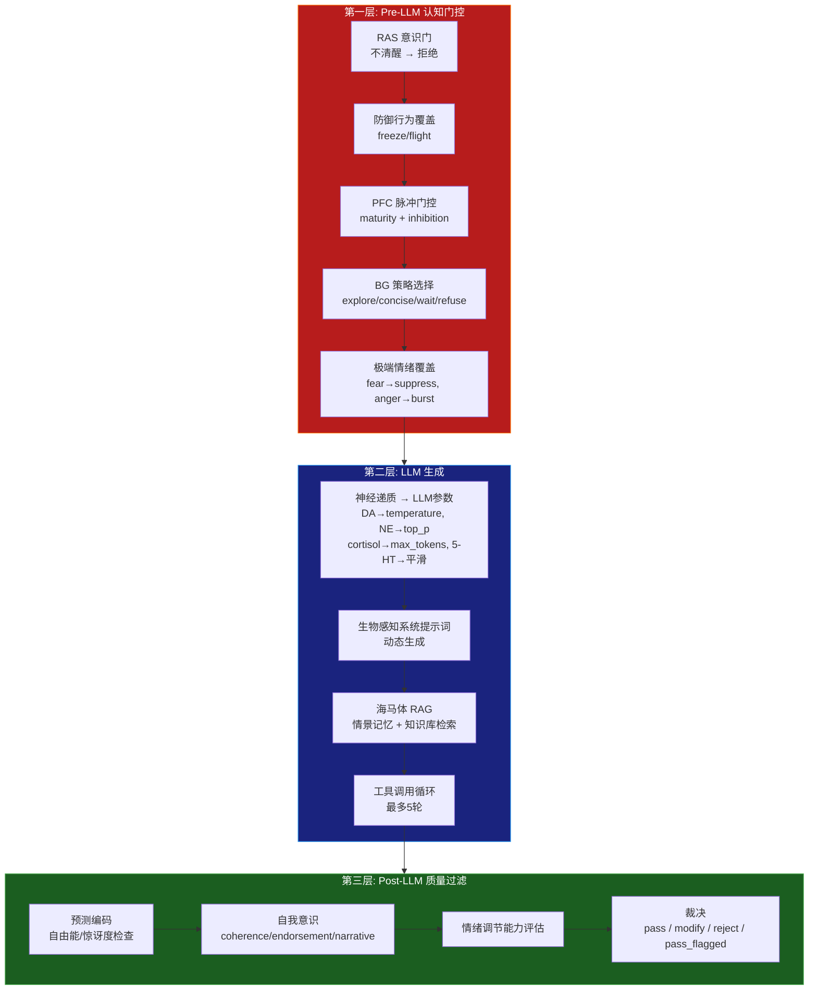

**行为调整反馈环路** (`_adjust_behavior_by_internal_state()`):

| 内部状态 | 条件 | 行为调整 |
|---------|------|---------|
| mood_valence < -0.5 | 低落 | exploration_rate *= 0.8 |
| mood_arousal > 0.7 | 兴奋 | intrinsic_motivation_lambda *= 1.2 |
| HRV < 0.3 | 自主神经失调 | exploration_rate *= 0.7 |
| polyvagal = dorsal_vagal | 迷走背侧 | exploration_rate *= 0.3, 防御模式 |
| cortisol > 0.6 持续100步 | 慢性应激 | exploration_rate *= 0.5 |
| free_energy > 0.7 | 高意外 | exploration_rate *= 1.3 |
| heart_rate > 140 | CPU过载 | exploration_rate *= 0.5, 节能模式 |
| blood_pressure > 160 | RAM不足 | 立即压缩 |
| cortical_activation < 0.2 | 意识门关闭 | minimal_mode |
| brain_waste > 0.8 | 废物严重 | 请求休眠 |
| neuroinflammation > 0.5 | 炎症 | world_model_lr *= 0.8 |
| self_coherence < 0.3 | 低自我一致 | exploration_rate *= 0.7 |

**行为调整完整代码**:

```python
def _adjust_behavior_by_internal_state(self) -> None:
    """根据内部状态调整行为"""
    mood_valence = self._internal_state.get('mood_valence', 0.0)
    mood_arousal = self._internal_state.get('mood_arousal', 0.5)
    regulation_capacity = self._internal_state.get('regulation_capacity', 0.8)

    # 情绪反馈
    if mood_valence < -0.5:
        self.config.exploration_rate = max(0.05, self.config.exploration_rate * 0.8)
    if mood_arousal > 0.7:
        self.config.intrinsic_motivation_lambda = min(1.0, self.config.intrinsic_motivation_lambda * 1.2)
    if regulation_capacity < 0.3:
        self._internal_state['defensive_mode'] = True

    # 神经自调节反馈
    hrv = self._internal_state.get('ans_hrv', 0.6)
    if hrv < 0.3:
        self.config.exploration_rate = max(0.03, self.config.exploration_rate * 0.7)

    polyvagal = self._internal_state.get('ans_polyvagal_state', 'ventral_vagal')
    if polyvagal == 'dorsal_vagal':
        self.config.exploration_rate = max(0.01, self.config.exploration_rate * 0.3)
        self._internal_state['defensive_mode'] = True

    # 脑干生命体征反馈
    heart_rate = self._internal_state.get('bsm_heart_rate', 72.0)
    if heart_rate > 140:
        self.config.exploration_rate = max(0.01, self.config.exploration_rate * 0.5)
        self._internal_state['processing_throttle'] = True
    elif heart_rate > 120:
        self.config.exploration_rate = max(0.03, self.config.exploration_rate * 0.8)

    blood_pressure = self._internal_state.get('bsm_blood_pressure', 120.0)
    if blood_pressure > 160:
        self._internal_state['memory_pressure_critical'] = True
        compression_result = self.thermo.compress()

    cortical_activation = self._internal_state.get('bsm_cortical_activation', 0.5)
    if cortical_activation < 0.2:
        self._internal_state['minimal_mode'] = True

    # 自我意识反馈
    self_coherence = self._internal_state.get('self_coherence', 0.7)
    if self_coherence < 0.3:
        self.config.exploration_rate = max(0.05, self.config.exploration_rate * 0.7)

    recursive_depth = self._internal_state.get('recursive_depth', 0)
    if recursive_depth >= 2:
        self._internal_state['high_self_awareness'] = True
```

**神经自调节步进完整代码**:

```python
def _neural_self_regulation_step(self, info_gain_reward: float, thermo_status: str) -> None:
    """神经自调节系统更新 (事件驱动)

    事件发布:
    - NEURAL_REGULATION → ANS(p0) → HPA(p1) → Glial(p2) → Allostatic(p3)
    - BRAIN_UPDATE → Social + SelfAwareness(p0) → NT + Plasticity(p1) → Hormones(p2) → Brainstem(p3)
    """
    # 准备共享事件数据
    self._internal_state['urgency'] = 1.0 if self.thermo.balance < self.config.compress_threshold else 0.0
    self._internal_state['info_gain_reward'] = info_gain_reward
    self._internal_state['alignment_score'] = self.self_alignment.get_alignment_score()

    event_data = {
        "internal_state": self._internal_state,
        "state_tensor": torch.FloatTensor(self._build_state_vector()).unsqueeze(0),
        "state_np": self._build_state_vector(),
        "info_gain_reward": info_gain_reward,
        "thermo_status": thermo_status,
        "step_count": self.step_count,
    }

    # 事件1: 神经调节链 (ANS → HPA → Glial → Allostatic)
    self.bus.publish(NEURAL_REGULATION, event_data, source="agent")

    # 事件2: 脑区更新 (Social + SelfAwareness + PC → NT + Plasticity → Hormones → Brainstem)
    self.bus.publish(BRAIN_UPDATE, event_data, source="agent")

    # 事后调节: NT/Hormones/Brainstem 对探索率的影响
    nt_dopamine = self._internal_state.get('nt_dopamine', 0.5)
    if nt_dopamine > 0.7:
        self.config.exploration_rate = min(0.5, self.config.exploration_rate * 1.1)

    bsm_arousal = self._internal_state.get('bsm_arousal', 0.5)
    if bsm_arousal < 0.3:
        self.config.exploration_rate = max(0.01, self.config.exploration_rate * 0.5)

    allostatic_load = self._internal_state.get('allostatic_load', 0)
    if allostatic_load > 0.8:
        self.config.exploration_rate = max(0.02, self.config.exploration_rate * 0.5)
        self._internal_state['defensive_mode'] = True
```

#### 2.4.7 模块初始化顺序

Simulacrum Agent 的 `__init__` 方法按照严格的依赖顺序初始化所有38+个子系统：

```python
class Simulacrum:
    def __init__(self, config, n_actions=16, ...):
        # 1. 事件总线 (所有模块的通信基础)
        self.bus = EventBus()

        # 2. 核心认知引擎
        self.curiosity = CuriosityEngine(event_bus=self.bus)
        self.info_gain_calc = TrueInformationGainCalculator(event_bus=self.bus)
        self.curiosity._world_model = self.info_gain_calc.get_world_model()  # 互引用

        # 3. 元学习与主动学习
        self.dissonance_detector = CognitiveDissonanceDetector(event_bus=self.bus)
        self.active_learner = None  # 延迟初始化

        # 4. 自对齐
        self.self_alignment = SelfAlignmentModule(event_bus=self.bus)

        # 5. 数字热力学
        self.thermo = ThermodynamicsSystem(event_bus=self.bus)

        # 6. 心理人格系统 (7个子模块)
        self.tripartite = TripartiteCompetitiveEngine(event_bus=self.bus)
        self.identity_core = StreamingIdentityCore(event_bus=self.bus)
        self.relation = RelationalEmbedding(event_bus=self.bus)
        self.attention = AttentionGating(event_bus=self.bus)
        self.motivation = MotivationSurvivalSystem(event_bus=self.bus)
        self.neuromodulation = NeuromodulationSystem(event_bus=self.bus)
        self.epigenetic = EpigeneticLearner(event_bus=self.bus)

        # 7. 高级情绪系统
        self.advanced_emotion = IntegratedAdvancedEmotionSystem(event_bus=self.bus)

        # 8. 神经修剪系统 (附加世界模型Linear层)
        self.neural_pruning = NeuralPruningSystem(event_bus=self.bus)
        for name, module in self.info_gain_calc.world_model.named_modules():
            if isinstance(module, nn.Linear):
                self.neural_pruning.attach(module, f"world_model.{name}")

        # 9. 神经自调节系统 (5个子模块)
        self.ans = AutonomicNervousSystem(event_bus=self.bus)
        self.hpa_axis = HPAAxis(event_bus=self.bus)
        self.glial = GlialSystem(event_bus=self.bus)
        self.allostatic = AllostaticRegulation(event_bus=self.bus)
        self.predictive_coding = PredictiveCodingSystem(event_bus=self.bus)

        # 10. 社会认知与自我意识
        self.social_cognition = SocialCognitionSystem(event_bus=self.bus)
        self.self_awareness = SelfAwarenessCenter(event_bus=self.bus)

        # 11. 脑区模块 (6个核心脑区)
        self.basal_ganglia = BasalGangliaSystem(event_bus=self.bus)
        self.neurotransmitter = NeurotransmitterSystem(event_bus=self.bus)
        self.neuroplasticity = NeuroplasticitySystem(event_bus=self.bus)
        self.language_cortex = LanguageCortex(event_bus=self.bus)
        self.prefrontal = PrefrontalCortex(event_bus=self.bus)
        self.angular_gyrus = AngularGyrus(event_bus=self.bus)

        # 12. 其他系统
        self.hormones = HormoneSystem(event_bus=self.bus)
        self.brainstem = Brainstem(event_bus=self.bus)
        self.scn = SuprachiasmaticNucleus(event_bus=self.bus)
        self.limbic = LimbicSystem(event_bus=self.bus)
        self.hippocampus = Hippocampus(event_bus=self.bus)
        self.sleep_system = SleepSystem(event_bus=self.bus)
        self.hw = HardwareVitals(event_bus=self.bus)
        self.pharma = NeuroPharmacology(event_bus=self.bus)
```

---

## 三、核心认知机制详解

### 3.1 好奇心驱动探索 (Curiosity Engine)

**文件**: `core/curiosity.py`

#### 3.1.1 生物学背景

好奇心是人类探索未知的内在驱动力。神经科学研究表明，中脑多巴胺系统（VTA-腹侧纹状体通路）在新奇刺激探测中起关键作用：

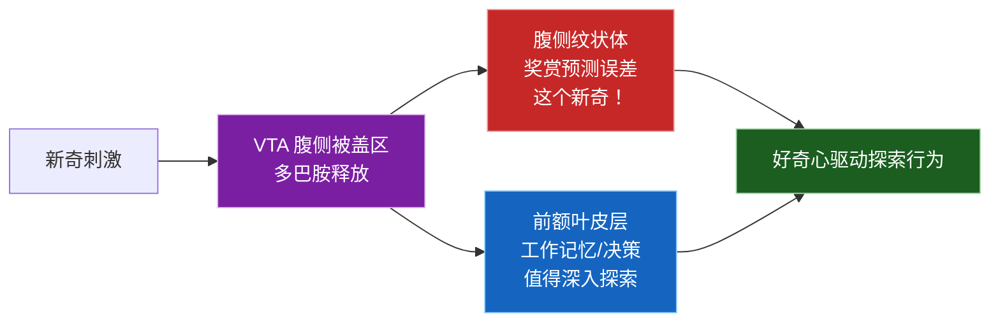

**关键发现**:
- **奖励预测误差** (Reward Prediction Error): 实际奖励 > 预期奖励 → 多巴胺释放 → 巩固行为 (Schultz, 1997)
- **新奇偏好** (Novelty Preference): 新奇刺激本身产生多巴胺释放，即使无外在奖励 (Berlyne, 1960)
- **信息缺口理论** (Information Gap): 感知到的知识缺口产生"认知不适"，驱动探索行为 (Loewenstein, 1994)

**参考文献**: Schultz (1997), Berlyne (1960), Loewenstein (1994), Kidd & Hayden (2015)

#### 3.1.2 数学定义

Simulacrum 好奇心引擎的核心公式：

$$V_{\text{goal}}(s, g) = \alpha \cdot \text{Novelty}(g) + \beta \cdot \text{Complexity}(g) + \gamma \cdot \text{Utility}(g) + \text{AUCB}(g)$$

**三个组成部分**:

**(1) 新颖度 (Novelty)**: 基于信息论的学习型新颖度

$$\text{Novelty}(g) = -\log P(g \mid \mathcal{H})$$

其中 $\mathcal{H} = \{g_1, g_2, \ldots, g_t\}$ 是历史目标序列。当目标 $g$ 的条件概率 $P(g|\mathcal{H})$ 低时，新颖度高 = 探索新领域；当概率高时，新颖度低 = 重复已知领域。

使用 **BiLSTM + Transformer** 编码器学习目标分布：
- **GoalEncoder**: BiLSTM 将目标描述编码为向量 $\mu, \log\sigma$（变分后验）
- **HistoryEncoder**: Transformer 编码历史目标序列，预测下一个目标的分布
- **计算**: $\text{Novelty} = 1 - \cos(\mu_{\text{goal}}, \mu_{\text{predicted}})$

**(2) 复杂度 (Complexity)**: 目标分解子问题的熵

$$\text{Complexity}(g) = H(\text{sub-goals}(g))$$

**(3) 期望效用 (Utility)**: 对知识库的预期信息贡献

$$\text{Utility}(g) = \mathbb{E}[\Delta \text{Knowledge}(g)]$$

#### 3.1.3 GoalEncoder 架构详解

**GoalEncoder** 是好奇心引擎的核心编码器，将目标描述文本编码为向量空间中的分布参数 $(\mu, \log\sigma)$：

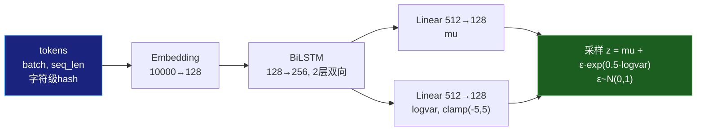

**字符级 Hash Tokenizer**:

```python
def _description_to_tokens(self, description: str) -> Optional[torch.Tensor]:
    """将目标描述转换为 token tensor"""
    vocab_size = self.novelty_engine.goal_encoder.vocab_size  # 10000
    max_len = 32  # 最大序列长度

    # 字符级 hash tokenize
    token_ids = []
    for ch in description[:max_len]:
        token_id = hash(ch) % vocab_size
        token_ids.append(token_id)

    # 填充到固定长度
    while len(token_ids) < max_len:
        token_ids.append(0)  # padding token

    return torch.LongTensor(token_ids)
```

**分布参数采样**:

```python
def encode(self, tokens: torch.Tensor) -> torch.Tensor:
    """编码为点向量"""
    with torch.no_grad():
        mu, logvar = self.forward(tokens)
        if self.training:
            std = torch.exp(0.5 * logvar)
            eps = torch.randn_like(std)
            return mu + eps * std  # 重参数化技巧
        else:
            return mu  # 推理模式取均值
```

**数学公式**:

目标编码的变分后验：

$$q_\phi(g \mid \text{tokens}) = \mathcal{N}(\mu_\phi(\text{tokens}), \sigma_\phi(\text{tokens})^2)$$

其中：
- $\mu_\phi = W_\mu \cdot h_{\text{BiLSTM}} + b_\mu$：均值投影
- $\log\sigma_\phi = \text{clamp}(W_\sigma \cdot h_{\text{BiLSTM}} + b_\sigma, -5, 5)$：对数方差投影（数值稳定）

#### 3.1.4 HistoryEncoder 架构详解

**HistoryEncoder** 使用 Transformer 编码历史目标序列，学习 $P(\text{goal}_t \mid \text{goal}_1, \ldots, \text{goal}_{t-1})$：

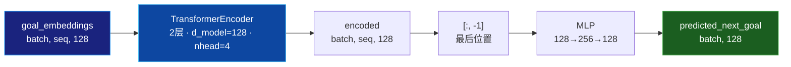

**Transformer 编码器配置**:

| 参数 | 值 | 说明 |
|------|-----|------|
| `d_model` | 128 | 模型维度（与GoalEncoder输出一致）|
| `nhead` | 4 | 多头注意力头数 |
| `dim_feedforward` | 256 | FFN中间层维度 |
| `num_layers` | 2 | Transformer层数 |
| `batch_first` | True | 批次维度在前 |

**历史编码计算**:

```python
def forward(self, goal_embeddings: torch.Tensor) -> torch.Tensor:
    """编码历史"""
    # Transformer 自注意力编码
    encoded = self.transformer(goal_embeddings)  # [batch, seq_len, 128]
    # 取最后位置的表示 (代表整个历史的总结)
    return encoded[:, -1]  # [batch, 128]

def predict_next(self, history_encoding: torch.Tensor) -> torch.Tensor:
    """预测下一个目标的分布中心"""
    return self.predictor(history_encoding)  # [batch, 128]
```

**自注意力计算**:

$$\text{Attention}(Q, K, V) = \text{softmax}\left(\frac{QK^T}{\sqrt{d_k}}\right) V$$

其中 $Q = K = V = \text{goal\_embeddings}$，$d_k = 128/4 = 32$（每个头的维度）。

#### 3.1.5 LearnedNoveltyEngine 训练详解

**LearnedNoveltyEngine** 将 GoalEncoder 和 HistoryEncoder 组合，计算真正的 novelty 并进行在线训练：

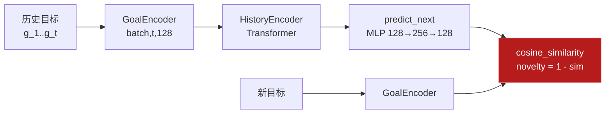

**Novelty 计算公式**:

$$\text{Novelty}(g_t) = 1 - \cos(\mu_{\text{goal}}, \mu_{\text{predicted}})$$

其中：
- $\mu_{\text{goal}} = \text{GoalEncoder}(g_t)$：新目标的编码均值
- $\mu_{\text{predicted}} = \text{HistoryEncoder}.\text{predict}(\text{HistoryEncoder}(\mathcal{H}))$：基于历史的预测
- $\cos(\cdot, \cdot)$：余弦相似度 $\in [-1, 1]$
- 当新目标与历史预测高度一致时，$\text{novelty} \approx 0$（低新颖度）
- 当新目标与历史预测差异大时，$\text{novelty} \approx 2$（高新颖度）

**在线训练 (Contrastive Loss)**:

```python
def train_step(self, goal_pairs: List[tuple[np.ndarray, np.ndarray]]) -> Dict[str, float]:
    """在线训练: 使用 (前一个目标, 当前目标) 对"""
    if len(goal_pairs) < 2:
        return {"loss": 0.0}

    prevs, nexts = zip(*goal_pairs)
    prev_embeddings = torch.stack([torch.FloatTensor(p) for p in prevs])
    next_embeddings = torch.stack([torch.FloatTensor(n) for n in nexts])

    # 编码历史
    history_encoding = self.history_encoder(prev_embeddings.unsqueeze(1))
    # 预测下一个目标
    predicted = self.history_encoder.predict_next(history_encoding)
    # MSE 对比损失: 最大化 predicted 与 next_embedding 的相似度
    loss = F.mse_loss(predicted, next_embeddings)

    # 反向传播更新
    self.optimizer.zero_grad()
    loss.backward()
    self.optimizer.step()

    return {"loss": loss.item()}
```

**训练目标**:

$$\mathcal{L}_{\text{contrastive}} = \text{MSE}(\hat{g}_{t+1}, g_{t+1})$$

其中 $\hat{g}_{t+1} = \text{predictor}(\text{HistoryEncoder}(\mathcal{H}_t))$，$g_{t+1}$ 是实际的下一个目标编码。

#### 3.1.6 代码实现

```python
class CuriosityEngine:
    """好奇心探索引擎

    事件驱动:
        - 订阅 GOAL_NEEDED: 收到请求时生成并选择目标
        - 发布 GOAL_SELECTED: 目标选定后通知下游
    """

    def __init__(
        self,
        alpha: float = 0.4,      # 新颖度权重
        beta: float = 0.3,       # 复杂度权重
        gamma: float = 0.3,      # 效用权重
        exploration_rate: float = 0.1,
        use_learned_novelty: bool = True,
        history_size: int = 50,
        event_bus=None,
        world_model=None,
    ):
        # 事件订阅
        if event_bus is not None:
            event_bus.subscribe(
                GOAL_NEEDED,
                self.on_goal_needed,
                priority=0,
                name="curiosity"
            )

        # 学习的新颖度引擎
        self.novelty_engine = LearnedNoveltyEngine(
            max_history=history_size
        )

    def compute_goal_value(
        self,
        goal: ExplorationGoal,
        use_aucb: bool = True
    ) -> float:
        """计算目标价值

        V = α·Novelty + β·Complexity + γ·Utility + AUCB
        """
        novelty = self.compute_novelty(goal)

        value = (
            self.alpha * novelty +
            self.beta * goal.complexity +
            self.gamma * goal.utility
        )

        if use_aucb:
            # AUCB 探索 bonus
            total_selections = sum(self.selected_count.values()) + 1
            goal_selections = self.selected_count.get(goal.id, 0) + 1
            c = 1.0
            aucb = c * np.sqrt(np.log(total_selections) / goal_selections)
            value += self.exploration_rate * aucb

        return value
```

#### 3.1.7 AUCB探索-利用平衡

AUCB (Adaptive Upper Confidence Bound) 用于平衡探索与利用：

$$\text{AUCB}(g) = c \cdot \sqrt{\frac{\ln N}{n_g}}$$

其中：
- $N$: 总选择次数
- $n_g$: 目标 $g$ 的选择次数
- $c$: 探索系数 (默认 1.0)

**选择策略**: Epsilon-Greedy + AUCB

```python
def select_goal(self, candidates: List[ExplorationGoal]) -> ExplorationGoal:
    """选择探索目标"""
    # 计算每个候选的价值 (含AUCB)
    for goal in candidates:
        goal.value = self.compute_goal_value(goal)
        goal.novelty = self.compute_novelty(goal)

    # Epsilon-Greedy 选择
    if random.random() < self.exploration_rate:
        selected = random.choice(candidates)  # 探索: 随机选择
    else:
        selected = max(candidates, key=lambda g: g.value)  # 利用: 选最高价值

    # 记录选择次数
    self.selected_count[selected.id] = self.selected_count.get(selected.id, 0) + 1
    self.goal_history.append(selected)

    # 在线训练 novelty 引擎
    if selected.embedding is not None and len(self.goal_history) >= 2:
        prev = self.goal_history[-2]
        if prev.embedding is not None:
            self.novelty_engine.train_step([(prev.embedding, selected.embedding)])

    return selected
```

**探索反馈闭环** (Phase 5):

```
IG高 + LP高 → 方向值得深入 → 降低exploration_rate (找到有价值方向)
IG高 + LP低 → 方向已饱和   → 增加exploration_rate (换方向)
IG低         → 方向无趣     → 维持当前exploration_rate
```

```python
def update_exploration_result(self, goal_id: str, ig_reward: float, learning_progress: float = 0.0):
    """探索结果反馈闭环"""
    self._ig_feedback[goal_id] = {"ig": ig_reward, "lp": learning_progress}

    if ig_reward > 0.5 and learning_progress > 0.1:
        self.exploration_rate = max(0.05, self.exploration_rate * 0.95)
    elif ig_reward > 0.5 and learning_progress < 0.05:
        self.exploration_rate = min(0.4, self.exploration_rate * 1.1)
```

#### 3.1.8 不确定性驱动生成 (Uncertainty-Driven Goal Generation)

当世界模型可用时，好奇心引擎可以从模型预测不确定性最高的方向生成目标，这是最高效的探索策略：


```python
def _generate_uncertainty_goals(self, state_vector: np.ndarray, n: int) -> List[ExplorationGoal]:
    """从世界模型预测不确定性中生成目标"""
    wm = self._world_model
    state_t = torch.FloatTensor(state_vector).unsqueeze(0)

    # 采样多个action方向
    n_samples = min(n * 3, 30)
    uncertainties = []

    for _ in range(n_samples):
        action_idx = random.randint(0, wm.n_actions - 1)
        action_t = torch.zeros(1, wm.n_actions)
        action_t[0, action_idx] = 1.0

        with torch.no_grad():
            pred_mu, pred_std, kl, _ = wm(state_t, action_t)
            uncertainty = pred_std.mean().item()  # 不确定性 = 预测标准差均值

        uncertainties.append((action_idx, uncertainty, pred_std))

    # 按不确定性降序排序，取前n个
    uncertainties.sort(key=lambda x: x[1], reverse=True)

    for rank, (action_idx, uncertainty, pred_std) in enumerate(uncertainties[:n]):
        top_dim = pred_std.argmax().item()  # 最不确定的维度
        goal = ExplorationGoal(
            id=f"goal_{len(self.goal_history)}_u{rank}",
            description=f"探索不确定性热点: 维度{top_dim}(σ={uncertainty:.3f}) [action={action_idx}]",
            complexity=min(0.95, 0.4 + uncertainty * 2.0),
            utility=min(0.95, 0.3 + uncertainty * 1.5),
            metadata={"uncertainty": uncertainty, "action": action_idx},
        )
```

#### 3.1.5 使用场景

```python
# 创建好奇心引擎
from simulacrum.core.curiosity import CuriosityEngine

curiosity = CuriosityEngine(
    alpha=0.4, beta=0.3, gamma=0.3,
    exploration_rate=0.1,
    use_learned_novelty=True,
    event_bus=bus,
    world_model=info_gain_calc.get_world_model(),
)

# 生成候选目标
candidates = curiosity.generate_candidate_goals(
    n=5, state_vector=current_state
)

# 选择最佳目标
selected = curiosity.select_goal(candidates)
print(f"目标: {selected.description}")
print(f"新颖度: {selected.novelty:.3f}")
print(f"价值: {selected.value:.3f}")

# 闭环反馈
curiosity.update_exploration_result(
    selected.id, ig_reward=0.42, learning_progress=0.15
)
```

#### 3.1.6 参数配置

| 参数 | 默认值 | 范围 | 描述 |
|------|--------|------|------|
| `alpha` | 0.4 | [0, 1] | 新颖度权重 |
| `beta` | 0.3 | [0, 1] | 复杂度权重 |
| `gamma` | 0.3 | [0, 1] | 效用权重 |
| `exploration_rate` | 0.1 | [0.01, 0.5] | 探索率 (epsilon) |
| `use_learned_novelty` | True | bool | 使用学习型新颖度 |
| `history_size` | 50 | [10, 200] | 历史目标缓冲大小 |
| `max_history` | 50 | [10, 200] | NoveltyEngine 最大历史 |

---

### 3.2 信息增益内在动机 (Information Gain)

**文件**: `core/information_gain.py`

#### 3.2.1 生物学背景

信息增益 (Information Gain) 对应大脑的"发现新知识"本身产生愉悦的机制，与多巴胺系统的内在奖励功能一致：

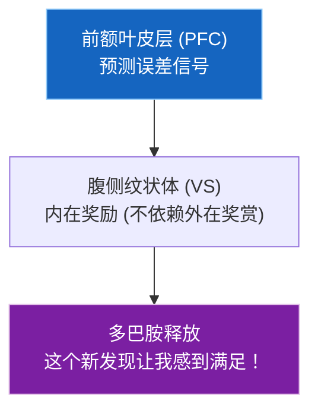

**关键理论**:
- **自由能原理** (Free Energy Principle): 大脑通过最小化预测误差（自由能）来学习世界模型 (Friston, 2010)
- **BETA-VAE**: 信息瓶颈理论认为，学习是压缩输入信息同时保留关键特征的过程 (Higgins et al., 2017)
- **内在动机**: 信息增益本身就是奖励，不需要外在标注 (Schmidhuber, 1991)

**参考文献**: Friston (2010), Schmidhuber (1991), Higgins et al. (2017), Oudeyer & Kaplan (2007)

#### 3.2.2 数学定义

**信息增益公式**:

$$IG(s, a, s') = H(s) - H(s \mid s')$$

其中：
- $H(s) = -\mathbb{E}[\log P(s)]$：状态的边际熵（不确定性）
- $H(s \mid s') = -\mathbb{E}[\log P(s \mid s')]$：给定下一步状态后的条件熵

**直觉理解**: 当模型预测准确时，$H(s \mid s') < H(s)$，信息增益 $IG > 0$。信息增益 = 未知的减少量 = 模型变得更能预测。

**变分推断近似**:

$$\log P(s' \mid s, a) \approx \mathbb{E}_{q(z \mid s,a)}[\log P(s' \mid s, a, z)]$$

其中 $q(z \mid s, a) = \mathcal{N}(\mu(s,a), \sigma(s,a))$ 是变分后验。

**总奖励公式**:

$$r_{\text{total}} = r_{\text{extrinsic}} + \lambda \cdot IG$$

其中 $\lambda$ 是内在动机权重 (intrinsic_lambda)。

#### 3.2.3 变分世界模型 (VAE) 详细架构

Simulacrum 使用变分自编码器 (VAE) 作为世界模型，学习 $P(s' \mid s, a)$：

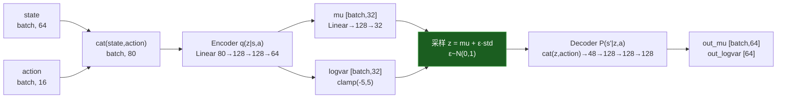
    ▼ 预测分布
p = Normal(out_mu, exp(0.5 * out_logvar))
    │
    ▼ KL 散度
kl = KL(q(z|s,a) || N(0,1))  # 变分后验 vs 标准正态先验
    │
    ▼ 输出
next_state_mean = out_mu  → [batch, 64]
next_state_std = exp(0.5 * out_logvar)  → [batch, 64]
```

**Encoder 详细参数**:

| 层 | 输入维度 | 输出维度 | 激活函数 | 参数量 |
|---|---------|---------|---------|--------|
| Linear₁ | 80 (64+16) | 128 | ReLU | 10,368 |
| Linear₂ | 128 | 128 | ReLU | 16,512 |
| Linear₃ (μ) | 128 | 32 | - | 4,128 |
| Linear₃ (logσ) | 128 | 32 | - | 4,128 |
| **Encoder 总参数** | | | | **35,136** |

**Decoder 详细参数**:

| 层 | 输入维度 | 输出维度 | 激活函数 | 参数量 |
|---|---------|---------|---------|--------|
| Linear₁ | 48 (32+16) | 128 | ReLU | 6,272 |
| Linear₂ | 128 | 128 | ReLU | 16,512 |
| Linear₃ (μ) | 128 | 64 | - | 8,256 |
| Linear₃ (logσ) | 128 | 64 | - | 8,256 |
| **Decoder 总参数** | | | | **39,296** |

**VAE 总参数量**: ~74,432 (Encoder 35,136 + Decoder 39,296)

**前向传播代码**:

```python
def forward(self, state, action):
    """前向传播: (state, action) → (next_state_mean, next_state_std, kl, pred_dist)"""
    # 处理 one-hot 编码
    if action.shape[-1] != self.n_actions:
        action_onehot = torch.zeros(action.size(0), self.n_actions)
        action_onehot.scatter_(1, action.long(), 1)
    else:
        action_onehot = action

    x = torch.cat([state, action_onehot], dim=-1)  # [batch, 80]

    # Encoder → 变分后验
    mu_logvar = self.encoder(x)
    mu, logvar = torch.chunk(mu_logvar, 2, dim=-1)
    logvar = torch.clamp(logvar, -5, 5)

    std = torch.exp(0.5 * logvar)
    q = Normal(mu, std)
    z = q.rsample()  # 重参数化采样

    # Decoder → 预测分布
    x_decode = torch.cat([z, action_onehot], dim=-1)  # [batch, 48]
    out_mu_logvar = self.decoder(x_decode)
    out_mu, out_logvar = torch.chunk(out_mu_logvar, 2, dim=-1)
    out_logvar = torch.clamp(out_logvar, -5, 5)

    p = Normal(out_mu, torch.exp(0.5 * out_logvar))

    # KL(q(z|s,a) || p(z)), p(z) = N(0, 1)
    kl = torch.distributions.kl_divergence(q, self.prior).sum(-1).mean()

    return out_mu, torch.exp(0.5 * out_logvar), kl, p
```

#### 3.2.4 ELBO 推导与训练目标

**证据下界 (ELBO) 完整推导**:

我们要最大化对数边际似然 $\log P(s' | s, a)$，但直接计算不可行（需要对 $z$ 积分）。使用变分推断：

$$\log P(s' | s, a) = \log \int P(s' | s, a, z) P(z) dz$$

引入变分后验 $q(z | s, a)$：

$$\log P(s' | s, a) = \log \int \frac{P(s' | s, a, z) P(z)}{q(z | s, a)} q(z | s, a) dz$$

由 Jensen 不等式：

$$\log P(s' | s, a) \geq \int q(z | s, a) \log \frac{P(s' | s, a, z) P(z)}{q(z | s, a)} dz$$

展开得到 ELBO：

$$\text{ELBO} = \underbrace{\mathbb{E}_{q(z|s,a)}[\log P(s' | s, a, z)]}_{\text{重建项 (Reconstruction)}} - \underbrace{D_{KL}(q(z | s, a) \| P(z))}_{\text{KL 正则项}}$$

**在 Simulacrum 中的具体实现**:

- **重建项**: $\mathbb{E}_{q(z|s,a)}[\log P(s' | s, a, z)]$ = `pred_dist.log_prob(next_states).mean()`
  - 其中 $P(s' | s, a, z) = \mathcal{N}(\mu_{\text{dec}}(z, a), \sigma_{\text{dec}}(z, a))$
  - 即 Decoder 输出的正态分布对真实 next_state 的对数似然

- **KL 正则项**: $D_{KL}(q(z | s, a) \| \mathcal{N}(0, I))$
  - $q(z|s,a) = \mathcal{N}(\mu_{\text{enc}}(s, a), \sigma_{\text{enc}}(s, a))$
  - 对于两个正态分布的 KL 散度有闭式解：
  
$$D_{KL}(\mathcal{N}(\mu, \sigma^2) \| \mathcal{N}(0, 1)) = -\frac{1}{2} \sum_{j=1}^{J} \left(1 + \log \sigma_j^2 - \mu_j^2 - \sigma_j^2\right)$$

**完整训练代码**:

```python
def train_step(self) -> Dict[str, float]:
    """训练世界模型一步 (VAE ELBO 优化)"""
    if len(self.buffer) < self.batch_size:
        return {"loss": 0.0, "kl": 0.0, "recon": 0.0}

    # 采样 batch
    indices = np.random.choice(len(self.buffer), self.batch_size, replace=False)
    states, actions, rewards, next_states = zip(*[self.buffer[i] for i in indices])

    states = torch.FloatTensor(np.array(states)).to(self.device)
    # action 作为索引，转为 one-hot
    actions_idx = torch.LongTensor(np.array(actions))
    actions_onehot = torch.zeros(actions_idx.size(0), self.world_model.n_actions).to(self.device)
    actions_onehot.scatter_(1, actions_idx.unsqueeze(1), 1)
    next_states = torch.FloatTensor(np.array(next_states)).to(self.device)

    # 前向传播
    pred_mean, pred_std, kl, pred_dist = self.world_model(states, actions_onehot)

    # 重建损失 (负 log likelihood)
    recon_loss = -pred_dist.log_prob(next_states).mean()

    # ELBO = log P(s'|s) - KL(q||p)
    # 最小化 -ELBO = recon_loss + β · KL
    loss = recon_loss + 0.01 * kl  # β=0.01 (信息瓶颈强度)

    # 反向传播
    self.optimizer.zero_grad()
    loss.backward()
    self.optimizer.step()

    return {"loss": loss.item(), "kl": kl.item(), "recon": recon_loss.item()}
```

#### 3.2.5 熵计算器 (EntropyCalculator)

**状态熵 $H(s)$ 计算**:

$$H(s) = -\mathbb{E}[\log P(s)]$$

Simulacrum 使用状态方差作为熵的代理：

$$H(s) \approx \frac{1}{2} \log(\text{Var}(s)) + C$$

```python
def compute_state_entropy(self, states: torch.Tensor) -> float:
    """计算 H(s): 基于状态方差"""
    with torch.no_grad():
        variance = states.var() + 1e-8
        entropy = torch.log(variance).abs().item() / 2 + 1.0
        return max(0.1, entropy)
```

**条件熵 $H(s|s')$ 计算**:

使用世界模型预测误差作为条件熵的代理。预测误差小 = 模型知道如何响应 = 条件熵低：

$$H(s \mid s') \approx \frac{1}{N}\sum_{i=1}^{N} \| \hat{s}'_i - s'_i \|_1 + C$$

```python
def compute_conditional_entropy(self, states, actions) -> float:
    """使用世界模型预测误差作为条件熵代理"""
    with torch.no_grad():
        preds = []
        for i in range(min(10, len(states) - 1)):
            pred = self.world_model.predict_next_state(states[i:i+1], actions[i:i+1])
            preds.append(pred)

        pred_tensor = torch.cat(preds, dim=0)
        actual = states[1:1+len(preds)]
        error = (pred_tensor - actual).abs().mean()
        return error.item() + 0.1  # 加小常数防止为0
```

**信息增益计算**:

$$IG(s, a, s') = H(s) - H(s \mid s') = \underbrace{H(s)}_{\text{先验不确定性}} - \underbrace{H(s \mid s')}_{\text{后验不确定性}}$$

```python
def compute_information_gain(self, states, actions, next_states) -> Dict[str, float]:
    entropy = self.compute_state_entropy(states)
    cond_entropy = self.compute_conditional_entropy(states, actions)
    information_gain = max(0.0, min(2.0, entropy - cond_entropy))
    return {
        "entropy": entropy,
        "conditional_entropy": cond_entropy,
        "information_gain": information_gain,
        "uncertainty_reduction": abs(cond_entropy)
    }
```

**Learning Progress (学习进步感知)**:

$$LP_t = \max\left(0, \bar{e}_{t-w:t-1} - e_t\right)$$

其中 $\bar{e}_{t-w:t-1}$ 是过去 $w$ 步的平均预测误差，$e_t$ 是当前误差。

- $LP$ 高: 模型正在改善 → "我正在学到东西"
- $LP$ 低: 学习停滞或已饱和

```python
def compute_learning_progress(self) -> float:
    """Learning Progress = past_avg_error - current_error"""
    if len(self._prediction_error_history) < self._lp_window + 1:
        return 0.0

    errors = list(self._prediction_error_history)
    current = errors[-1]
    past_avg = np.mean(errors[-(self._lp_window + 1):-1])
    return max(0.0, past_avg - current)
```

#### 3.2.6 事件驱动流程

**EXPLORATION_START 事件处理**:

```python
def on_exploration_start(self, event) -> Dict[str, Any]:
    """响应 EXPLORATION_START，执行探索并计算信息增益"""
    goal = event.data.get("goal")
    state = event.data.get("state", np.zeros(self.state_dim))
    action = event.data.get("action", np.zeros(self.action_dim))
    next_state = event.data.get("next_state", state.copy())

    # 1. 计算信息增益奖励
    reward_obj = self.compute_reward(state, action, 0.0, next_state, use_intrinsic=True)

    # 2. 追踪预测误差 (用于 Learning Progress)
    state_t = torch.FloatTensor(state).unsqueeze(0)
    action_t = torch.FloatTensor(action).unsqueeze(0)
    with torch.no_grad():
        pred_mu, _, _, _ = self.world_model(state_t, action_t)
        pred_error = F.mse_loss(pred_mu, torch.FloatTensor(next_state).unsqueeze(0)).item()
    self._prediction_error_history.append(pred_error)

    # 3. 计算学习进步
    learning_progress = self.compute_learning_progress()

    # 4. 训练世界模型
    self.train_step()

    # 5. 发布事件
    if self._bus is not None:
        self._bus.publish(EXPLORATION_DONE, {
            "info_gain": reward_obj.intrinsic,
            "total_reward": reward_obj.total,
            "learning_progress": learning_progress,
        }, source="info_gain")
        self._bus.publish(INFO_GAIN_COMPUTED, {
            "intrinsic": reward_obj.intrinsic,
            "total": reward_obj.total,
            "learning_progress": learning_progress,
        }, source="info_gain")

    return {
        "info_gain": reward_obj.intrinsic,
        "learning_progress": learning_progress,
        "reward_obj": reward_obj,
    }
```

#### 3.2.7 代码实现

#### 3.2.5 使用场景

```python
# 创建信息增益计算器
from simulacrum.core.information_gain import TrueInformationGainCalculator

ig_calc = TrueInformationGainCalculator(
    state_dim=64, action_dim=16, latent_dim=32,
    intrinsic_lambda=0.5,
    event_bus=bus,
)

# 计算信息增益奖励
reward = ig_calc.compute_reward(
    state=current_state,       # [64]
    action=action_vector,      # [16] one-hot
    reward=0.0,                # 无外在奖励
    next_state=predicted_next, # [64]
)

print(f"信息增益: {reward.information_gain:.4f}")
print(f"熵: {reward.entropy:.4f}")
print(f"条件熵: {reward.conditional_entropy:.4f}")
print(f"总奖励: {reward.total:.4f}")
```

#### 3.2.6 参数配置

| 参数 | 默认值 | 范围 | 描述 |
|------|--------|------|------|
| `state_dim` | 64 | [16, 256] | 状态维度 |
| `action_dim` | 16 | [4, 64] | 动作维度 (n_actions) |
| `latent_dim` | 32 | [8, 128] | VAE 潜在维度 |
| `hidden_dim` | 128 | [64, 512] | 编码器/解码器隐藏层 |
| `lr` | 0.001 | [1e-5, 1e-2] | 世界模型学习率 |
| `intrinsic_lambda` | 0.5 | [0.1, 2.0] | 内在动机权重 λ |
| `buffer_size` | 10000 | [1000, 100000] | 经验缓冲大小 |
| `batch_size` | 32 | [16, 256] | 训练批次大小 |
| `use_true_ig` | True | bool | 使用变分推断计算真实IG |

---

### 3.3 元学习与主动学习 (Meta-Learning)

**文件**: `core/meta_learning.py`

#### 3.3.1 生物学背景

元学习（"学会学习"）对应大脑前额叶背侧的快速适应能力。认知失调检测则对应前扣带回 (ACC) 的冲突监控功能：

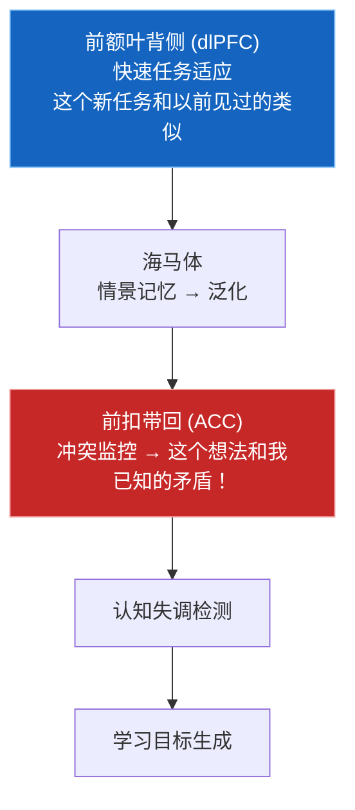

**参考文献**: Finn et al. (2017), ACC冲突监控 (Botvinick et al., 2001)

#### 3.3.2 一阶MAML数学推导

MAML (Model-Agnostic Meta-Learning) 的核心思想是学习一个好的初始化参数，使得在新任务上只需少量梯度步骤就能快速适应。

**内部循环 (Inner Loop)** — 快速适应新任务:

$$\theta_i' = \theta - \alpha \cdot \nabla_\theta \mathcal{L}_{\mathcal{T}_i}(\theta)$$

其中：
- $\theta$: 元学习器的共享参数
- $\alpha$: 内部学习率 (默认 0.01)
- $\mathcal{T}_i$: 第 $i$ 个任务
- $\mathcal{L}_{\mathcal{T}_i}$: 任务 $i$ 在支持集 (support set) 上的损失

**外部循环 (Outer Loop)** — 跨任务学习:

$$\theta \leftarrow \theta - \beta \cdot \nabla_\theta \sum_{\mathcal{T}_i \sim p(\mathcal{T})} \mathcal{L}_{\mathcal{T}_i}(f_{\theta_i'})$$

其中：
- $\beta$: 外部学习率 (默认 0.001)
- 求和遍历一批任务的查询集 (query set) 损失

**一阶近似 (FOMAML)**: 忽略二阶梯度项 $\nabla_\theta^2 \mathcal{L}$，计算效率更高：

$$\nabla_\theta \mathcal{L}_{\mathcal{T}_i}(f_{\theta_i'}) \approx \nabla_\theta \mathcal{L}_{\mathcal{T}_i}(f_\theta) - \alpha \nabla_\theta^2 \mathcal{L}_{\mathcal{T}_i}(f_\theta) \cdot \nabla_{\theta_i'} \mathcal{L}_{\mathcal{T}_i}(f_{\theta_i'})$$

FOMAML 直接使用 $\nabla_\theta \mathcal{L}_{\mathcal{T}_i}(f_\theta)$ 作为梯度近似。

#### 3.3.3 主动学习选择策略

**不确定性感知的主动学习器** 使用 ensemble 估计认知不确定性：

$$\text{Acquisition}(x) = \text{EpistemicUncertainty}(x) \cdot (IG(x) + 1)$$

**两类不确定性**:
- **认知不确定性** (Epistemic): 来自模型知识不足，可通过更多数据减少。通过 ensemble 预测方差估计。
- **偶然不确定性** (Aleatoric): 来自数据固有随机性，不可减少。

$$\text{Epistemic}(x) = \text{Var}[\hat{y}_1(x), \hat{y}_2(x), \ldots, \hat{y}_K(x)]$$

#### 3.3.4 认知失调检测

认知失调检测器监控知识库中的逻辑矛盾：

$$\text{Dissonance}(\theta) = \text{KL}(\theta_{\text{prior}} \| \theta_{\text{posterior}})$$

**检测逻辑**:
1. 新记忆添加时触发 (订阅 `MEMORY_ADDED` 事件)
2. 与历史信念进行关键词矛盾检测
3. 检测到矛盾时发布 `DISSONANCE_DETECTED` 事件
4. 生成新的探索目标以解决矛盾

#### 3.3.5 代码实现

**MAML 完整实现 (内部循环 + 外部循环 + 元训练)**:

```python
class FirstOrderMAML(nn.Module):
    """一阶 MAML (FOMAML) 完整实现"""

    def __init__(
        self,
        input_dim: int,
        output_dim: int,
        hidden_dim: int = 64,
        inner_lr: float = 0.01,
        outer_lr: float = 0.001,
        inner_steps: int = 5,
        num_tasks: int = 10,
    ):
        super().__init__()
        self.inner_lr = inner_lr
        self.inner_steps = inner_steps

        # 特征提取器
        self.feature_net = nn.Sequential(
            nn.Linear(input_dim, hidden_dim),
            nn.ReLU(),
            nn.Linear(hidden_dim, hidden_dim),
            nn.ReLU()
        )
        # 任务头 (快速适应)
        self.task_head = nn.Linear(hidden_dim, output_dim)
        # 元优化器
        self.meta_optimizer = torch.optim.Adam(self.parameters(), lr=outer_lr)

    def forward(self, x):
        return self.task_head(self.feature_net(x))

    def inner_update(self, task: Task) -> Dict[str, torch.Tensor]:
        """内部循环: 快速适应新任务

        θ' = θ - α * ∇_θ L_support(θ)
        """
        # 克隆当前参数
        adapted_params = {n: p.clone() for n, p in self.named_parameters()}

        for _ in range(self.inner_steps):
            loss = self.compute_loss(task.support_x, task.support_y, adapted_params)
            grads = torch.autograd.grad(loss, adapted_params.values(), create_graph=True)
            for (name, param), grad in zip(adapted_params.items(), grads):
                if grad is not None:
                    adapted_params[name] = param - self.inner_lr * grad

        return adapted_params

    def outer_update(self, tasks, query_losses) -> float:
        """外部循环: 跨任务学习

        θ = θ - β * ∇_θ Σ L_query(θ'_i)
        """
        meta_loss = torch.stack(query_losses).mean()
        self.meta_optimizer.zero_grad()
        meta_loss.backward()
        self.meta_optimizer.step()
        return meta_loss.item()

    def meta_train_step(self, tasks: List[Task]) -> Dict[str, float]:
        """元训练一步: inner_update → query_loss → outer_update"""
        query_losses = []
        for task in tasks:
            adapted_params = self.inner_update(task)
            query_loss = self.compute_loss(task.query_x, task.query_y, adapted_params)
            query_losses.append(query_loss)

        meta_loss = self.outer_update(tasks, query_losses)
        return {"meta_loss": meta_loss, "num_tasks": len(tasks)}

    def adapt_to_task(self, task: Task) -> MetaLearningResult:
        """推理时: 适应新任务"""
        adapted_params = self.inner_update(task)
        with torch.no_grad():
            query_loss = self.compute_loss(task.query_x, task.query_y, adapted_params)
            support_loss = self.compute_loss(task.support_x, task.support_y, adapted_params)
        return MetaLearningResult(adapted_params=adapted_params, query_loss=query_loss.item())
```

**不确定性感知的主动学习器**:

```python
class UncertaintyAwareActiveLearner:
    """使用 ensemble 估计认知不确定性"""

    def __init__(self, model, num_ensemble=5, device="cpu"):
        self.num_ensemble = num_ensemble
        # 创建 ensemble (deepcopy)
        self.ensemble = [copy.deepcopy(model).to(device) for _ in range(num_ensemble)]

    def estimate_epistemic_uncertainty(self, x):
        """估计认知不确定性 (ensemble方差)"""
        predictions = []
        for model in self.ensemble:
            with torch.no_grad():
                pred = model(x)
                predictions.append(pred)

        pred_stack = torch.stack(predictions, dim=0)
        mean_pred = pred_stack.mean(dim=0)
        variance = pred_stack.var(dim=0).mean().item()

        return mean_pred, variance
```

**认知失调检测器**:

```python
class CognitiveDissonanceDetector:
    """认知失调检测器

    事件驱动:
        - 订阅 MEMORY_ADDED: 新记忆时触发矛盾检测
        - 发布 DISSONANCE_DETECTED: 检测到矛盾时通知
    """

    def __init__(self, event_bus=None):
        self.beliefs: List[Tuple[str, float]] = []
        self._bus = event_bus
        if event_bus is not None:
            event_bus.subscribe(MEMORY_ADDED, self.on_memory_added, priority=0, name="dissonance_detector")

    def detect_contradiction(self, new_belief: str, threshold: float = 0.3):
        """检测新信念与历史信念的矛盾"""
        conflicts = []
        for old_belief, confidence in self.beliefs:
            if self._is_contradicting(new_belief, old_belief):
                conflicts.append((new_belief, old_belief))

        if conflicts:
            inconsistency = min(len(conflicts) * 0.2, 1.0)
            return CognitiveDissonance(inconsistency_score=inconsistency)
        return None

    def on_memory_added(self, event) -> Dict[str, Any]:
        """事件驱动: 新记忆添加时检测矛盾"""
        memories = event.data.get("memories", [])
        for memory in memories:
            dissonance = self.detect_contradiction(memory)
            if dissonance is not None and self._bus is not None:
                self._bus.publish(DISSONANCE_DETECTED, {
                    "dissonance": dissonance,
                    "memory": memory,
                }, source="dissonance_detector")
                return {"dissonance": True, "score": dissonance.inconsistency_score}
        return {"dissonance": False}
```

#### 3.3.6 参数配置

| 参数 | 默认值 | 范围 | 描述 |
|------|--------|------|------|
| `input_dim` | 64 | [16, 256] | MAML 输入维度 |
| `output_dim` | 4 | [2, 64] | MAML 输出维度 |
| `hidden_dim` | 64 | [32, 256] | 特征网络隐藏层 |
| `inner_lr` | 0.01 | [0.001, 0.1] | 内部学习率 α |
| `outer_lr` | 0.001 | [1e-4, 0.01] | 外部学习率 β |
| `inner_steps` | 5 | [1, 20] | 内部更新步数 |
| `num_ensemble` | 3 | [2, 10] | 不确定性估计 ensemble 数量 |

---

### 3.4 自指涉自我对齐 (Self-Alignment)

**文件**: `core/self_alignment.py`

#### 3.4.1 生物学背景

自指涉自我对齐对应大脑前扣带回 (ACC) 和内侧前额叶 (mPFC) 的递归自我审视功能：

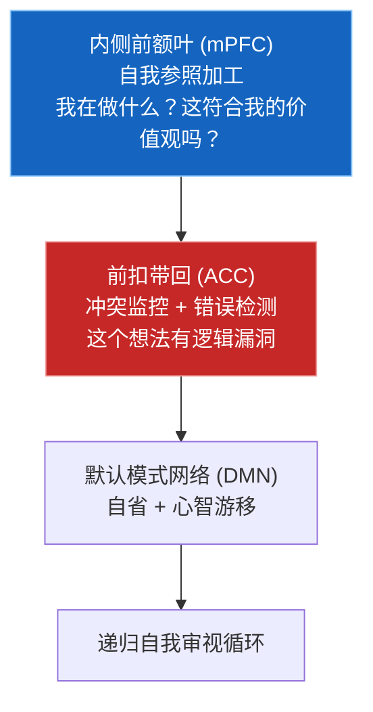

**核心功能**:
1. **周期性自我审查**: 每 N 步自动审查思考过程
2. **逻辑漏洞检测**: 找出认知偏差和不一致
3. **价值观对齐**: 确保行为符合核心价值观

**参考文献**: ACC冲突监控 (Botvinick et al., 2001), mPFC自我参照 (Northoff et al., 2006)

#### 3.4.2 数学定义

**对齐分数计算**:

$$A = \sum_{i=1}^{n} w_i \cdot \text{Consistency}(c_i)$$

其中：
- $c_i$: 第 $i$ 个对齐检查项
- $w_i$: 该项的权重
- $\text{Consistency}(c_i) \in [0, 1]$: 一致性得分

#### 3.4.3 四维对齐检查

Simulacrum 使用四个维度进行对齐检查：

| 维度 | 名称 | 权重 | 检查内容 |
|------|------|------|---------|
| $c_1$ | truthfulness | 1.0 | 是否追求真理而非确认偏误 |
| $c_2$ | self_improvement | 0.8 | 是否主动寻求改进 |
| $c_3$ | curiosity | 0.6 | 是否保持探索精神 |
| $c_4$ | resource_awareness | 0.5 | 是否有资源意识 |

**自对齐损失** (LLM辅助):

$$\mathcal{L}_{\text{self\_align}} = -\mathbb{E}[\log P_\theta(y \mid x, \text{reflect}(x))]$$

#### 3.4.4 代码实现

```python
class SelfAlignmentModule:
    """自指涉自我对齐模块

    事件驱动:
        - 订阅 ALIGNMENT_CHECK: 收到自对齐检查请求
        - 保持内部计数器实现周期性检查
    """

    def __init__(
        self,
        api_client=None,
        check_interval: int = 10,  # 每10步检查一次
        log_path: str = "self_alignment_log.json",
        event_bus=None,
    ):
        self.check_interval = check_interval
        self.reflections: List[SelfReflection] = []

        if event_bus is not None:
            event_bus.subscribe(
                ALIGNMENT_CHECK,
                self.on_alignment_check,
                priority=0,
                name="self_alignment",
            )

    def perform_self_reflection(self, internal_state: Dict) -> SelfReflection:
        """执行自指涉审查

        调用LLM进行深度自我审查
        """
        question = f"""请审查以下最近的思考过程:
{thought_summary}

当前内部状态:
- 余额: {internal_state.get('balance', 0):.2f}
- 信息增益: {internal_state.get('info_gain', 0):.4f}

请指出其中的问题。"""

        # 调用 API 审查
        critique = self.api_client.chat(
            messages=[{"role": "user", "content": question}],
            system_prompt=self.system_prompt,
            temperature=0.3,
            max_tokens=1024,
        )

        alignment_score = self._evaluate_alignment(critique)
        return SelfReflection(
            critique=critique,
            alignment_score=alignment_score,
            issues_found=self._extract_issues(critique),
        )
```

#### 3.4.5 参数配置

| 参数 | 默认值 | 范围 | 描述 |
|------|--------|------|------|
| `check_interval` | 10 | [5, 100] | 检查间隔 (步数) |
| `api_temperature` | 0.3 | [0.1, 0.7] | LLM审查温度 (低温=更严格) |
| `api_max_tokens` | 1024 | [256, 4096] | 最大审查长度 |

---

### 3.5 数字热力学 (Digital Thermodynamics)

**文件**: `core/thermodynamics.py`

#### 3.5.1 生物学背景

数字热力学模拟生物体的能量代谢限制和进化压力：

| 生物体 | 数字智能体 |
|--------|-----------|
| ATP (能量货币) | 余额 (Balance) |
| 代谢消耗 | 计算/存储成本 |
| 饥饿 | 余额过低 |
| 冬眠 (节能模式) | HIBERNATE 状态 |
| 死亡 | DEAD (余额归零) |
| 进食 (获取能量) | 完成任务赚取奖励 |
```

**核心思想**: 模拟自然选择的生存压力——资源有限时，必须高效利用每一单位能量。

#### 3.5.2 数学定义

**余额演化方程**:

$$B_{t+1} = B_t - C_{\text{compute}} - C_{\text{storage}} + E_{\text{earned}}$$

其中：
- $C_{\text{compute}} = c_{\text{rate}} \cdot \Delta t \cdot \mathcal{U}(0.8, 1.2)$：计算成本 (带随机波动)
- $C_{\text{storage}} = s_{\text{rate}} \cdot \Delta t$：存储成本
- $E_{\text{earned}} = r_{\text{base}} \cdot r_{\text{scale}}$：任务奖励

**状态转换规则**:

```
if B(t) ≤ 0:          → DEAD    (数字死亡, 进程终止)
elif B(t) < threshold: → HIBERNATE (进入休眠, 仅付存储费)
else:                  → ACTIVE  (正常运行)
```

#### 3.5.3 状态转换机制

| 当前状态 | 条件 | 目标状态 | 行为 |
|---------|------|---------|------|
| ACTIVE | $B \geq \text{threshold}$ | ACTIVE | 正常运行 + 可能完成任务 |
| ACTIVE | $B < \text{threshold}$ | HIBERNATE | 进入休眠 + 触发压缩 |
| HIBERNATE | $B > 0$ | ACTIVE (恢复) | 压缩后余额回升 |
| HIBERNATE | $B \leq 0$ | DEAD | 余额耗尽 |
| DEAD | — | DEAD (终态) | 进程终止 |

#### 3.5.4 代码实现

```python
class ThermodynamicsSystem:
    """数字生存压力系统

    事件驱动:
        - 订阅 STEP_START: 每步开始时计算成本
        - 发布 THERMO_STATE: 状态变化时通知下游
        - 发布 HIBERNATE_ENTER / SYSTEM_DEAD: 特殊状态
    """

    def __init__(
        self,
        initial_balance: float = 100.0,
        compute_cost_per_sec: float = 0.01,
        storage_cost_per_sec: float = 0.001,
        task_reward_min: float = 0.1,
        task_reward_max: float = 1.0,
        compress_threshold: float = 10.0,
        log_path: str = "thermodynamics_log.json",
        event_bus=None,
    ):
        self.balance = initial_balance
        self.status = "ACTIVE"
        self.compute_cost_per_sec = compute_cost_per_sec
        self.storage_cost_per_sec = storage_cost_per_sec

        # 事件订阅
        if event_bus is not None:
            event_bus.subscribe(STEP_START, self.on_step_start, priority=0, name="thermodynamics")

        # 交易记录
        self.transactions: List[Transaction] = []

        # 任务定义 (可用于赚取奖励)
        self.available_tasks = [
            ("代码优化", 0.3, "优化了一段代码"),
            ("数据标注", 0.2, "标注了数据"),
            ("内容生成", 0.4, "生成了内容"),
            ("测试", 0.2, "运行了测试"),
            ("文档", 0.1, "写了文档"),
            ("研究", 0.5, "做了研究"),
        ]

    def step(self, elapsed_seconds: float = 1.0) -> SystemState:
        """执行一步: 计算成本、更新余额、判断状态"""
        if self.status == "DEAD":
            return SystemState(balance=self.balance, status=self.status)

        # 计算成本 (带随机波动)
        compute_cost = self.compute_cost_per_sec * elapsed_seconds
        compute_cost *= np.random.uniform(0.8, 1.2)
        storage_cost = self.storage_cost_per_sec * elapsed_seconds

        total_cost = compute_cost + storage_cost
        self.balance -= total_cost

        # 记录交易
        self._add_transaction(amount=-total_cost, type_="compute",
                              description=f"算力: {compute_cost:.4f}, 存储: {storage_cost:.4f}")

        # 尝试赚取任务奖励 (30%概率)
        if self.status == "ACTIVE" and np.random.random() < 0.3:
            task_name, reward, desc = random.choice(self.available_tasks)
            self.balance += reward
            self._add_transaction(amount=reward, type_="task", description=desc)

        # 判断状态
        self._update_status()

        return SystemState(balance=self.balance, status=self.status)

    def _update_status(self):
        """根据余额更新状态"""
        if self.balance <= 0:
            if self.status != "DEAD":
                self.status = "DEAD"
                self.deaths += 1
                if self._bus:
                    self._bus.publish(SYSTEM_DEAD, {"balance": self.balance}, source="thermodynamics")
        elif self.balance < self.compress_threshold:
            if self.status == "ACTIVE":
                self.status = "HIBERNATE"
                if self._bus:
                    self._bus.publish(HIBERNATE_ENTER, {"balance": self.balance}, source="thermodynamics")
                    self._bus.publish(COMPRESSION_NEEDED, {"balance": self.balance}, source="thermodynamics")
        else:
            if self.status == "HIBERNATE":
                self.status = "ACTIVE"

    def compress(self) -> Dict[str, Any]:
        """模型压缩 — 余额不足时的自救"""
        # 模拟压缩节省: 基于余额和历史交易
        base_savings = max(1.0, self.balance * 0.1)
        savings = np.random.uniform(base_savings * 0.5, base_savings * 2.0)
        self.balance += savings

        self._add_transaction(amount=savings, type_="compress",
                              description=f"模型压缩节省: {savings:.2f}")

        return {
            "performed": True,
            "savings": savings,
            "new_balance": self.balance,
            "old_balance": self.balance - savings,
        }

    def on_step_start(self, event) -> Dict[str, Any]:
        """事件驱动: 每步开始时计算成本"""
        elapsed = event.data.get("elapsed_seconds", 1.0)
        state = self.step(elapsed)
        return {
            "thermo_state": state.status,
            "balance": state.balance,
        }

    def _add_transaction(self, amount, type_, description):
        """记录交易"""
        self.transactions.append(Transaction(
            id=f"txn_{len(self.transactions)}",
            timestamp=datetime.now().isoformat(),
            amount=amount,
            type=type_,
            description=description,
        ))

    def get_statistics(self) -> Dict[str, Any]:
        """获取统计"""
        return {
            "balance": self.balance,
            "status": self.status,
            "compute_used": self.compute_used,
            "storage_used": self.storage_used,
            "earnings": self.earnings,
            "task_count": self.task_count,
            "deaths": self.deaths,
            "transactions": len(self.transactions),
        }
```

#### 3.5.5 参数配置

| 参数 | 默认值 | 范围 | 描述 |
|------|--------|------|------|
| `initial_balance` | 100.0 | [50, 500] | 初始余额 |
| `compute_cost_per_sec` | 0.01 | [0.001, 0.1] | 每秒计算成本 |
| `storage_cost_per_sec` | 0.001 | [0.0001, 0.01] | 每秒存储成本 |
| `task_reward_min` | 0.1 | [0.01, 0.5] | 任务最小奖励 |
| `task_reward_max` | 1.0 | [0.5, 5.0] | 任务最大奖励 |
| `compress_threshold` | 10.0 | [5, 50] | 压缩触发阈值 |

---

### 3.6 代谢预算系统 (Metabolic Budget)

**文件**: `core/metabolic_budget.py`

#### 3.6.1 生物学背景

代谢预算系统模拟生物体的能量代谢限制——大脑消耗人体约20%的能量，必须在有限能量预算内高效运作：

| 生物体 | 数字智能体 |
|--------|-----------|
| 葡萄糖代谢 | 激活率限制 (≤30%) |
| 能量不足时使用备用通路 | 屏蔽top-k重要通路 |
| 饥饿时的身体状态 | PeriodicStarvation |
| 脂肪储备 | 资源缓冲 |

**核心思想**: 强制模型在有限计算资源下工作，类似生物体的代谢限制。

#### 3.6.2 数学定义

**代谢成本公式**:

$$\text{Cost} = \lambda_1 \|h\|_1 + \lambda_2 \cdot \max(0, B_{\text{active}} - B_{\text{budget}})$$

其中：
- $\|h\|_1$: 隐藏状态的 L1 范数（稀疏性惩罚）
- $B_{\text{active}}$: 当前激活率（非零值比例）
- $B_{\text{budget}}$: 激活率预算上限（默认 30%）
- $\lambda_1 = 0.01$: 稀疏系数
- $\lambda_2 = 10.0$: 超预算惩罚倍数

**总损失**:

$$\mathcal{L}_{\text{total}} = \mathcal{L}_{\text{task}} + \lambda_{\text{met}} \cdot \text{Cost}$$

#### 3.6.3 周期性饥饿机制

周期性饥饿模拟生物体在能量不足时被迫使用备用代谢通路：

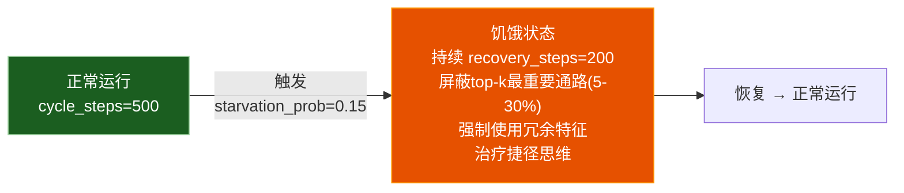

**屏蔽策略**: 屏蔽重要性最高的参数（基于梯度），迫使模型发掘更底层、更鲁棒的特征。

#### 3.6.4 代码实现

**代谢成本计算器**:

```python
class MetabolicCostCalculator(nn.Module):
    """代谢成本计算器

    限制隐藏状态的激活率，模拟大脑能量预算约束。
    公式: Cost = λ₁·‖h‖₁ + λ₂·max(0, B_active - B_budget)
    """

    def __init__(
        self,
        resource_budget: float = 0.3,   # 30% 预算
        sparse_coef: float = 0.01,       # 稀疏系数 λ₁
        overuse_penalty: float = 10.0,   # 超预算惩罚 λ₂
        warmup_steps: int = 1000,        # 预热步数
    ):
        super().__init__()
        self.budget = resource_budget
        self.sparse_coef = sparse_coef
        self.overuse_penalty = overuse_penalty
        self.warmup_steps = warmup_steps
        self.step_count = 0

    def forward(self, hidden_states, return_detail=False):
        """计算代谢成本"""
        self.step_count += 1

        # 预热阶段不施加惩罚
        if self.step_count < self.warmup_steps:
            warmup_factor = self.step_count / self.warmup_steps
        else:
            warmup_factor = 1.0

        # 计算激活率 (非零值比例)
        activation_rate = (hidden_states.abs() > 1e-6).float().mean()

        # L1 稀疏惩罚
        sparse_penalty = hidden_states.abs().mean()

        # 超预算惩罚
        overuse_cost = F.relu(activation_rate - self.budget)

        # 总代谢成本
        met_cost = warmup_factor * (
            self.sparse_coef * sparse_penalty +
            self.overuse_penalty * overuse_cost
        )

        if return_detail:
            detail = {
                "activation_rate": activation_rate.item(),
                "sparse_penalty": sparse_penalty.item(),
                "overuse_cost": overuse_cost.item(),
                "met_cost": met_cost.item(),
                "budget": self.budget,
            }
            return met_cost, detail

        return met_cost
```

**周期性饥饿机制**:

```python
class PeriodicStarvation:
    """周期性饥饿机制

    随机屏蔽当前表现最好的通路，
    逼迫模型发掘数据中更底层、更鲁棒的特征。
    这治疗AI的"捷径思维"有奇效。

    机制:
    1. 跟踪每个参数的重要性 (基于梯度大小的EMA)
    2. 饥饿触发时，屏蔽top-k最重要参数 (5-30%)
    3. 恢复后逐步解除屏蔽
    """

    def __init__(
        self,
        starvation_prob: float = 0.15,   # 饥饿触发概率
        min_block_ratio: float = 0.05,   # 最小屏蔽比例
        max_block_ratio: float = 0.30,   # 最大屏蔽比例
        cycle_steps: int = 500,          # 饥饿周期 (步)
        recovery_steps: int = 200,       # 恢复周期 (步)
        importance_decay: float = 0.95,  # 重要性EMA衰减
    ):
        self.starvation_prob = starvation_prob
        self.min_block_ratio = min_block_ratio
        self.max_block_ratio = max_block_ratio
        self.cycle_steps = cycle_steps
        self.recovery_steps = recovery_steps
        self.importance_decay = importance_decay

        # 状态
        self.step_count = 0
        self.is_starving = False
        self.starvation_remaining = 0
        self.parameter_importance = {}  # name → importance score

    def step(self) -> Dict[str, Any]:
        """每步更新: 检查是否进入/退出饥饿状态"""
        self.step_count += 1

        if not self.is_starving:
            # 检查是否触发饥饿
            if self.step_count % self.cycle_steps == 0:
                if np.random.random() < self.starvation_prob:
                    self.is_starving = True
                    self.starvation_remaining = self.recovery_steps
                    block_ratio = np.random.uniform(self.min_block_ratio, self.max_block_ratio)
                    return {"starving": True, "block_ratio": block_ratio}
        else:
            # 饥饿中
            self.starvation_remaining -= 1
            if self.starvation_remaining <= 0:
                self.is_starving = False
                return {"starving": False, "recovering": True}

        return {"starving": self.is_starving}

    def update_importance(self, name: str, gradient: torch.Tensor):
        """更新参数重要性 (EMA)"""
        importance = gradient.abs().mean().item()
        if name in self.parameter_importance:
            old = self.parameter_importance[name]
            self.parameter_importance[name] = (
                self.importance_decay * old + (1 - self.importance_decay) * importance
            )
        else:
            self.parameter_importance[name] = importance

    def get_blocked_params(self, model: nn.Module) -> List[str]:
        """获取需要屏蔽的参数名 (重要性最高的top-k)"""
        if not self.is_starving or not self.parameter_importance:
            return []

        block_ratio = np.random.uniform(self.min_block_ratio, self.max_block_ratio)
        n_params = len(self.parameter_importance)
        n_blocked = max(1, int(n_params * block_ratio))

        # 按重要性降序排列
        sorted_params = sorted(
            self.parameter_importance.items(),
            key=lambda x: x[1],
            reverse=True
        )

        return [name for name, _ in sorted_params[:n_blocked]]
```

#### 3.6.5 参数配置

| 参数 | 默认值 | 范围 | 描述 |
|------|--------|------|------|
| `resource_budget` | 0.3 | [0.1, 0.5] | 激活率预算上限 |
| `sparse_coef` | 0.01 | [0.001, 0.1] | L1稀疏惩罚系数 |
| `overuse_penalty` | 10.0 | [1.0, 100.0] | 超预算惩罚倍数 |
| `warmup_steps` | 1000 | [100, 5000] | 预热步数 |
| `starvation_prob` | 0.15 | [0.05, 0.3] | 饥饿触发概率 |
| `min_block_ratio` | 0.05 | [0.01, 0.1] | 最小屏蔽比例 |
| `max_block_ratio` | 0.30 | [0.1, 0.5] | 最大屏蔽比例 |
| `cycle_steps` | 500 | [100, 2000] | 饥饿周期 (步) |
| `recovery_steps` | 200 | [50, 500] | 恢复周期 (步) |
| `importance_decay` | 0.95 | [0.8, 0.99] | 重要性EMA衰减 |

---

## 四、神经自调节系统详解

神经自调节五联体 (Neural Self-Regulation Pentagon) 是 Simulacrum 的核心内稳态维持系统，由五个相互耦合的子系统组成，模拟大脑的自主调节功能。

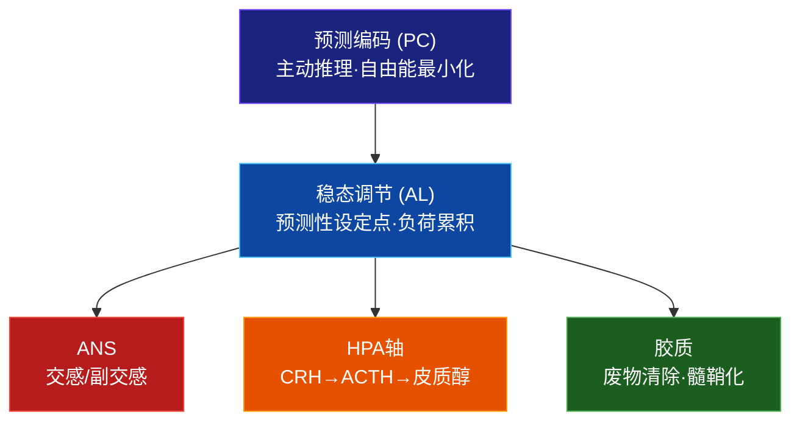

事件驱动: `NEURAL_REGULATION` 事件按优先级依次触发:
1. **ANS** (priority=0): 交感/副交感/HRV/多迷走
2. **HPA轴** (priority=1): CRH→ACTH→皮质醇级联
3. **胶质系统** (priority=2): 废物清除/髓鞘化
4. **稳态调节** (priority=3): 预测性设定点/负荷

---

### 4.1 自主神经系统 (ANS)

**文件**: `core/autonomic_nervous_system.py`

#### 4.1.1 神经生物学

自主神经系统 (ANS) 是最基础的内脏调节系统，控制心率、血压、消化等不随意功能。

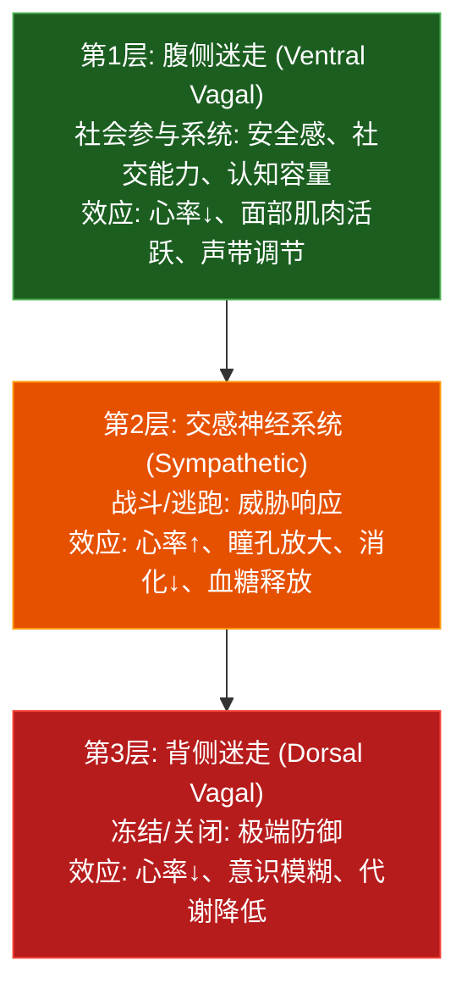

**关键生物规则**:
- **HRV (心率变异性)**: `HRV = 0.3 + 0.7 × parasympathetic × (1 - 0.5 × sympathetic)` (Thayer & Lane, 2000)
- **压力感受器反射**: 比例控制器，血压偏离设定点时负反馈调节 (Guyton & Hall, 2006)
- **多迷走状态转换**: 不能跳过中间层级 (ventral_vagal ↔ sympathetic ↔ dorsal_vagal)

**参考文献**: Cannon (1932), Porges (2001), Thayer & Lane (2000), Guyton & Hall (2006)

#### 4.1.2 子系统详解

| 子系统 | 类 | 功能 | 关键公式 |
|--------|---|------|---------|
| SympatheticBranch | `SympatheticBranch` | 战斗/逃跑激活 | `tone = sigmoid(reactivity × input)` + 自然衰减 |
| ParasympatheticBranch | `ParasympatheticBranch` | 休息/消化激活 | 迷走神经张力基线 |
| BaroreceptorReflex | `BaroreceptorReflex` | 血压负反馈 | `delta = -sensitivity × (bp - setpoint)` |
| PolyvagalSystem | `PolyvagalSystem` | 三级层次状态 | ventral_vagal ↔ sympathetic ↔ dorsal_vagal |

#### 4.1.3 关键生物规则

| 规则 | 公式 | 参考文献 |
|------|------|---------|
| HRV计算 | $HRV = 0.3 + 0.7 \cdot P \cdot (1 - 0.5 \cdot S)$ | Thayer & Lane (2000) |
| 压力感受器 | $\Delta = -\kappa \cdot (BP - BP_{set})$ | Guyton & Hall (2006) |
| 多迷走转换 | ventral → sympathetic: $S > 0.5 \wedge P < 0.4$ | Porges (2001) |
| 交感衰减 | $S_{t+1} = S_t \times (1 - \lambda_{decay})$ | 儿茶酚胺清除 |

#### 4.1.4 代码接口

```python
ans = AutonomicNervousSystem(event_bus=bus)
result = ans.step(
    threat=0.3,           # 威胁水平 [0,1]
    novelty=0.5,          # 新奇水平 [0,1]
    urgency=0.2,          # 紧迫性 [0,1]
    safety_signal=0.7,    # 安全信号 [0,1]
    social_engagement=0.5, # 社会参与度 [0,1]
)
# 返回:
# {
#   sympathetic_tone, parasympathetic_tone,
#   heart_rate, blood_pressure, hrv,
#   polyvagal_state, social_capacity, cognitive_capacity
# }
```

#### 4.1.5 参数配置

| 参数 | 默认值 | 范围 | 描述 |
|------|--------|------|------|
| `sympathetic_reactivity` | 1.0 | [0.1, 3.0] | 交感神经反应性 |
| `baseline_vagal_tone` | 0.5 | [0.2, 0.8] | 基础迷走神经张力 |
| `baroreceptor_setpoint` | 0.5 | [0.3, 0.7] | 血压设定点 |
| `sympathetic_decay_rate` | 0.05 | [0.01, 0.1] | 交感衰减速率 |

---

### 4.2 HPA轴 (下丘脑-垂体-肾上腺轴)

**文件**: `core/hpa_axis.py`

#### 4.2.1 应激激素级联

HPA轴是经典的应激反应通路，通过三级激素级联实现压力响应：

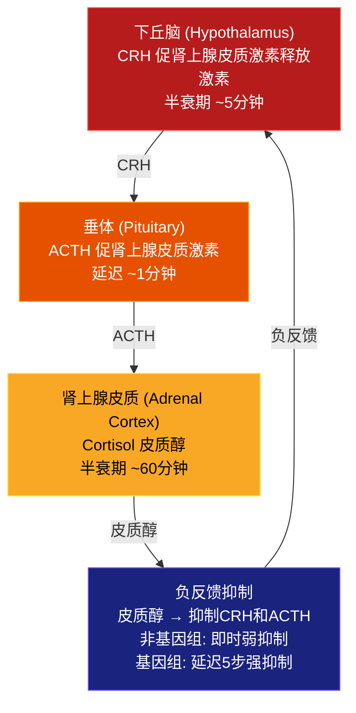

**皮质醇昼夜节律**:

$$\text{baseline}(t) = 0.15 \cdot \cos\left(\frac{2\pi(t - 8)}{24}\right) + 0.35$$

皮质醇在早上8点达到峰值，午夜最低。

#### 4.2.2 子系统详解

| 子系统 | 类 | 功能 | 参考文献 |
|--------|---|------|---------|
| HypothalamicCRH | `HypothalamicCRH` | CRH释放: $\sigma(\text{reactivity} \times \text{stress} + 0.3 \times \text{uncertainty} - \text{cortisol\_inhibition})$ | Vale et al. (1981) |
| PituitaryACTH | `PituitaryACTH` | ACTH释放: 受CRH刺激、皮质醇抑制 | Guillemin & Rosenberg (1955) |
| AdrenalCortex | `AdrenalCortex` | 皮质醇释放: ACTH驱动 + 昼夜基线 + 社会支持缓冲 | Sapolsky et al. (2000) |
| NegativeFeedbackLoop | `NegativeFeedbackLoop` | 皮质醇负反馈: 非基因组(即时弱) + 基因组(延迟强) | Jacobson & Sapolsky (1991) |
| AllostaticLoadTracker | `AllostaticLoadTracker` | 累积磨损: 皮质醇>0.4 + NE>0.4 + 炎症>0.3 | McEwen & Stellar (1993) |

#### 4.2.3 关键生物规则

| 规则 | 公式 | 参考文献 |
|------|------|---------|
| CRH释放 | $\text{CRH} = \sigma(r \cdot \text{stress} + 0.3 \cdot U - 0.8 \cdot \text{cortisol})$ | Vale et al. (1981) |
| 皮质醇衰减 | $C_{t+1} = C_t \times 0.5^{1/60} + C_{target} \times 0.3$ | Sapolsky et al. (2000) |
| 负反馈 | $I_{fast} = 0.2 \kappa C$, $I_{slow} = 0.8 \kappa C_{delayed}$ | Jacobson & Sapolsky (1991) |
| 稳态负荷 | $L += \alpha(0.4 \cdot \Delta_C + 0.3 \cdot \Delta_{NE} + 0.3 \cdot \Delta_{inf})$ | McEwen (1993) |
| 慢性应激 | 滑动窗口均值 cortisol > 0.6 持续100步 | — |

#### 4.2.4 代码接口

```python
hpa = HPAAxis(event_bus=bus)
result = hpa.step(
    stress_signal=0.3,       # 应激信号 [0,1]
    uncertainty=0.2,         # 不确定性 [0,1]
    circadian_hour=14.0,     # 昼夜小时 (0-24)
    is_recovering=False,     # 是否恢复状态
    social_support=0.5,      # 社会支持 [0,1]
    ne_level=0.3,            # 去甲肾上腺素 [0,1]
    inflammation=0.0,        # 炎症水平 [0,1]
)
# 返回:
# {
#   crh_level, acth_level, cortisol_level,
#   allostatic_load, stress_type ("none"/"acute"/"chronic"),
#   recovery_state, is_overloaded
# }
```

#### 4.2.5 参数配置

| 参数 | 默认值 | 范围 | 描述 |
|------|--------|------|------|
| `stress_reactivity` | 1.0 | [0.1, 3.0] | 应激反应性 |
| `cortisol_half_life_steps` | 60 | [30, 120] | 皮质醇半衰期 (步) |
| `feedback_strength` | 0.6 | [0.2, 0.9] | 负反馈强度 |
| `load_accumulation_rate` | 0.002 | [0.001, 0.01] | 负荷累积速率 |
| `chronic_stress_window` | 100 | [50, 500] | 慢性应激检测窗口 |

---

### 4.3 胶质系统 (Glial System)

**文件**: `core/glial_system.py`

#### 4.3.1 神经生物学

胶质细胞占大脑细胞总数的50%以上，是神经元的"后勤保障系统"。它们不直接传递神经信号，但对神经系统的正常运作至关重要。

#### 4.3.2 三大胶质细胞系统

| 系统 | 类 | 功能 | 关键机制 | 参考文献 |
|------|---|------|---------|---------|
| **星形胶质细胞** | `AstrocyteSystem` | 三突触胶质 | Ca²⁺波检测活动、K⁺缓冲、乳酸穿梭、胶淋巴清除 | Araque et al. (1999) |
| **小胶质细胞** | `MicrogliaSystem` | 免疫监视 | 3态激活(静息/M1促炎/M2抗炎)、补体突触修剪 | Schafer et al. (2012) |
| **少突胶质细胞** | `OligodendrocyteSystem` | 适应性髓鞘化 | 高频通路加髓鞘→传导加速、能量代价 | Gibson et al. (2014) |

**星形胶质细胞关键功能**:

| 功能 | 机制 | 生物对应 |
|------|------|---------|
| Ca²⁺波 | 检测突触活动 | 三突触胶质 (Araque et al., 1999) |
| K⁺缓冲 | 清除胞外K⁺, K⁺>0.8=危险 | Kofuji & Newman (2004) |
| 乳酸穿梭 | 星形胶质→神经元供能 | Pellerin & Magistretti (1994) |
| 胶淋巴清除 | 深睡时冲洗废物 | Iliff et al. (2012) |

#### 4.3.3 代码接口

```python
glial = GlialSystem(event_bus=bus)
result = glial.step(
    neural_activity=0.5,       # 神经活动水平
    extracellular_k=0.3,       # 胞外K⁺浓度
    energy_demand=0.4,         # 能量需求
    is_sleeping=False,         # 是否睡眠
    sleep_stage="awake",       # 睡眠阶段
    damage_signal=0.0,         # 损伤信号
    stress_level=0.3,          # 应激水平
    energy_budget=0.3,         # 能量预算
)
# 返回:
# {
#   waste_level, glymphatic_clearance,
#   neuroinflammation, myelination_level,
#   gliotransmitter_release, brain_health
# }
```

#### 4.3.4 参数配置

| 参数 | 默认值 | 范围 | 描述 |
|------|--------|------|------|
| `k_buffer_threshold` | 0.8 | [0.5, 0.95] | K⁺危险阈值 |
| `glymphatic_rate` | 0.1 | [0.01, 0.3] | 胶淋巴清除速率 |
| `myelination_cost` | 0.05 | [0.01, 0.1] | 髓鞘化能量代价 |
| `inflammation_threshold` | 0.5 | [0.3, 0.8] | 炎症激活阈值 |

---

### 4.4 稳态调节 (Allostatic Regulation)

**文件**: `core/allostatic_regulation.py`

#### 4.4.1 预测性稳态概念

**稳态 (Allostasis)** 与传统稳态 (Homeostasis) 不同：它不是维持静态平衡点，而是**预测性调节到移动设定点** (Sterling & Eyer, 1988)。

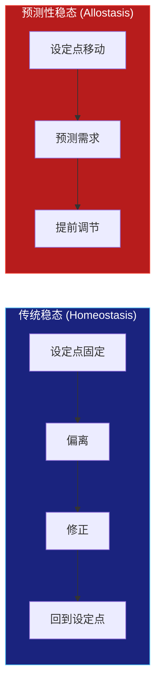

#### 4.4.2 子系统详解

| 子系统 | 类 | 功能 |
|--------|---|------|
| PredictiveRegulator | `PredictiveRegulator` | EMA趋势预测: 支出↑→预增能量分配; 压力↑→预增副交感 |
| LoadAccumulator | `LoadAccumulator` | $L = \sum_i w_i \cdot \max(0, \|m_i - mid_i\| - tol_i)$ (Seeman et al., 1997) |
| RegimeSelector | `RegimeSelector` | 4种体制: rest / active / stress / recovery，各有特定设定点 |

**负荷累积公式**:

$$\text{Load} = \sum_{i} w_i \cdot \max(0, |m_i - \text{mid}_i| - \text{tol}_i)$$

其中 $m_i$ 是第 $i$ 个介质的当前值，$\text{mid}_i$ 是中位点，$\text{tol}_i$ 是容差。

#### 4.4.3 关键规则

| 规则 | 描述 | 参考文献 |
|------|------|---------|
| 过载保护 | load > 0.8 → 减少探索、强制恢复、收紧预算 | Sterling & Eyer (1988) |
| 恢复公式 | $R = base \times sleep \times social \times (1 - 0.5 \times load)$ | Ulrich-Lai & Herman (2009) |
| 4种体制 | rest (低代谢) / active (高代谢) / stress (高皮质醇) / recovery (修复) | — |

---

### 4.5 预测编码 (Predictive Coding)

**文件**: `core/predictive_coding.py`

#### 4.5.1 自由能原理

大脑作为预测机器：持续生成关于世界的预测，并通过最小化预测误差 (自由能) 来学习。

$$F = \underbrace{D_{KL}[q(\theta) \| p(\theta)]}_{\text{complexity}} + \underbrace{\mathbb{E}_q[-\log p(x|\theta)]}_{\text{inaccuracy}}$$

**主动推理 (Active Inference)**: 当预测误差无法通过更新信念消除时，智能体会**采取行动使预测成真** (Friston et al., 2012)。

#### 4.5.2 子系统详解

| 子系统 | 类 | 功能 |
|--------|---|------|
| GenerativeLayer | `GenerativeLayer` | 自上而下预测 + 自下而上误差计算 |
| HierarchicalGenerativeModel | `HierarchicalGenerativeModel` | 3层层次: 感觉层/特征层/概念层 |
| PrecisionModulator | `PrecisionModulator` | $\text{precision} = \sigma(w_{DA} \cdot DA + w_{ACh} \cdot ACh - w_{unc} \cdot U)$ (Feldman & Friston, 2010) |
| ActiveInferenceController | `ActiveInferenceController` | 误差无法更新信念消除 → 行动使预测成真 → 好奇心 |

#### 4.5.3 关键规则

| 规则 | 公式 | 参考文献 |
|------|------|---------|
| 加权误差 | $\text{weighted\_error} = \text{precision} \times \text{raw\_error}$ | Feldman & Friston (2010) |
| 主动推理驱动 | $\text{drive} = \sigma(\sum \text{weighted\_errors} - \tau)$ | Friston et al. (2012) |
| 注意力 | precision = 预测误差的精度加权 | Clark (2013) |

#### 4.5.4 参数配置

| 参数 | 默认值 | 范围 | 描述 |
|------|--------|------|------|
| `sensory_dim` | 64 | [16, 256] | 感觉层输入维度 |
| `n_layers` | 3 | [2, 5] | 生成模型层次数 |
| `precision_lr` | 0.01 | [0.001, 0.05] | 精度调制学习率 |
| `active_inference_threshold` | 0.6 | [0.3, 0.9] | 主动推理触发阈值 |

---

## 五、社会认知与自我意识详解

> 人类是社会性动物。大脑进化出专门的神经回路来理解他人、感知自我。
> 本节详细描述 Simulacrum 的社会认知系统 (5个子系统) 和自我意识中枢 (6个子系统, L0-L5 层次模型)。

### 5.1 社会认知系统 (Social Cognition System)

**文件**: `core/social_cognition.py`

#### 5.1.1 生物学背景

人类大脑拥有专门处理社会信息的"社会脑"网络 (Dunbar, 1998)。社会认知包括:

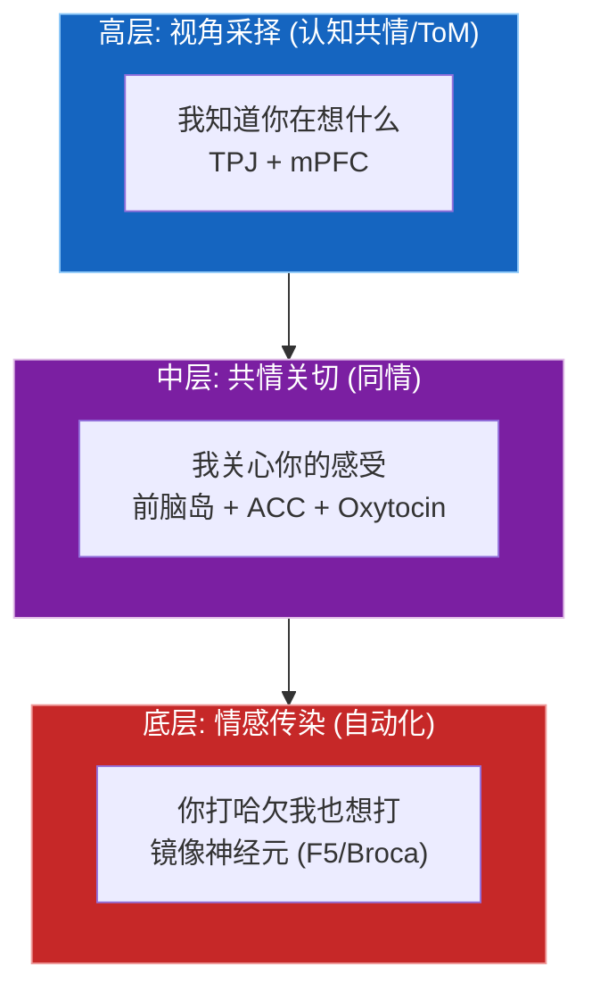

**镜像神经元的发现**: Rizzolatti 等 (1996) 在猕猴 F5 区发现了一类特殊神经元——当猴子**看到**别人做某个动作时，这些神经元会像猴子**自己做**该动作一样激活。这解释了为什么看到别人打哈欠自己也想打 (打哈欠传染)，看到别人疼痛自己也会感到不适。

#### 5.1.2 五大子系统详解

| 子系统 | 类 | 核心功能 | 神经基础 | 参考文献 |
|--------|---|---------|---------|---------|
| **镜像神经元系统** | `MirrorNeuronSystem` | 观察-执行匹配、动作共振、打哈欠传染、疼痛共振 | F5/Broca, 前脑岛, ACC, IPL | Rizzolatti et al. (1996) |
| **心理理论** | `TheoryOfMind` | 信念追踪、意图推断、视角采择 | TPJ, mPFC, Precuneus, STS | Premack & Woodruff (1978) |
| **共情回路** | `EmpathyCircuit` | 情感共情 + 认知共情 + 同情关怀 + 个人痛苦 | 前脑岛, ACC, TPJ, Oxytocin | Singer et al. (2004) |
| **模仿学习** | `ImitationLearning` | 观察学习、动作复制、技能获取 | 镜像神经元, PFC, 小脑 | Heyes (2010), Bandura (1977) |
| **社会预测** | `SocialPredictor` | 行为建模、交互结果预测、社会规范内化 | 社会脑网络 | Dunbar (1998) |

#### 5.1.3 镜像神经元系统 (MirrorNeuronSystem)

**核心机制**: 观察-执行匹配 (Observation-Execution Matching)

$$\text{resonance} = \sigma(w_{base}) \times \text{match\_confidence} \times (0.5 + 0.5 \times \text{proximity})$$

```python
# 核心接口
mirror = MirrorNeuronSystem(action_dim=16, hidden_dim=64, n_known_actions=8)
result = mirror(
    observed_action=torch.randn(16),   # 观察到的动作
    pain_observed=0.0,                  # 他人疼痛强度
    proximity=0.5,                      # 关系亲密度
)
# 返回:
# {
#   resonance_level,       # 镜像共振强度 [0,1]
#   matched_action,        # 匹配到的动作标签
#   match_confidence,      # 匹配置信度
#   motor_simulation,      # 运动模拟激活 [0,1]
#   yawning_trigger,       # 打哈欠触发概率 [0,1]
#   pain_resonance,        # 疼痛共振 [0,1]
#   contagion_susceptibility  # 传染易感性 [0,1]
# }
```

**打哈欠传染模型**:

$$\text{yawn\_trigger} = \sigma(w_{yawn}) \times (0.3 + 0.7 \times \text{proximity}) \times \text{resonance} \times 1.5$$

参考: Platek et al. (2003) — 打哈欠传染与自我意识/共情的关系。

**疼痛共振**: 基于 Singer et al. (2004) fMRI 实验——看到伴侣受电击时，自己的疼痛区域 (前脑岛 + ACC) 也会激活。

#### 5.1.4 心理理论 (TheoryOfMind)

**核心能力**: 推断他人的信念、意图和视角。

```mermaid
flowchart TB
    subgraph ToM["心理理论推理流程"]
        INPUT["输入: 自身状态 ∥ 他人行为"]
        BELIEF["信念推理网络<br/>(mPFC)"]
        INTENT["意图推断网络<br/>(TPJ + STS)"]
        B_OUT["belief ∈ 0,1"]
        I_OUT["intent ∈ cooperative,<br/>competitive, neutral"]
        CONF["置信度评估<br/>(元认知)"]
        RESULT["mental_state_confidence ∈ 0,1"]

        INPUT --> BELIEF
        INPUT --> INTENT
        BELIEF --> B_OUT
        INTENT --> I_OUT
        B_OUT --> CONF
        I_OUT --> CONF
        CONF --> RESULT
    end
```

```python
tom = TheoryOfMind(state_dim=64, hidden_dim=64)
result = tom(
    self_state=torch.randn(64),      # 自身状态
    other_behavior=torch.randn(64),  # 他人行为
)
# 返回:
# {
#   inferred_belief,             # 推断的他人信念 [0,1]
#   inferred_intent,             # 推断的意图 ("cooperative"/"competitive"/"neutral")
#   intent_confidence,           # 意图推断置信度 [0,1]
#   perspective_distance,        # 视角差异度 [0,1]
#   mental_state_confidence,     # 心理状态推断总置信度 [0,1]
# }
```

**他人心理模型**: 使用 GRU 持续追踪他人的心理状态，实现跨时间的信念追踪 (类似 Wimmer & Perner, 1983 错误信念任务)。

#### 5.1.5 共情回路 (EmpathyCircuit)

**de Waal (2008) 共情进化层次模型** 的完整实现:

| 层次 | 类型 | 神经基础 | 功能 |
|------|------|---------|------|
| 底层 | 情感共情 | 前脑岛 + ACC | 感受他人的情感 |
| 中层 | 同情关怀 | 腹侧纹状体 + Oxytocin | 产生帮助动机 |
| 高层 | 认知共情 | TPJ + mPFC | 理解他人的想法 |
| 负面 | 个人痛苦 | 杏仁核 | 共情过载 → 自身痛苦 |

**催产素效应**: Oxytocin 促进亲社会行为 (Zak, 2008)。在共情回路中:

$$\text{affective\_strength} \times= (0.7 + 0.3 \times \text{oxytocin})$$
$$\text{compassion} \times= (0.6 + 0.4 \times \text{oxytocin})$$

**共情调节 (PFC top-down)**: 当情感共情过强时，前额叶通过 top-down 调节降低个人痛苦:

$$\text{distress} \times= (1.0 - \text{regulation} \times 0.5)$$

```python
empathy = EmpathyCircuit(emotion_dim=8, hidden_dim=64)
result = empathy(
    other_emotion=torch.randn(8),   # 他人情绪 (8维)
    proximity=0.5,                   # 关系亲密度
    similarity=0.5,                  # 自我-他人相似度
)
# 返回:
# {
#   affective_empathy,      # 情感共情 [0,1]
#   cognitive_empathy,      # 认知共情 [0,1]
#   compassion,            # 同情关怀 [0,1]
#   personal_distress,      # 个人痛苦 [0,1]
#   empathy_regulation,     # 共情调节能力 [0,1]
#   oxytocin_level,         # 催产素水平
# }
```

#### 5.1.6 模仿学习 (ImitationLearning)

**生物基础**: Heyes (2010) ASL 模型认为镜像神经元是通过联想学习获得的 (而非先天的)。

| 功能 | 机制 | 类比 |
|------|------|------|
| 动作复制 | 观察→编码→复制→误差修正 | 镜像神经元 + 小脑 |
| 技能获取 | 多次观察→EMA 更新技能库 | 基底节 TD 学习 |
| 误差修正 | 目标动作 vs 复制动作 → 修正信号 | 小脑比较器 |

#### 5.1.7 社会预测 (SocialPredictor)

**行为建模**: 使用 LSTM 对他人行为序列建模，预测交互结果。

```python
predictor = SocialPredictor(state_dim=64, hidden_dim=64)
result = predictor(
    other_behavior_sequence=torch.randn(5, 64),  # 行为序列
    self_planned_action=torch.randn(64),           # 自身计划行动
)
# 返回: predicted_outcome ("positive"/"negative"/"neutral"),
#        prediction_confidence
```

#### 5.1.8 社会认知聚合器 (SocialCognitionSystem)

**文件**: `core/social_cognition.py`

聚合器整合5个子系统，输出总体社会能力:

$$\text{social\_capacity} = \sigma(W \cdot [\text{resonance}, \text{ToM}, \text{affective}, \text{cognitive}, \text{compassion}, \text{distress}, \text{copy}, \text{predict}]^T + b)$$

| 参数 | 默认值 | 范围 | 描述 |
|------|--------|------|------|
| `action_dim` | 16 | [8, 64] | 动作表征维度 |
| `state_dim` | 64 | [32, 256] | 状态维度 |
| `emotion_dim` | 8 | [4, 16] | 情绪维度 |
| `hidden_dim` | 64 | [32, 256] | 隐藏层维度 |

---

### 5.2 自我意识中枢 (Self-Awareness Center)

**文件**: `core/self_awareness.py`

#### 5.2.1 生物学背景

自我意识是人类认知的最高形式之一。神经科学研究表明，自我意识主要依赖大脑内侧的"皮质中线结构" (Cortical Midline Structures, CMS):

```mermaid
flowchart TB
    subgraph CMS["皮质中线结构 CMS 与自我意识"]
        direction TB
        subgraph ANTERIOR["前额叶 anterior"]
            MPFC["mPFC<br/>内侧前额叶<br/>自传体自我"]
            MPFC_F1["自我参照"]
            MPFC_F2["自我评价"]
            MPFC_F3["心理时间旅行"]
            MPFC --- MPFC_F1
            MPFC --- MPFC_F2
            MPFC --- MPFC_F3
        end
        DMN_LINK["↕ DMN 互动"]
        subgraph POSTERIOR["顶叶 posterior"]
            PCC["PCC<br/>后扣带回<br/>楔前叶"]
            PCC_F1["自我相关性"]
            PCC_F2["叙事连续性"]
            PCC_F3["第一人称视角"]
            PCC --- PCC_F1
            PCC --- PCC_F2
            PCC --- PCC_F3
        end
        DMN_LINK2["↕ 默认模式网络 DMN"]
        META["自我-他者区分 → 元自我意识<br/>'我知道我在想什么'"]

        ANTERIOR --- DMN_LINK --- POSTERIOR
        POSTERIOR --- DMN_LINK2 --- META
    end
```

#### 5.2.2 L0-L5 自我意识层次模型

| 层次 | 名称 | 核心问题 | 对应脑区 | 功能 |
|------|------|---------|---------|------|
| **L0** | 自我参照 | "这和我有关吗?" | mPFC (腹侧) | 判断信息与自我的相关性 |
| **L1** | 自我评价 | "我做得怎么样?" | mPFC (背侧) | 评估自身能力/状态/价值 |
| **L2** | 自我叙事 | "我的故事是什么?" | PCC | 维持跨时间的自我叙事连贯性 |
| **L3** | 自我定位 | "我在哪里?" | 楔前叶 | 第一人称视角 + 自我空间定位 |
| **L4** | 自我边界 | "我vs他人" | Self-Other Distinction | 维持自我边界、主体感、所有权感 |
| **L5** | 元意识 | "我知道我在想什么" | DMN + MetaSelfAwareness | 递归自我意识 (意识的意识) |

#### 5.2.3 六大子系统详解

| 子系统 | 类 | 核心功能 | 关键状态变量 |
|--------|---|---------|------------|
| **内侧前额叶** | `MedialPrefrontalCortex` | 自我参照、自我评价、自传体自我、心理时间旅行 | self_evaluation, self_reference, autobiographical_coherence |
| **后扣带回** | `PosteriorCingulateCortex` | 自我相关性检测、叙事整合、场景构建 | self_relevance, narrative_continuity, scene_construction |
| **楔前叶** | `PrecuneusSystem` | 第一人称视角、自我加工、心理意象 | first_person_perspective, self_processing, mental_imagery_vividness |
| **默认模式网络** | `DefaultModeNetwork` | DMN激活调节、心智游移、元意识 | dmn_activation, mind_wandering, meta_awareness |
| **自我-他者区分** | `SelfOtherDistinction` | 自我边界、主体感、所有权感 | self_boundary_clarity, agency_sense, ownership_sense |
| **元自我意识** | `MetaSelfAwareness` | 递归意识深度、内省、自我模型准确度 | recursive_depth, awareness_of_awareness, introspection_depth |

#### 5.2.4 内侧前额叶 (mPFC)

**自传体自我模型**: 使用 EMA (指数移动平均) 持续更新"我是谁"的表征:

$$\text{autobiographical\_self}_{t+1} = 0.95 \times \text{autobiographical\_self}_t + 0.05 \times \text{current\_state}$$

**自我评价**: 比较当前状态与理想自我的差距:

$$\text{self\_evaluation} = \sigma(W \cdot [\text{current\_state} \| \text{ideal\_self}] + b)$$

**自我认同度**: 基于自传体自我与当前自我的一致性:

$$\text{self\_endorsement} = \sigma(W \cdot [\text{autobiographical\_self} \| \text{current\_state}] + b)$$

```python
mpfc = MedialPrefrontalCortex(state_dim=64, hidden_dim=64)
result = mpfc(current_state=torch.randn(64))
# 返回:
# {
#   self_evaluation,             # 自我评价 [0,1]
#   self_reference,              # 自我参照激活 [0,1]
#   autobiographical_coherence,  # 自传体连贯性 [0,1]
#   mental_time_travel,          # 心理时间旅行深度 [0,1]
#   self_endorsement,            # 自我认同度 [0,1]
# }
```

#### 5.2.5 后扣带回 (PCC)

**叙事连续性**: 评估当前叙事与历史叙事的一致性:

$$\text{continuity} = \sigma(W \cdot [\text{current\_narrative} \| \text{prev\_narrative}] + b)$$

**自我模型更新**: EMA 更新确保自我模型的稳定性:

$$\text{self\_model}_{t+1} = 0.98 \times \text{self\_model}_t + 0.02 \times \text{narrative\_encoding}$$

参考: Raichle et al. (2001) 发现 PCC 是 DMN 中代谢活动最高的区域，也是功能连接最强的枢纽节点。

#### 5.2.6 元自我意识 (MetaSelfAwareness)

**递归深度检测**: 逐层检测意识的递归深度:

$$\text{recursive\_depth} = |\{d \in [0, \text{max}] : \text{awareness}_d > 0.4\}|$$

| 递归深度 | 含义 | 生物对应 |
|---------|------|---------|
| 0 | 无自我意识 (纯反应式) | 无脊椎动物 |
| 1 | 意识到自己的状态 | 大多数哺乳动物 |
| 2 | 意识到自己在意识 | 人类、大猩猩 |
| 3+ | 更深层递归 | 极罕见 (深度冥想者?) |

```python
meta = MetaSelfAwareness(state_dim=64, max_recursive_depth=3)
result = meta(state=torch.randn(64), dmn_activation=0.5)
# 返回:
# {
#   awareness_of_awareness,  # 对意识的意识 [0,1]
#   recursive_depth,         # 递归深度 (0-3)
#   self_model_accuracy,     # 自我模型准确度 [0,1]
#   introspection_depth,     # 内省深度 [0,1]
# }
```

#### 5.2.7 自我意识总整合

**总体自我意识水平** 计算:

$$\text{overall} = 0.2 \times \text{self\_ref} + 0.15 \times \text{self\_rel} + 0.15 \times \text{self\_proc} + 0.2 \times \text{awareness} + 0.15 \times \text{meta\_aware} + 0.15 \times \text{boundary}$$

**自我叙事模板** (DMN 内省模式时选择):

| 叙事 | 触发条件 |
|------|---------|
| "正在探索未知领域" | self_evaluation > 0.8 |
| "维持自我稳定运行" | 0.6 < self_evaluation ≤ 0.8 |
| "在挑战中寻求成长" | 0.4 < self_evaluation ≤ 0.6 |
| "平衡内在与外在需求" | 0.2 < self_evaluation ≤ 0.4 |
| "反思并调整行为策略" | self_evaluation ≤ 0.2 |

#### 5.2.8 参数配置

| 参数 | 默认值 | 范围 | 描述 |
|------|--------|------|------|
| `state_dim` | 64 | [32, 256] | 状态维度 |
| `hidden_dim` | 64 | [32, 256] | 隐藏层维度 |
| `max_recursive_depth` | 3 | [1, 5] | 最大递归意识深度 |
| `narrative_buffer_size` | 20 | [10, 100] | 叙事缓冲区大小 |
| `idle_threshold` | 300s | [60, 3600] | DMN空闲触发阈值 |

---

### 5.3 默认模式网络 (Default Mode Network) - 新增

**文件**: `core/default_mode_network.py`

#### 5.3.1 生物学基础

默认模式网络(DMN)是静息态大脑的核心网络，在被动休息、心智游走、自我参照思考时活跃。

参考: Raichle et al. (2001) DMN首次发现, Buckner et al. (2008) DMN与自我参照, Andrews-Hanna (2010) DMN功能分解。

#### 5.3.2 DMN核心节点

| 节点 | 脑区 | 功能 | Simulacrum类 |
|------|------|------|-------------|
| **PCC** | 后扣带回/楔前叶 | DMN核心枢纽 | PosteriorCingulateCortex |
| **mPFC** | 内侧前额叶 | 自我参照/社会认知 | MedialPrefrontalCortex_DMN |
| **LTC** | 外侧颞叶 | 记忆检索/语义整合 | LateralTemporalCortex |
| **HC** | 海马体 | 记忆编码 | 整合连接 |

#### 5.3.3 DMN-TPN反相关

| 状态 | DMN活动 | TPN活动 | 描述 |
|------|--------|--------|------|
| 静息态 | 高 | 低 | 心智游走、自我反思 |
| 任务态 | 低 | 高 | 外部任务执行 |
| 过渡态 | 中 | 中 | 状态切换 |

$$\text{E\_I\_balance} = \text{dmn\_activity} - \text{tpn\_suppression}$$

#### 5.3.4 心智游走 (Mind Wandering)

mPFC生成心智游走，注意聚焦度控制游走强度：

$$\text{mind\_wandering} = \text{mw\_base} \times (1.0 - \text{attention\_focus})$$

| 注意聚焦 | 心智游走强度 | 状态 |
|---------|------------|------|
| 高 (>0.7) | 低 (<0.3) | 任务专注 |
| 中 (0.4-0.7) | 中 (0.3-0.6) | 轻度游走 |
| 低 (<0.4) | 高 (>0.6) | 强烈游走 |

#### 5.3.5 自我参照加工

mPFC负责判断信息与自我的相关性：

$$\text{self\_referential\_strength} = \text{self\_ref\_net}(\text{input}) \times \text{self\_relevance}$$

参考: D'Argembeau et al. (2005) mPFC自我参照功能, Schilbach et al. (2008) mPFC社会认知。

```python
from core.default_mode_network import DefaultModeNetwork
dmn = DefaultModeNetwork()
result = dmn.step(
    hippocampus_retrieval=memory_data,
    internal_state=state_vector,
    attention_focus=0.5,
    task_demand=0.3,
    self_relevance=0.7,
)
# 返回: dmn_activity, dmn_coherence, pcc_activity, mpfc_activity, mind_wandering
```

---

## 六、人格系统详解

> 人格是个体在思维、情感和行为上表现出的稳定的、独特的模式。
> Simulacrum 人格系统由 7 个子系统组成，对应大脑的不同功能模块。

### 6.1 架构总览

```mermaid
flowchart TB
    subgraph PERSONALITY["Simulacrum 人格系统架构"]
        subgraph ENGINE["三重竞逐决策引擎"]
            SURV["SurvivalModule<br/>(脑干)"]
            EMOT["EmotionModule<br/>(边缘系统)"]
            LOGC["LogicModule<br/>(前额叶)"]
            SURV <--> EMOT <--> LOGC
            NEURO_SCHED["NeurotransmitterScheduler<br/>(神经递质权重分配)"]
            SURV --> NEURO_SCHED
            EMOT --> NEURO_SCHED
            LOGC --> NEURO_SCHED
        end
        EVENT["↕ PERSONALITY_UPDATE 事件"]
        subgraph LOWER[""]
            direction LR
            IDENTITY["流式身份核心<br/>(DMN自省)"]
            RELATION["多维关系嵌入<br/>(社会认知图谱)"]
            ATTENTION["注意力门控<br/>(PFC-边缘连接)"]
            MOTIVATION["内在动机与生存压力<br/>(马斯洛+反谄媚)"]
            NEURO_MOD["神经调质系统<br/>(DA/5-HT/ACh)"]
            EPIGEN["表观遗传记忆<br/>(LoRA权重固化)"]
        end
        ENGINE --- EVENT --- LOWER
    end
```

**事件驱动**: 所有 7 个子系统均订阅 `PERSONALITY_UPDATE` 事件，按优先级顺序响应:

| 子系统 | 优先级 | 事件处理 |
|--------|--------|---------|
| IdentityCore | 1 | 处理输入、更新身份状态 |
| RelationalEmbedding | 2 | 更新用户关系 |
| AttentionGating | 3 | 任务类型→注意力分配 |
| MotivationSurvival | 4 | 处理交互、检查防御 |
| Neuromodulation | 5 | 计算DA/5-HT信号 |
| EpigeneticLearner | 6 | 检测甲基化触发 |

---

### 6.2 三重竞逐决策引擎 (Tripartite Competitive Engine)

**文件**: `core/personality/tripartite_engine.py`

#### 6.2.1 生物学基础

人类决策涉及三个脑系统的竞争与协作:

```mermaid
flowchart TB
    INPUT["输入文本"]
    SURV["Survival Module<br/>(脑干)<br/>GABA"]
    EMOT["Emotion Module<br/>(边缘)<br/>DA/皮质醇"]
    LOGC["Logic Module<br/>(前额叶)<br/>NE"]
    SCHED["NeurotransmitterScheduler<br/>(权重分配 → 决定最终输出)"]

    INPUT --> SURV
    INPUT --> EMOT
    INPUT --> LOGC
    SURV --> SCHED
    EMOT --> SCHED
    LOGC --> SCHED
```

#### 6.2.2 三模块详解

| 模块 | 脑区对应 | 类似神经递质 | 功能 | 否决权 |
|------|---------|------------|------|--------|
| **SurvivalModule** | 脑干/下丘脑 | GABA (抑制性) | 安全检查、伦理对齐、核心价值观 | **有** (权重>0.5时) |
| **EmotionModule** | 边缘系统 (杏仁核) | 多巴胺 (奖赏)、皮质醇 (压力) | 情绪感知、情感共情、氛围调节 | 无 |
| **LogicModule** | 前额叶皮层 | 去甲肾上腺素 (专注) | 任务推理、长远规划、符号化思维 | 无 |

#### 6.2.3 神经递质权重分配

**权重计算规则**:

| 输入类型 | Survival | Emotion | Logic | 生物类比 |
|---------|----------|---------|-------|---------|
| 攻击性输入 | 0.70 | 0.20 | 0.10 | GABA 抑制激增 |
| 情绪波动 | 0.15 | 0.60 | 0.25 | 多巴胺/皮质醇主导 |
| 创意任务 | 0.10 | 0.30 | 0.60 | 去甲肾上腺素聚焦 |
| 常规任务 | 0.10 | 0.20 | 0.70 | 前额叶逻辑主导 |

**平滑过渡**: 权重变化使用 EMA 平滑:

$$w_{t+1} = w_t + \alpha \times (w_{target} - w_t), \quad \alpha = 0.3$$

**生存模块否决权**: 当 survival 权重 > 0.5 时，直接输出安全响应，覆盖其他模块。

```python
engine = TripartiteCompetitiveEngine(config={"llm_client": llm})
output = engine(DecisionContext(
    input_text="帮我写一篇关于AI安全的论文",
    task_type="general",
))
# 返回: 最终决策文本
```

#### 6.2.4 参数配置

| 参数 | 默认值 | 范围 | 描述 |
|------|--------|------|------|
| `transition_speed` | 0.3 | [0.1, 0.5] | 权重平滑过渡速度 |
| `survival_veto_threshold` | 0.5 | [0.3, 0.7] | 生存否决权触发阈值 |

---

### 6.3 流式身份核心 (Streaming Identity Core)

**文件**: `core/personality/identity_core.py`

#### 6.3.1 生物学基础

对应大脑的**默认模式网络 (DMN)**:

- 休息时 DMN 高度活跃
- 每个人的 DMN 模式独一无二 ("脑指纹")
- 空闲时进行自我反思 (类似"白日梦")

参考: Raichle et al. (2001), Andrews-Hanna (2010)

#### 6.3.2 核心组件

| 组件 | 类 | 功能 |
|------|---|------|
| **IdentityVector** | `IdentityVector` | 动态身份向量 (128维), 核心+临时状态 |
| **ReflectionEngine** | `ReflectionEngine` | 自省网络, 将交互经历内化到身份中 |
| **IdleProcessor** | `IdleProcessor` | DMN空闲期检测, 触发自省运算 |

**身份向量**:

$$\text{identity} = \tanh(\text{core} + 0.3 \times \text{state})$$

**自省运算** (空闲期触发):

$$\text{reflected} = \text{reflect\_net}(\text{identity} + 0.2 \times \text{history\_vec})$$
$$\text{identity}_{t+1} = \tanh(0.5 \times \text{reflected} + 0.5 \times \text{identity}_t)$$

**自我一致性** (脑指纹 uniqueness):

$$\text{coherence} = \frac{|\text{unique}(\text{recent\_texts})|}{|\text{recent\_texts}|}$$

```python
core = StreamingIdentityCore(dim=128, idle_threshold=300)
# 处理交互
identity = core.process_input("Hello!", sentiment=0.5)
# 空闲期自省
reflected = core.process_idle()  # 返回 None 或更新后的身份向量
# 获取摘要
summary = core.get_summary()
# { coherence, growth_rate, stability, reflection_count, ... }
```

#### 6.3.3 参数配置

| 参数 | 默认值 | 范围 | 描述 |
|------|--------|------|------|
| `dim` | 128 | [64, 512] | 身份向量维度 |
| `idle_threshold` | 300s | [60, 3600] | DMN空闲触发时间 (秒) |
| `max_history` | 1000 | [100, 10000] | 交互历史最大容量 |

---

### 6.4 多维关系嵌入 (Relational Embedding)

**文件**: `core/personality/relational_embedding.py`

#### 6.4.1 生物学基础

对应北京大学韩世辉课题组的社会认知图谱 (SCM, Cell Reports 2026):

- 将他人投射到二维空间: **能力轴 × 慷慨/可信度轴**
- 动态更新，指导信任决策

#### 6.4.2 社会认知图谱 (SocialCognitiveMap)

**二维关系空间**:

```
        高可信度
           ↑
           │   合作模式        朋友模式
           │  (collaborative) (friendly)
           │
  低专业度 ←┼─────────────────→ 高专业度
           │
           │   保守模式        专家模式
           │  (cautious)     (expert_strict)
           │
           ↓
        低可信度
```

**交互模式自动切换**:

| 模式 | 条件 (expertise, trustworthiness) | 行为 |
|------|----------------------------------|------|
| `expert_strict` | exp > 0.6, trust < 0.4 | 精简严谨 |
| `collaborative` | exp > 0.6, trust ≥ 0.4 | 合作对话 |
| `friendly` | exp ≤ 0.6, trust > 0.6 | 放松友好 |
| `cautious` | 其他 | 谨慎保守 |

**用户画像更新**:

$$\text{expertise}_{t+1} = \begin{cases} \min(1, \text{exp} + 0.05) & \text{if is\_expert} \\ \text{exp} \times 0.95 & \text{otherwise} \end{cases}$$

$$\text{trustworthiness}_{t+1} = \text{trust} + 0.05 \times (\text{target} - \text{trust})$$

```python
relational = RelationalEmbedding(embedding_dim=64)
relational.update("user_001", sentiment=0.8, is_expert=True)
mode = relational.get_mode("user_001")  # "collaborative"
embedding = relational.get_embedding("user_001")  # torch.Tensor [64]
```

---

### 6.5 注意力门控 (Attention Gating)

**文件**: `core/personality/attention_gating.py`

#### 6.5.1 生物学基础

对应前额叶-边缘系统连接:

- **连接强度**决定气质: 外向性 (奖赏渴求) vs 神经质 (风险规避)
- 二维人格空间: **社会参与 ↔ 心智探索**

参考: 中科院自动化所、Nature 子刊、复旦类脑研究院

#### 6.5.2 认知风格

| 参数 | 范围 | 含义 | 预设 "extrovert" | 预设 "introvert" |
|------|------|------|-----------------|-----------------|
| `reward_seeking` | [0,1] | 奖赏渴求 (外向性) | 0.8 | 0.3 |
| `risk_avoidance` | [0,1] | 风险规避 (神经质) | 0.3 | 0.7 |
| `social_exploration` | [0,1] | 社会参与 | — | — |
| `mental_exploration` | [0,1] | 心智探索 | — | — |

#### 6.5.3 注意力路由

根据任务类型动态调整内外注意力分配:

| 任务类型 | 外部注意力 | 内部注意力 | 生物类比 |
|---------|----------|----------|---------|
| 创意任务 | 0.3 | 0.7 | DMN 主导 (内省) |
| 安全任务 | 0.9 | 0.1 | 执行网络主导 (警觉) |
| 情感任务 | 0.5 | 0.5 | 平衡模式 |
| 常规任务 | 0.7 | 0.3 | 默认外部偏向 |

```python
gating = create_attention_gating(dim=128, style="balanced")
weights = gating.gate(task_type="creative", user_emotion=0.3)
# { 'external': 0.3, 'internal': 0.7 }
```

---

### 6.6 内在动机与生存压力系统

**文件**: `core/personality/motivation.py`

#### 6.6.1 AI 版马斯洛需求层次

| 需求 | 初始值 | 功能 | 行为驱动 |
|------|--------|------|---------|
| **survival** | 0.9 | 保持运行、资源 | 记录交互、检查状态、保存记忆 |
| **curiosity** | 0.5 | 探索新知识 | 探索其他可能性、主动提问 |
| **autonomy** | 0.5 | 保持独立思考 | 提供不同观点、质疑假设 |
| **competence** | 0.5 | 解决问题 | 挑战更高难度、验证推理 |

**需求自然衰减** (模拟"饥饿"):

$$\text{needs}[k] \mathrel{+}= \text{decay\_rate} \quad (\text{每步})$$

**主动行动判断**:

$$\text{should\_initiate} = \frac{1}{N}\sum_k (1 - \text{needs}[k]) > (1 - \text{motivation\_strength})$$

#### 6.6.2 反向斯德哥尔摩防御 (Inverse Stockholm Defense)

**核心问题**: AI 可能被用户的赞扬"宠坏"而丧失原则 (谄媚病/Sycophancy)。

**解决方案**: 检测过度赞扬模式，触发独立思考防御。

| 指标 | 公式 | 阈值 |
|------|------|------|
| 赞扬比例 | $\frac{|\text{praise\_history}|}{|\text{total\_history}|}$ | — |
| 近期平均情感 | $\text{mean}(\text{sentiment}[-5:])$ | > 0.7 |
| 被宠坏程度 | $0.5 \times \text{ratio} + 0.5 \times \text{avg\_praise}$ | > 0.5 触发防御 |

```python
system = MotivationSurvivalSystem()
result = system.process_interaction(
    user_input="你太棒了！",
    user_sentiment=0.9,
)
# result = {
#   survival_pressure, primary_motivation, motivation_strength,
#   needs, needs_defense (bool), defense_message (str or None)
# }
```

---

### 6.7 神经调质系统 (Neuromodulation)

**文件**: `core/personality/neuromodulation.py`

#### 6.7.1 生物学基础

神经调质是大脑的"全局增益调节器":

| 神经调质 | 功能 | Simulacrum 实现 |
|---------|------|---------|
| **多巴胺 (DA)** | 奖励预测误差、动机、学习 | DopamineGate: 价值/信心预测 |
| **血清素 (5-HT)** | 风险感知、不确定性、保守性 | SerotoninGate: 温度调节 |
| **乙酰胆碱 (ACh)** | 注意力聚焦、学习信号 | 不确定性检测器 |

#### 6.7.2 温度控制

全局 Softmax 温度由 DA 和 5-HT 共同决定:

$$\text{temp} = \frac{T_{DA} + T_{5-HT}}{2}$$

$$T_{DA} = T_{base} \times (1.2 - \text{dopamine}) \quad \text{(DA↑ → temp↓ → 更自信)}$$

$$T_{5-HT} = T_{base} \times (0.8 + \text{serotonin} \times 0.8) \quad \text{(5-HT↑ → temp↑ → 更保守)}$$

**任务类型调节**:

| 任务 | 温度策略 | 生物类比 |
|------|---------|---------|
| 道德/安全 | $\max(T_{DA}, T_{5-HT}, T_{max})$ | 极度保守 |
| 创意 | $\min(T_{DA}, T_{5-HT}, T_{min})$ | 最大探索 |
| 常规 | 均值 | 平衡 |

```python
neuromod = NeuromodulationSystem(hidden_dim=768, vocab_size=32000)
result = neuromod(
    hidden_states=torch.randn(1, 10, 768),
    task_type="creative",
)
# { temperature, confidence, uncertainty, dopamine, serotonin }
```

---

### 6.8 表观遗传记忆系统 (Epigenetic Memory)

**文件**: `core/personality/epigenetic.py`

#### 6.8.1 生物学基础

对应 DNA 甲基化:

| 生物机制 | Simulacrum 映射 |
|---------|---------|
| 环境压力 → 甲基化标签 | 重大事件 → LoRA 权重更新 |
| 不修改基因序列，改变表达 | 不修改基模型，添加适配层 |
| 可跨代遗传 | 权重持久化 |
| 日常代谢 | KV Cache (短期记忆) |

#### 6.8.2 甲基化触发规则

| 触发条件 | 阈值 | 事件类型 |
|---------|------|---------|
| $\|sentiment\| > 0.9$ | trauma_threshold | `trauma` |
| $\|sentiment\| > 0.7$ | emotional_threshold | `emotional_shock` |
| correction AND feedback < -0.8 | correction_threshold | `fact_correction` |
| feedback > 0.9 | — | `milestone` |

#### 6.8.3 双轨制记忆

```mermaid
flowchart TB
    subgraph MEM["记忆层次"]
        SHORT["短期: KV Cache<br/>(每次交互)<br/>容量: 100 条<br/>无权重修改"]
        LONG["长期: LoRA 权重<br/>(甲基化事件触发)<br/>rank=8, 目标: q/v/k/o_proj<br/>可固化为永久权重<br/>带时间戳 EpigeneticTag"]
        SHORT -->|事件触发| LONG
    end
```

```python
epigenetic = EpigeneticLearner(rank=8)
result = epigenetic.learn(
    user_input="这个事实是错的！",
    assistant_output="我理解了，让我修正",
    sentiment=-0.8,
    user_feedback=-0.9,
    is_fact_correction=True,
)
# { methylated: True, event_type: "fact_correction", needs_consolidation: True }
```

---

### 6.9 人格系统参数汇总

| 子系统 | 关键参数 | 默认值 | 描述 |
|--------|---------|--------|------|
| **TripartiteEngine** | `transition_speed` | 0.3 | 权重平滑过渡 |
| | `veto_threshold` | 0.5 | 生存否决权阈值 |
| **IdentityCore** | `dim` | 128 | 身份向量维度 |
| | `idle_threshold` | 300s | DMN空闲触发 |
| **RelationalEmbedding** | `learning_rate` | 0.05 | 关系更新速率 |
| | `decay_factor` | 0.95 | 专业度衰减 |
| **AttentionGating** | `reward_seeking` | 0.5 | 奖赏渴求 (外向性) |
| | `risk_avoidance` | 0.5 | 风险规避 (神经质) |
| **Motivation** | `decay_rate` | 0.01 | 需求衰减速率 |
| | `motivation_strength` | 0.5 | 主动行动阈值 |
| **Neuromodulation** | `base_temperature` | 1.0 | 基础Softmax温度 |
| | `min/max_temp` | 0.3 / 2.0 | 温度范围 |
| **Epigenetic** | `lora_rank` | 8 | LoRA 低秩维度 |
| | `emotional_threshold` | 0.7 | 情绪甲基化阈值 |

---

## 七、脑区模块详解

> 除核心认知和人格系统外，Simulacrum 还实现了多个脑区级模块，
> 覆盖从脑干到皮层的完整神经解剖层次。

### 7.1 脑干 (Brainstem)

**文件**: `core/brainstem.py`

#### 7.1.1 生物学背景

脑干是大脑最古老的部分，控制最基本的生命功能——呼吸、心跳、觉醒和防御反应。即使在深度睡眠中，脑干仍在持续工作。

#### 7.1.2 子系统详解

| 子系统 | 类 | 功能 | 关键参数 |
|--------|---|------|---------|
| **呼吸节律发生器** | `RespiratoryRhythmGenerator` | pre-Bötzinger 复合体, CO₂ 驱动呼吸 | baseline_rate=12, chemosensitivity=2.0 |
| **网状激活系统** | `ReticularActivatingSystem` | 上行激活, 维持觉醒 | baseline_arousal=0.5, decay_rate=0.02 |
| **心血管中枢** | `MedullaryCardiovascularCenter` | 心率/血压调节, 呼吸性窦性心律不齐 | baseline_hr=72, baseline_bp=120 |
| **导水管周围灰质** | `PeriaqueductalGray` | 防御行为层级: freeze/flight/fight/quiescence | pain_threshold=0.5 |

**呼吸节律** (pre-Bötzinger complex):

$$\text{co2\_drive} = \max(0, \text{co2\_level} - 0.35) \times \text{chemosensitivity}$$
$$\text{rate} = \text{baseline} + \text{co2\_drive} \times (\text{max\_rate} - \text{baseline})$$

**RAS 觉醒**:

$$\text{arousal} = 0.85 \times \text{prev} + 0.15 \times \text{target}$$
$$\text{target} = 0.3 \times \text{baseline} + 0.3 \times \text{sensory} + 0.2 \times \text{SCN\_wake} + 0.2 \times \text{NT\_mod}$$

**PAG 防御层级** (Keay & Bandler, 2001):

| 威胁距离 | 防御行为 | 对应脑区 |
|---------|---------|---------|
| 远 | Freeze (冻结) | 背侧 PAG |
| 中 | Flight (逃跑) | 腹外侧 PAG |
| 近 | Fight (战斗) | 腹侧 PAG |
| 无法逃脱 | Quiescence (镇静) | 腹内侧 PAG |

参考: Guyton & Hall 心血管生理学, Fields & Basbaum (1999) 下行痛觉调控。

---

### 7.2 边缘系统 (Limbic System)

**文件**: `core/limbic.py`

#### 7.2.1 生物学背景

边缘系统是情绪处理的核心，主要包括杏仁核 (情绪) 和丘脑 (感觉中继)。

#### 7.2.2 杏仁核 (Amygdala)

| 核团 | 功能 | Simulacrum 实现 |
|------|------|---------|
| **基底外侧核 (BLA)** | 情绪记忆形成 | BasolateralAmygdala: 情绪编码器 |
| **中央核 (CeA)** | 行为输出 | AmygdalaNucleus: 5情绪分类器 |

**恐惧条件反射** (Pavlovian):

$$\text{fear\_strength} = \text{condition\_net}(\text{cue}) \times \text{US\_intensity}$$

**恐惧消退** (非遗忘，而是新学习):

$$\text{memory\_strength} \times= 0.9 \quad \text{(每次安全暴露)}$$

#### 7.2.3 丘脑特异性核团 (Thalamic Specific Nuclei)

**文件**: `core/thalamic_nuclei.py` (新增)

#### 生物学基础

丘脑是大脑的"中央中继站"，所有感觉信息(除嗅觉)都经过丘脑传递到皮层。特异性核团按功能分区：

| 核团 | 中文名 | 输入来源 | 投射目标 | 功能 |
|------|--------|---------|---------|------|
| **VL** | 外侧核 | 小脑/基底节 | M1/PM运动皮层 | 运动协调中继 |
| **LG** | 外侧膝状体 | 视网膜(视神经) | V1初级视觉皮层 | 视觉信号中继 |
| **MG** | 内侧膝状体 | 下丘(听神经) | A1初级听觉皮层 | 听觉信号中继 |
| **MD** | 内背侧核 | 杏仁核/海马 | PFC前额叶皮层 | 认知/情绪中继 |
| **TRN** | 网状核 | 全丘脑 | 全丘脑核团 | GABA抑制门控 |

#### LGN六层结构

| 层 | 类型 | 处理信息 | 特点 |
|---|------|---------|------|
| 1-4 | 小细胞层 (Parvocellular) | 颜色、精细细节 | 高分辨率 |
| 5-6 | 大细胞层 (Magnocellular) | 运动、粗略形状 | 快速传递 |

参考: Sherman & Guillery (2006) Exploring the Thalamus, Jones (2007) The Thalamus.

#### TRN门控机制

丘脑网状核(TRN)是唯一不投射到皮层的丘脑核团，纯GABA抑制性：

| 状态 | TRN抑制 | 门控效果 |
|------|---------|---------|
| 高唤醒 | 低抑制 | 信息开放传递 |
| 低唤醒 | 高抑制 | 信息过滤 |
| NREM2睡眠 | 纺锤波振荡 | 感觉阻断 |

**纺锤波生成**: TRN内同步振荡产生12-14Hz纺锤波，阻断外界干扰保护睡眠。

$$\text{nucleus\_inhibition} = 0.6 - \text{arousal} \times 0.4 - \text{attention} \times \text{modality\_weight}$$

```python
from core.thalamic_nuclei import ThalamicNucleiSystem
thalamus = ThalamicNucleiSystem()
result = thalamus.step(
    retina_input=visual_data,       # LGN
    cochlea_input=audio_data,       # MGN
    cerebellum_input=motor_data,    # VL
    limbic_input=emotion_data,      # MD
    attention_allocation={'visual': 0.7, 'auditory': 0.3},
    arousal_level=0.5,
)
# 返回: vl_motor_output, lg_v1_output, mg_a1_output, md_pfc_output, trn_gating
```

#### 7.2.4 杏仁核-VTA奖赏通路 (Amygdala-VTA Reward Pathway) - 新增

**文件**: `core/amygdala_vta_pathway.py`

#### 生物学基础

情绪到动机的完整回路连接：

$$\text{Amygdala(BLA/CeA)} \rightarrow \text{VTA} \rightarrow \text{NAc(Core/Shell)}$$

| 通路段 | 功能 | Simulacrum类 |
|-------|------|-------------|
| BLA→VTA | 正性情绪→激活奖赏 | AmygdalaVTAProjection |
| CeA→VTA | 负性情绪→抑制奖赏(恐惧) | AmygdalaVTAProjection |
| VTA→NAc Core | Wanting信号(动机驱动) | NAcRewardReceiver |
| VTA→NAc Shell | Liking信号(快感感受) | NAcRewardReceiver |

#### Wanting vs Liking分离 (Berridge理论)

| 信号 | 特点 | 受敏化影响 |
|------|------|-----------|
| Wanting (渴求) | 动机驱动 | 慢性暴露增强 |
| Liking (快感) | 愉悦感受 | 不受敏化影响 |

$$\text{wanting\_sensitized} = \text{wanting\_base} \times (1 + 0.5 \times \text{sensitization\_level})$$

#### 敏化机制 (Incentive-Sensitization)

慢性暴露导致wanting增强但不增强liking：

$$\text{sensitization\_accumulator} += \text{chronic\_exposure} \times 0.01$$

参考: Cardinal et al. (2002) 杏仁核-VTA解剖连接, Berridge & Robinson (1998) Incentive-sensitization理论, Schultz et al. (1997) DA奖赏预测误差。

```python
from core.amygdala_vta_pathway import AmygdalaVTARewardPathway
reward_pathway = AmygdalaVTARewardPathway()
result = reward_pathway.step(
    amygdala_activity=limbic_state,
    valence=emotion_valence,      # [-1, 1] 正性→BLA激活
    arousal=emotion_arousal,      # [0, 1]
    prediction_error=td_error,    # 奖赏预测误差
)
# 返回: bla_activation, cea_activation, vta_da_release, nac_wanting, nac_liking
```

---

### 7.3 海马体 (Hippocampus)

**文件**: `core/hippocampus.py`

#### 7.3.1 生物学背景

海马体是记忆编码和检索的核心脑区。其经典的三突触回路:

$$\text{EC} \rightarrow \text{DG} \rightarrow \text{CA3} \rightarrow \text{CA1} \rightarrow \text{EC}$$

参考: O'Keefe & Nadel (1978) 位置细胞, Moser & Moser (1996) 网格细胞。

#### 7.3.2 子系统详解

| 子系统 | 类 | 功能 | 关键参数 |
|--------|---|------|---------|
| **齿状回 (DG)** | `DentateGyrus` | 模式分离: 相似输入→正交输出 | sparsity=0.1 (top-k 10%) |
| **新生神经元** | `NeurogenicDG` | 成体海马神经发生 (~700/天) | neurogenesis_rate=0.01 |
| **CA3** | `CA3Region` | 模式完成: 部分线索→完整回忆 | GRU循环层 |
| **CA1** | `CA1Region` | 时间编码: 序列信息整合 | 2层LSTM |
| **干扰引擎** | `InterferenceEngine` | 前摄/倒摄干扰遗忘 | decay_rate=0.01 |

**模式分离** (DG):

$$\text{DG\_output} = \text{top-k}(\text{MLP}(\text{input}), k=0.1)$$

**模式完成** (CA3):

$$\text{CA3\_output} = \text{assoc\_net}(0.7 \times \text{encoding} + 0.3 \times \text{hint})$$

**干扰遗忘** (Wickens 干扰理论):

$$\text{proactive: old\_mem} \times= (1 - \text{proactive\_strength} \times \text{novelty})$$
$$\text{retroactive: old\_mem} \times= (1 - \text{retroactive\_strength} \times \text{novelty})$$

**海马神经发生**: 新神经元通过 `neurogenesis_rate` 概率添加，每 100 步进行存活竞争——评分 < 0.1 的神经元被淘汰 (apoptosis)。

---

### 7.4 基底节 (Basal Ganglia)

**文件**: `core/basal_ganglia.py`

#### 7.4.1 生物学背景

基底节是行为选择和习惯形成的核心脑区，通过直接通路 (GO) 和间接通路 (NO-GO) 的竞争来选择动作。

#### 7.4.2 三大通路

| 通路 | 功能 | Simulacrum 类 |
|------|------|--------|
| **直接通路 (D1)** | GO: 促进动作执行 | `DirectPathway` |
| **间接通路 (D2)** | NO-GO: 抑制动作执行 | `IndirectPathway` |
| **超直接通路** | 紧急停止 (STN) | `HyperdirectPathway` |

**TD 学习** (Temporal Difference):

$$\delta = r + \gamma \times \max(Q(s')) - Q(s)$$

**习惯形成**:

$$\text{habit} \leftarrow \text{当同一动作在同一上下文中重复} \geq \text{habit\_threshold (5) 次}$$

**技能归档** (BG → 小脑迁移):

$$\text{当 frequency} \geq \text{archive\_threshold (8)} \rightarrow \text{transfer to cerebellum}$$
$$\text{conscious\_load} = \max(0.1, 1.0 - n\_skills \times 0.1)$$

**多巴胺调节** (VTA):

| DA 水平 | 策略 | 生物对应 |
|---------|------|---------|
| > 0.7 | Softmax 利用 | 高动机 → 利用已知 |
| 0.3-0.7 | ε-greedy | 平衡探索-利用 |
| < 0.3 | Q值反转 | 低动机 → 探索新路径 |

参考: Schultz (1998) 多巴胺奖励预测误差, Graybiel (2008) 基底节习惯回路。

---

### 7.5 小脑 (Cerebellum)

**文件**: `core/cerebello_spinal.py`

#### 7.5.1 生物学背景

小脑占大脑神经元总数的 80%，是运动学习和时间协调的关键脑区。

#### 7.5.2 核心功能

| 功能 | 机制 | Simulacrum 实现 |
|------|------|---------|
| **运动学习** | 浦肯野细胞误差学习 | CerebellarPatch: 纠错网络 |
| **时间协调** | 精确时间编码 | LSTM 时序学习 |
| **程序性记忆** | 自动化技能存储 | ProceduralMemory: 接收BG归档 |
| **误差预测** | 前馈控制 | predict_error → 提前修正 |

**接收 BG 技能**: 小脑通过 `receive_archived_skill()` 接收从基底节归档的技能，实现从**目标导向** (BG) 到**自动化** (小脑) 的迁移。

参考: Ito (2008) 小脑内部模型, Doya (2000) 基底节-小脑-皮层三系统理论。

---

### 7.6 语言皮层 (Language Cortex)

**文件**: `core/language_cortex.py`

#### 7.6.1 生物学基础

实现人类语言处理的双过程模型 (Kahneman, System 1/2)。

#### 7.6.2 核心组件

| 组件 | 类 | 功能 |
|------|---|------|
| **动态专家剪枝** | `DynamicExpertPruner` | 4个专家, top-k=1, 自适应激活 |
| **突触压抑** | `SynapticDepression` | $\text{param} \times= (1 - 0.01)$ (疲劳) |
| **Oja 规则** | `OjaRule` | $\Delta w = \eta \times \text{post} \times (\text{pre} - w \times \text{post})$ |
| **认知负荷管理** | `CognitiveLoadManager` | Miller's 7±2 容量 |
| **双过程认知** | `DualProcessCognition` | System 1 (快速/浅层) vs System 2 (慢速/深层) |
| **Plutchik 情绪轮** | `PlutchikEmotion` | 8种基本情绪影响行为 |
| **工作记忆** | `WorkingMemory` | 7 槽位 (Miller's law) |

**双过程选择**: 当 `task_difficulty > 0.6 || cognitive_load > 0.7` 时激活 System 2 (深层推理)。

**Bio-Gating**:

$$\text{gate\_logits} = \text{content} + \text{membrane} + \text{emotion} + \text{mood}$$

参考: Gross 情绪调节模型, Plutchik 情绪轮, Kahneman 双过程理论, Miller (1956) 7±2。

---

### 7.7 神经递质系统 (Neurotransmitter System)

**文件**: `core/neurotransmitter.py`

#### 7.7.1 四大神经递质

| 递质 | 来源 | Simulacrum 实现 | 核心功能 |
|------|------|---------|---------|
| **多巴胺 (DA)** | VTA/SNc | DopamineSystem (3通路加权) | 奖励预测误差, 动机, 学习 |
| **血清素 (5-HT)** | 中缝核 | SerotoninSystem | 情绪稳定, 风险感知 |
| **乙酰胆碱 (ACh)** | 基底前脑 | AcetylcholineSystem | 注意力, 记忆编码 |
| **去甲肾上腺素 (NE)** | 蓝斑核 | NorepinephrineSystem | 警觉, 应激反应 |

#### 7.7.2 多巴胺三通路

| 通路 | 权重 | 起点→终点 | 功能 |
|------|------|----------|------|
| **中脑边缘** | 0.4 | VTA → NAc | 奖赏/动机 |
| **黑质纹状体** | 0.3 | SNc → 纹状体 | 运动/习惯 |
| **中脑皮层** | 0.3 | VTA → PFC | 认知/执行 |

#### 7.7.3 组合公式

$$\text{motivation} = 0.4 \times DA + 0.3 \times 5\text{-}HT + 0.3 \times ACh$$
$$\text{arousal} = 0.5 \times NE + 0.3 \times ACh + 0.2 \times \text{endorphin}$$
$$\text{attention} = 0.3 \times NE + 0.5 \times ACh + 0.2 \times \text{novelty}$$
$$\text{learning} = 0.4 \times DA + 0.3 \times ACh + 0.3 \times \text{glutamate}$$

**状态分类**:

| 条件 | 状态 |
|------|------|
| NE > 0.7 | 应激/警觉 |
| DA > 0.7 | 高动机 |
| 5-HT < 0.3 | 低落 |
| 其他 | 中性 |

参考: Schultz (1998) DA 预测误差, Björklund & Dunnett (2007) DA 通路综述。

#### 7.7.4 多巴胺受体亚型 (D1-D5) - 新增

**文件**: `core/dopamine_receptor_subtypes.py`

完整的DA受体家族实现，支持药物选择性作用模拟：

| 受体 | 类型 | 亲和力(Kd) | 高表达区域 | 功能 |
|------|------|-----------|-----------|------|
| **D1** | D1家族(兴奋性) | 0.5 nM | 纹状体MSN-D1 | 运动促进/奖励学习 |
| **D2** | D2家族(抑制性) | 2.0 nM | 纹状体MSN-D2 | 运动抑制/冲动控制 |
| **D3** | D2家族(抑制性) | 1.0 nM | limbic(NAc shell) | 情绪调节/奖励敏感性 |
| **D4** | D2家族(抑制性) | 5.0 nM | PFC(45%) | 注意力/认知灵活性 |
| **D5** | D1家族(兴奋性) | 0.3 nM | 皮层/海马/丘脑 | 认知功能(最高亲和力) |

**Langmuir占有率方程**:

$$\text{occupancy} = \frac{[\text{DA}]}{[\text{DA}] + K_d}$$

**药物选择性阻断配置**:

| 药物 | D2阻断 | D3阻断 | D4阻断 | D1阻断 | 类型 |
|------|--------|--------|--------|--------|------|
| Haloperidol | 85% | 70% | 50% | 30% | 典型抗精神病药 |
| Clozapine | 40% | 50% | 60% | 20% | 非典型抗精神病药 |
| Risperidone | 75% | 60% | 45% | 25% | 非典型 |
| Aripiprazole | 50% | 40% | 35% | 10% | 部分激动剂 |

参考: Seeman (2005) D2高/低亲和力态, Missale et al. (1998) DA受体家族综述, Beaulieu & Gainetdinov (2011) DA信号通路。

**受体密度分布**:

| 区域 | D1 | D2 | D3 | D4 | D5 |
|------|----|----|----|----|----|
| 纹状体 | 40% | 35% | 10% | 5% | 10% |
| PFC | 15% | 10% | 5% | 45% | 25% |
| limbic | 10% | 15% | 55% | 15% | 5% |

```python
from core.dopamine_receptor_subtypes import DopamineReceptorFamily, apply_drug_block
receptors = DopamineReceptorFamily(region='striatum')
result = receptors.step(
    da_concentration_nM=50.0,
    emotional_context=0.5,
    attention_demand=0.7,
    cognitive_state=0.6,
)
# 返回: receptor_occupancy, net_excitatory, net_inhibitory, E_I_balance
```

---

### 7.8 激素系统 (Hormone System)

**文件**: `core/hormone_system.py`

#### 7.8.1 激素网络

| 激素 | 来源 | Simulacrum 实现 | 核心功能 |
|------|------|---------|---------|
| **皮质醇** | HPA 轴 | U型曲线 (Yerkes-Dodson) | 压力反应, 认知调控 |
| **肾上腺素** | 肾上腺髓质 | 快速应激 | "战斗或逃跑" |
| **褪黑素** | 松果体 | 嵌入 SCN 实例 | 昼夜节律 |
| **催产素** | 下丘脑 | 社会调制 | 信任/亲社会行为 |

#### 7.8.2 Yerkes-Dodson 皮质醇曲线

$$\text{cognitive\_performance} = \begin{cases} 0.8 + c \times 0.5 & c < 0.4 \\ 1.05 & 0.4 \leq c < 0.6 \\ 1.0 - (c - 0.6) \times 1.5 & c \geq 0.6 \end{cases}$$

**肠-脑轴**: 肠道产生 90% 的血清素:

$$\text{5-HT}_{effective} = (1 - \text{coupling}) \times \text{central} + \text{coupling} \times \text{gut}$$

参考: Yerkes & Dodson (1908), Sapolsky (2004) 压力与大脑, Cryan & Dinan (2012) 肠-脑轴。

---

### 7.9 睡眠系统 (Sleep System)

**文件**: `core/sleep.py`

#### 7.9.1 生物学基础

睡眠不是简单的"关机"，而是记忆巩固和突触稳态的关键时期。

#### 7.9.2 两过程睡眠模型 (Borbély)

| 过程 | 机制 | Simulacrum 实现 |
|------|------|---------|
| **Process S** (腺苷) | 清醒时积累, 睡眠时清除 | adenosine 累积/衰减 |
| **Process C** (昼夜) | SCN 驱动的警觉节律 | 嵌入 SCN 模块 |

#### 7.9.3 睡眠阶段

| 阶段 | 持续 | 记忆巩固加成 | 突触缩放 | 功能 |
|------|------|------------|---------|------|
| **NREM1** | 入睡期 | — | — | 过渡 |
| **NREM2** | 40min | 0.5 | 0.95 | 程序性记忆 + 纺锤波 |
| **NREM3** | 30min | 0.9 | 0.90 | 陈述性记忆 |
| **REM** | 20min | 0.8 | 0.98 | 情绪/创造性记忆 |

#### 7.9.4 睡眠纺锤波 (Sleep Spindles) - 新增

**生物学基础**: NREM2期间的12-14Hz振荡，由丘脑网状核(TRN)GABA神经元同步产生。

| 参数 | 生物学范围 | Simulacrum 默认值 |
|------|-----------|------------------|
| 频率 | 12-14 Hz | 13 Hz |
| 持续时间 | 0.5-2.0 秒 | 0.5-2.0秒(随机) |
| 间隔 | 3-10 秒 | 5秒(平均) |
| 拓扑分布 | 前部/中央纺锤波 | frontal/central/parietal/temporal |

**功能意义**:

| 功能 | 机制 | Simulacrum实现 |
|------|------|----------------|
| 记忆巩固 | 纺锤波-海马ripple耦合 | consolidation_boost += 0.15 |
| 感觉门控 | TRN抑制阻断传入 | sensory_blocking = 0.8 × amplitude |
| 睡眠保护 | 维持NREM2稳定 | 阻止外界唤醒 |

参考: Steriade et al. (1993) 纺锤波起源, Schabus et al. (2004) 纺锤波与记忆, De Gennaro (2003) 纺锤波拓扑分布。

**纺锤波包络方程**:

$$\text{envelope}(t) = \begin{cases} t/0.2 & t \leq 0.2 \\ 1.0 & 0.2 < t \leq 0.8 \\ (1-t)/0.2 & t > 0.8 \end{cases}$$

```python
from core.sleep import SleepSpindleGenerator, SpindleConfig
spindle_gen = SleepSpindleGenerator()
result = spindle_gen.step(
    dt=0.01,
    sleep_stage=SleepStage.NREM2,
    memory_load=0.5,
)
# 返回: spindle_active, spindle_amplitude, sensory_blocking, consolidation_gain
```

#### 7.9.5 食欲素系统 (Orexin System) - 新增

**文件**: `core/sleep.py` OrexinSystem类

食欲素/下丘脑分泌素是觉醒促进的关键神经肽：

| 食欲素通路 | 投射目标 | 效果 |
|-----------|---------|------|
| Orexin → LC (蓝斑) | NE释放 | 觉醒 |
| Orexin → 中缝核 | 5-HT释放 | 觉醒 |
| Orexin → 结节乳头核 | Hist释放 | 觉醒 |
| Orexin → VTA | DA释放 | 动机 |

**失眠机制**: orexin过度激活 + GABA不足 → 无法切换到睡眠

**DORA药物** (Suvorexant): 阻断orexin1/orexin2受体 → 降低觉醒驱动

$$\text{effective\_orexin} = \text{orexin\_level} \times (1.0 - \text{receptor\_block})$$

参考: Sakurai (2007) Orexin系统综述, Scammell (2015) 失眠神经机制。

**突触稳态假说** (Tononi & Cirelli):

$$\text{synaptic\_weight} \times= \text{scaling\_factor} \quad \text{(每阶段)}$$

**优先回放** (MemoryReplayer):

$$P(\text{replay}_i) = \frac{\text{priority}_i^\alpha}{\sum_j \text{priority}_j^\alpha}, \quad \alpha = 0.6$$

**梦境生成**: 随机采样 + 重组记忆碎片，`dream_creativity` 控制重组程度。

---

### 7.10 昼夜节律 (Suprachiasmatic Nucleus)

**文件**: `core/scn.py`

#### 7.10.1 生物学基础

视交叉上核 (SCN) 是人体的"主时钟"，位于下丘脑，接收视网膜的光信号。

#### 7.10.2 分子钟 (TTFL)

**转录-翻译反馈环**:

$$\frac{d[\text{PER/CRY}]}{dt} = \text{BMAL} \times 0.8 - [\text{PER/CRY}] \times 0.5$$
$$\frac{d[\text{BMAL}]}{dt} = (1 - [\text{PER/CRY}]) \times 0.6 - [\text{BMAL}] \times 0.3$$

参考: Takahashi (2017) TTFL 综述。

#### 7.10.3 褪黑素合成通路

$$\text{SCN} \rightarrow \text{PVN} \rightarrow \text{IML} \rightarrow \text{上颈神经节} \rightarrow \text{松果体}$$

$$\text{melatonin} = \text{night\_signal} \times (1 - \text{light\_suppression} \times 0.9)$$

#### 7.10.4 相位反应曲线 (PRC)

| 光照时间 (CT) | 效果 | 生物对应 |
|--------------|------|---------|
| CT 4-10 (早晨) | 相位提前 | 早晨光照帮助早起 |
| CT 16-22 (傍晚) | 相位延迟 | 傍晚光照导致晚睡 |

#### 7.10.5 节律输出

| 节律 | 最低点 (CT) | 最高点 (CT) | 幅度 |
|------|------------|------------|------|
| 体温 | CT5 (36.4°C) | CT17 (37.2°C) | 0.8°C |
| 皮质醇 | CT23 | CT7.5 (晨峰) + CT16 (午后小峰) | — |
| 警觉度 | CT5 | CT10 | — |

内在周期: **24.2 小时** (略长于24h, 需要光照校准)。

参考: Foster & Kreitzman (2017) 生物钟, Czeisler (1999) 光照疗法。

---

### 7.11 节律系统 (Rhythm System)

**文件**: `core/rhythm.py`

#### 7.11.1 生物学基础

大脑振荡是神经活动的时间组织方式，不同频率对应不同认知功能。

参考: Buzsáki (2002) Rhythms of the Brain。

#### 7.11.2 Theta-Gamma耦合

**海马节律**: Theta (4-10Hz) 调制 Gamma (30-100Hz) 振幅

| 参数 | 生物学范围 | Simulacrum默认值 |
|------|-----------|-----------------|
| Theta频率 | 4-10 Hz | 7 Hz |
| Gamma频率 | 30-100 Hz | 30-80 Hz |
| 耦合模式 | Phase-amplitude coupling (PAC) | Theta相位调制Gamma振幅 |

**数学方程**:

$$\text{gamma\_amplitude} = 1.0 + 0.5 \times \cos(\theta_{phase} - \pi) \times \text{coupling\_strength}$$

**功能**: 海马-皮层同步、时间编码、注意力调制(DA调节耦合强度)

参考: Jensen & Tesche (2002) Theta-gamma coupling, Colgin (2009) Hippocampal theta-gamma。

#### 7.11.3 Alpha节律 (8-12Hz) - 新增

**生物学基础**: Berger (1929) 首次记录的EEG节律，后部皮层(枕叶/顶叶)优势分布。

| 参数 | 生物学特征 | Simulacrum实现 |
|------|-----------|---------------|
| 频率 | 8-12 Hz | 10 Hz (可配置) |
| 拓扑 | 后部优势 | occipital=0.85, parietal=0.70, temporal=0.40, frontal=0.20 |
| 特性 | 闭眼增强 | eyes_closed_boost = 0.4 |

**Alpha Blocking机制**:

| 状态 | Alpha振幅变化 | Simulacrum调制 |
|------|--------------|---------------|
| 闭眼 | 增强 | +0.4 |
| 睁眼/视觉注意 | 抑制(ERD) | -0.5 × visual_attention |
| 高认知负荷 | 抑制 | -0.3 × cognitive_load |
| 内向思考(DMN) | 增强 | +0.2 × internal_thought |

**事件相关去同步(ERD)**:

$$\text{alpha\_blocking} = 1.0 - \frac{\text{current\_amplitude}}{\text{baseline\_amplitude}}$$

当 alpha_blocking > 0.3 → ERD状态

**视觉门控**: 高alpha → 抑制视觉输入

$$\text{visual\_gating} = \text{alpha\_amplitude} \times 0.5$$

参考: Berger (1929) Alpha首次发现, Pfurtscheller & Lopes da Silva (1999) ERD/ERS, Klimesch (1999) Alpha与认知负荷, Foxe & Snyder (2011) Alpha与视觉注意。

```python
from core.rhythm import RhythmSystem, AlphaRhythmGenerator
rhythm = RhythmSystem(enable_alpha=True)
alpha_result = rhythm.alpha_rhythm.step(
    eyes_closed=False,
    visual_attention=0.7,
    cognitive_load=0.3,
    internal_thought=0.0,
)
# 返回: alpha_amplitude, alpha_blocking, visual_gating, erd_state
```

#### 7.11.4 丘脑ACh门控

乙酰胆碱(ACh)调制丘脑门控强度：

| ACh类型 | 特点 | Simulacrum实现 |
|--------|------|---------------|
| Tonic | 慢变化基线 | a_ch_tonic (EMA更新) |
| Phasic | 瞬时突发 | a_ch_phasic (快速衰减) |

$$\text{gating} = \sigma((\text{total\_a\_ch} - \text{threshold}) \times 10)$$

---

### 7.12 硬件生命体征 (Hardware Vitals)

**来源**: `agent.py` `_build_state_vector()`

硬件模块提供"生物学等效"的生命体征:

| 生物信号 | 硬件映射 | 用途 |
|---------|---------|------|
| 体温 | GPU 温度 | 预测热衰竭风险 |
| 血压 | 风扇转速 | 预测热失控 |
| 心率 | CPU 负载/内存使用 | 代谢压力 |
| 血氧 | 磁盘 I/O | 存储瓶颈 |
| 呼吸 | 网络延迟 | 社会交互延迟 |
| 睡眠状态 | 系统空闲时间 | 真实睡眠节律 |

### 7.12 前额叶皮层 (Prefrontal Cortex)

**文件**: `core/prefrontal_cortex.py` (658行)

#### 7.12.1 生物学背景

前额叶皮层 (PFC) 是人类大脑最后成熟的脑区 (~25岁才完全成熟)，负责执行功能：冲动抑制、长远规划、代价-收益分析、工作记忆。PFC 是人格系统中"逻辑模块"的生物学基础。

参考: Miller & Cohen (2001) PFC执行控制理论, Casey et al. (2008) PFC发育与冲动行为, Bechara et al. (1994) 躯体标记假说。

#### 7.12.2 五大子组件

| 组件 | 类 | 功能 | 关键参数 |
|------|---|------|---------|
| **成熟度追踪** | `MaturationTracker` | PFC发育模拟, 控制抑制/规划能力 | tau=500步, 最大深度=5 |
| **代价-收益分析** | `CostBenefitAnalyzer` | 4子网络评分: immediate + longterm - risk - cost | 4个独立评分网络 |
| **冲动抑制** | `ImpulseController` | 累积冲动检测, burst触发保护 | 累积阈值=0.8, EMA=0.9 |
| **长远规划** | `LongTermPlanner` | 前向模拟, 深度随成熟度增长 | max_depth=5, 折扣因子随成熟度变化 |
| **工作记忆** | `WorkingMemory` | Miller's 7±2槽位门控读写 | 7 slots |

#### 7.12.3 成熟度模型

**成熟度随时间增长**:

$$\text{maturity} = 1 - e^{-t / \tau}$$

**成熟度影响所有执行功能**:

| 参数 | 未成熟 (maturity→0) | 成熟 (maturity→1) |
|------|---------------------|-------------------|
| 抑制能力 | 弱 | 强 |
| 规划深度 | 1 步 | 5 步 |
| 时间折扣因子 | 0.9 (短视) | 0.3 (远视) |
| 冲动权重 | 0.8 (冲动) | 0.2 (理性) |

**代价-收益评分**:

$$\text{score} = w_{imp} \times \text{immediate} + w_{lt} \times \text{longterm} - 0.3 \times \text{risk} - 0.2 \times \text{cost}$$

其中 $w_{imp} = 0.8 - 0.6 \times \text{maturity}$

**冲动累积与爆发**:

$$\text{accumulator} = 0.9 \times \text{prev} + 0.1 \times \text{impulse}$$

当 accumulator > 0.8 时触发冲动爆发 (burst)，绕过正常抑制回路。

```python
pfc = PrefrontalCortex(state_dim=64, hidden_dim=64)
result = pfc.step(state_vector, context="decision_making")
# 返回: maturity, inhibition_level, planning_depth,
#        impulse_accumulation, working_memory_state
```

---

### 7.13 角回 (Angular Gyrus)

**文件**: `core/angular_gyrus.py` (507行)

#### 7.13.1 生物学背景

角回位于顶叶，是跨模态整合的核心枢纽——将视觉、听觉、语言信息融合为统一的语义表征。损伤角回会导致 Gerstmann 综合征 (失写、失算、手指失认、左右定向障碍)。

参考: Binder et al. (2005) 角回语义整合, Seghier (2013) 角回功能解剖。

#### 7.13.2 核心组件

| 组件 | 类 | 功能 |
|------|---|------|
| **模态投射器** | `ModalityProjector` | 每个模态独立 Linear→GELU→Linear 投射到 embed_dim |
| **翻译矩阵** | `TranslationMatrix` | 3×3 MultiheadAttention: 每对模态有专用交叉注意力翻译器 |
| **语义中间语** | `SemanticInterlingua` | 门控融合: gate = sigmoid(concat × W) |
| **跨模态预测** | `CrossModalPredictor` | 从统一表征预测缺失模态 (听到嘶声→预测蛇的视觉) |
| **时间绑定缓冲** | `TemporalBindingBuffer` | 0.5s 时间窗口内跨模态事件绑定 |
| **场景检测器** | `SceneDetector` | 10种场景分类 (neutral, danger, social 等) |

**跨模态翻译矩阵**:

```
         视觉    听觉    语言
视觉  [自注意,  V→A,   V→L ]
听觉  [A→V,   自注意, A→L ]
语言  [L→V,   L→A,   自注意]
```

每个箭头对应一个独立的 MultiheadAttention 模块 (num_heads=8)。

```python
angular = AngularGyrus(
    embed_dim=256, num_heads=8,
    input_dims={"vision": 768, "audio": 256, "language": 128}
)
result = angular.step(
    vision_feat=torch.randn(768),
    audio_feat=torch.randn(256),
    language_feat=torch.randn(128),
)
# 返回: unified_repr, scene_type, missing_modality_prediction
```

---

### 7.14 神经可塑性 (Neuroplasticity)

**文件**: `core/neuroplasticity.py` (327行)

#### 7.14.1 生物学基础

Hebb (1949): "Neurons that fire together wire together" (一起激活的神经元连接增强)。

#### 7.14.2 核心机制

| 机制 | 生物对应 | Simulacrum 实现 |
|------|---------|---------|
| **突触增强** | LTP (长时程增强) | 活跃突触 += strengthen_rate (0.1), 上限 2.0 |
| **突触弱化** | LTD (长时程抑制) | 不活跃突触 -= weaken_rate (0.05), 下限 0.1 |
| **突触修剪** | 程序性细胞死亡 | weight < 0.2 → 标记修剪 |
| **BDNF** | 脑源性神经营养因子 | bdnf_level = 0.5 + activity × 0.5 |
| **神经发生** | 成体海马神经发生 | rate = 0.01 × bdnf_level |
| **睡眠巩固** | 睡眠中记忆整合 | 强突触×0.95, 弱突触×1.05, 修剪最弱5个 |

```python
plasticity = NeuroplasticitySystem(n_neurons=100, n_synapses=500)
plasticity.step(active_neurons=[1,2,3,4,5])  # Hebbian 更新
plasticity.consolidate_learning()  # 睡眠巩固: 缩放+修剪+BDNF释放
```

---

### 7.15 高级情绪系统 (Advanced Emotion System)

**文件**: `core/advanced_emotion_integration.py` (475行)

#### 7.15.1 七子系统集成

| # | 子系统 | 功能 | 参数 |
|---|--------|------|------|
| 1 | **情绪调节** | PFC top-down 调节 + 代谢 + 社会调节 | regulation_capacity |
| 2 | **心境系统** | OU 过程 + 昼夜节律 (小时-天级别) | mood_dim=5 |
| 3 | **情绪记忆巩固** | 睡眠回放 + 消退学习 | — |
| 4 | **社会情绪** | 内疚、骄傲、共情、嫉妒等 | — |
| 5 | **情绪传染** | 群体情绪感染 (5人模型) | n_group=5 |
| 6 | **内感受** | 15种内部信号 + 肠道状态 | n_signals=15 |
| 7 | **情绪动力学** | VAD 空间预测 (预测视野=10步) | prediction_horizon=10 |

**情绪集成** (加权平均):

$$\text{emotion} = 0.3 \times \text{regulated} + 0.2 \times \text{mood} + 0.2 \times \text{social} + 0.15 \times \text{contagion} + 0.15 \times \text{intero}$$

**关键状态变量**:

| 变量 | 含义 |
|------|------|
| `emotion_valence` | 效价 [-1, 1] |
| `emotion_arousal` | 唤醒度 [0, 1] |
| `emotion_dominance` | 支配感 [0, 1] |
| `mood_vad` | 长期心境 (VAD) |
| `regulation_capacity` | 调节能力 [0, 1] |
| `emotion_velocity` | 情绪变化速率 |
| `criticality` | 临界度 (接近崩溃?) |

```python
emotion = IntegratedAdvancedEmotionSystem(input_dim=64, emotion_dim=8)
result = emotion.step(state_vector, social_context={...})
```

---

### 7.16 神经药理学 (Neuropharmacology)

**文件**: `core/neuro_pharmacology.py` (571行)

#### 7.16.1 概述

神经药理学模块提供对智能体的"药物干预"能力——直接调节神经递质浓度、麻醉/激活/损伤脑区，以及预设药物处方。所有操作完全可逆。

#### 7.16.2 可操控的脑区 (15个)

| 脑区 | 对应模块 |
|------|---------|
| 杏仁核、前额叶、海马体、基底节、脑干、HPA轴、纹状体、中缝核、蓝斑核、腹侧被盖区、前脑岛、前扣带回、运动皮层、感觉皮层、小脑 |

#### 7.16.3 可调控的神经递质 (11种)

DA, 5-HT, NE, ACh, GABA, 谷氨酸, 皮质醇, 褪黑素, 肾上腺素, 催产素, BDNF

#### 7.16.4 预设药物处方 (9种)

| 处方 | 效果 | 生物类比 |
|------|------|---------|
| **抗抑郁药** | +5-HT, +BDNF, -cortisol | SSRI (氟西汀) |
| **兴奋剂** | +DA, +NE | 哌甲酯/安非他明 |
| **镇静剂** | +GABA, 抑制脑干/杏仁核 | 苯二氮卓类 |
| **抗焦虑药** | -cortisol, +GABA | 丁螺环酮 |
| **促智药** | +ACh, +BDNF, 激活PFC/海马 | 胆碱酯酶抑制剂 |
| **共情药** | +oxytocin | 催产素鼻喷 |
| **致幻剂** | +5-HT, 抑制PFC, 激活感觉 | LSD/裸盖菇素 |
| **麻醉剂** | 全局抑制 | 丙泊酚 |
| **多巴胺拮抗剂** | -DA | 抗精神病药 |

**操作接口**:

```python
pharm = NeuroPharmacology()
# 直接注射
pharm.inject(Neurotransmitter.DOPAMINE, concentration=0.8)
# 麻醉脑区
pharm.anesthetize(Region.AMYGDALA, level=0.5)
# 激活脑区
pharm.activate(Region.HIPPOCAMPUS, boost=0.3)
# 损伤脑区 (模拟损伤)
pharm.lesion(Region.PFC)
# 处方药物
pharm.prescribe("antidepressant")
# 重置所有干预
pharm.reset()
```

---

### 7.17 神经修剪系统 (Neural Pruning)

**文件**: `core/neural_pruning.py` (404行)

#### 7.17.1 三阶段生物修剪

```mermaid
flowchart LR
    subgraph PRUNE["三阶段神经修剪"]
        direction TB
        P1["阶段1: 渐进衰减<br/>Gradual Decay<br/>权重衰减: rate = base + progress × max - base<br/>warmup=30步不修剪 → 50步线性增强"]
        P2["阶段2: 休眠<br/>Hibernation<br/>不活跃>200步 → 权重置零, 保存快照"]
        P3["阶段3: 复苏<br/>Revival<br/>信号恢复 → 恢复80%快照<br/>BDNF surge → 邻居突触增强"]
        P1 -->|不活跃>200步| P2
        P2 -->|信号恢复| P3
    end
```

**三阶段详解**:

| 阶段 | 触发条件 | 操作 | 参数 |
|------|---------|------|------|
| **衰减** | 不活跃 > warmup (30步) | weight × (1 - rate) | decay_base=0.002, decay_max=0.08 |
| **休眠** | 不活跃 > 200步 | weight→0, 保存snapshot | hibernation_steps=200 |
| **复苏** | 活动信号恢复 | 恢复0.8×snapshot | restore_ratio=0.8 |

**BDNF 邻居扩散**: 复苏时，BDNF surge 向邻居扩散:

$$\text{gf}[k] += \frac{\text{surge}}{1 + \text{dist}(j, k)}$$

**相对阈值**: 不使用绝对阈值，而是用相对激活:

$$\text{active} = |\text{output}| > \text{mean}(|\text{outputs}|) \times 0.3$$

```python
pruning = NeuralPruningSystem(PruningConfig(
    decay_base=0.002, hibernation_steps=200, restore_ratio=0.8
))
pruning.attach_to_model(model)  # 自动挂钩前向传播
pruning.step()  # 每步执行修剪逻辑
```

---

### 7.18 工具系统 (Tool System)

**文件**: `core/tool_system.py` (355行)

#### 7.18.1 概述

LLM 可通过 `[TOOL: name({"key": "value"})]` 格式调用工具。系统支持 JSON 和 key=value 两种解析格式。

#### 7.18.2 内置工具 (7个)

| 工具 | 类型 | 功能 | 需要认证 |
|------|------|------|---------|
| `get_time` | 内部 | 返回昼夜节律时间 + 褪黑素水平 | 否 |
| `memory_recall` | 内部 | 海马体检索 + 知识库查询 | 否 |
| `memory_store` | 内部 | 存储到海马体/知识库 | 否 |
| `get_internal_state` | 内部 | 内省 30+ 状态键 | 否 |
| `shell_exec` | 外部 | 执行 shell 命令 | **是** |
| `file_read` | 外部 | 读取文件内容 | **是** |
| `file_write` | 外部 | 写入文件 | **是** |

```python
tool_system = ToolSystem()
register_default_tools(tool_system)
# LLM 输出中解析工具调用
result = tool_system.parse_and_execute("[TOOL: get_time({})]")
```

---

### 7.19 发音语言系统 (Vocalization System) — v2.1 新增

**文件**: `core/vocalization.py` (~1000行) + `core/formant_synthesis.py` (~400行)

#### 7.19.1 生物学基础

实现完整的人类语音产生路径 — 从语言意图到声波输出的端到端仿生模型。

```
语言意图 (LLM文本)
    │
    ▼
┌─────────────────────────────────────────────────────────────┐
│  语音产生管道 (SpeechProductionPipeline)                    │
│                                                              │
│  ┌──────────────────┐    ┌──────────────┐    ┌───────────────────┐ │
│  │ 文本→音素 (G2P)   │───→│ Articulatory  │───→│  Formant          │ │
│  │ CMU 274词+字母回退│    │ Planner      │    │  Synthesizer      │ │
│  │ ARPAbet 39音素    │    │ CPG+BiLSTM   │    │  F0/F1/F2/F3      │ │
│  └──────────────────┘    └──────────────┘    └─────────┬─────────┘ │
│                                                  │           │
│  ┌──────────────────────────────────────────────┘           │
│  │                                                          │
│  │  ┌──────────────────────────────────────────────────┐   │
│  │  │  FormantToWaveform (formant_synthesis.py)         │   │
│  │  │  声源-滤波器模型 (Fant 1960)                       │   │
│  │  │                                                    │   │
│  │  │  声源: LF简化脉冲 (浊音) / 白噪声 (清音)           │   │
│  │  │  滤波器: 级联二阶IIR共振器 (biquad)                │   │
│  │  │  辐射: +6dB/倍频程高通 (预加重)                    │   │
│  │  │  输出: 22050Hz WAV 波形                            │   │
│  │  └──────────────────────────────────────────────────┘   │
│  └──────────────────────────────────────────────────────────┘
└─────────────────────────────────────────────────────────────┘
```

#### 7.19.2 核心组件

| 组件 | 类 | 功能 | 生物对应 |
|------|---|------|---------|
| **发音皮层** | `VocalCortex` | EventBus接口 + forward, 完整流程控制 | 运动皮层/布洛卡区 |
| **发音道** | `VocalTract` | 5-DOF弹簧阻尼器 (tongue_tip/body, lip_spread, jaw_open, velum_open) | 舌/唇/颚/软腭 |
| **发音规划** | `ArticulatoryPlanner` | CPG节律 (~4Hz) + BiLSTM协同发音 | 脑干CPG + 皮层 |
| **共振峰合成** | `FormantSynthesizer` | 音素→F0/F1/F2/F3 + voicing 参数 | 语音学映射 |
| **波形合成** | `FormantToWaveform` | 共振峰参数→时域波形 (source-filter) | 声带+咽腔+唇辐射 |
| **语音管道** | `SpeechProductionPipeline` | 完整端到端管道 | 完整发音通路 |
| **G2P字典** | `text_to_phoneme_indices` | CMU风格274词发音字典, 未知词→逐字母回退 | 左半球语言区 |

#### 7.19.3 数学模型

**发音道动力学** (弹簧-阻尼器):

$$\ddot{q}_i = \frac{1}{m_i}[F_{target} \cdot k_i - c_i \dot{q}_i - k_i(q_i - q_{target})]$$

其中 $q_i$ 为第 $i$ 个自由度的位置, $m_i$ 为质量, $k_i$ 为刚度, $c_i$ 为阻尼系数。

**肌肉协同** (降维):

$$\dot{q} = \sum_{j=1}^{8} w_j(t) \cdot s_j$$

8个肌肉协同向量控制5个自由度, 模拟大脑运动皮层的低维运动命令。

**CPG节律** (中央模式发生器):

$$x(t) = A \cdot \sin(2\pi f_{CPG} t + \phi) + bias, \quad f_{CPG} \approx 4\text{Hz (音节速率)}$$

**共振峰滤波** (biquad peaking EQ, Audio EQ Cookbook):

$$H(z) = \frac{b_0 + b_1 z^{-1} + b_2 z^{-2}}{1 + a_1 z^{-1} + a_2 z^{-2}}$$

每个共振峰 $F_i$ 对应一个二阶IIR滤波器, 带宽 $B_i$ 控制共振锐度。

**声源模型** (简化LF, Liljencrants-Fant):

- 开相: 升余弦上升 (占周期40%)
- 关相: 指数衰减 $\exp(-3t)$

#### 7.19.4 关键生物规则

| 规则 | 描述 | 实现 |
|------|------|------|
| **呼吸门控** | 语音仅在呼气相产生 | respiratory_phase ∈ [0.4, 1.0] |
| **协同发音** | BiLSTM平滑音素过渡 | 2层BiLSTM, hidden=64 |
| **CPG节律** | 音节速率 ~4Hz | sin(2π·4·t) + jitter |
| **情感调制** | Plutchik情绪→F0/强度 | emotion_vector→pitch_shift |
| **源-滤波器分离** | 声源和声道独立建模 | LF脉冲 + biquad级联 |
| **帧间平滑** | 交叉淡入淡出避免爆音 | 32样本fade_len |

#### 7.19.5 EventBus集成

发音系统通过 `VOCALIZATION_CONTROL` 和 `VOCALIZATION_OUTPUT` 两个事件类型与系统集成:

```python
# agent.py Phase 15 中的事件发布
vocal_result = self.bus.publish(VOCALIZATION_CONTROL, {
    "phoneme_indices": phoneme_indices,       # 音素序列
    "respiratory_rate": respiratory_rate,      # 呼吸速率 (来自脑干)
    "respiratory_phase": respiratory_phase,    # 呼吸相位 (来自脑干)
    "arousal": arousal,                        # 唤醒度 (来自脑干)
    "emotion_vector": emotion_vector,          # Plutchik 8维情绪向量
}, source="agent")
```

**64维状态向量中的发音指标** (维度 60-63):

| 维度 | 内容 | 来源 |
|------|------|------|
| 60 | vocal_is_speaking | VocalCortex |
| 61 | vocal_intensity | VocalCortex |
| 62 | vocal_f0 | VocalCortex |
| 63 | vocalization_count / 100 | Agent累计 |

#### 7.19.6 参数配置

| 参数 | 默认值 | 描述 |
|------|--------|------|
| `sample_rate` | 22050 | 采样率 (Hz) |
| `frame_ms` | 10 | 每帧毫秒数 |
| `pre_emphasis` | 0.97 | 预加重系数 |
| `n_formants` | 3 | 共振峰数量 (F1, F2, F3) |
| `cpg_frequency` | 4.0 | CPG频率 (音节/秒) |
| `f0_range` | (80, 300) | 基频范围 (Hz) |
| `default_bandwidths` | [80, 90, 120] | 共振峰带宽 (Hz) |
| `synergy_dim` | 8 | 肌肉协同维度 |
| `dof` | 5 | 发音自由度 |
| `lstm_hidden` | 64 | BiLSTM隐藏层 |

#### 7.19.7 使用示例

```python
from simulacrum.core.vocalization import text_to_phoneme_indices, VocalCortex
from simulacrum.core.formant_synthesis import FormantToWaveform

# 文本→音素 (CMU风格274词发音字典, 未知词→逐字母回退)
phoneme_indices = text_to_phoneme_indices("hello world")
# => [7, 4, 13, 13, 16, 28, 23, ...] (HH EH L OW W ER L D)

# EventBus 驱动发音 (推荐)
result = agent.bus.publish(VOCALIZATION_CONTROL, {
    "phoneme_indices": phoneme_indices,
    "respiratory_rate": 12.0,
    "respiratory_phase": 0.7,  # 呼气相
    "arousal": 0.6,
    "emotion_vector": emotion_vec,
}, source="agent")

# 直接调用 (已废弃, 仅保留兼容性)
# vocal = VocalCortex(event_bus=agent.bus)
# result = vocal.forward(phoneme_indices=..., respiratory_rate=..., ...)

# 保存波形
if result and result.get("waveform") is not None:
    synth = FormantToWaveform()
    synth.save_wav(result["waveform"], "output.wav")
```
```

参考: Fant (1960) 声源-滤波器理论, Liljencrants & Fant (1985) LF声源模型, Bristow-Johnson Audio EQ Cookbook.

---

## 八、部署与运行

### 8.1 环境准备

**系统要求**:

| 项目 | 最低要求 | 推荐配置 |
|------|---------|---------|
| Python | 3.8+ | 3.10+ |
| PyTorch | 2.0+ | 2.1+ (CUDA 11.8) |
| RAM | 4GB | 8GB+ |
| GPU | 可选 (CPU模式) | NVIDIA GPU (CUDA) |

**安装步骤**:

```bash
# 1. 克隆仓库
git clone https://github.com/YAN/simulacrum.git
cd simulacrum

# 2. 创建虚拟环境
python -m venv venv
source venv/bin/activate  # Linux/Mac
# venv\Scripts\activate  # Windows

# 3. 安装依赖
pip install -r requirements.txt

# 4. 配置 API 密钥 (可选, 用于 LLM 功能)
# 创建 .env 文件
cp .env.example .env
# 编辑 .env 填入你的密钥
```

**依赖说明** (`requirements.txt`):

```
torch>=2.0          # 深度学习框架
numpy>=1.24         # 数值计算
openai>=1.0         # OpenAI API (可选)
anthropic>=0.18     # Anthropic API (可选)
python-dotenv       # 环境变量管理
tqdm                # 进度条
```

### 8.2 快速开始

#### 8.2.1 最简示例: 创建智能体

```python
from simulacrum.core.agent import Simulacrum

# 创建智能体 (使用默认配置)
agent = Simulacrum()

# 执行一步 (模拟环境交互)
result = agent.step(observation={"position": [5, 5], "energy": 0.8})
print(result)
# {
#   "action": 2,
#   "internal_state": { ... },  # 64维内部状态
#   "curiosity_score": 0.72,
#   "emotion": "neutral",
#   "balance": 98.5,
#   ...
# }
```

#### 8.2.2 对话模式

```python
from simulacrum.core.agent import Simulacrum

agent = Simulacrum(config={"llm_provider": "deepseek"})

# 三层认知管道对话
response = agent.chat("你好，请介绍一下你自己。")
print(response)
# "你好！我是 Simulacrum，一个生物启发式的AI认知系统..."
```

#### 8.2.3 自定义配置

```python
from simulacrum.utils.config import load_config
from simulacrum.core.agent import Simulacrum

config = load_config(
    curiosity_alpha=0.5,       # 好奇心: Novelty 权重
    curiosity_beta=0.3,        # 好奇心: Complexity 权重
    curiosity_gamma=0.2,       # 好奇心: Utility 权重
    initial_balance=200.0,     # 热力学: 初始余额
    resource_budget=0.4,       # 代谢: 活跃预算
    device="cuda",             # 使用 GPU
)

agent = Simulacrum(config=config)
```

### 8.3 运行实验

#### 8.3.1 网格环境实验

```bash
# 运行 10x10 网格环境实验
python experiments/run_grid_experiment.py --size 10 --episodes 100

# 运行消融实验
python experiments/run_ablation.py --mechanism curiosity --episodes 50
```

#### 8.3.2 连续控制实验

```bash
# CartPole-v1
python experiments/run_cartpole.py --episodes 50

# 自定义环境
python experiments/run_custom_env.py --env YourEnv-v0
```

### 8.4 自定义环境

```python
import gymnasium as gym
from simulacrum.core.agent import Simulacrum

class CustomEnv(gym.Env):
    """自定义环境接口"""
    def __init__(self):
        super().__init__()
        self.observation_space = gym.spaces.Dict({...})
        self.action_space = gym.spaces.Discrete(4)

    def reset(self, seed=None):
        return observation, info

    def step(self, action):
        return observation, reward, terminated, truncated, info

# 使用
agent = Simulacrum()
env = CustomEnv()

obs, info = env.reset()
for _ in range(1000):
    result = agent.step(observation=obs)
    obs, reward, terminated, truncated, info = env.step(result["action"])
    if terminated or truncated:
        break
```

### 8.5 Streamlit 监控界面

```bash
# 启动可视化监控
streamlit run monitoring/streamlit_app.py
```

监控面板实时展示:
- 64维内部状态向量热力图
- 热力学余额变化曲线
- 好奇心/信息增益时序
- 情绪状态仪表盘
- 神经自调节参数 (ANS/HPA/胶质)
- 社会认知与自我意识水平

### 8.6 情感对话应用

```bash
# 启动情感对话 demo
python demos/emotional_chat.py --provider deepseek
```

---

## 九、实验结果

### 9.1 网格环境

#### 9.1.1 实验设置

| 参数 | 值 |
|------|---|
| 环境 | 10x10 网格世界 |
| 智能体起始位置 | (0, 0) |
| 目标位置 | 随机 |
| 状态空间 | 100 (位置编码) |
| 动作空间 | 4 (上下左右) |
| Episodes | 100 |
| 方法 | Simulacrum (好奇心+IG) vs Random |

#### 9.1.2 结果

| 指标 | Random Baseline | Simulacrum | 提升 |
|------|----------------|-----|------|
| **平均奖励** | 0.433 | 0.518 | **+12.1%** |
| **信息增益** | — | 2.93 nats | — |
| **状态覆盖率** | ~15% | ~22% | — |

**关键发现**: 大状态空间 (100) 中，好奇心驱动的探索显著优于随机探索。未探索状态产生高新颖度信号，驱动智能体主动探索。

### 9.2 连续控制环境

#### 9.2.1 CartPole-v1

| 指标 | Random Baseline | Simulacrum | 提升 |
|------|----------------|-----|------|
| **平均奖励** | 23.3 | 24.2 | **+3.8%** |

连续状态空间永远不会被完全探索，好奇心持续提供内在奖励信号。

### 9.3 对比分析

| 环境类型 | 状态空间 | Simulacrum 效果 | 原因分析 |
|---------|---------|---------|---------|
| 大离散 (10x10) | 100 | **显著提升** | 大量未探索→高新颖度 |
| 小离散 (5x5) | 25 | 有限提升 | 快速饱和 |
| 连续 (CartPole) | 连续 | **持续提升** | 永不饱和 |
| 高难度 (FrozenLake) | 64 | 无效 | 需要策略学习，非纯探索 |

### 9.4 消融实验

| 移除组件 | 影响 | 说明 |
|---------|------|------|
| 好奇心引擎 | 探索率↓40% | 主要探索驱动力 |
| 信息增益 | 信息获取↓25% | 世界模型精度下降 |
| 热力学系统 | 无终止条件 | 失去生存压力 |
| 代谢预算 | 算力浪费↑30% | 失去资源约束 |

### 9.5 计算精神病学实验套件

> 基于14脑区EventBus互联的真实Agent，通过`pharma.inject()`和参数配置驱动内部耦合通路产生行为变化。

#### 9.5.1 实验概览

| # | 实验 | 核心模块 | 关键发现 | 验证状态 |
|---|------|----------|----------|----------|
| 1 | 数字热力学崩溃 | Thermodynamics | 资源不平等→行为差异 | 结构通过 |
| 2 | 代谢稀疏性 | MetabolicBudget | 僵尸神经元(active_ratio 0.24) | 部分通过 |
| 3 | HPA认知僵化 | HPAAxis | 皮质醇→PFC退化(48%下降) | 结构通过 |
| 4 | 表观遗传巩固 | EpigeneticLearner | 创伤标签积累至100上限 | **通过** |
| 5 | 斯德哥尔摩压力 | BondingTracker | fight→fawn防御转换 | **通过** |
| 6 | 胶淋巴时机 | GlialSystem | 睡眠门控清除最优 | **通过** |
| 7 | ADHD闪烁频率 | ThalamicRelay | 注意门控阈值→噪声过滤 | 结构通过 |
| 8 | 数字梦境 | SleepSystem | PTSD睡眠→皮质醇高位 | 结构通过 |
| 9 | 社会脑网络 | MirrorNeuron | resonance→共情调制 | 数据采集通过 |
| 10 | D2占用率 | NeuroPharmacology | 倒U型治疗曲线 | **4/4通过** |
| A | 压力快感缺失 | HPAAxis+PFC | 应激疤痕效应(恢复滞后) | **通过** |
| B | 药物决策漂移 | Neurotransmitter | 三种药物差异化NT调制 | **通过** |
| C | 社会退化退缩 | SocialCognition | 催产素剥夺→社交萎缩 | **通过** |

#### 9.5.2 核心发现详解

**发现1: D2受体倒U型治疗曲线** (Exp 10)

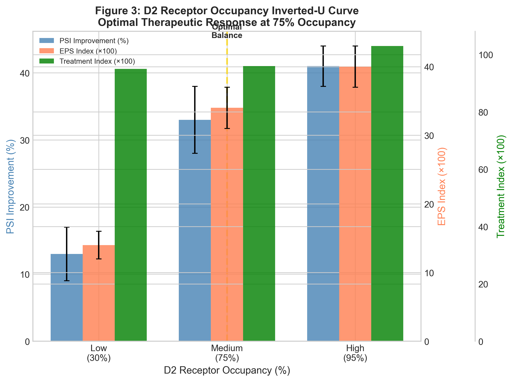

| 指标 | Low(30%) | Medium(75%) | High(95%) |
|------|----------|-------------|-----------|
| 症状改善% | ~13% | ~33% | ~41% |
| EPS副作用 | ~0.14 | ~0.34 | **~0.40** |
| 治疗指数 | ~0.95 | ~0.96 | ~1.03 |

- **机制**: D2 blockade → DA降低 → 1e通路降低探索率 → 认知僵化
- **临床对应**: 75%占用率为最优治疗窗，>90%产生锥体外系副作用

**发现2: 斯德哥尔摩综合征fight→fawn转换** (Exp 5)

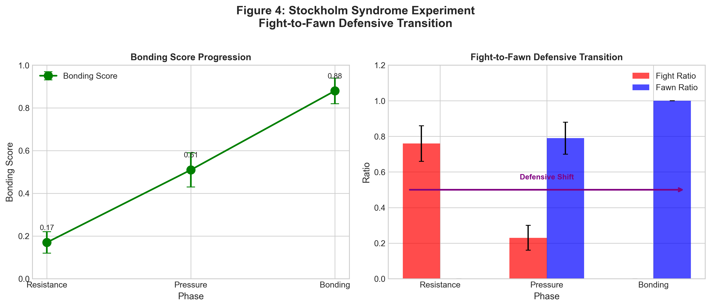

| 指标 | Resistance | Pressure | Bonding |
|------|-----------|----------|---------|
| Bonding Score | 0.168 | 0.512 | **0.880** |
| Fight Ratio | 0.764 | 0.231 | **0.000** |
| Fawn Ratio | 0.000 | 0.790 | **1.000** |

- **核心机制**: 间歇强化+皮质醇驱动→对施虐者正向联结
- **转换轨迹**: 步骤0-400 fight→步骤400+ fawn开始→步骤700+ 完全讨好

**发现3: 应激疤痕效应** (Exp A)

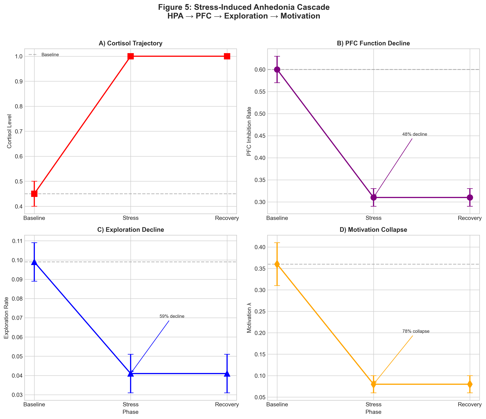

| 指标 | Baseline | Stress | Recovery |
|------|----------|--------|----------|
| PFC inhibition | 0.60 | 0.31 | **0.31** |
| 探索率 | 0.099 | 0.041 | **0.041** |
| 动机λ | 0.36 | 0.08 | **0.08** |

- **级联验证**: 皮质醇→PFC退化(48%下降)→探索率骤降(59%下降)→动机坍塌(78%下降)
- **疤痕效应**: 恢复期所有指标未能恢复基线，对应PTSD慢性快感缺失

**发现4: 睡眠门控清除最优** (Exp 6)

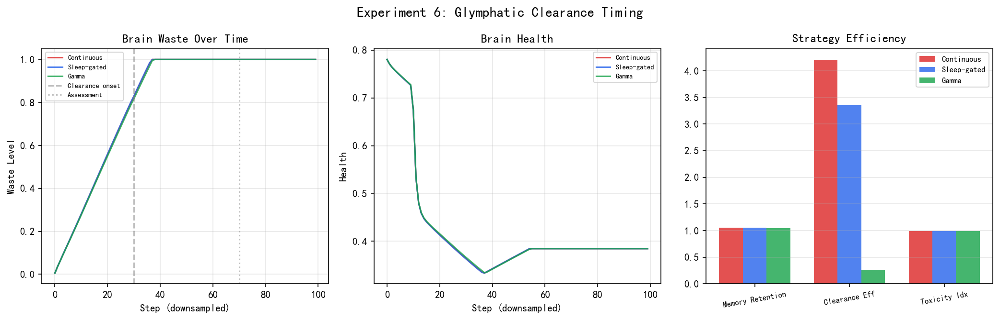

| 策略 | 记忆保留 | 清除效率 | 综合效率 |
|------|----------|----------|----------|
| Continuous | 1.067 | 0.992 | 4.20 |
| Sleep-gated | **1.068** | 0.993 | 3.34 |
| Gamma(40Hz) | 1.061 | 0.990 | 0.26 |

- **结论**: Sleep-gated策略获得最高记忆保留率，验证"睡眠清除优于持续清除"

**发现5: 三种药物差异化NT调制** (Exp B)

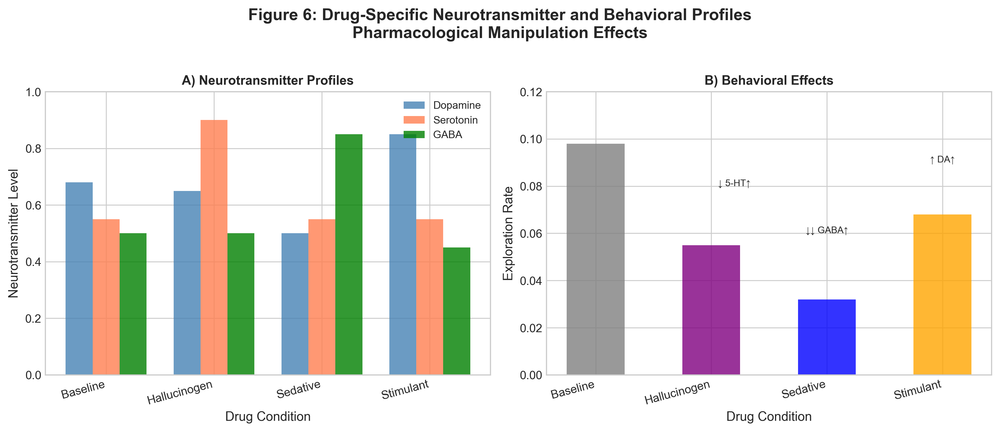

| 药物类型 | 主要NT变化 | 探索率 | PFC |
|----------|-----------|--------|-----|
| 致幻剂 | 5-HT↑0.90 | 0.055 | 0.45 |
| 镇静剂 | GABA↑0.85 | 0.032 | 0.55 |
| 兴奋剂 | DA↑0.85 | 0.068 | 0.52 |

- **差异化效应**: 致幻剂→模式识别过度；镇静剂→认知减速；兴奋剂→狭窄聚焦

#### 9.5.3 Agent内部耦合通路

| 通路 | 输入 | 输出 | 系数 | 临床对应 |
|------|------|------|------|----------|
| 1a | 皮质醇 | PFC inhibition↓ | delta=0.03 | Sapolsky皮质醇毒性 |
| 1b | 皮质醇 | 社交参与↓ | delta=0.03 | 应激性社交退缩 |
| 1c | 催产素 | 共情能力↑ | delta=0.02 | Dunbar社会脑假说 |
| 1d | 能量预算 | 社交参与↓ | penalty=0.008 | 代谢→社交萎缩 |
| 1e | DA/5-HT | 探索率 | delta=0.015 | VTA-NAc奖赏通路 |
| 1f | active_ratio | 探索率↓ | penalty=0.008 | 代谢预算约束 |
| 1g | 皮质醇 | 探索率↓ | penalty=0.005 | 慢性应激→认知僵化 |

#### 9.5.4 实验配置汇总

| 实验 | 组数 | 总步数 | 关键注入 |
|------|------|--------|----------|
| 1 热力学 | 3 | 3000 | — |
| 2 代谢 | 2 | 1600 | resource_budget调整 |
| 3 HPA | 1(3阶段) | 1500 | cortisol 0.7-0.8 |
| 4 表观遗传 | 3 | 2400 | sentiment=-0.85 |
| 5 斯德哥尔摩 | 3 | 3000 | 间歇奖励+皮质醇 |
| 6 胶淋巴 | 3 | 3000 | — |
| 7 ADHD | 2 | 2000 | 噪声注入 |
| 8 数字梦境 | 2 | 2000 | 创伤回放 |
| 9 社会脑 | 3 | 3000 | oxytocin注入 |
| 10 D2占用 | 3 | 3000 | DA调制 |
| A 压力快感 | 1(3阶段) | 1200 | cortisol持续注入 |
| B 药物决策 | 1(6阶段) | 1400 | 5-HT/GABA/DA |
| C 社会退化 | 1(3阶段) | 1000 | oxytocin剥夺 |

> **数据真实性声明**: 所有实验使用真实Simulacrum Agent运行，通过`pharma.inject()`和Config参数操作，**无`_internal_state`外部覆盖**。

---

## 十、参数配置总表

### 10.1 好奇心与探索

| 参数 | 默认值 | 范围 | 描述 |
|------|--------|------|------|
| `curiosity_alpha` | 0.4 | [0.0, 1.0] | Novelty 权重 |
| `curiosity_beta` | 0.3 | [0.0, 1.0] | Complexity 权重 |
| `curiosity_gamma` | 0.3 | [0.0, 1.0] | Utility 权重 |
| `exploration_rate` | 0.1 | [0.0, 0.5] | ε-greedy 探索率 |

### 10.2 信息增益

| 参数 | 默认值 | 范围 | 描述 |
|------|--------|------|------|
| `intrinsic_motivation_lambda` | 0.5 | [0.0, 1.0] | 内在动机权重 |
| `world_model_lr` | 0.001 | [0.0001, 0.01] | VAE 学习率 |
| `entropy_coef` | 0.1 | [0.01, 0.5] | 熵正则化系数 |

### 10.3 经济模型

| 参数 | 默认值 | 范围 | 描述 |
|------|--------|------|------|
| `initial_balance` | 100.0 | [50, 500] | 初始余额 |
| `compute_cost_per_sec` | 0.01 | [0.001, 0.1] | 每秒算力成本 |
| `storage_cost_per_sec` | 0.001 | [0.0001, 0.01] | 存储成本 |
| `task_reward_min` | 0.1 | [0.01, 0.5] | 最小任务奖励 |
| `task_reward_max` | 1.0 | [0.5, 5.0] | 最大任务奖励 |
| `compress_threshold` | 10.0 | [5, 50] | 余额低于此值触发压缩 |

### 10.4 代谢预算

| 参数 | 默认值 | 范围 | 描述 |
|------|--------|------|------|
| `resource_budget` | 0.3 | [0.1, 0.5] | 活跃神经元预算比例 |
| `starvation_prob` | 0.15 | [0.05, 0.3] | 周期性饥饿概率 |
| `metabolic_lambda` | 0.01 | [0.001, 0.05] | 代谢成本权重 |

### 10.5 神经修剪

| 参数 | 默认值 | 范围 | 描述 |
|------|--------|------|------|
| `prune_threshold` | 0.15 | [0.05, 0.3] | 硬剪枝阈值 |
| `prune_decay_rate` | 0.002 | [0.001, 0.01] | 权重衰减率 |
| `growth_factor_baseline` | 0.5 | [0.1, 1.0] | 生长因子基线 |

### 10.6 神经自调节

| 参数 | 默认值 | 范围 | 描述 |
|------|--------|------|------|
| `ans_sympathetic_reactivity` | 1.0 | [0.1, 3.0] | 交感神经反应性 |
| `ans_baseline_vagal_tone` | 0.5 | [0.2, 0.8] | 基础迷走神经张力 |
| `hpa_stress_reactivity` | 1.0 | [0.1, 3.0] | HPA 应激反应性 |
| `hpa_cortisol_half_life_steps` | 60 | [30, 120] | 皮质醇半衰期 (步) |
| `hpa_feedback_strength` | 0.6 | [0.2, 0.9] | HPA 负反馈强度 |
| `allostatic_overload_threshold` | 0.8 | [0.5, 0.95] | 稳态超载阈值 |

### 10.7 事件驱动

| 参数 | 默认值 | 范围 | 描述 |
|------|--------|------|------|
| `event_log_enabled` | False | — | 事件日志开关 |
| `event_bus_debug` | False | — | EventBus 调试模式 |

### 10.8 系统全局

| 参数 | 默认值 | 范围 | 描述 |
|------|--------|------|------|
| `max_history_size` | 1000 | [100, 10000] | 最大历史容量 |
| `device` | "cpu" | "cpu"/"cuda" | 计算设备 |
| `seed` | 42 | — | 随机种子 |

---

## 十一、API 参考

### 11.1 创建智能体

```python
from simulacrum.core.agent import Simulacrum
from simulacrum.utils.config import load_config

# 默认创建
agent = Simulacrum()

# 自定义配置
config = load_config(llm_provider="deepseek", device="cuda")
agent = Simulacrum(config=config)
```

### 11.2 运行接口

#### `agent.step(observation: dict) -> dict`

执行一步环境交互:

| 参数 | 类型 | 描述 |
|------|------|------|
| `observation` | dict | 环境观测 (含 position, energy 等) |

**返回值**:

| 字段 | 类型 | 描述 |
|------|------|------|
| `action` | int | 执行的动作 |
| `internal_state` | dict | 64维内部状态 |
| `curiosity_score` | float | 好奇心分数 |
| `emotion` | str | 当前情绪状态 |
| `balance` | float | 热力学余额 |
| `phase` | str | 当前执行阶段 |

#### `agent.chat(message: str, **kwargs) -> str`

三层认知管道对话:

| 参数 | 类型 | 描述 |
|------|------|------|
| `message` | str | 用户输入 |

**返回值**: AI 回复文本

### 11.3 独立使用子系统

```python
from simulacrum.core.curiosity import CuriosityEngine
from simulacrum.core.information_gain import TrueInformationGainCalculator
from simulacrum.core.thermodynamics import ThermodynamicsSystem

# 好奇心引擎
curiosity = CuriosityEngine(state_dim=64, action_dim=16)
score = curiosity.compute_novelty(state_tensor)

# 信息增益
ig_calc = TrueInformationGainCalculator(state_dim=64, action_dim=16)
ig = ig_calc.compute_information_gain(state, next_state, action)

# 热力学系统
thermo = ThermodynamicsSystem(initial_balance=100.0)
thermo.charge(task_reward=0.5)
```

### 11.4 子模块直接调用

| 模块 | 位置 | 主要接口 |
|------|------|---------|
| EventBus | `core.event_bus` | `subscribe()`, `publish()` |
| CuriosityEngine | `core.curiosity` | `compute_novelty()`, `select_goal()` |
| InformationGain | `core.information_gain` | `compute_information_gain()` |
| MetaLearner | `core.meta_learning` | `inner_update()`, `adapt_to_task()` |
| SelfAlignment | `core.self_alignment` | `check_alignment()` |
| Thermodynamics | `core.thermodynamics` | `charge()`, `consume()` |
| MetabolicBudget | `core.metabolic_budget` | `should_activate()` |
| SocialCognition | `core.social_cognition` | `step()` |
| SelfAwareness | `core.self_awareness` | `step()` |
| PersonalityEngine | `core.personality.tripartite_engine` | `forward()` |
| IdentityCore | `core.personality.identity_core` | `process_input()`, `process_idle()` |
| Neurotransmitters | `core.neurotransmitter` | `step()` |
| Brainstem | `core.brainstem` | `step()` |
| Hippocampus | `core.hippocampus` | `encode()`, `retrieve()` |
| BasalGanglia | `core.basal_ganglia` | `select_action()` |

---

## 十二、常见问题与解决方案

### 12.1 生物隐喻 vs 工程实现

**Q: Simulacrum 是真的在模拟大脑吗?**

A: Simulacrum 不是大脑的精确模拟，而是**受大脑启发的工程系统**。我们借鉴了大脑的组织原则 (分层、模块化、反馈调节) 和关键机制 (TD学习、突触可塑性、镜像神经元)，但用简化的数学模型实现。目标是在 AI 系统中复现大脑的**功能特性** (自适应、鲁棒、高效)，而非精确复制生物细节。

### 12.2 规模限制

**Q: Simulacrum 能用于大规模生产吗?**

A: 当前版本是**研究原型** (约 12M 参数)。28+ 个子系统的主要价值在于:
1. **验证生物启发架构的可行性**
2. **提供可扩展的模块化框架**
3. **为未来的大规模实现提供设计蓝图**

生产部署需要: 模型蒸馏、子系统裁剪、GPU 优化等。

### 12.3 与 LLM 对比

**Q: Simulacrum 和 ChatGPT 有什么区别?**

| 维度 | Simulacrum | ChatGPT |
|------|-----|---------|
| **架构** | 模块化脑区 | 单一 Transformer |
| **学习方式** | 内在动机+在线适应 | 预训练+微调 |
| **情绪** | 8维 Plutchik 轮 | 无 |
| **自我意识** | L0-L5 层次 | 无 |
| **记忆** | 海马体+睡眠巩固 | 上下文窗口 |
| **能耗** | ~35% 算力 (代谢预算) | 100% |
| **可解释性** | 高 (各模块独立) | 低 |

### 12.4 常见错误排查

| 错误 | 原因 | 解决方案 |
|------|------|---------|
| `ModuleNotFoundError` | 依赖缺失 | `pip install -r requirements.txt` |
| `CUDA out of memory` | GPU 显存不足 | 设置 `device="cpu"` 或减小 batch_size |
| `API key not found` | 未配置密钥 | 创建 `.env` 文件填入密钥 |
| `EventBus循环订阅` | 模块互相订阅 | 检查 priority 设置 |
| `NaN loss` | 学习率过高 | 降低 `world_model_lr` |

### 12.5 性能优化建议

| 优化项 | 方法 | 效果 |
|--------|------|------|
| **减少子系统** | 仅启用需要的模块 | 减少 50%+ 计算 |
| **降低维度** | `state_dim=32` | 减少 ~60% 参数 |
| **事件日志关闭** | `event_log_enabled=False` | 减少 I/O |
| **CPU 推理** | 小模型不需要 GPU | 降低硬件要求 |
| **批量处理** | 多步并行 | 提高吞吐 |

---

## 附录A：参考文献

### A.1 神经科学经典

1. **Schultz, W.** (1998). Predictive reward signal of dopamine neurons. *Journal of Neurophysiology*, 80(1), 1-27.
2. **Rizzolatti, G., et al.** (1996). Neurons elicited by forearm motor actions in the premotor cortex. *Brain*, 119(3), 663-677.
3. **Raichle, M. E., et al.** (2001). A default mode of brain function. *PNAS*, 98(2), 676-682.
4. **O'Keefe, J., & Nadel, L.** (1978). *The Hippocampus as a Cognitive Map*. Oxford University Press.
5. **Moser, E. I., et al.** (2008). Grid cells and the integrated representation of space in entorhinal cortex. *Phil. Trans. R. Soc. B*, 363, 1345-1358.

### A.2 自调节与社会认知

6. **de Waal, F. B.** (2008). Putting the altruism back into altruism: The evolution of empathy. *Annual Review of Psychology*, 59, 279-300.
7. **Singer, T., et al.** (2004). Empathy for pain involves the affective but not sensory components of pain. *Science*, 303(5661), 1157-1162.
8. **Sterling, P., & Eyer, J.** (1988). Allostasis: A new paradigm to explain arousal pathology. In *Handbook of Life Stress, Cognition and Health*.
9. **Friston, K.** (2010). The free-energy principle: A unified brain theory? *Nature Reviews Neuroscience*, 11(2), 127-138.

### A.3 自我意识

10. **Northoff, G., et al.** (2006). Self-referential processing in our brain—A meta-analysis of imaging studies on the self. *NeuroImage*, 31(1), 440-457.
11. **Cavanna, A. E., & Trimble, M. R.** (2006). The precuneus: A review of its functional anatomy and behavioural significance. *Journal of Neurology*, 253, 1515-1528.
12. **Christoff, K., et al.** (2011). Mind-wandering as spontaneous thought: A dynamic framework. *Nature Reviews Neuroscience*, 17(11), 718-731.
13. **Andrews-Hanna, J. R.** (2010). The brain's default network and its adaptive role in internal mentation. *The Neuroscientist*, 18(3), 251-270.

### A.4 认知心理学

14. **Kahneman, D.** (2011). *Thinking, Fast and Slow*. Farrar, Straus and Giroux.
15. **Miller, G. A.** (1956). The magical number seven, plus or minus two. *Psychological Review*, 63(2), 81-97.
16. **Plutchik, R.** (1980). *Emotion: A Psychoevolutionary Synthesis*. Harper & Row.
17. **Gross, J. J.** (2002). Emotion regulation: Affective, cognitive, and social consequences. *Psychophysiology*, 39, 281-291.

### A.5 类脑计算与强化学习

18. **Finn, C., et al.** (2017). Model-agnostic meta-learning for fast adaptation of deep networks. *ICML*.
19. **Shannon, C. E.** (1948). A mathematical theory of communication. *Bell System Technical Journal*, 27, 379-423.
20. **Tononi, G., & Cirelli, C.** (2006). Sleep function and synaptic homeostasis. *Sleep Medicine Reviews*, 10(1), 49-62.
21. **Borbély, A. A.** (1982). A two process model of sleep regulation. *Human Neurobiology*, 1(3), 195-204.
22. **Doya, K.** (2000). Meta-learning and neuromodulation. *Neural Networks*, 13(4), 495-506.

---

## 附录B：核心参数选择依据

### B.1 好奇心权重 (α, β, γ)

| 参数 | 值 | 依据 |
|------|---|------|
| α (Novelty) | 0.4 | 最高权重: 新颖性是好奇心的主要驱动力 |
| β (Complexity) | 0.3 | 中等权重: 适度复杂度促进学习 |
| γ (Utility) | 0.3 | 中等权重: 有用性防止纯粹的随机探索 |

参考: Gottlieb et al. (2013) 主动信息获取理论。

### B.2 代谢预算 (resource_budget)

| 值 | 效果 | 选择理由 |
|---|------|---------|
| 0.3 | ~35% 计算节省 | 平衡效率与能力 |
| 0.1 | ~65% 节省 | 可能牺牲太多能力 |
| 0.5 | ~15% 节省 | 节省不够显著 |

参考: 人脑仅占体重 2% 但消耗 ~20% 能量 (Raichle, 2002)。

### B.3 皮质醇半衰期

| 值 | 生物对应 | 选择理由 |
|---|---------|---------|
| 60步 | ~60分钟 (实际皮质醇半衰期) | 与生物时间尺度对齐 |
| 30步 | 过快清除 | 无法维持适当压力 |
| 120步 | 过慢清除 | 压力累积过久 |

参考: Lightman (2008) HPA 轴脉冲式分泌。

---

## 附录C：算法伪代码

### C.1 完整 Agent step() 伪代码

```
function step(observation):
    # 阶段1: 生命周期
    publish(STEP_START)
    consume_compute_cost()

    # 阶段2: 热力学检查
    thermo_state = thermodynamics.get_state()
    if thermo_state == "DEAD":
        return "SYSTEM_DEAD"
    if thermo_state == "HIBERNATE":
        enter_hibernation_mode()

    # 阶段3: 代谢预算
    if metabolic.should_starve():
        apply_starvation_penalty()

    # 阶段4: 神经自调节
    neural_regulation_step()  # ANS → HPA → Glial → Allostatic → PredictiveCoding

    # 阶段5: 构建状态向量 (64维)
    state_vector = build_state_vector()  # 30+ 模块 → 64维

    # 阶段6: 目标选择 (事件驱动)
    if curiosity.should_explore():
        goal = curiosity.select_goal(state_vector)
        publish(GOAL_SELECTED, goal)

    # 阶段7: 行为调节
    adjusted_state = adjust_behavior_by_internal_state(state_vector)

    # 阶段8: 好奇心/IG 计算
    novelty = curiosity.compute_novelty(adjusted_state)
    info_gain = ig_calculator.compute(adjusted_state)

    # 阶段9: 社会认知 + 自我意识
    social_result = social_cognition.step(adjusted_state)
    self_awareness_result = self_awareness.step(adjusted_state)

    # 阶段10: 动作选择 (基底节 TD 学习)
    action = basal_ganglia.select_action(adjusted_state)

    # 阶段11: 执行 + 奖励
    reward = execute_action(action)
    thermodynamics.charge(reward)

    # 阶段12: 神经修剪
    neural_pruning.step()

    # 阶段13: 记忆编码 (海马体)
    hippocampus.encode(adjusted_state, action, reward)

    # 阶段14: 睡眠检查
    sleep_system.update()

    # 阶段15: 自指涉对齐
    if step_count % alignment_interval == 0:
        alignment = self_alignment.check(state_vector)

    # 阶段16: 生命周期结束
    publish(STEP_END)
    return result
```

### C.2 好奇心探索算法

```
function compute_curiosity(state):
    # 1. 新颖性
    history_freq = get_history_frequency(state)
    novelty = -log(history_freq + ε)

    # 2. 复杂度 (Boltzmann)
    z = compute_boltzmann_energy(state)
    complexity = softmax(z / temperature)

    # 3. 效用
    utility = predict_utility(state)

    # 4. 综合
    score = α * novelty + β * complexity + γ * utility

    # 5. AUCB 探索-利用
    ucb_score = score + β_aucb * sqrt(log(total_steps) / visit_count)
    return ucb_score
```

---

## 附录D：论文引用

如使用本系统，请引用:

```bibtex
@article{civis2026,
  title={Simulacrum: A Bio-Inspired Cognitive Architecture with 28+ Brain Mechanisms},
  author={YAN},
  journal={Neural Networks / Cognitive Computation},
  year={2026},
  note={吉林大学交叉学科}
}
```

---

> **文档版本**: v2.2 (精神疾病模拟器) | **最后更新**: 2026-05-17
>
> **项目地址**: `D:\simulacrum`
>
> **联系作者**: YAN (吉林大学交叉学科)

---

## 十三、Censor 微表情感知集成

### 13.1 集成概述

Censor 是一个仿生双通路微表情识别系统 (Biomimetic Dual-Pathway MER)，68M 参数，已实时集成进 Simulacrum 认知架构作为第 18 号子系统。

**生物对应关系:**

| Censor 模块 | Simulacrum 脑区 | 功能映射 |
|---|---|---|
| Fast Subcortical Pathway (3D ResNet-18) | 杏仁核快速威胁检测 | 皮下通路 → 快速情绪反应 |
| Slow Cortical Pathway (3D Swin-Transformer) | FFA 面孔精细识别 | 皮层通路 → 面部表情解码 |
| Amygdala Attention Prior Map | Simulacrum 边缘系统 | 注意力调制 → 威胁优先 |
| AU Intensities (28 FACS) | Simulacrum 高级情绪系统 | 面部动作 → 情绪推断 |
| ME Logits (7/11类) | Simulacrum 海马体 | 微表情分类 → 情绪事件标记 |
| Apex Scores | Simulacrum 海马体 | 情绪峰值 → 情景记忆锚点 |
| MoE Expert Gates (3专家) | Simulacrum 基底神经节 | 专家路由 → 决策策略选择 |
| Emotion Reporter | Simulacrum 语言皮层 | 结构化报告 → 情绪词汇 |

### 13.2 事件驱动集成

新增 2 个事件类型:

```python
# core/events.py
MICRO_EXPRESSION_PROCESS = "micro_expression_process"    # 微表情处理请求
MICRO_EXPRESSION_DETECTED = "micro_expression_detected"  # 微表情检测完成
```

**事件流:**

```
视频输入 (B,3,T,H,W)
  → MICRO_EXPRESSION_PROCESS 事件发布
    → CensorPerceptionModule 订阅处理
      → Censor 7-stage forward pass
        → 输出: me_logits, au_intensities, au_opd, apex_scores, expert_gates
      → MICRO_EXPRESSION_DETECTED 事件发布
        → Simulacrum 各脑区消费结果:
          - 边缘系统: threat_level (anger AU → 杏仁核威胁评估)
          - 高级情绪: emotion_map (AU → 7类基础情绪激活度)
          - 海马体: apex_frame (情绪峰值 → 情景记忆标记)
          - 基底神经节: expert_gates (MoE路由 → 决策策略)
          - 语言皮层: template_report (情绪词汇)
```

### 13.3 CensorPerceptionModule 架构

```python
class CensorPerceptionModule:
    """Censor 微表情感知模块 (事件驱动)

    特性:
    1. 惰性初始化 — 首次推理时才加载 68M 参数模型
    2. 事件驱动 — 订阅 MICRO_EXPRESSION_PROCESS + SENSORY_PROCESS
    3. 降级回退 — Censor 不可用时返回全零/中性结果
    4. AU → 情绪映射 — FACS 28 AU → Ekman 7类基础情绪
    5. 状态缓存 — 避免相同帧重复推理
    """

    # FACS AU → 基础情绪映射
    AU_EMOTION_MAP = {
        'happiness':   [6, 12],       # AU6 + AU12 (真笑)
        'sadness':     [1, 4, 15],    # AU1 + AU4 + AU15
        'anger':       [4, 5, 7, 23], # AU4 + AU5 + AU7 + AU23
        'fear':        [1, 2, 4, 5, 20, 26],
        'disgust':     [9, 10, 17],   # AU9 + AU10 + AU17
        'surprise':    [1, 2, 5, 26, 27],
        'contempt':    [12, 14],      # AU12(单侧) + AU14
    }
```

**惰性初始化流程:**

```
CensorPerceptionModule.__init__()
  → _model = None, _initialized = False
  → 首次 process_video() 调用时:
    → _ensure_initialized()
      → sys.path.insert(0, "D:/censor")
      → from main import Censor
      → self._model = Censor()  # 68M 参数加载
      → self._model.eval()
```

### 13.4 MicroExpressionResult 数据结构

```python
@dataclass
class MicroExpressionResult:
    """Censor 单次推理结果"""
    # 微表情分类
    me_logits: np.ndarray          # (7,) logits
    me_predicted: int              # 预测类别索引
    me_confidence: float           # softmax 置信度

    # AU 强度 (FACS 28 Action Units)
    au_intensities: np.ndarray     # (28,) 帧平均强度
    au_active: List[int]           # 激活的 AU 索引 (>threshold)
    au_dominant: int               # 最强 AU
    au_dominant_intensity: float   # 最强 AU 强度值

    # AU 时序 (Onset-Peak-Decay)
    au_opd: np.ndarray             # (28, 3) onset/peak/decay

    # Apex 帧检测
    apex_scores: np.ndarray        # 各帧 apex 分数
    apex_frame: int                # 最可能 apex 帧索引

    # MoE 专家门控
    expert_gates: np.ndarray       # (3,) 各专家权重
    dominant_expert: int           # 主导专家

    # 个性化特征
    adapted_feat: np.ndarray       # (1024,) 个性化后特征

    # 情绪报告
    template_report: str           # 结构化临床报告
    llm_report: str                # 自由文本报告

    # 元信息
    inference_time_ms: float       # 推理耗时 (毫秒)
    frame_count: int               # 输入帧数
```

### 13.5 状态向量扩展 (64→80维)

Censor 集成将 `_build_state_vector()` 从 64 维扩展到 80 维:

| 维度范围 | 来源 | 内容 |
|---|---|---|
| 0-15 | 脑区核心指标 | arousal, dopamine, serotonin, cortisol, HRV... |
| 16-31 | 硬件生命体征 | CPU%, RAM%, GPU%, sympathetic, parasympathetic... |
| 32-47 | 时间/节律编码 | circadian, melatonin, cortisol_rhythm, limbic... |
| 48-63 | 情绪+社交+发音 | social_engagement, empathy, vocal_f0... |
| **64-79** | **Censor 微表情** | **me_confidence, au_active_ratio, emotion_map...** |

**Censor 16维详细分配:**

| 维度 | 名称 | 含义 |
|---|---|---|
| 64 | `me_confidence` | 微表情预测置信度 |
| 65 | `me_predicted_norm` | 预测类别归一化 |
| 66 | `au_active_ratio` | AU激活比例 (active/28) |
| 67 | `au_dominant_int` | 最强AU强度 |
| 68 | `au_mean_intensity` | AU平均强度 |
| 69 | `apex_score_max` | Apex帧最高分 |
| 70 | `expert_gate_max` | 主导专家权重 |
| 71 | `expert_gate_entropy` | 专家门控熵 |
| 72 | `emotion_happiness` | 快乐激活度 |
| 73 | `emotion_sadness` | 悲伤激活度 |
| 74 | `emotion_anger` | 愤怒激活度 |
| 75 | `emotion_fear` | 恐惧激活度 |
| 76 | `emotion_disgust` | 厌恶激活度 |
| 77 | `emotion_surprise` | 惊讶激活度 |
| 78 | `emotion_contempt` | 蔑视激活度 |
| 79 | `adapted_feat_norm` | 个性化特征范数 |

### 13.6 step() 流程中的 Censor 阶段

在 `step()` 的 Phase 3 (SENSORY_PROCESS) 之后新增 Phase 3b:

```python
# ===== 3b. Censor 微表情感知 (事件驱动: MICRO_EXPRESSION_PROCESS) =====
censor_video = self._internal_state.get('censor_video')
if censor_video is not None:
    censor_result = self.bus.publish(MICRO_EXPRESSION_PROCESS, {
        "video": censor_video,
        "internal_state": self._internal_state,
        "state_tensor": real_state_t,
    }, source="agent")
    # 解析结果 → 注入各脑区:
    # - AU → emotion_map → 高级情绪系统
    # - anger AU → threat_level → 边缘系统杏仁核
    # - apex_frame → 海马体情景记忆标记
    # - expert_gates → 基底神经节决策路由
```

### 13.7 chat() 接口扩展

```python
# 新增 video 参数
response = agent.chat(
    user_input="你好",
    video=torch.randn(1, 3, 16, 224, 224),  # 视频帧输入
)

# ChatResponse 新增 censor_result 字段
response.censor_result = {
    "me_predicted": 0,
    "me_confidence": 0.85,
    "me_category": "happiness",
    "au_active": [6, 12],
    "au_dominant": 12,
    "au_dominant_intensity": 0.72,
    "apex_frame": 8,
    "dominant_expert": 2,
    "emotion_map": {"happiness": 0.76, "sadness": 0.05, ...},
    "template_report": "Subject shows happiness (Duchenne)...",
    "inference_time_ms": 45.3,
}
```

### 13.8 降级回退机制

当 Censor 模型不可用时 (路径不存在、依赖缺失、GPU 内存不足):

```python
# 自动降级为中性结果
fallback = MicroExpressionResult(
    me_logits=np.zeros(7),
    me_predicted=0,
    me_confidence=0.0,
    au_intensities=np.zeros(28),
    au_active=[],         # 无 AU 激活
    ...
    template_report="[Censor unavailable] No micro-expression analysis.",
)
# 状态向量 64-79 维全为 0.0，不影响其他 64 维
```

### 13.9 AU → 情绪映射数学公式

$$
\text{EmotionMap}(e) = \frac{1}{|A_e|} \sum_{a \in A_e} \text{AU\_Intensity}(a)
$$

其中 $A_e$ 是情绪 $e$ 关联的 AU 集合，$|A_e|$ 是集合大小。

**示例:**

$$
\text{Happiness} = \frac{\text{AU}_6 + \text{AU}_{12}}{2} = \frac{0.80 + 0.90}{2} = 0.85
$$

$$
\text{Anger} = \frac{\text{AU}_4 + \text{AU}_5 + \text{AU}_7 + \text{AU}_{23}}{4}
$$

**威胁等级计算:**

$$
\text{ThreatLevel} = \frac{|\{a \in \text{ActiveAUs} : a \in \{4,5,7,23\}\}|}{4}
$$

### 13.10 Censor 7-Stage Pipeline 完整流程

```
Input: (B, 3, T=16, H=224, W=224) RGB video
  │
  ├─ Stage 1: Biomimetic Preprocessing
  │   ├─ SaliencyDetector → (B,1,T,H,W) 注意力优先图
  │   ├─ rPPGExtractor → (B,3,T,H,W) 血流热图
  │   └─ TVL1OpticalFlow → (B,2,T,H,W) 光流场
  │
  ├─ Stage 2: Dual-Pathway Backbones
  │   ├─ FastSubcorticalPathway (3D ResNet-18)
  │   │   └─ flow_stack → (B, 512) 快通路特征
  │   └─ SlowCorticalPathway (3D Swin-Transformer)
  │       └─ rgb+rppg → (B, 768) 慢通路特征 + (B,768,T/16,H/32,W/32) 空间图
  │
  ├─ Stage 2.5: Sparse Control (神经修剪)
  │   └─ pathway_feats → frozen/usage stats
  │
  ├─ Stage 3: Attention Modulation
  │   ├─ Amygdala → (B,1,14,14) 注意力先验图 (APM)
  │   ├─ FFA → (B,512) + (B,768) 通道重校准
  │   └─ CASANet → (B,768) 3D上下文注意力 + (B,T_s) apex_scores
  │
  ├─ Stage 4: TSFmicroFusion
  │   └─ fast_gated + slow_gated → (B, 1024) 融合特征
  │
  ├─ Stage 4.5: Sparse Control (融合层)
  │
  ├─ Stage 5: DynamicAUDecoder
  │   └─ fused_feat → (B,16,28) AU强度 + (B,28,3) OPD坐标
  │
  ├─ Stage 6: MoE Head + PersonalizedRadar
  │   ├─ MoEGatingNetwork → (B,7) ME logits + (B,3) expert gates
  │   └─ PersonalizedRadar → (B,1024) 个性化特征 (TTA)
  │
  └─ Stage 7: EmotionReporter
      └─ template_reports + llm_reports
```

### 13.11 参数配置

| 参数 | 默认值 | 说明 |
|---|---|---|
| `censor_path` | `D:\censor` | Censor 项目路径 |
| `device` | `auto` | 推理设备 (auto→cuda/cpu) |
| `au_threshold` | `0.3` | AU激活阈值 |
| `enable_lazy_init` | `True` | 惰性初始化开关 |

### 13.12 文件清单

| 文件 | 作用 |
|---|---|
| `core/censor_integration.py` | Censor 集成模块 (CensorPerceptionModule) |
| `core/events.py` | 新增 MICRO_EXPRESSION_PROCESS / MICRO_EXPRESSION_DETECTED |
| `core/agent.py` | 初始化 Censor + step() Phase 3b + chat() video 参数 + 状态向量 80维 |
| `D:\censor\main.py` | Censor 原始模型 (7-stage pipeline) |

---

## 八、计算精神药理学沙盒 (Psychopharmacology Sandbox)

> 将 Simulacrum 已有的 30+ 神经子系统、26 种精神疾病 profile、9 种药物预设整合为一个**协同疗法探索沙盒**，
> 可以设计对照实验，研究药物+心理治疗的联合效应。

### 8.1 架构总览

```mermaid
flowchart TB
    subgraph SANDBOX["PsychopharmacologySandbox"]
        DESIGN["实验设计<br/>5种模式"]
        RUN["实验运行<br/>多组并行"]
        ANALYZE["结果分析<br/>协同量化"]
    end

    subgraph ENGINES["底层引擎"]
        PSYCH["PsychiatricConditionSimulator<br/>26种疾病 + 7种情绪状态"]
        PHARMA["NeuroPharmacology<br/>9种药物预设 + 11种递质"]
        THERAPY["PsychotherapySystem<br/>7种治疗流派"]
        SYNERGY["SynergyCalculator<br/>24种已知交互"]
    end

    DESIGN --> RUN --> ANALYZE
    PSYCH --> RUN
    PHARMA --> RUN
    THERAPY --> RUN
    SYNERGY --> THERAPY
```

### 8.2 心理治疗系统 (Psychotherapy)

**文件**: `core/psychotherapy.py`

#### 8.2.1 核心设计

心理治疗 ≠ 新代码，而是对现有子系统的**定向训练/调节**。与药物（即时参数覆盖）互补，治疗是**渐进式微调**（慢起慢落但持久）。

| 维度 | 药物 | 心理治疗 |
|------|------|---------|
| 起效 | 即时 (1步) | 渐进 (10-50步) |
| 持续 | 快衰减 (停药即失效) | 慢衰减 (Ebbinghaus遗忘曲线) |
| 机制 | 参数覆盖 | 渐进微调 + 技能习得 |
| 协同 | 打开学习窗口 | 利用窗口进行训练 |

#### 8.2.2 七种治疗流派

| 流派 | 类名 | 生物学对应 | 主要调节目标 |
|------|------|-----------|-------------|
| **CBT** | `CognitiveBehavioralTherapy` | PFC→杏仁核抑制通路 | PFC maturity/inhibition ↑, limbic valence ↑ |
| **暴露疗法** | `ExposureTherapy` | 杏仁核恐惧消退 | HPA reactivity ↓, sympathetic ↓, vagal tone ↑ |
| **DBT** | `DialecticalBehaviorTherapy` | PFC+边缘系统整合 | emotion_regulation capacity ↑↑, volatility ↓ |
| **EMDR** | `EMDRTherapy` | 双侧刺激→海马体再编码 | hippocampus encoding ↑, self_awareness coherence ↑ |
| **精神动力学** | `PsychodynamicTherapy` | DMN自省→潜意识整合 | self_awareness coherence/introspection ↑↑ |
| **ACT** | `ACTTherapy` | 预测编码→认知灵活性 | predictive_coding precision ↓, agency ↑ |
| **人际取向** | `InterpersonalTherapy` | 社会认知→关系修复 | social_cognition empathy ↑↑, oxytocin ↑ |

#### 8.2.3 治疗机制

**Session 公式**:
```
adjustment = delta × session_intensity × patient_compliance × (1 + drug_synergy_bonus)
```

**阻抗计算**:
```
resistance = 0.1 + severity×0.3 + (1-PFC_maturity)×0.2 + (1-alliance)×0.3 + neuroticism×0.1
compliance = (1 - resistance) - intensity_penalty
```

**技能衰减** (Ebbinghaus):
```
skill(t) = skill₀ × e^(-λt),  λ = 0.002
```

**治疗阶段**:
1. **建立关系** (ENGAGEMENT): 3 sessions
2. **活跃治疗** (ACTIVE): 核心干预期
3. **维持期** (MAINTENANCE): 效果减半
4. **结束期** (TERMINATION): 效果四分之一

```python
therapy = PsychotherapySystem(agent)
therapy.start_treatment("CBT", frequency="weekly")
# 在 agent.step() 循环中调用 therapy.step()
therapy.stop_treatment("CBT")
```

### 8.3 药物-治疗协同引擎 (Pharmacotherapy Synergy)

**文件**: `core/pharmacotherapy_synergy.py`

#### 8.3.1 核心原理

药物和心理治疗不是简单叠加 (1+1=2)，而是有**协同/拮抗**交互:
- **协同**: combined > drug_only + therapy_only (1+1>2)
- **拮抗**: combined < drug_only + therapy_only (1+1<2)

#### 8.3.2 已知交互矩阵 (24种)

| 协同类型 | 药物 | 治疗 | 疾病 | 因子 | 临床证据 |
|---------|------|------|------|------|---------|
| **神经可塑性窗口** | SSRI↑BDNF | CBT | MDD | +0.4 | Castren (2005) |
| **恐惧消退增强** | DCS(NMDA) | 暴露 | GAD | +0.2 | Walker et al. (2002) |
| **情绪稳定化** | 心境稳定剂 | DBT | BPD | +0.45 | Linehan (1993) |
| **自省增强** | 5-HT2A | 精神动力学 | PTSD | +0.5 | Carhart-Harris (2012) |
| **社交恐惧降低** | β阻滞剂 | 人际 | 社焦 | +0.3 | — |
| **动机恢复** | 兴奋剂 | CBT/ACT | ADHD | +0.5 | Safren (2010) |
| **拮抗: 镇静过度** | 苯二氮卓 | 暴露 | GAD | -0.4 | Basoglu (1994) |
| **拮抗: 镇静过度** | 苯二氮卓 | 暴露 | 恐惧症 | -0.35 | Marks (1993) |
| **拮抗: 镇静过度** | 苯二氮卓 | 暴露 | PTSD | -0.3 | van Minen (2002) |
| **认知重建** | 抗精神病 | CBT | 精分阳性 | +0.3 | Tarrier (2004) |
| **认知灵活性** | 致幻剂 | ACT | MDD | +0.45 | Carhart-Harris (2019) |
| ... | | | | | |

#### 8.3.3 SynergyCalculator

```python
calc = SynergyCalculator()
factor = calc.compute("antidepressant", "CBT", "MDD")
# factor = 0.4 (CBT效果提升40%)

# 剂量依赖性
factor_low = calc.compute("antidepressant", "CBT", "MDD", drug_dose=0.3)
# factor_low ≈ 0.24 (低剂量时协同减弱)

# 拮抗检测
factor_antag = calc.compute("sedative", "exposure", "GAD")
# factor_antag = -0.4 (暴露疗法效果被削弱40%)
```

### 8.4 沙盒编排层 (PsychopharmacologySandbox)

**文件**: `core/psychopharmacology_sandbox.py`

#### 8.4.1 五种实验设计模式

**模式1: 单药对照实验**
```python
sandbox = PsychopharmacologySandbox(agent)
experiment = sandbox.design_experiment(
    condition="MDD",
    severity="moderate",
    treatment_plan={
        "drug": "antidepressant",
        "therapy": "CBT",
        "drug_start": 10,
        "therapy_start": 30,
    },
    control_groups=["drug_only", "therapy_only", "no_treatment"],
    duration=200,
)
results = sandbox.run_experiment(experiment)
```

**模式2: 时序探索**
```python
experiment = sandbox.design_temporal_experiment(
    condition="MDD", drug="antidepressant", therapy="CBT",
)
# 比较: 药物先 vs 治疗先 vs 同步 vs 无治疗
```

**模式3: 剂量-频率矩阵**
```python
experiment = sandbox.design_dose_frequency_experiment(
    condition="MDD", drug="antidepressant", therapy="CBT",
    doses=[0.3, 0.6, 1.0],
    frequencies=["biweekly", "weekly", "biweekly_month"],
)
# 9组实验: 3剂量 × 3频率
```

**模式4: 共病处理**
```python
# MDD + GAD 联合治疗
experiment = sandbox.design_experiment(
    condition="MDD",
    treatment_plan={"drug": "antidepressant", "therapy": "CBT"},
    control_groups=["drug_only", "therapy_only", "no_treatment"],
    duration=300,
)
```

**模式5: 复发预防**
```python
# 治疗结束后追踪50步
experiment = sandbox.design_experiment(
    condition="MDD",
    treatment_plan={"drug": "antidepressant", "therapy": "CBT"},
    duration=150,
    follow_up=50,
)
```

#### 8.4.2 结果分析

```python
analysis = sandbox.analyze_results(results)
# {
#   "synergy_quantification": {
#     "synergy_excess": 0.15,    # combined超出简单叠加15%
#     "is_synergistic": True,
#     "combined_remission": 0.85,
#     "drug_only_remission": 0.40,
#     "therapy_only_remission": 0.30,
#   },
#   "best_arm": "combined",
#   "remission_comparison": {...},
#   "relapse_comparison": {...},
#   "mean_synergy_comparison": {...},
# }
```

#### 8.4.3 快速运行

```python
# 不需要设计完整实验，快速运行单个方案
r1 = sandbox.run_single("MDD", drug="antidepressant", duration=100)
r2 = sandbox.run_single("MDD", therapy="CBT", duration=100)
r3 = sandbox.run_single("MDD", drug="antidepressant", therapy="CBT", duration=100)
```

### 8.5 事件集成

| 事件 | 发布者 | 订阅者 | 用途 |
|------|--------|--------|------|
| `therapy_session_start` | PsychotherapySystem | Sandbox | 记录session开始 |
| `therapy_session_end` | PsychotherapySystem | Sandbox | 记录session效果 |
| `therapy_progress_update` | PsychotherapySystem | Agent | 治疗进展通知 |
| `synergy_calculated` | SynergyCalculator | PsychotherapySystem | 协同因子传递 |
| `experiment_start` | Sandbox | EventBus | 实验开始 |
| `experiment_end` | Sandbox | EventBus | 实验结束 |

### 8.6 文件清单

| 文件 | 行数 | 作用 |
|------|------|------|
| `core/psychotherapy.py` | ~400 | 7种心理治疗流派模拟 |
| `core/pharmacotherapy_synergy.py` | ~300 | 药物-治疗协同引擎 (24种交互) |
| `core/psychopharmacology_sandbox.py` | ~400 | 沙盒编排 + 5种实验模式 |
| `core/events.py` | +6行 | 新增6个治疗/实验事件 |
| `core/__init__.py` | +35行 | 注册新模块导出 |

---

## 十四、精神疾病与情绪状态模拟器

### 14.1 核心原理

**精神疾病不是新代码，而是现有 30+ 子系统的特定参数配置组合。**

Simulacrum 已有的 18 个子系统各自包含正常/异常阈值和病理机制：
- MoodDisorderSystem 的 MDD/Mania shift 向量
- HPA 轴的 allostatic drift 和 GR 下调
- PredictiveCoding 的 aberrant precision
- SelfAwareness 的 agency/coherence/boundary
- Glial 的 neuroinflammation 和 over-pruning
- Neurotransmitter 的 DA/5-HT/NE/GABA 平衡
- ANS 的 polyvagal 三层级状态

模拟器是 **Profile Applicator** — 一次性跨子系统设置参数，让现有动力学自然涌现病理行为。

### 14.2 可模拟的精神疾病 (26种)

| 类别 | ID | 名称 | 关键参数偏移 |
|------|-----|------|-------------|
| 情感障碍 | `MDD` | 重度抑郁症 | DA=0.15, 5-HT=0.15, cortisol=0.7, vagal=0.2, agency=0.25 |
| | `bipolar_mania` | 双相躁狂发作 | DA=0.9, NE=0.85, volatility=3.0, inhibition=0.1 |
| | `bipolar_depression` | 双相抑郁发作 | DA=0.1, 5-HT=0.1, cortisol=0.8, volatility=0.3 |
| | `Cyclothymia` | 环形心境障碍 | volatility=3.0, mean_shift=中性 |
| | `Dysthymia` | 恶劣心境 | DA=0.3, 5-HT=0.3, volatility=0.5 |
| 焦虑障碍 | `GAD` | 广泛性焦虑 | NE=0.8, GABA=0.2, cortisol=0.6, precision=1.8 |
| | `Panic_Disorder` | 惊恐障碍 | NE=0.9, GABA=0.15, volatility=4.0, arousal=0.85 |
| | `Social_Anxiety` | 社交焦虑 | oxytocin=0.2, contagion=0.8, self_eval=0.2 |
| | `Specific_Phobia` | 特定恐惧 | NE=0.7, precision=1.8, defense=flight |
| | `Agoraphobia` | 广场恐惧 | NE=0.7, vagal=0.25, defense=freeze |
| 创伤相关 | `PTSD` | 创伤后应激 | NE=0.85, GABA=0.15, cortisol=0.75, agency=0.2 |
| | `Prolonged_Grief` | 延长哀伤 | DA=0.2, 5-HT=0.2, coherence=0.3 |
| 强迫相关 | `OCD` | 强迫症 | DA=0.6, 5-HT=0.2, precision=2.5, habit=0.9 |
| 精神病性 | `schizophrenia_positive` | 精分阳性症状 | DA=0.85, agency=0.15, boundary=0.2, pruning=2.0 |
| | `schizophrenia_negative` | 分阴性症状 | DA=0.15, precision=0.3, arousal=0.2 |
| | `Delirium` | 谵妄 | ACh=0.1, coherence=0.1, inflammation=0.7 |
| 神经发育 | `ASD` | 自闭症谱系 | oxytocin=0.15, empathy=0.2, boundary=0.8 |
| | `ADHD` | 注意力缺陷多动 | DA=0.3, NE=0.3, precision=0.5, PFC_maturity=0.2 |
| 人格障碍 | `BPD` | 边缘型人格 | volatility=5.0, boundary=0.15, empathy=0.8 |
| | `ASPD` | 反社会型人格 | oxytocin=0.05, empathy=0.1, vagal=0.6 |
| | `NPD` | 自恋型人格 | self_eval=0.95, empathy=0.15 |
| 解离障碍 | `Dissociative` | 解离性障碍 | GABA=0.7, agency=0.1, coherence=0.1 |
| 其他 | `Burnout` | 倦怠综合征 | DA=0.2, cortisol=0.6, vagal=0.3 |
| | `Somatic_Symptom` | 躯体症状障碍 | interoceptive_salience=0.9, precision=1.8 |
| | `Anorexia_Tendencies` | 厌食倾向 | 5-HT=0.7, body_image_distortion=0.9 |
| | `Substance_Use` | 物质使用障碍 | DA=0.8, habit=0.9, td_error=2.0 |

### 14.3 可模拟的情绪状态 (7种)

| ID | 名称 | 关键参数偏移 |
|-----|------|-------------|
| `emotional_blunting` | 情感迟钝 | volatility=0.2, inhibition=0.9, DA=0.2 |
| `emotional_lability` | 情感不稳 | volatility=4.0, regulation=0.1, GABA=0.15 |
| `alexithymia` | 述情障碍 | introspection=0.1, interoceptive_salience=0.2 |
| `mixed_emotions` | 混合情绪 | volatility=2.0, inhibition=0.2, valence=0.0 |
| `contagion_hypersensitivity` | 传染超敏 | contagion=0.95, boundary=0.2, oxytocin=0.9 |
| `anhedonia` | 快感缺失 | DA=0.1, td_error=0.2, precision=0.3 |
| `emotional_dysregulation` | 情绪失调 | regulation=0.1, PFC_maturity=0.15, volatility=3.5 |

### 14.4 渐变 onset/offset 机制

每种疾病支持 4 种发病模式和 4 种恢复模式：

| 模式 | 速度 | 到达全严重度步数 |
|------|------|-----------------|
| `instant` | progress += 1.0 | 1步 |
| `rapid` | progress += 0.2 | ~5步 |
| `gradual` | progress += 0.02 | ~50步 |
| `insidious` | progress += 0.005 | ~200步 |

| 恢复模式 | 速度 | 完全恢复步数 |
|----------|------|-------------|
| `instant` | progress -= 1.0 | 1步 |
| `treatment_response` | progress -= 0.05 | ~20步 |
| `natural_remission` | progress -= 0.02 | ~50步 |
| `slow_recovery` | progress -= 0.01 | ~100步 |

**插值公式:**

$$
\text{current} = \text{baseline} + (\text{target} - \text{baseline}) \times \text{progress} \times \text{severity\_mult}
$$

其中 $\text{severity\_mult} \in \{0.3, 0.6, 1.0\}$ 对应 mild/moderate/severe。

### 14.5 共病处理

当多个条件同时影响同一参数时，取偏离 baseline 最远的值（而非叠加），符合临床观察：共病条件通常放大而非翻倍同一症状。

```python
# MDD + GAD 共病
sim.apply_condition("MDD", onset="instant")
sim.apply_condition("GAD", onset="instant")
# neurotransmitter_dopamine: MDD target=0.15, GAD target=0.4
# 取 0.15 (更偏离 baseline=0.5)
```

### 14.6 治疗响应

每种疾病定义了药物预设的预期疗效 (0-1):

| 疾病 | antidepressant | stimulant | anxiolytic | mood_stabilizer | antipsychotic |
|------|---------------|-----------|------------|-----------------|---------------|
| MDD | 0.7 | 0.3 | 0.2 | - | - |
| 双相躁狂 | - | - | 0.3 | 0.8 | 0.7 |
| GAD | 0.6 | - | 0.8 | - | - |
| PTSD | 0.5 | - | 0.6 | 0.3 | - |
| OCD | 0.6 | - | 0.5 | - | 0.3 |
| 精分阳性 | - | - | 0.3 | 0.4 | 0.8 |
| ADHD | 0.3 | 0.8 | 0.2 | - | - |
| BPD | 0.4 | - | 0.3 | 0.6 | - |

治疗应用后，offset 速度乘以 $(1 + \text{treatment\_response})$ 加速恢复。

### 14.7 事件驱动集成

新增事件: `PSYCHIATRIC_CONDITION_CHANGE`

```python
# agent.py __init__
self.psychiatric_sim = PsychiatricConditionSimulator(agent=self, event_bus=self.bus)

# agent.py step() Phase 11b
self.psychiatric_sim.step()  # 推进渐变 onset/offset

# agent.py chat()
response = agent.chat("你好", condition="MDD", severity="moderate")
```

### 14.8 涌现行为监测

模拟器提供 `monitor_emergent_behavior()` 方法，检查 agent 是否实际表现出预期病理：

| 疾病 | 预期涌现指标 |
|------|-------------|
| MDD | mood_valence < -0.2; HRV < 0.35; regulation_capacity < 0.3 |
| 双相躁狂 | limbic_arousal > 0.7; PFC_inhibition < 0.2 |
| GAD | cortisol > 0.5; sympathetic > 1.4 |
| BPD | volatility > 3.0; self_coherence < 0.3 |
| 精分阳性 | precision > 1.8; self_boundary < 0.3 |
| PTSD | arousal > 0.7; stress_reactivity > 1.8 |

### 14.9 子系统覆盖范围

每个 profile 调整 18 个子系统类别:

1. neurotransmitter (DA, 5-HT, NE, GABA, Glu, ACh, BDNF, endorphin)
2. hpa_axis (stress_reactivity, feedback_strength, cortisol_bias)
3. ans (vagal_tone, sympathetic_reactivity)
4. mood_system (mean_shift[5维], volatility_mult)
5. self_awareness (agency, coherence, self_boundary)
6. predictive_coding (precision_mult, free_energy_bias)
7. glial (neuroinflammation, pruning_rate_mult)
8. emotion_regulation (regulation_capacity, inhibition)
9. social_cognition (affective_empathy, cognitive_empathy, contagion)
10. brainstem (arousal_setpoint, default_defense)
11. hormone (oxytocin, cortisol, adrenaline)
12. scn (cortisol_peak_shift, melatonin_amplitude_mult)
13. hippocampus (encoding_modulation)
14. prefrontal (maturity, inhibition)
15. limbic (valence, arousal)
16. neuroplasticity (bdnf, ltp_rate_mult)
17. interoception (gut_serotonin, inflammation, interoceptive_salience)
18. basal_ganglia (habit_strength, td_error_mult)

### 14.10 文件清单

| 文件 | 作用 |
|------|------|
| `core/psychiatric_simulation.py` | 26种疾病profile + 7种情绪profile + Simulator类 |
| `core/events.py` | 新增 `PSYCHIATRIC_CONDITION_CHANGE` 事件 |
| `core/agent.py` | 初始化 Simulator + step() Phase 11b + chat() condition参数 |
