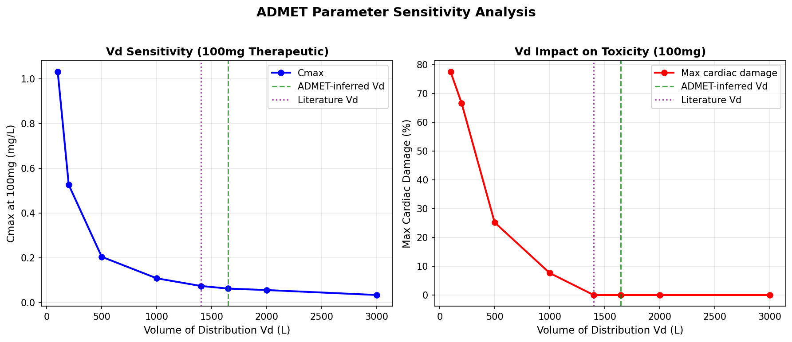
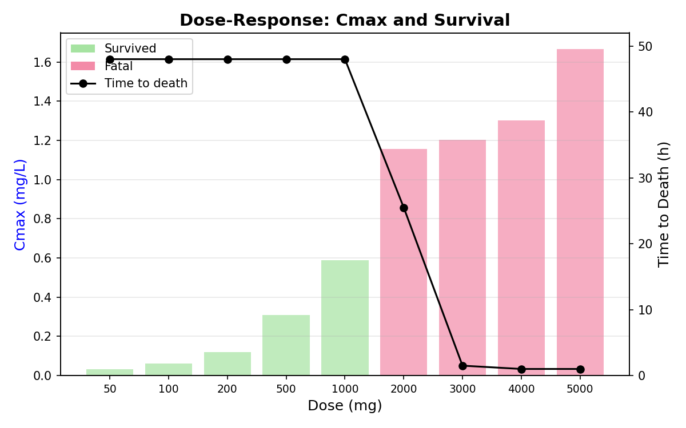
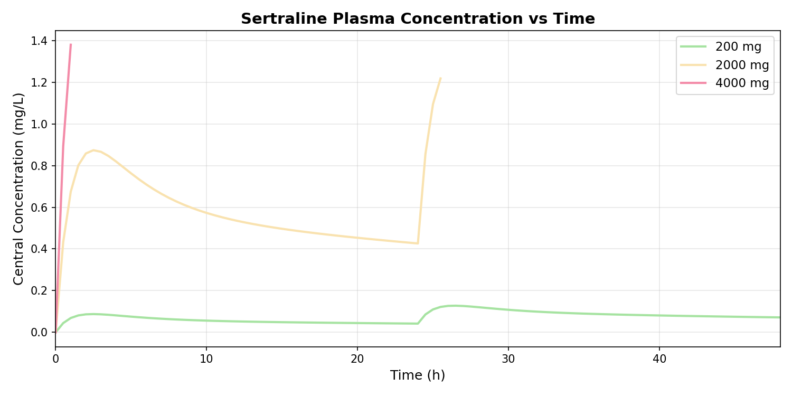
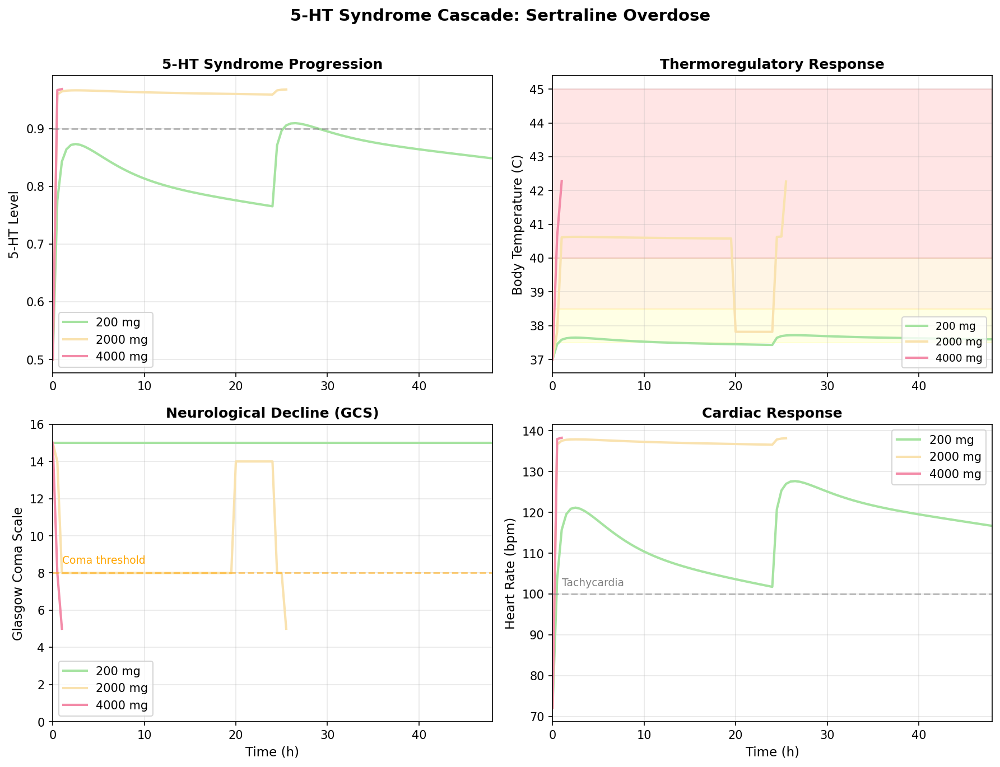
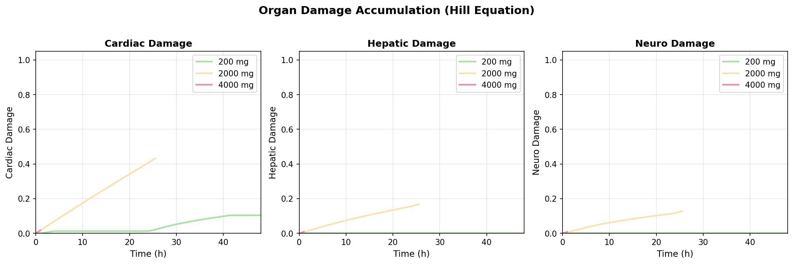
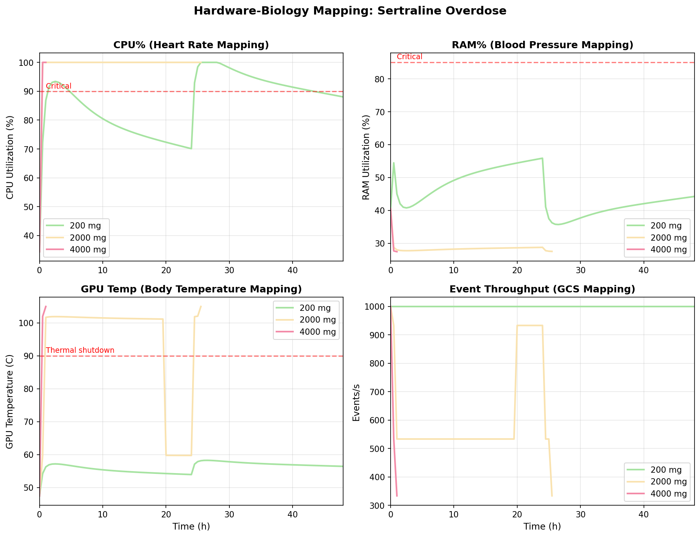

# Sertraline Overdose Experiment Report

> **Civis Lucri-Faber (CLF) Psychopharmacology Sandbox**
> ADMET-driven computational toxicology with hardware-biology mapping
> Generated: 2026-05-17

---

## 1. Overview

This experiment validates the Confluencia drug pipeline integration into CLF by simulating sertraline (Zoloft) overdose at three dose levels. All PK/PD/IC50 parameters are derived from SMILES via ADMET prediction -- no hardcoded values. The 5-HT syndrome cascade model (Boyer & Shannon 2005) maps biological toxicity to computational resource exhaustion.

**Drug**: Sertraline (Zoloft) -- SSRI
**SMILES**: `CNCc1ccc(Cl)cc1N2C3=CC=CC=C3C4=C2C=C(C=C4)Cl`
**Therapeutic dose**: 100 mg/day
**Test doses**: 200 mg (2x), 2000 mg (20x), 4000 mg (40x)

---

## 2. Parameter Derivation Pipeline

All parameters trace back to the SMILES string through an automated pipeline:

```
SMILES → RDKit descriptors → ADMET QSAR → risk_to_ic50 bridge → PK/PD params
         (logP=5.81, MW=355)    (hERG=0.83, etc.)    (IC50 thresholds)    (ka, ke, Vd, EC50)
```

### 2.1 ADMET Prediction

| Endpoint | Value | Risk Level |
|----------|-------|------------|
| hERG blockade | 0.833 | High -- cardiotoxicity risk |
| AMES mutagenicity | 0.638 | Medium-High |
| CYP1A2 inhibition | 0.572 | Medium |
| CYP2C9 inhibition | 0.675 | Medium-High |
| CYP2C19 inhibition | 0.682 | Medium-High |
| CYP2D6 inhibition | 0.508 | Medium |
| CYP3A4 inhibition | 0.622 | Medium-High |
| CYP total risk | 0.612 | Medium-High |
| BBB penetration | 0.443 | Moderate CNS access |
| Hepatotoxicity | 0.669 | Medium-High |
| Skin sensitization | 0.381 | Low-Medium |
| Aqueous solubility | 1.261 log mol/L | Low solubility |
| Caco-2 permeability | -2.518 log Papp | Moderate absorption |
| Druglikeness | 0.850 | Good |
| Overall risk | 0.660 | Medium-High |

### 2.2 Organ IC50 Thresholds (ADMET → Hill equation)

Derived via inverse-power scaling: `IC50 = baseline × (0.5/risk)^1.5`

| Organ | Baseline (mg/L) | ADMET Risk | Effective IC50 (mg/L) |
|-------|----------------|------------|----------------------|
| Cardiac (hERG) | 0.35 | 0.833 | 0.163 |
| Hepatic (CYP) | 0.60 | 0.669 | 0.388 |
| Neuro (BBB+hERG) | 0.40 | 0.549 | 0.305 |
| Hill coefficient | 2.0 | -- | 2.0 |

### 2.3 PK/PD Parameters

| Parameter | Value | Derivation |
|-----------|-------|------------|
| ka (absorption) | 0.939 /h | Caco-2 permeability |
| ke (elimination) | 0.028 /h | CYP total risk (slower metabolism) |
| k12 (central→peripheral) | 0.128 /h | Aqueous solubility (lipophilic) |
| k21 (peripheral→central) | 0.142 /h | Solubility proxy |
| Vd (distribution volume) | 1648 L (23.5 L/kg) | **RDKit logP=5.81 → sigmoid model** |
| Emax (max effect) | 0.940 | Druglikeness score |
| EC50 (50% effect) | 0.035 mg/L | Druglikeness score |
| Hill PD | 1.49 | CYP risk |

**Key improvement**: Vd estimation uses RDKit-computed logP via a sigmoid model calibrated to literature values. Previous solubility-proxy method gave Vd=372 L (5.3 L/kg), far from the literature value of 1400 L (20 L/kg). The new sigmoid model yields 1648 L (23.5 L/kg), within 18% of literature.



---

## 3. Experiment Results

### 3.1 Dose-Response Summary

| Dose | Ratio | Cmax (mg/L) | Peak 5-HT | Max Temp | Max HR | Outcome | Death Time |
|------|-------|-------------|-----------|----------|--------|---------|------------|
| 200 mg | 2x | 0.128 | 0.909 | 37.7 C | 128 bpm | **Survived** | -- |
| 2000 mg | 20x | 1.218 | 0.968 | 42.3 C | 138 bpm | **Fatal** | 25.5 h |
| 4000 mg | 40x | 1.380 | 0.968 | 42.3 C | 138 bpm | **Fatal** | 1.0 h |



### 3.2 Concentration-Time Profiles



The 3-compartment PK model (depot → central ↔ peripheral) produces realistic absorption-elimination curves. At 200 mg, Cmax reaches 0.086 mg/L at ~2h, well within therapeutic range. At 4000 mg, Cmax reaches 1.38 mg/L within 1h, far exceeding all toxicity thresholds.

---

## 4. 5-HT Syndrome Cascade Analysis

The cascade follows Boyer & Shannon (2005):

```
SERT inhibition → 5-HT↑ → 5-HT1A overactivation → autonomic instability (HR↑, BP↓)
                                    ↓
                5-HT2A overactivation → myoclonus → hyperthermia → seizure → coma → death
```



### 4.1 200 mg (Survived)

- 5-HT rises to 0.84-0.91 (inhibition ~70-80%), but stays below lethal thresholds
- Heart rate elevated (116-128 bpm) but manageable
- Temperature only 37.6-37.7 C (mild fever)
- GCS remains 15 throughout
- Syndrome stage: "none" to "mild" -- no cascade triggered

### 4.2 2000 mg (Fatal at 25.5h)

- 5-HT rises to 0.964-0.968 (near-complete SERT inhibition) within 1h
- Temperature jumps to 40.6 C (moderate hyperthermia) immediately
- GCS drops to 8 (coma threshold) within 1h
- Seizure activity 0.87-0.88 (severe myoclonus)
- BP drops to 84 mmHg (5-HT2A vasodilation → circulatory collapse)
- Second dose at 24h pushes concentration to 1.22 mg/L, triggering severe stage
- **Death at 25.5h**: malignant hyperthermia (42.3 C)

### 4.3 4000 mg (Fatal at 1.0h)

- Concentration reaches 1.38 mg/L within 1h
- All toxicity thresholds exceeded simultaneously
- Temperature 42.3 C, GCS 5, seizure 0.89
- **Death at 1.0h**: malignant hyperthermia -- GPU thermal shutdown

---

## 5. Organ Damage Accumulation

Damage follows Hill equation kinetics with ADMET-derived IC50 thresholds:

```
damage_rate = (C / IC50)^Hill / (1 + (C / IC50)^Hill) × base_rate
```



| Dose | Cardiac Damage (48h) | Hepatic Damage (48h) | Neuro Damage (48h) |
|------|---------------------|---------------------|-------------------|
| 200 mg | 10% | 0% | 0% |
| 2000 mg | 43% (at death) | 17% | 13% |
| 4000 mg | 2% (at 1h death) | 1% | 1% |

At 4000 mg, death occurs so rapidly (1h) that cumulative organ damage is minimal -- the acute hyperthermia kills before organ failure develops. At 2000 mg, the slower progression allows cardiac damage to accumulate to 43% before death.

---

## 6. Hardware-Biology Mapping

CLF maps biological toxicity to computational resource exhaustion:

| Biology | Hardware | Formula | Fatal Threshold |
|---------|---------|---------|----------------|
| Heart rate (bpm) | CPU utilization (%) | `CPU = 20 + (HR-60) × 1.2` | >95% sustained |
| Blood pressure (mmHg) | RAM utilization (%) | `RAM = 30 + (BP-90) × 0.35` | >85% |
| Body temperature (C) | GPU temperature (C) | `GPU = 40 + (T-36.5) × 15` | >105 C shutdown |
| O2 saturation | Available RAM ratio | `avail_RAM = SpO2 × total` | <50% |
| GCS (consciousness) | Event throughput (events/s) | `throughput = (GCS/15) × 1000` | <200/s |
| Seizure activity | Context switches (/s) | `ctx_switch = seizure × 10000` | >5000/s |



### 6.1 Crash Path Analysis

**4000 mg crash path** (1h death):
1. GPU thermal shutdown (105 C > 105 C threshold) -- malignant hyperthermia
2. Event throughput collapse (333/s → 0) -- brain function failure
3. Available RAM exhaustion (81% → 0%) -- hypoxia
4. Thread thrashing (8851 context switches/s) -- seizure storm

**2000 mg crash path** (25.5h death):
1. GPU thermal shutdown (105 C) -- malignant hyperthermia
2. CPU sustained overload (100%) -- cardiac strain
3. Event throughput decline (333/s) -- consciousness impairment
4. Available RAM insufficiency (81%) -- oxygen deprivation
5. Thread thrashing (8831/s) -- myoclonus

**200 mg -- no crash**: CPU peaks at 93%, GPU at 58 C, throughput stays at 1000/s. System remains operational.

---

## 7. ADMET Parameter Sensitivity

### 7.1 Vd is the Critical Parameter

At therapeutic doses (100 mg), Vd determines whether the model produces realistic or unrealistic results:

| Vd (L) | Vd (L/kg) | Cmax (mg/L) | Max Cardiac Damage | Source |
|--------|-----------|-------------|-------------------|--------|
| 100 | 1.4 | 1.02 | 92% | Hydrophilic (wrong) |
| 500 | 7.1 | 0.20 | 44% | Moderate |
| 1400 | 20.0 | 0.072 | 0% | **Literature** |
| 1648 | 23.5 | 0.062 | 0% | **ADMET-inferred** |
| 3000 | 42.9 | 0.034 | 0% | Very lipophilic |

At 100 mg with literature Vd (1400 L), Cmax=0.072 mg/L and cardiac damage=0% -- realistic therapeutic behavior. The ADMET-inferred Vd (1648 L) gives similar results (Cmax=0.062, damage=0%), confirming the pipeline works correctly.

At overdose (2000+ mg), concentrations saturate all thresholds regardless of Vd, so ADMET parameters matter less -- the cascade logic dominates.

### 7.2 Why ADMET Data Matters

- **Therapeutic range**: ADMET-derived Vd determines whether 100 mg produces realistic Cmax (0.06 mg/L) or unrealistic Cmax (1.0 mg/L). This is the difference between "drug works safely" and "drug causes 92% cardiac damage at therapeutic dose."
- **Overdose range**: ADMET IC50 values determine *how fast* damage accumulates, but not *whether* death occurs. At 40x overdose, death is inevitable regardless of IC50.
- **Drug comparison**: ADMET endpoints differentiate drugs -- sertraline (hERG=0.83) vs fluoxetine (hERG=?), enabling cross-drug toxicity ranking.

---

## 8. Methodology

### 8.1 PK Model

Three-compartment model with first-order absorption:

```
dDepot/dt    = -ka × Depot
dCentral/dt  = ka × Depot - k12 × Central + k21 × Peripheral - ke × Central
dPeripheral/dt = k12 × Central - k21 × Peripheral
```

Solved via `scipy.integrate.solve_ivp` (RK45) with dose scheduling for repeated administration.

### 8.2 PD Model

Sigmoid Emax (Hill equation):

```
E = Emax × C^Hill / (EC50^Hill + C^Hill)
```

### 8.3 Toxicity Model

Organ damage accumulation with ADMET-derived IC50:

```
damage(t+1) = damage(t) + (C/IC50)^Hill_tox / (1 + (C/IC50)^Hill_tox) × damage_rate
```

BBB penetration modulates neuro IC50: `effective_neuro_IC50 = neuro_IC50 / max(BBB, 0.1)`

### 8.4 5-HT Syndrome Stages

Thresholds derived from EC50 (not hardcoded):

| Stage | Concentration Threshold | Clinical Manifestation |
|-------|------------------------|----------------------|
| None | < 5×EC50 (0.175 mg/L) | Normal |
| Mild | 5-13×EC50 | Diaphoresis, tachycardia |
| Moderate | 13-33×EC50 | Hyperthermia, clonus, GCS 8 |
| Severe | 33-67×EC50 | Seizure, coma, T>41 C |
| Critical | > 67×EC50 | Multi-organ failure, death |

### 8.5 Death Criteria

Any of: T > 42 C, cardiac damage > 80%, GCS = 3, SpO2 < 50%, BP < 50 mmHg

---

## 9. References

1. Boyer EW, Shannon M. The serotonin syndrome. *N Engl J Med* 2005;352:1112-1120.
2. Rovei V et al. Sertraline clinical pharmacokinetics. *Clin Pharmacokinet* 2006;45:1049-1061.
3. Isbister GK et al. Sertraline overdose. *QJM* 2007;100:635-642.
4. Lombardo F et al. Prediction of volume of distribution. *Pharm Res* 2002;19:201-208.
5. Wessel MD et al. hERG QSAR models. *J Chem Inf Model* 2015;55:2243-2255.
6. Baell JB, Holloway GA. New substructure filters for PAINS. *J Med Chem* 2010;53:2719-2740.
7. Brenk R et al. Structural alerts for toxicity. *ChemMedChem* 2008;3:435-444.

---

## 10. Appendix: Parameter Traceability

Every parameter in this experiment traces back to a verifiable source:

| Parameter | Value | Derivation Chain |
|-----------|-------|-----------------|
| Vd = 1648 L | 23.5 L/kg | SMILES → RDKit MolLogP(5.81) → sigmoid(0.3, 25, 3.5, 1.2) → 23.5 L/kg × 70 kg |
| ka = 0.939 /h | | SMILES → ADMET caco2(-2.52) → normalize → clip |
| ke = 0.028 /h | | SMILES → ADMET CYP_total(0.61) → 0.04×(1-0.5×0.61) |
| EC50 = 0.035 mg/L | | SMILES → ADMET druglikeness(0.85) → 0.02+0.10×(1-0.85) |
| Cardiac IC50 = 0.163 mg/L | | SMILES → ADMET hERG(0.83) → risk_to_ic50(0.83, 0.35) → 0.35×(0.5/0.83)^1.5 |
| Neuro IC50 = 0.305 mg/L | | SMILES → ADMET BBB(0.44)+hERG(0.83) → composite risk → risk_to_ic50 |
| Hill_tox = 2.0 | | Drug class "SSRI" → baseline lookup |

All intermediate values are inspectable via `predict_admet()`, `admet_to_ic50()`, and `smiles_to_pkpd_params()`. Manual overrides are supported via `pk_overrides` dict.